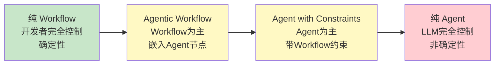
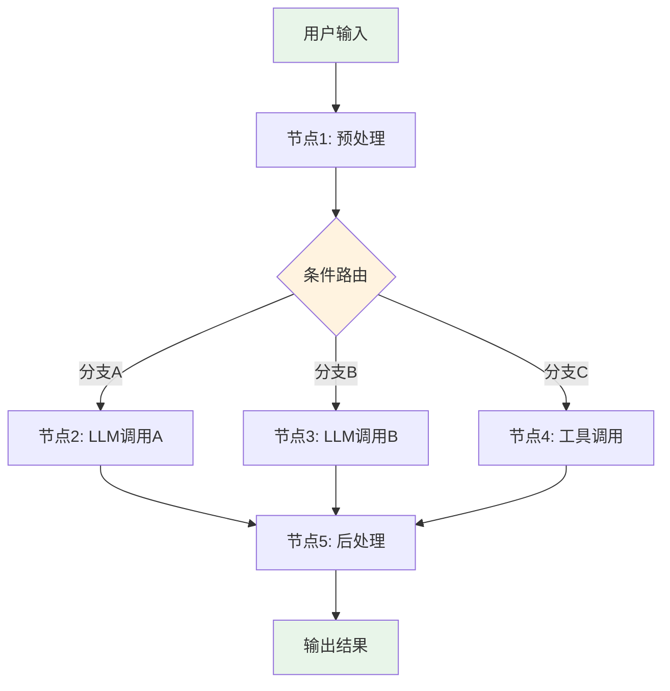
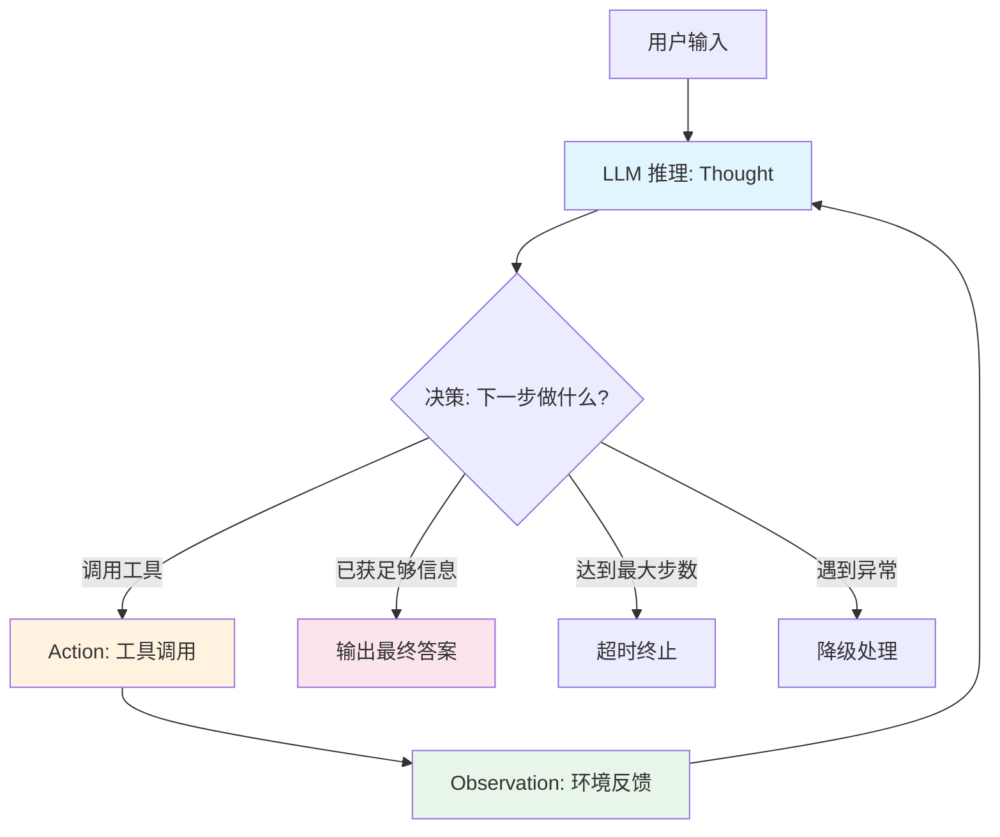
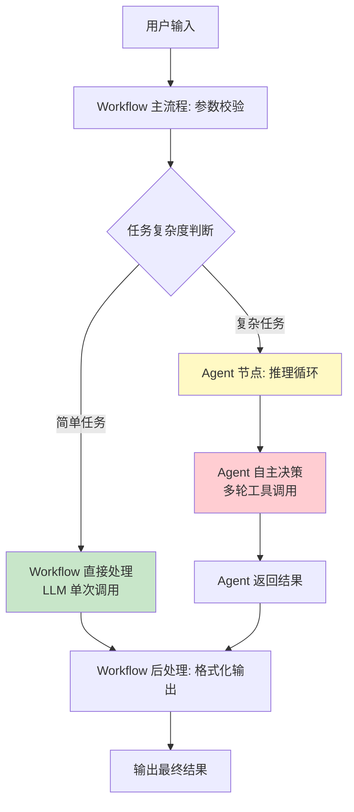
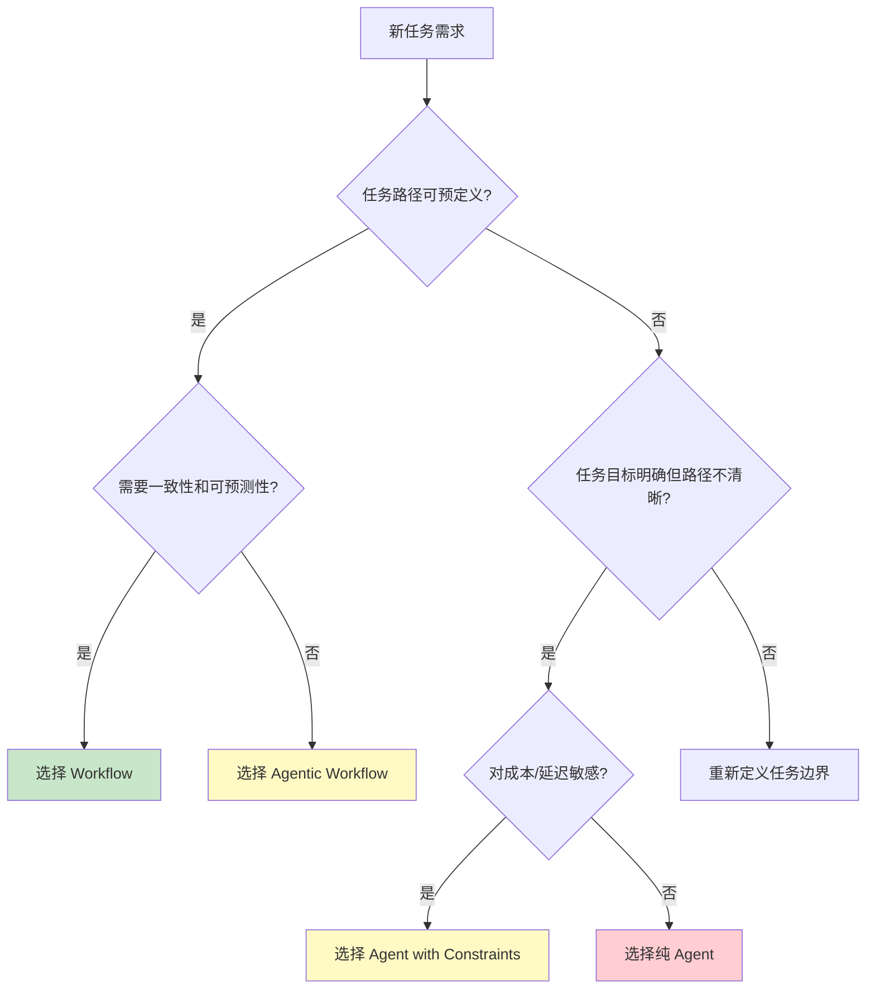

# Agent与Workflow的区别

## 一、定义

**Agent 与 Workflow 的区别**是指 AI 系统中两种控制权归属截然不同的架构模式：Workflow 是"开发者预设路径、LLM 按编排执行"的确定性系统，Agent 是"LLM 自主决策路径、动态控制流程"的非确定性系统。两者同属 Agentic System，但决策权归属不同。

## 二、为什么出现

在 LLM 应用落地的过程中，开发者面临一个根本性选择困境：**任务的执行路径该由谁控制？**

| 困境 | 表现 | 后果 |
|------|------|------|
| **全用 Workflow** | 所有路径预定义，LLM 只做节点内的文本处理 | 遇到未预见的情况无法灵活应对，灵活性不足 |
| **全用 Agent** | 所有路径交给 LLM 自主决策 | 成本不可控、延迟高、结果不可预测、难以调试 |
| **混用无标准** | 不清楚何时该用哪种，随意混搭 | 架构混乱，维护困难，生产事故频发 |

Anthropic 在 2024 年 12 月发布的《Building Effective Agents》正是为了解决这个问题——建立一套清晰的分类框架和决策原则，帮助开发者判断何时用 Workflow、何时用 Agent、何时混合使用。核心主张：**简单优于复杂，优先 Workflow，仅在必要时才用 Agent**。

> [!important] 核心问题
> 这不是技术选型问题，而是**架构设计问题**。选错模式会导致成本失控、可靠性下降、维护困难。理解两者的本质区别，是构建生产级 LLM 应用的前提。

## 三、核心思想

### 3.1 Anthropic 的权威定义

Anthropic 在《Building Effective Agents》中对两者做出了业界广泛引用的权威定义：

> **Workflow**：LLM 和工具通过**预先定义的代码路径**进行编排的系统。
>
> **Agent**：LLM **动态指导自己的流程和工具调用**，并保持对完成任务方式的控制。

一句话区分：**Workflow 中开发者控制流程，Agent 中 LLM 控制流程**。

### 3.2 控制权光谱



### 3.3 核心差异对比

| 维度 | Workflow | Agent |
|------|----------|-------|
| **控制权** | 开发者（硬编码规则） | LLM（模型自主决策） |
| **执行路径** | 预定义、静态、确定性 | 动态、可变、非确定性 |
| **灵活性** | 低，任务需可预定义 | 高，可处理开放式问题 |
| **可预测性** | 高，每节点输出可预期 | 低，结果依赖模型决策 |
| **成本** | 低，调用次数确定 | 高，多轮推理消耗大量 Token |
| **延迟** | 低，路径确定 | 高，多轮思考+工具调用 |
| **调试性** | 强，可追踪每节点 | 弱，需分析语义链路 |
| **适用场景** | 标准化、可预测流程 | 开放式、动态决策 |

### 3.4 Workflow 的五种模式

Anthropic 定义了五种 Workflow 编排模式：

| 模式 | 原理 | 适用场景 |
|------|------|----------|
| **Prompt Chaining** | 串联多个 LLM 调用，前一个的输出作为后一个的输入 | 任务可分解为固定步骤（先翻译再摘要） |
| **Routing** | 先分类输入，再路由到不同处理分支 | 客服分类、多领域问答 |
| **Parallelization** | 多个 LLM 调用并行执行，结果汇总 | 多角度分析、投票式验证 |
| **Orchestrator-Workers** | 一个 LLM 动态分解任务，分配给多个 Worker 执行 | 复杂任务的子任务分配 |
| **Evaluator-Optimizer** | 一个 LLM 生成，另一个 LLM 评价并反馈，循环优化 | 代码生成+审查、文案打磨 |

> [!note] 注意
> Orchestrator-Workers 模式已经接近 Agent 的边界——Orchestrator 在动态分解任务时具有一定自主性，但整体流程仍受 Workflow 框架约束。

### 3.5 Agent 的核心架构

Agent 的架构由四大模块构成（参见 Agent）：

- **规划（Planning）**：任务分解、路径规划（参见 ReAct 推理框架）
- **记忆（Memory）**：短期上下文 + 长期记忆（参见 Agent记忆机制）
- **工具调用（Tool Use）**：与外部环境交互（参见 Tool Calling 工具调用）
- **推理循环（Think-Act Loop）**：Thought-Action-Observation 循环

## 四、工作流程

### 4.1 Workflow 执行流程



特征：路径在开发阶段确定，运行时按条件分支执行，每步可预测。

### 4.2 Agent 执行流程



特征：路径由 LLM 实时决策，每轮根据 Observation 动态调整，非确定性。

### 4.3 混合架构执行流程



特征：Workflow 控制主流程和边界，Agent 处理复杂子任务。这是生产环境的主流模式。

## 五、关键技术

### 5.1 Workflow 关键技术

| 技术 | 作用 | 代表实现 |
|------|------|----------|
| **DAG 编排** | 有向无环图定义节点和边 | Dify Workflow、LangGraph |
| **条件路由** | 根据中间结果选择执行分支 | LangGraph conditional_edges |
| **并行执行** | 多个节点同时执行，结果汇总 | LangGraph parallel branches |
| **状态管理** | 在节点间传递和持久化状态 | LangGraph Checkpointer |
| **人工审批（HITL）** | 关键节点暂停等待人工确认 | LangGraph interrupt |

### 5.2 Agent 关键技术

| 技术 | 作用 | 代表实现 |
|------|------|----------|
| **ReAct 循环** | Thought-Action-Observation 推理循环 | LangChain ReAct Agent（参见 ReAct 推理框架） |
| **Tool Calling** | 模型原生函数调用 | OpenAI Function Calling（参见 Tool Calling 工具调用） |
| **规划与分解** | 任务分解为子步骤 | Plan-and-Execute、ToT |
| **记忆管理** | 短期上下文 + 长期记忆 | Mem0、LangGraph Store（参见 Agent记忆机制） |
| **安全护栏** | 最大步数、重复检测、降级机制 | LangGraph 状态机约束 |

### 5.3 混合架构关键模式

| 模式 | 描述 | 适用场景 |
|------|------|----------|
| **Agentic Workflow** | Workflow 为主，在特定节点嵌入 Agent | 企业 RAG、客服系统 |
| **Agent with Constraints** | Agent 为主，用 Workflow 约束边界 | 编程助手、数据分析 |
| **Multi-Agent Orchestration** | 多个 Agent 协作，Workflow 负责调度 | 复杂项目、团队协作 |

### 5.4 框架支持对比

| 框架 | Workflow 支持 | Agent 支持 | 混合架构 | 特色 |
|------|-------------|-----------|----------|------|
| **LangGraph** | 图结构编排 | ReAct/ToolCalling | 原生支持 | 控制力最强，生产级 |
| **Dify** | 可视化节点编排 | ReAct/Function Calling | Agent 节点嵌入 | 开源，低代码 |
| **Coze** | 低代码工作流 | 多 Agent 模式 | 支持 | 字节系，C 端友好 |
| **CrewAI** | 配置驱动流程 | 多 Agent 协作 | 支持 | 团队式角色分工 |
| **AutoGen** | 对话式编排 | 多智能体对话 | 支持 | 轻量灵活，快速原型 |

## 六、优点

### Workflow 的优点

- **高可预测性**：每个节点的输入输出在开发阶段确定，运行时行为可预期，便于测试和监控
- **低成本低延迟**：调用次数和路径长度确定，不会出现 Agent 的 Token 爆炸问题，适合大规模标准化任务
- **强可调试性**：流程拓扑清晰，每个节点的输入输出可追踪，出问题能快速定位到具体节点
- **一致性保障**：相同输入产生相同输出（在相同模型和参数下），适合需要一致性的企业场景
- **合规友好**：流程透明可审计，容易满足金融、医疗等领域的合规要求
- **开发门槛低**：可视化编排（如 Dify），非技术人员也能搭建

### Agent 的优点

- **高灵活性**：可处理开发阶段未预见的场景，根据环境反馈动态调整策略
- **开放式问题处理**：不需要预先知道所有可能的执行路径，适合探索性任务
- **自主决策**：任务明确后可独立规划、执行、检查进展，减少人工干预
- **多工具编排**：Agent 自主决定调用哪些工具、以什么顺序调用，实现复杂的多工具协作
- **自适应纠错**：遇到错误能通过 Observation 发现并调整方向，而非线性失败

### 混合架构的优点

- **兼得两者优势**：Workflow 保障可控性和可预测性，Agent 保障灵活性和自适应能力
- **成本可控**：只在必要节点使用 Agent，避免全链路 Agent 的成本爆炸
- **渐进式复杂化**：可以先部署纯 Workflow，再逐步在关键节点引入 Agent，降低风险

## 七、缺点

### Workflow 的缺点

- **灵活性不足**：只能处理开发阶段预定义的场景，遇到未预见情况无法应对
- **维护成本随场景增长**：每增加一个新场景就需要新增一条分支，分支组合爆炸
- **无法处理开放式问题**：对于"帮我研究一下XX"这类模糊任务，无法预先定义路径
- **僵化**：一旦流程定义完成，修改需要重新部署，响应变化慢

### Agent 的缺点

- **成本不可控**：多轮推理 + 工具调用消耗大量 Token，复杂任务成本可能是 Workflow 的 10-30 倍
- **延迟高**：多轮 LLM 推理导致端到端延迟随步数线性增长，实时性差
- **结果不可预测**：相同输入可能产生不同执行路径和结果，难以测试和验证
- **调试困难**：需分析语义链路而非代码堆栈，出问题难定位
- **循环失控风险**：可能陷入无意义循环（参见 ReAct 推理框架 中的 $47,000 案例）
- **安全风险**：自主决策可能执行非预期操作，需要安全护栏（参见 Harness Engineering 驾驭工程）
- **生产就绪度低**：需要额外的步数限制、重复检测、降级机制等约束才能上生产

### 混合架构的缺点

- **架构复杂度高**：同时维护 Workflow 和 Agent 两套逻辑，系统复杂度增加
- **调试更困难**：问题可能出在 Workflow 层或 Agent 层，需要跨层调试
- **边界设计困难**：哪些任务走 Workflow、哪些交给 Agent，需要经验判断

## 八、典型应用

### 8.1 适合 Workflow 的场景

| 场景 | 原因 | 典型实现 |
|------|------|----------|
| **客服路由** | 意图分类明确，路由规则固定 | Routing 模式 |
| **文档处理流水线** | 步骤固定：解析→提取→验证→入库 | Prompt Chaining |
| **多语言翻译** | 先检测语言→翻译→校对，路径确定 | Prompt Chaining |
| **数据 ETL** | 提取→转换→加载，每步可预测 | 并行化 + 汇总 |
| **内容审核** | 多维度并行检查→汇总判断 | Parallelization |
| **代码生成+审查** | 生成→审查→优化，循环改进 | Evaluator-Optimizer |

### 8.2 适合 Agent 的场景

| 场景 | 原因 | 典型实现 |
|------|------|----------|
| **编程助手** | 需求开放，需自主探索代码库、调试 | Cursor、Copilot |
| **科研助手** | 探索性任务，路径不可预见 | 多工具编排 Agent |
| **数据分析** | 需根据数据特征动态决定分析方法 | ReAct + Code Interpreter |
| **网页浏览** | 需根据页面内容动态决定下一步 | Browser Agent |
| **复杂 RAG** | 需自主判断何时检索、检索什么 | Agentic RAG |

### 8.3 适合混合架构的场景

| 场景 | Workflow 部分 | Agent 部分 |
|------|-------------|-----------|
| **企业知识库问答** | 参数校验→路由→格式化输出 | 复杂问题的多轮检索推理 |
| **金融风控** | 数据收集→规则检查→报告生成 | 异常案例的深度分析 |
| **医疗辅助诊断** | 病历解析→结构化→报告生成 | 复杂病例的推理诊断 |
| **智能客服** | 意图分类→简单问题直接回答 | 复杂问题转 Agent 多轮处理 |

### 8.4 决策框架



## 九、面试高频问题

### Q1: Agent 和 Workflow 的本质区别是什么？

Anthropic 的权威定义：Workflow 是 LLM 和工具通过预先定义的代码路径编排的系统，控制权在开发者；Agent 是 LLM 动态指导自己的流程和工具调用并保持对完成任务方式控制的系统，控制权在 LLM。一句话：**Workflow 中开发者控制流程，Agent 中 LLM 控制流程**。这导致两者在可预测性、成本、延迟、灵活性上有根本差异。

### Q2: 什么场景应该选 Workflow 而不是 Agent？

五种情况选 Workflow：任务可分解为固定子任务；需要一致性和可重复性；对延迟敏感；对成本敏感；输出需要强确定性。Anthropic 的核心建议是"简单优于复杂"——优先 Workflow，仅在复杂性能够明显改善结果时才引入 Agent。很多场景根本不需要 Agent，Agent 会牺牲延迟和成本换取灵活性，需要评估这种 trade-off 是否值得。

### Q3: Anthropic 定义的 Workflow 五种模式是什么？

Prompt Chaining（串联多个 LLM 调用）、Routing（先分类再路由到不同分支）、Parallelization（多个 LLM 调用并行执行后汇总）、Orchestrator-Workers（一个 LLM 动态分解任务分配给多个 Worker）、Evaluator-Optimizer（生成-评价-优化循环）。其中 Orchestrator-Workers 最接近 Agent 边界——Orchestrator 有一定自主性，但整体仍受 Workflow 框架约束。

### Q4: 如何设计 Workflow + Agent 的混合架构？

三层设计：第一层，Workflow 作为主流程控制器，负责参数校验、条件路由、格式化输出等确定性步骤；第二层，在复杂子任务节点嵌入 Agent，由 Agent 自主完成多轮推理和工具调用；第三层，为 Agent 设置 Workflow 约束——最大步数、重复检测、人工审批点（HITL）、降级机制。Dify 的"Agent 节点"和 LangGraph 的"图嵌套"都支持这种模式。关键原则：能用 Workflow 解决的不用 Agent，只在必要节点引入 Agent 灵活性。

### Q5: Agent 的成本为什么比 Workflow 高？

三个原因：第一，Agent 每轮 Thought + Action + Observation 都消耗 Token，复杂任务可能 30 轮消耗 50K-100K tokens，而 Workflow 调用次数确定；第二，Agent 的多轮推理导致多次 LLM 调用，每次调用都有延迟和成本；第三，Agent 的非确定性意味着同一任务可能走不同路径，成本波动大。优化策略：用 Workflow 替代部分 Agent 步骤、限制最大步数、用摘要压缩历史轨迹、用 ToolCalling 替代 Prompt 驱动的 ReAct。

### Q6: LangGraph 如何同时支持 Workflow 和 Agent？

LangGraph 的核心是状态图（StateGraph）：节点（Node）处理状态，边（Edge）控制流转。Workflow 模式通过预定义的节点和边实现确定性流转；Agent 模式通过 `conditional_edges` 让 LLM 动态决定下一个节点。关键在于 LangGraph 不区分"Workflow 节点"和"Agent 节点"——所有逻辑都是图节点，区别在于节点的决策方式是确定性的（代码逻辑）还是非确定性的（LLM 决策）。这使得混合架构在 LangGraph 中是自然的——同一个图中可以混合两种节点。

### Q7: Dify 和 Coze 在 Workflow/Agent 支持上有何区别？

Dify 面向开发者，支持 Workflow（可视化节点编排）和 Agent（ReAct/Function Calling/Tool-use）双模式，支持 Agent 节点嵌入 Workflow 实现混合架构，开源可私有化部署。Coze 面向终端用户，低门槛、强对话体验，支持多 Agent 模式和插件系统，偏云端部署。核心区别：Dify 强在开发灵活性和技术自由度，适合需要深度定制的技术团队；Coze 强在低门槛和对话体验，适合快速搭建 C 端应用。两者都支持混合模式，但 Dify 的 Workflow 更偏"流程控制器+智能节点"，Coze 更偏"低代码可视化+多 Agent 协作"。

### Q8: 如何评估应该用 Agent 还是 Workflow？

三个维度评估：第一，**任务可预测性**——如果任务路径可在开发阶段确定，选 Workflow；如果路径依赖运行时信息动态决定，选 Agent。第二，**成本延迟敏感度**——如果对成本和延迟高度敏感（如高频客服），选 Workflow；如果可以接受较高成本换取灵活性（如编程助手），选 Agent。第三，**一致性要求**——如果需要相同输入相同输出（如金融报告），选 Workflow；如果允许结果差异（如创意写作），选 Agent。实践原则：先 Workflow 上线，收集失败案例，再在失败节点引入 Agent。

## 十、相关知识

### 核心关联笔记

- Agent —— Agent 的完整定义和架构，理解 Agent 才能理解与 Workflow 的区别
- ReAct 推理框架 —— Agent 最核心的推理范式，Workflow 不涉及 TAO 循环
- Tool Calling 工具调用 —— Agent 和 Workflow 都使用工具，但 Agent 自主决策调用时机
- LangChain-LangGraph —— 同时支持 Workflow 和 Agent 的主流框架，混合架构的最佳实践
- LLM 大语言模型 —— Agent 和 Workflow 都基于 LLM，区别在于 LLM 的控制权范围
- Prompt Engineering 提示词工程 —— Workflow 的节点设计和 Agent 的系统提示都需要 prompt 工程
- RAG 检索增强生成 —— RAG 可以作为 Workflow 节点，也可以作为 Agent 的工具
- Agent记忆机制 —— Agent 需要记忆管理跨会话信息，Workflow 通常无状态或仅节点间传状态
- Loop Engineering 循环工程 —— Agent 的 TAO 循环是循环工程的典型应用，Workflow 通常无循环
- Harness Engineering 驾驭工程 —— Agent 需要安全护栏才能上生产，Workflow 天然可控
- 模型幻觉 —— Agent 的多轮推理可能放大幻觉，Workflow 的单步调用幻觉风险更低
- MCP 模型上下文协议 —— MCP 扩展了 Agent 和 Workflow 可调用的工具范围

### 关键参考资料

- *Building Effective Agents* (Anthropic, 2024.12) —— 最权威的 Agent/Workflow 区分，行业重要参考
- *Agents* (Google, 2024) —— Google 视角的 Agent 定义白皮书
- Anthropic 官方博客：https://www.anthropic.com/engineering/building-effective-agents

### 关键概念

- **Agentic System**：Anthropic 提出的统称，包含 Workflow 和 Agent 两种模式
- **Control Flow**：控制流——Workflow 中由代码控制，Agent 中由 LLM 控制
- **Agentic Workflow**：Workflow 为主、嵌入 Agent 节点的混合架构
- **Orchestrator-Workers**：Workflow 五种模式中最接近 Agent 边界的模式
- **HITL（Human-in-the-Loop）**：人工审批节点，Workflow 和 Agent 都可使用

## 十一、代码示例

### 示例 1: Workflow 模式 —— 确定性路由（LangGraph）

```python
from langgraph.graph import StateGraph, END
from langchain_openai import ChatOpenAI
from typing import TypedDict

class State(TypedDict):
    query: str
    intent: str
    response: str

llm = ChatOpenAI(model="gpt-4o-mini", temperature=0)

def classify_intent(state: State) -> State:
    """节点1: 意图分类（确定性路由）"""
    response = llm.invoke(
        f"将以下问题分类为 weather/finance/knowledge/chat 之一，只返回类别名：\n{state['query']}"
    )
    return {"intent": response.content.strip()}

def handle_weather(state: State) -> State:
    """节点2A: 天气处理"""
    return {"response": f"天气查询: {state['query']}"}

def handle_finance(state: State) -> State:
    """节点2B: 金融处理"""
    return {"response": f"金融查询: {state['query']}"}

def handle_knowledge(state: State) -> State:
    """节点2C: 知识查询"""
    return {"response": f"知识查询: {state['query']}"}

def handle_chat(state: State) -> State:
    """节点2D: 通用聊天"""
    return {"response": f"聊天回复: {state['query']}"}

def route(state: State) -> str:
    """路由函数: 根据意图选择分支"""
    intent = state["intent"]
    routing = {
        "weather": "weather",
        "finance": "finance",
        "knowledge": "knowledge",
        "chat": "chat",
    }
    return routing.get(intent, "chat")

# 构建 Workflow 图
workflow = StateGraph(State)
workflow.add_node("classify", classify_intent)
workflow.add_node("weather", handle_weather)
workflow.add_node("finance", handle_finance)
workflow.add_node("knowledge", handle_knowledge)
workflow.add_node("chat", handle_chat)

workflow.set_entry_point("classify")
workflow.add_conditional_edges("classify", route, {
    "weather": "weather",
    "finance": "finance",
    "knowledge": "knowledge",
    "chat": "chat",
})
for node in ["weather", "finance", "knowledge", "chat"]:
    workflow.add_edge(node, END)

app = workflow.compile()
result = app.invoke({"query": "明天北京天气怎么样？"})
print(result["response"])
# 输出: 天气查询: 明天北京天气怎么样？
# 路径确定: classify → weather → END
```

### 示例 2: Agent 模式 —— LLM 自主决策（LangGraph）

```python
from langgraph.graph import StateGraph, END
from langgraph.prebuilt import ToolNode
from langchain_openai import ChatOpenAI
from langchain_core.tools import tool
from typing import TypedDict, Annotated
import operator

class AgentState(TypedDict):
    messages: Annotated[list, operator.add]
    iterations: int

@tool
def search_weather(city: str) -> str:
    """查询指定城市的天气"""
    return f"{city}明天中雨，22-28℃"

@tool
def search_stock(symbol: str) -> str:
    """查询股票价格"""
    return f"{symbol}当前价格: 150.25"

@tool
def calculator(expression: str) -> str:
    """计算数学表达式"""
    try:
        return str(eval(expression))
    except:
        return "计算错误"

tools = [search_weather, search_stock, calculator]
llm = ChatOpenAI(model="gpt-4o-mini", temperature=0).bind_tools(tools)

def agent_node(state: AgentState):
    """Agent 节点: LLM 自主决定下一步"""
    response = llm.invoke(state["messages"])
    return {
        "messages": [response],
        "iterations": state["iterations"] + 1,
    }

def should_continue(state: AgentState):
    """路由: LLM 决定继续还是结束"""
    if state["iterations"] >= 10:  # 安全护栏
        return END
    last_msg = state["messages"][-1]
    if hasattr(last_msg, "tool_calls") and last_msg.tool_calls:
        return "tools"
    return END

# 构建 Agent 图
agent_graph = StateGraph(AgentState)
agent_graph.add_node("agent", agent_node)
agent_graph.add_node("tools", ToolNode(tools))

agent_graph.set_entry_point("agent")
agent_graph.add_conditional_edges("agent", should_continue, {
    "tools": "tools",
    END: END,
})
agent_graph.add_edge("tools", "agent")  # 工具执行后回到 Agent 决策

app = agent_graph.compile()

# Agent 自主决定: 先查天气, 再判断是否需要计算
result = app.invoke({
    "messages": [{"role": "user", "content": "北京明天天气怎么样？如果下雨，温差是多少度？"}],
    "iterations": 0,
})
# Agent 自主路径: agent → tools(天气) → agent → tools(计算) → agent → END
print(result["messages"][-1].content)
```

### 示例 3: 混合架构 —— Workflow 控制 + Agent 节点

```python
from langgraph.graph import StateGraph, END
from langchain_openai import ChatOpenAI
from langchain_core.tools import tool
from typing import TypedDict, Annotated
import operator

class HybridState(TypedDict):
    query: str
    complexity: str  # simple / complex
    agent_messages: Annotated[list, operator.add]
    final_response: str

llm = ChatOpenAI(model="gpt-4o-mini", temperature=0)

# === Workflow 节点: 确定性步骤 ===

def validate_input(state: HybridState) -> HybridState:
    """Workflow 节点1: 参数校验（确定性）"""
    if not state["query"] or len(state["query"]) < 3:
        return {"final_response": "错误: 输入内容过短"}
    return {}

def assess_complexity(state: HybridState) -> HybridState:
    """Workflow 节点2: 复杂度评估（确定性路由）"""
    response = llm.invoke(
        f"判断以下问题的复杂度，只返回 simple 或 complex：\n{state['query']}"
    )
    return {"complexity": response.content.strip().lower()}

# === Agent 节点: 非确定性推理 ===

@tool
def knowledge_search(query: str) -> str:
    """在企业知识库中搜索"""
    return f"知识库结果: {query}"

@tool
def web_search(query: str) -> str:
    """在互联网搜索"""
    return f"网络结果: {query}"

agent_llm = llm.bind_tools([knowledge_search, web_search])

def agent_node(state: HybridState) -> HybridState:
    """Agent 节点: LLM 自主多轮推理"""
    messages = [{"role": "user", "content": state["query"]}] + state.get("agent_messages", [])
    response = agent_llm.invoke(messages)
    return {"agent_messages": [response]}

def execute_tools(state: HybridState) -> HybridState:
    """Agent 工具执行节点"""
    last_msg = state["agent_messages"][-1]
    results = []
    if hasattr(last_msg, "tool_calls"):
        for tc in last_msg.tool_calls:
            if tc["name"] == "knowledge_search":
                results.append(knowledge_search.invoke(tc["args"]))
            elif tc["name"] == "web_search":
                results.append(web_search.invoke(tc["args"]))
    from langchain_core.messages import ToolMessage
    return {"agent_messages": [
        ToolMessage(content=str(r), tool_call_id=f"call_{i}")
        for i, r in enumerate(results)
    ]}

def agent_should_continue(state: HybridState) -> str:
    last_msg = state["agent_messages"][-1]
    if hasattr(last_msg, "tool_calls") and last_msg.tool_calls:
        return "tools"
    return "format"

# === Workflow 后处理节点 ===

def simple_response(state: HybridState) -> HybridState:
    """Workflow 节点: 简单任务直接处理"""
    response = llm.invoke(state["query"])
    return {"final_response": response.content}

def format_output(state: HybridState) -> HybridState:
    """Workflow 节点: 格式化输出（确定性）"""
    last_msg = state["agent_messages"][-1]
    return {"final_response": f"【Agent 分析结果】\n{last_msg.content}"}

def route_by_complexity(state: HybridState) -> str:
    """Workflow 路由: 根据复杂度分流"""
    if state["complexity"] == "complex":
        return "agent"
    return "simple"

# === 构建混合架构图 ===
hybrid = StateGraph(HybridState)

# Workflow 节点
hybrid.add_node("validate", validate_input)
hybrid.add_node("assess", assess_complexity)
hybrid.add_node("simple", simple_response)
hybrid.add_node("format", format_output)

# Agent 节点
hybrid.add_node("agent", agent_node)
hybrid.add_node("tools", execute_tools)

# Workflow 控制流
hybrid.set_entry_point("validate")
hybrid.add_edge("validate", "assess")
hybrid.add_conditional_edges("assess", route_by_complexity, {
    "agent": "agent",
    "simple": "simple",
})
hybrid.add_edge("simple", END)

# Agent 控制流（在 Workflow 内部）
hybrid.add_conditional_edges("agent", agent_should_continue, {
    "tools": "tools",
    "format": "format",
})
hybrid.add_edge("tools", "agent")
hybrid.add_edge("format", END)

app = hybrid.compile()

# 简单任务: validate → assess → simple → END
result1 = app.invoke({"query": "你好", "complexity": "", "agent_messages": [], "final_response": ""})

# 复杂任务: validate → assess → agent → tools → agent → format → END
result2 = app.invoke({
    "query": "分析公司2024年财报，对比同行，给出投资建议",
    "complexity": "",
    "agent_messages": [],
    "final_response": "",
})
```

### 示例 4: 同一任务的 Workflow vs Agent 对比

```python
"""
任务: "查询苹果公司2024年营收，计算同比增长率，生成分析报告"

Workflow 方式: 路径确定，3步完成
  Step1: search("苹果2024营收") → 获取数据
  Step2: calculator(同比增长率) → 计算结果
  Step3: llm(生成报告) → 输出报告

Agent 方式: LLM 自主决策，路径不确定
  Thought1: 需要先查苹果2024营收 → Action: search
  Observation1: 营收3830亿美元
  Thought2: 还需要2023年数据计算同比 → Action: search
  Observation2: 2023营收3832亿美元
  Thought3: 计算同比 → Action: calculator
  Observation3: -0.05%
  Thought4: 生成报告 → Final Answer
"""

# === Workflow 实现 ===
def workflow_revenue_analysis():
    """Workflow: 固定3步，路径确定"""
    # Step 1: 查询数据（确定性）
    revenue_2024 = search("苹果公司2024年营收")
    revenue_2023 = search("苹果公司2023年营收")

    # Step 2: 计算（确定性）
    growth_rate = calculator(f"({revenue_2024} - {revenue_2023}) / {revenue_2023} * 100")

    # Step 3: 生成报告（单次LLM调用）
    report = llm.invoke(
        f"苹果2024年营收{revenue_2024}，2023年{revenue_2023}，"
        f"同比增长{growth_rate}%，请生成分析报告"
    )
    return report

# === Agent 实现 ===
def agent_revenue_analysis():
    """Agent: LLM自主决策，路径不确定"""
    tools = [search, calculator]
    agent = create_react_agent(llm, tools, max_steps=10)

    result = agent.invoke({
        "input": "查询苹果公司2024年营收，计算同比增长率，生成分析报告"
    })
    # Agent 自主决定: 查什么、算什么、何时结束
    # 可能 4 步完成，也可能 6 步（如果第一次搜索结果不全）
    return result["output"]
```

## 十二、个人理解

### 1. "Agent vs Workflow" 是个伪命题，真正的问题是"控制权该给谁"

业界经常把 Agent 和 Workflow 作为对立概念讨论，但这掩盖了问题的本质。Agent 和 Workflow 不是两种不同的技术，而是同一种技术（LLM + 工具）的两种控制权分配方式。真正的架构决策不是"用 Agent 还是 Workflow"，而是"这个任务的这个步骤，控制权该给开发者还是给 LLM"。一个成熟的系统必然是混合的——某些步骤用 Workflow 确保可控，某些步骤用 Agent 确保灵活。Anthropic 的贡献不在于发明了新概念，而在于给出了一个清晰的控制权分配框架。

### 2. Anthropic "简单优于复杂"的建议被严重低估了

Anthropic 在《Building Effective Agents》中的核心建议是"简单优于复杂，优先 Workflow"，但业界对这个建议的重视程度远不够。原因是从众心理：Agent 更酷、更前沿、更能讲故事，而 Workflow 听起来像传统的流程编排。但生产环境的现实是：Workflow 的可靠性、可预测性、低成本是 Agent 无法比拟的。很多团队一上来就全栈 Agent，结果在生产环境中遭遇成本爆炸、循环失控、结果不可预测等问题，最后不得不回退到 Workflow。正确的路径是反过来的：先 Workflow 上线，收集失败案例，再在必要节点引入 Agent。

### 3. LangGraph 的图模型天然消解了 Agent/Workflow 的二元对立

LangGraph 的设计哲学深刻且优雅：它不区分"Workflow 节点"和"Agent 节点"，所有逻辑都是图中的节点，区别仅在于节点的决策方式是确定性的（代码逻辑）还是非确定性的（LLM 决策）。这意味着在 LangGraph 中，Agent 和 Workflow 不是两种不同的系统，而是同一个图中的不同节点类型。混合架构不是"两种系统的拼接"，而是"同一个图中不同决策方式的自然共存"。这种统一模型比 Dify/Coze 的"Workflow 嵌入 Agent 节点"方案更优雅——后者仍然是两层架构，前者是单层统一。

### 4. Orchestrator-Workers 是 Workflow 和 Agent 的"临界点"

Anthropic 定义的五种 Workflow 模式中，Orchestrator-Workers 最值得关注，因为它处于 Workflow 和 Agent 的临界点。Orchestrator 负责动态分解任务——这本身就是一种"决策"行为，和 Agent 的"Thought"非常相似。区别在于 Orchestrator 的决策范围被限制在"分解任务给 Worker"，而 Agent 的决策范围是"决定一切"。这个临界点的存在说明：Workflow 和 Agent 之间不是黑白分明的边界，而是一个连续的光谱。未来的架构创新很可能就发生在这个光谱的中间地带——比如 Claude 的 Dynamic Workflow 就是向这个方向的探索。

### 5. 未来趋势：Agent 隐形化，Workflow 智能化

两个趋势正在同时发生：第一，**Agent 隐形化**——随着模型原生能力增强（ToolCalling、推理能力），Agent 的显式 TAO 循环会逐渐变成模型的内部能力，用户不再感知"Agent 在思考"，但自主决策逻辑仍在运行。第二，**Workflow 智能化**——Workflow 的路由和分支不再完全依赖硬编码规则，而是由 LLM 动态决定（如 Orchestrator-Workers、Dynamic Workflow）。这两个趋势从两端向中间靠拢，最终的结果是：**Workflow 和 Agent 的边界将逐渐模糊**，取而代之的是"智能编排"——流程框架提供可控性，LLM 提供灵活性，两者无缝融合。但无论怎么演进，核心问题始终不变：控制权如何分配、成本如何控制、可靠性如何保障。
