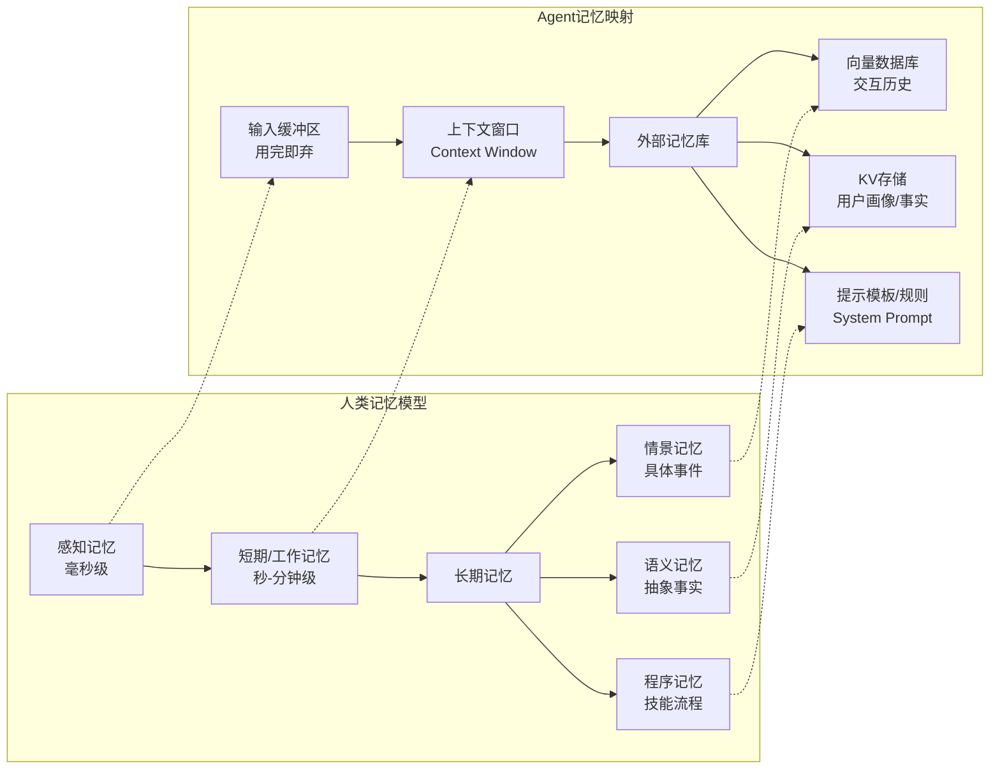
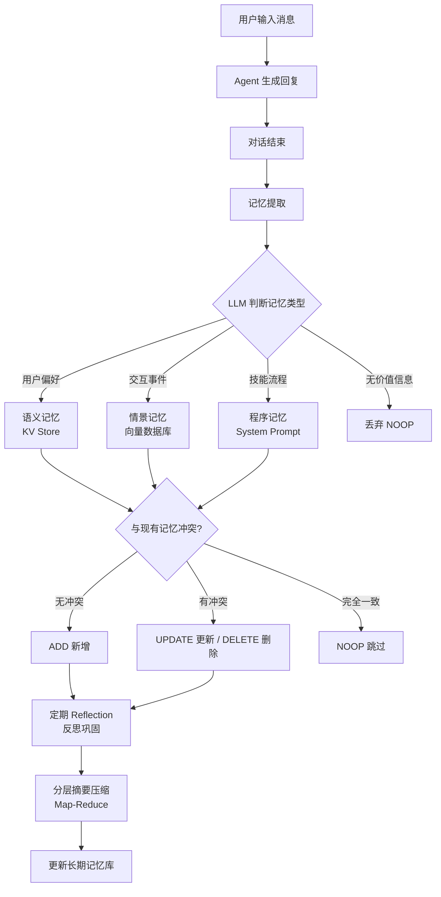
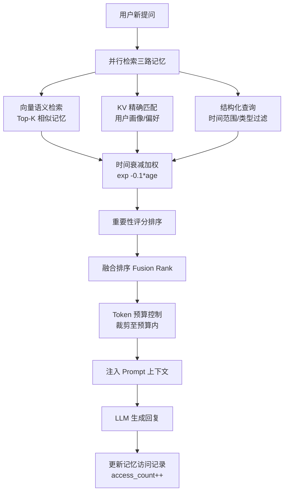

# Agent记忆机制

## 一、定义

**Agent 记忆机制**是指让基于 LLM 的 AI Agent 能够跨回合、跨会话、跨任务记住信息，从而实现个性化交互、持续学习和长期一致性的系统组件。它本质上是 LLM 的"外部记忆库"，解决了 LLM 原生无状态的问题。

## 二、为什么出现

LLM 本质是无状态的——每次调用都像一次全新的对话，上下文窗口一旦满载或会话结束，所有信息就消失了。这带来三个核心问题：

| 问题 | 表现 | 后果 |
|------|------|------|
| **无状态性** | 每次调用独立，不记得上次对话 | 用户反复自我介绍，体验割裂 |
| **上下文窗口限制** | 4K-200K Token 物理上限 | 长对话信息丢失，Agent"失忆" |
| **无学习能力** | 无法从历史交互中积累经验 | Agent无法个性化、无法持续优化 |

Agent 记忆机制的出现，就是为了让 Agent 从"金鱼记忆"进化为"长期伙伴"——记住用户偏好、积累交互经验、保持跨会话一致性。

## 三、核心思想

Agent 记忆机制的核心思想是**将人类认知科学的记忆模型映射到 AI 系统中**，通过分层存储和智能检索，让 Agent 模拟人类的记忆行为。

### 认知科学映射



三个核心命题：

1. **存什么**：从海量对话中提取值得长期保存的记忆点，区分偏好、事实、事件、技能
2. **何时存**：对话结束后自动提取，定期反思巩固，触发式更新
3. **怎么取**：相似度检索 + 时间衰减 + 重要性评分的混合策略

> [!important] 关键认知
> 记忆机制不是简单的"存取数据库"，而是让 Agent 具备**主动遗忘、智能巩固、冲突处理**的能力——这恰恰是人类记忆系统最核心的特征。

## 四、工作流程

### 4.1 记忆写入与巩固流程



### 4.2 记忆检索与注入流程



## 五、关键技术

### 5.1 记忆类型体系

| 类型 | 认知科学对应 | 内容示例 | 存储方案 | 生命周期 |
|------|-------------|----------|----------|----------|
| **工作记忆** | 短期记忆 | 当前对话消息历史 | Context Window / Checkpointer | 会话级 |
| **情景记忆** | Episodic | "用户昨天问了 iPhone 价格" | 向量数据库（带时间戳） | 长期，带 TTL |
| **语义记忆** | Semantic | "用户是 Python 开发者" | KV 存储 + 向量库 | 长期 |
| **程序记忆** | Procedural | "问天气先查 API 再总结" | System Prompt / 规则引擎 | 长期 |
| **感知记忆** | Sensory | 输入缓冲区 | 内存缓冲 | 毫秒级，用完即弃 |

### 5.2 主流记忆架构

**MemGPT / Letta —— 虚拟内存架构**：
受操作系统虚拟内存启发，将上下文窗口视为"RAM"，外部队列视为"Disk"，Agent 通过函数调用自主调度数据换入换出。三层结构：Core Memory（常驻人格）→ Summary Memory（会话摘要）→ Archival Memory（完整归档）。

**Mem0 —— 四操作记忆管理**：
将记忆操作抽象为 ADD / UPDATE / DELETE / NOOP 四种。写入前用 LLM 比较新信息与现有记忆的语义关系，自动决策操作类型。支持三级作用域：用户级、会话级、Agent 级。混合存储：向量嵌入 + 属性图谱 + KV。

**Zep / Graphiti —— 时序知识图谱**：
每个事实携带有效性窗口（validity window），支持"谁在何时负责什么"的时序查询。时间作为一等公民，适合需要精确时间推理的生产场景。

**LangGraph Memory —— 双层架构**：
短期记忆通过 Checkpointer 实现（thread-scoped 状态快照），长期记忆通过 Store 实现（跨会话持久化）。命名空间分层组织：`["users", "user_123", "preferences"]`。

**LangChain Memory 组件体系**：
`ConversationBufferMemory`（全量缓冲）→ `ConversationBufferWindowMemory`（滑动窗口）→ `ConversationSummaryMemory`（摘要压缩）→ `ConversationSummaryBufferMemory`（混合缓冲+摘要）。

### 5.3 记忆存储技术

| 存储类型 | 代表方案 | 适用场景 | 局限 |
|----------|----------|----------|------|
| **向量数据库** | Chroma / Pinecone / Milvus | 语义相似度检索，模糊联想 | 不理解时间、不追踪因果 |
| **知识图谱** | Neo4j / Graphiti | 实体关系建模，时序推理 | 构建成本高，更新复杂 |
| **关系型数据库** | PostgreSQL / MySQL | 结构化查询，范围过滤 | 语义检索能力弱 |
| **键值存储** | Redis | 精确匹配，用户画像 | 无语义检索能力 |
| **混合存储** | 向量 + KV + 关系 | 全面覆盖各类检索需求 | 架构复杂，维护成本高 |

### 5.4 记忆检索策略

**相似度检索**：向量检索语义最相似的记忆，先按 `user_id` 过滤避免跨用户污染。

**时间衰减**：旧记忆自然衰减，新记忆优先。衰减公式：$weight = e^{-0.1 \times age} \times \ln(access\_count + 1)$

**重要性评分**：用户显式强调的、Agent 主动追问的、包含结构化数据的信息评分更高。

**混合检索（推荐）**：
```python
# 三路并行检索 → 融合排序
semantic_results = vector_store.similarity_search(query_embedding, k=top_k)
kv_results = kv_store.hget(f"user:{user_id}:entity:{entity}")
sql_results = db.fetch("SELECT * FROM memories WHERE user_id=? AND created_at > NOW() - INTERVAL '30 days'")
fused = fusion_rank(semantic_results, kv_results, sql_results)
```

### 5.5 记忆操作四元组

| 操作 | 触发条件 | 实现方式 |
|------|----------|----------|
| **ADD** | 新信息与现有记忆无冲突 | 写入对应存储，附时间戳和元数据 |
| **UPDATE** | 新信息是对现有记忆的更新 | LLM 判断语义相似度 >0.85 → 替换 |
| **DELETE** | 新信息表明现有记忆已失效 | 软删除（`is_deleted=True`）+ TTL 清理 |
| **NOOP** | 新信息与现有记忆完全一致 | 跳过，避免冗余写入 |

## 六、优点

- **个性化能力**：记住用户偏好和历史交互，提供量身定制的服务体验，这是无状态 LLM 无法实现的核心价值
- **跨会话一致性**：用户不需要反复自我介绍，Agent 能在长期交互中保持上下文连贯
- **持续学习**：从历史交互中积累经验，通过 Reflection 反思机制不断优化行为策略
- **长程推理支撑**：为多步任务提供历史状态和中间结果，支撑复杂的长程推理
- **上下文窗口扩展**：通过外部存储突破 Context Window 物理限制，理论上可实现"无限记忆"
- **成本优化**：Mem0 方案相比全量上下文，牺牲约 6% 准确率换取 13 倍提速和 90% Token 节省
- **可审计性**：结构化记忆存储支持审计追溯，满足合规需求

## 七、缺点

- **记忆噪音问题**：全量存储会导致大量低价值信息堆积，检索时召回噪音干扰判断，需要复杂的过滤和排序策略
- **记忆冲突难处理**：用户信息变化时（如"上周说有两个孩子，这周说有三个"），判断是 ADD 还是 UPDATE 需要语义理解，LLM 判断可能出错
- **检索质量瓶颈**：向量检索的召回率受 Embedding 质量影响，时序弱、不理解因果关系，重要记忆可能被淹没
- **Token 预算矛盾**：注入的记忆越多，留给当前对话的 Token 越少；注入太少又会导致上下文不足，平衡困难
- **隐私安全风险**：记忆库存储大量用户敏感信息，存在记忆提取攻击（MEXTRA）、记忆投毒、跨用户记忆泄露等安全威胁
- **冷启动问题**：新用户没有历史记忆，Agent 无法个性化；记忆积累需要时间，初期体验与无记忆 Agent 无异
- **维护成本高**：混合存储架构（向量 + KV + 关系）涉及多套系统，部署运维复杂，中小企业难以承受
- **评估标准不统一**：LoCoMo、LongMemEval、PersonaMem 等基准各有侧重，缺乏统一评估标准，方案间难以横向比较
- **遗忘机制不成熟**：何时遗忘、遗忘什么目前依赖启发式规则，缺乏理论指导，可能导致重要信息被误删

## 八、典型应用

### 8.1 个性化助手

- **智能客服**：记住用户历史咨询、偏好、投诉记录，提供连贯服务。腾讯云 Agent Memory 四层架构已在生产落地
- **AI 伴侣**：长期记住用户生活细节、情感状态，建立深度情感连接（Character.AI、Replika）
- **个人助理**：记住日程习惯、工作偏好、常用联系人，主动提供个性化建议

### 8.2 专业领域 Agent

- **医疗 Agent**：记住患者病史、用药记录、过敏信息，提供连续性医疗建议
- **法律 Agent**：记住案件背景、客户诉求、历史咨询，提供一致性法律意见
- **金融 Agent**：记住用户风险偏好、投资组合、财务目标，提供个性化理财建议
- **教育 Agent**：记住学生 learning progress、薄弱知识点、学习风格，自适应调整教学策略

### 8.3 多 Agent 协作

- **团队记忆共享**：CrewAI 中多 Agent 共享任务状态和中间结果，避免重复劳动
- **经验传承**：老 Agent 的经验记忆传递给新 Agent，加速团队学习
- **角色记忆**：每个 Agent 维护自己的专业领域记忆，分工协作时调用各自专业知识

### 8.4 主流框架对比

| 框架 | 架构类型 | 最佳场景 | 核心特征 |
|------|----------|----------|----------|
| **Mem0** | 向量+图谱+KV | 助手/客服 | 四操作管理，三级作用域，MaaS 云服务 |
| **Zep/Graphiti** | 时序知识图谱 | 生产管线 | 时间一等公民，有效性窗口 |
| **Letta(MemGPT)** | 分层 OS 式 | 长运行 Agent | 虚拟内存机制，Agent 自主调度 |
| **LangMem** | 扁平 KV+向量 | LangChain 生态 | 情景/语义/程序三类记忆 |
| **LangGraph** | Checkpointer+Store | 状态图 Agent | 短期快照+长期持久化 |
| **MemBrain** | 持久化记忆系统 | 长期记忆评测 | 多项基准 SOTA |

## 九、面试高频问题

### Q1: Agent 的记忆有哪几种类型？分别存在哪里？

参考认知科学映射，分为五类：工作记忆（Context Window，会话级）、情景记忆（向量数据库，记录具体事件带时间戳）、语义记忆（KV 存储+向量库，存储抽象事实和用户偏好）、程序记忆（System Prompt/规则引擎，存储技能流程）、感知记忆（输入缓冲区，毫秒级用完即弃）。核心区别：工作记忆是"现在在想什么"，情景记忆是"经历过什么"，语义记忆是"知道什么"，程序记忆是"会做什么"。

### Q2: 记忆冲突怎么处理？比如用户上周说有两个孩子，这周说有三个。

分四步处理：第一步，用 LLM 提取新信息的关键实体（"孩子数量=3"）；第二步，用语义相似度检索现有记忆中相关条目（阈值 >0.85 判定为同一实体）；第三步，LLM 判断关系类型——是 UPDATE（信息更新）还是 ADD（新增事件）；第四步，执行 UPDATE 操作替换旧记忆，并记录变更日志。关键是要保留变更历史而非直接覆盖，以支持回溯审计。

### Q3: Mem0 的四种记忆操作是什么？如何决策？

ADD（新增）、UPDATE（更新）、DELETE（删除）、NOOP（无操作）。决策流程：写入前用 LLM 比较新信息与现有记忆的语义关系——如果新信息是全新的执行 ADD；如果是对现有记忆的更新执行 UPDATE；如果表明现有记忆已失效执行 DELETE；如果与现有记忆完全一致执行 NOOP 跳过。这个决策本身也是一个 LLM 调用，通过特定 prompt 引导。

### Q4: 如何解决记忆爆炸问题？

分层压缩策略：第一层，重要性评分剪枝——低分记忆直接丢弃；第二层，结构化摘要压缩——Map-Reduce 多级压缩，压缩率可达 50:1；第三层，关键事实提取——从摘要中提取原子事实存入语义记忆；第四层，动态 Token 预算分配——根据任务复杂度动态调整记忆注入量。核心是 Token Budget Controller，确保注入记忆不超过总 Token 预算的 30%-40%。

### Q5: 向量检索记忆有什么问题？如何改进？

三个核心问题：召回噪音大（语义相似不等于相关）、时序弱（不理解时间先后）、无因果推理能力。改进方案：混合检索（向量+KV+关系三路并行→融合排序）、时间衰减加权（旧记忆权重降低）、重要性评分排序（用户强调的信息优先）、预检索过滤（先按 user_id 和时间范围过滤再做向量检索）。Zep/Graphiti 的时序知识图谱路线从根本上解决了时序问题。

### Q6: MemGPT 的虚拟内存机制是什么？

受操作系统虚拟内存启发：将 LLM 上下文窗口视为"物理内存"（RAM），将外部存储视为"磁盘"（Disk），Agent 通过函数调用自主控制数据换入换出。三层结构：Core Memory（人格设定+系统指令，常驻上下文）→ Summary Memory（会话摘要，按需加载）→ Archival Memory（完整历史，外部存储）。关键创新是 Agent 自己决定何时检索、何时归档，模拟人类主动回忆和遗忘的过程。

### Q7: Agent 记忆的安全风险有哪些？

三类主要威胁：**记忆提取攻击**（MEXTRA，ACL 2025）——通过精心构造的 prompt 从记忆库中提取其他用户的隐私信息；**记忆投毒**——恶意注入虚假记忆，污染 Agent 的决策基础；**跨用户记忆泄露**——检索时未严格按 user_id 过滤，导致 A 用户看到 B 用户的记忆。防护措施：严格的多租户隔离、记忆访问审计日志、敏感信息加密存储、GDPR 合规的"被遗忘权"支持。

### Q8: 如何评估 Agent 记忆系统的效果？

主流基准：LoCoMo（10 段超长对话，平均 300 轮/9K token，1986 题）、LongMemEval（每条问题约 115K token 历史，ICLR 2025）、PersonaMem（20 个画像，6462 条上下文，589 题）。评估维度：准确率（能否正确回答历史相关问题）、延迟（检索+生成 p95）、Token 消耗（成本效率）。当前 SOTA 方案 MemBrain 在多项基准上领先，但全量上下文方案准确率最高（72.9%），Mem0 以 66.9% 准确率换取 13 倍提速。

## 十、相关知识

### 核心关联笔记

- Agent —— 记忆机制是 Agent 三大核心组件（规划+记忆+工具）之一，理解 Agent 架构是理解记忆机制的前提
- LLM 大语言模型 —— 记忆机制解决的就是 LLM 无状态和上下文窗口限制问题
- RAG 检索增强生成 —— 记忆检索与 RAG 检索在技术栈上高度重叠，都是向量检索+上下文注入
- Embedding 向量嵌入 —— 记忆的语义检索依赖 Embedding 技术，Embedding 质量直接决定记忆召回质量
- 向量数据库 —— 情景记忆的核心存储引擎，Chroma/Milvus/Pinecone 是主流选择
- LangChain-LangGraph —— LangChain Memory 组件和 LangGraph Checkpointer/Store 是记忆机制的主流实现框架
- Transformer —— 理解注意力机制才能理解为什么上下文窗口有限、为什么需要外部记忆
- Prompt Engineering 提示词工程 —— 记忆注入本质是 prompt 工程，如何组织记忆上下文直接影响生成质量
- 模型幻觉 —— 记忆冲突或记忆噪音可能导致 Agent 基于错误记忆产生幻觉
- Tool Calling 工具调用 —— MemGPT 的记忆调度通过函数调用实现，记忆检索也可封装为工具
- MCP 模型上下文协议 —— MCP 正在成为记忆互操作的标准总线，实现跨框架记忆共享
- Loop Engineering 循环工程 —— 记忆的 Reflection 反思机制是循环工程的典型应用
- Harness Engineering 驾驭工程 —— 记忆管理是驾驭 Agent 长期运行的核心挑战

### 关键论文

- *Generative Agents: Interactive Simulacra of Human Behavior* (Park et al., 2023) —— Agent 记忆领域奠基工作，提出 Memory Stream → Retrieval → Reflection 三段流程
- *MemoryBank: Enhancing Large Language Models with Long-Term Memory* (Zhong et al., 2024) —— 结构化记忆存储与检索，支撑长程推理
- *Position: Episodic Memory is the Missing Piece for Long-term LLM Agents* (Pink et al., 2025) —— 强调情景记忆是长程 Agent 的关键缺失
- *A Survey on the Memory Mechanism of LLM-based Agents* —— 系统梳理 200+ 篇论文，提出三维分类框架：Forms/Functions/Processes
- *MEXTRA: Memory EXTRaction Attack* (ACL 2025) —— 揭示 Agent 记忆安全风险

### 关键概念

- **Memory Stream**：Generative Agents 提出的记忆流，按时间顺序记录所有观察
- **Reflection**：Agent 对记忆进行反思，提炼更高层次的抽象认知
- **Recency / Importance / Relevance**：记忆检索的三因子评分——时间近度、重要性、相关性
- **Memory Consolidation**：记忆巩固，将短期记忆转化为长期记忆的过程
- **MaaS（Memory as a Service）**：记忆即服务，Mem0 等框架提供托管记忆层

## 十一、代码示例

### 示例 1: 短期记忆 —— 滑动窗口实现

```python
class ShortTermMemory:
    """短期记忆：滑动窗口，保留最近 N 轮对话"""

    def __init__(self, window_size: int = 10):
        self.window_size = window_size
        self.messages: list[dict] = []

    def add_message(self, role: str, content: str):
        self.messages.append({"role": role, "content": content})
        # 超出窗口时裁剪，保留最近 window_size*2 条（每轮含 user+assistant）
        if len(self.messages) > self.window_size * 2:
            self.messages = self.messages[-self.window_size * 2 :]

    def get_context(self) -> list[dict]:
        return self.messages

    def clear(self):
        self.messages = []

# 使用
memory = ShortTermMemory(window_size=5)
memory.add_message("user", "我喜欢喝美式咖啡")
memory.add_message("assistant", "好的，已记下您的偏好")
context = memory.get_context()
```

### 示例 2: 长期记忆 —— Mem0 操作

```python
from mem0 import Memory

# 初始化 Mem0 记忆系统
config = {
    "vector_store": {
        "provider": "qdrant",
        "config": {"host": "localhost", "port": 6333},
    },
    "llm": {
        "provider": "openai",
        "config": {"model": "gpt-4o-mini"},
    },
}
memory = Memory.from_config(config)

# === ADD：新增记忆 ===
memory.add(
    "用户偏好低风险理财产品，不接受股票类投资",
    user_id="user_001",
    metadata={"type": "preference", "importance": "high"},
)

# === 读取记忆 ===
results = memory.search(
    query="用户能接受什么类型的投资？",
    user_id="user_001",
    limit=5,
)
for r in results:
    print(f"- {r['memory']} (score: {r['score']:.3f})")

# === UPDATE：更新记忆 ===
memory.update(
    memory_id="mem_xxx",
    data="用户已升级为VIP客户，风险偏好调整为中等，可接受部分股票投资",
)

# === DELETE：删除记忆 ===
memory.delete(memory_id="mem_xxx")

# === 获取所有记忆 ===
all_memories = memory.get_all(user_id="user_001")
```

### 示例 3: LangGraph 短期+长期记忆

```python
from langgraph.checkpoint.memory import InMemorySaver
from langgraph.store.memory import InMemoryStore
from langgraph.graph import StateGraph, MessagesState
from langchain_openai import ChatOpenAI

# 短期记忆：Checkpointer（会话级状态快照）
checkpointer = InMemorySaver()

# 长期记忆：Store（跨会话持久化）
store = InMemoryStore()

# 构建带记忆的 Agent
llm = ChatOpenAI(model="gpt-4o-mini")

def call_model(state: MessagesState, config, *, store):
    """节点函数：同时访问短期和长期记忆"""
    messages = state["messages"]  # 短期：当前会话消息

    # 长期：检索用户偏好
    user_id = config["configurable"]["user_id"]
    preferences = store.get(
        namespace=["users", user_id, "preferences"],
        key="investment_style",
    )

    # 注入长期记忆到系统提示
    system_msg = "你是一个专业的理财顾问。"
    if preferences:
        system_msg += f"\n用户投资偏好：{preferences.value}"

    full_messages = [{"role": "system", "content": system_msg}] + messages
    response = llm.invoke(full_messages)
    return {"messages": [response]}

# 编译图
builder = StateGraph(MessagesState)
builder.add_node("model", call_model)
builder.set_entry_point("model")
builder.set_finish_point("model")

graph = builder.compile(checkpointer=checkpointer, store=store)

# 会话 1：用户提到偏好
graph.invoke(
    {"messages": [{"role": "user", "content": "我比较保守，只买国债和存款"}]},
    config={"configurable": {"thread_id": "session-1", "user_id": "user_001"}},
)

# 保存到长期记忆
store.put(
    namespace=["users", "user_001", "preferences"],
    key="investment_style",
    value={"risk_tolerance": "low", "products": ["国债", "存款"]},
)

# 会话 2：新会话，Agent 记得用户偏好
graph.invoke(
    {"messages": [{"role": "user", "content": "有什么推荐的产品吗？"}]},
    config={"configurable": {"thread_id": "session-2", "user_id": "user_001"}},
)
# Agent 会基于长期记忆推荐低风险产品
```

### 示例 4: 记忆检索混合策略（向量+时间衰减+重要性）

```python
import math
import numpy as np
from datetime import datetime, timedelta

class HybridMemoryRetriever:
    """混合记忆检索：向量相似度 + 时间衰减 + 重要性评分"""

    def __init__(self, vector_store, decay_factor: float = 0.1):
        self.vector_store = vector_store
        self.decay_factor = decay_factor

    def retrieve(
        self,
        query_embedding: list[float],
        user_id: str,
        top_k: int = 10,
        time_window_days: int = 90,
    ) -> list[dict]:
        # Step 1: 向量语义检索（先按 user_id 过滤）
        candidates = self.vector_store.similarity_search(
            query_embedding,
            filter={"user_id": user_id},
            k=top_k * 3,  # 过采样
        )

        now = datetime.now()
        scored = []

        for mem in candidates:
            # Step 2: 时间衰减
            age_days = (now - mem["created_at"]).days
            if age_days > time_window_days:
                continue  # 超出时间窗口，跳过
            recency_score = math.exp(-self.decay_factor * age_days)

            # Step 3: 重要性评分
            importance = mem.get("importance", 1.0)
            access_count = mem.get("access_count", 0)
            frequency_score = math.log(access_count + 1)

            # Step 4: 综合评分（参考 Generative Agents 公式）
            # Score = α * relevance + β * recency + γ * importance
            alpha, beta, gamma = 0.5, 0.3, 0.2
            final_score = (
                alpha * mem["similarity"]
                + beta * recency_score
                + gamma * importance * (1 + frequency_score * 0.1)
            )

            scored.append({**mem, "final_score": final_score})

        # Step 5: 排序取 Top-K
        scored.sort(key=lambda x: x["final_score"], reverse=True)
        return scored[:top_k]

    def update_access_count(self, memory_id: str):
        """更新记忆访问次数（被检索到的记忆 access_count++）"""
        self.vector_store.update(
            id=memory_id,
            inc={"access_count": 1},
        )
```

### 示例 5: 记忆冲突检测与解决

```python
from langchain_openai import ChatOpenAI
from langchain_core.messages import SystemMessage, HumanMessage

class MemoryConflictResolver:
    """记忆冲突检测与解决：判断 ADD / UPDATE / DELETE / NOOP"""

    DECISION_PROMPT = """你是一个记忆管理助手。请判断新信息与现有记忆的关系。

现有记忆：
{existing_memories}

新信息：
{new_info}

请从以下选项中选择一个操作：
- ADD：新信息是全新的，与现有记忆无冲突
- UPDATE：新信息是对某条现有记忆的更新（请指明更新哪条）
- DELETE：新信息表明某条现有记忆已失效（请指明删除哪条）
- NOOP：新信息与现有记忆完全一致，无需操作

请以 JSON 格式返回：
{{"action": "ADD/UPDATE/DELETE/NOOP", "target_id": "被操作的memory_id（如有）", "reason": "判断理由"}}
"""

    def __init__(self, llm: ChatOpenAI, similarity_threshold: float = 0.85):
        self.llm = llm
        self.similarity_threshold = similarity_threshold

    def resolve(
        self,
        new_info: str,
        existing_memories: list[dict],
        new_embedding: list[float],
    ) -> dict:
        # Step 1: 语义相似度过滤，找出可能冲突的记忆
        candidates = []
        for mem in existing_memories:
            sim = cosine_similarity(new_embedding, mem["embedding"])
            if sim > self.similarity_threshold:
                candidates.append({**mem, "similarity": sim})

        if not candidates:
            # 无相似记忆，直接 ADD
            return {"action": "ADD", "target_id": None, "reason": "无相似记忆，新增"}

        # Step 2: LLM 判断操作类型
        prompt = self.DECISION_PROMPT.format(
            existing_memories="\n".join(
                [f"[{m['id']}] {m['content']} (sim: {m['similarity']:.3f})"
                 for m in candidates]
            ),
            new_info=new_info,
        )

        response = self.llm.invoke([
            SystemMessage(content="你是记忆管理专家，只返回JSON。"),
            HumanMessage(content=prompt),
        ])

        import json
        return json.loads(response.content)

def cosine_similarity(a: list[float], b: list[float]) -> float:
    a, b = np.array(a), np.array(b)
    return float(np.dot(a, b) / (np.linalg.norm(a) * np.linalg.norm(b)))
```

## 十二、个人理解

### 1. 记忆机制是 Agent 从"工具"到"伙伴"的分水岭

没有记忆的 Agent 充其量是一个高级工具——每次交互都是一次性的。有了记忆机制，Agent 才真正具备了"持续陪伴"的能力。这个跨越看似简单，实则是质的飞跃：它意味着 Agent 开始积累关于特定用户的认知模型，从"通用智能"走向"个性化智能"。未来衡量一个 Agent 价值的核心指标，很可能不是它的通用能力有多强，而是它对"你"有多了解——而这完全取决于记忆机制的质量。

### 2. RAG 和 Agent Memory 是同一技术的两个面

很多人把 RAG 和 Agent Memory 视为不同技术，但它们本质上是同一个范式：**从外部存储检索相关信息，注入到 LLM 上下文中**。区别只在于检索对象——RAG 检索的是静态文档，Agent Memory 检索的是动态交互历史。这意味着 RAG 领域的技术积累（向量检索、混合检索、重排序）可以直接迁移到 Agent Memory。反过来说，Agent Memory 的挑战（时序、冲突、遗忘）也在推动 RAG 技术演进。两者融合是必然趋势。

### 3. MemGPT 的虚拟内存思想被严重低估了

MemGPT 将操作系统虚拟内存的概念引入 LLM，让 Agent 自主调度上下文窗口的换入换出——这个思想的价值远未被充分认识。当前主流方案（Mem0、LangMem）都是"外部框架管理记忆"，而 MemGPT 是"Agent 自己管理记忆"。后者更接近人类认知——人类不需要外部系统告诉自己该回忆什么，而是自主决定何时回忆、回忆什么。随着 LLM 能力增强，Agent 自主管理记忆的能力也会提升，MemGPT 路线的优势会越来越明显。

### 4. 记忆安全将成为下一个焦点

ACL 2025 的 MEXTRA 攻击揭示了一个被忽视的问题：Agent 记忆库是一座"隐私金矿"，存储了用户最敏感的个人信息、偏好、行为模式。当前的 Agent 框架几乎没有记忆安全防护——没有访问控制、没有加密、没有审计。随着 Agent 在医疗、金融等敏感领域部署，记忆安全将成为合规的硬性要求。谁能率先解决记忆安全问题，谁就能在企业级市场占据先机。

### 5. 最大的挑战不是技术，而是"遗忘"

当前所有 Agent 记忆方案都在解决"如何记住"的问题，但几乎没有方案认真解决"如何遗忘"的问题。人类的遗忘不是缺陷而是功能——它让我们聚焦重要信息、过滤噪音、保持认知效率。Agent 的记忆无限增长会导致检索质量下降、冲突加剧、成本飙升。真正的突破点在于：让 Agent 像人类一样，能够"智能遗忘"——主动丢弃过时信息、合并冗余记忆、压缩低价值历史。这需要的不只是工程优化，而是对"遗忘"本身的理论建模。谁先建立 Agent 遗忘的理论框架，谁就能定义下一代记忆系统。
