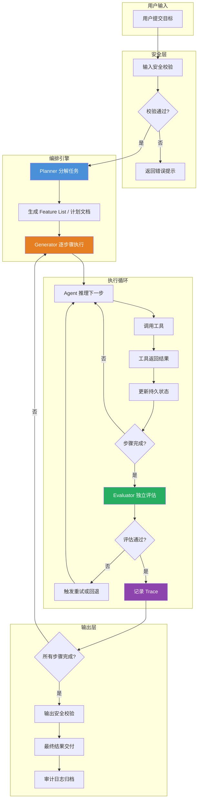

# Harness Engineering 驾驭工程

## 一、定义

Harness Engineering（驾驭工程）是 2026 年成形的 AI 工程新学科——**围绕 AI Agent 设计和构建约束机制、反馈回路、工作流控制和持续改进循环的系统工程实践**。它位于 LLM 推理"内循环"之上，构建 Agent 运行时的"外循环"系统：计划分解、持久状态、工具编排、验证门控、反馈回路、回退机制和人机交接点。评估一个 Agent 的效果时，评估的不是模型本身，而是 **model + harness** 的组合。

> [!quote] 一句话类比
> 模型是赛车手，Harness 是赛道规则、维修站和安全护栏。再厉害的赛车手，上了没有护栏的烂路，跑不快，甚至会翻车。

---

## 二、为什么出现

### 2.1 AI 工程范式的演进弧线

要理解 Harness Engineering 为什么在 2026 年突然成为被认真讨论的工程实践，必须看清 AI 工程四年的完整弧线——不是线性的，而是一连串 **能力跳变 → 旧框架崩塌 → 新抽象涌现** 的循环：

| 阶段 | 时间 | 核心矛盾 | 工程产物 |
|---|---|---|---|
| **生成** | 2022.11-2023 | 模型能生成，但不能行动 | Prompt Engineering |
| **连接** | 2023-2024 | 模型能连接工具，但编排≠治理 | LangChain、Function Calling |
| **推理** | 2024 | 单步推理能力强，但长任务可靠性差 | o1、MCP 协议 |
| **行动** | 2025 | Agent 能自主工作数小时，但基础设施停留在"单次对话"时代 | MCP 生态爆发、A2A |
| **治理** | 2026-现在 | 模型不是瓶颈，系统才是 | **Harness Engineering** |

### 2.2 Agent 的五大根本性挑战

Agent 的本质是"在开放环境中自主推进目标的系统"，这个定义暗含五个工程挑战，**每一个都不能靠更聪明的模型单独解决**：

| 挑战 | 本质 | 为什么模型解决不了 |
|---|---|---|
| **状态持久性** | Agent 需要跨时间、跨 session 记住做过什么 | 模型本身无状态，Context Window 有上限 |
| **目标一致性** | 长任务中 Agent 容易漂移、自嗨、提前宣布完成 | 模型缺少外部锚点，无法稳定校准"什么才算真正完成" |
| **行动可验证性** | 每一步都是概率性的，需要区分"做了"和"做对了" | 模型评价自己时天然存在自我表扬和误判倾向 |
| **熵增抑制** | 持续产出会不断累积冗余、漂移和不一致 | 模型会复制已有模式，哪怕这些模式是坏的 |
| **人机边界** | 何时自主、何时交给人，需要明确工程化地定义 | 模型没有可靠的"不确定性自觉" |

### 2.3 2025 年 Agent 的"翻车"教训

2025 年 Agent 大爆发，但暴露了系统性的结构问题：

- Agent 一把梭完成整个任务，做到一半 Context Window 耗尽
- Agent 完成 70% 后宣布"已全部完成"然后停下
- 多 Agent 并行产生级联错误，单个小错误被放大到不可调试
- 代码库在 Agent 连续工作后出现严重"AI slop"——冗余代码、不一致命名、过时文档

> [!important] 核心洞察
> 这些不是模型的智力问题，而是**系统的结构问题**。Agent 的能力已经到了"可以自主工作数小时"的水平，但围绕它的工程基础设施还停留在"单次对话"的时代。这个断裂就是 Harness Engineering 诞生的根因。

---

## 三、核心思想

### 3.1 三层工程抽象

Prompt → Context → Harness 不是替代关系，而是递进的抽象层级：

```
Prompt Engineering（单次调用）
    ↓ 问题从"单次调用"上移到"每步上下文"
Context Engineering（每一步喂什么）
    ↓ 问题从"每步上下文"上移到"整个任务外循环"
Harness Engineering（整条流水线怎么运转）
```

| 层级 | 解决什么问题 | 时间尺度 |
|---|---|---|
| **Prompt Engineering** | 怎么问才能让模型回答得更好 | 单次 API 调用 |
| **Context Engineering** | 在每一步，把什么信息、以什么形式、在什么时机交给模型 | 单个推理步骤 |
| **Harness Engineering** | 整条流水线怎么运转——多步结构、验证门、持久状态、失败恢复 | 整个任务生命周期 |

> [!tip] 关键区分
> Context Engineering 是"每一步喂什么"，Harness Engineering 是"整条流水线怎么运转"。前者是后者的子集。把 Harness 当成"一个更长的 System Prompt"来做，是当下最常见的失败模式。

### 3.2 精确定义

Anthropic 给出过一个被广泛引用的定义：**Agent Harness（或 Scaffold）是让模型能够作为 Agent 行动起来的系统；它负责处理输入、编排工具调用并返回结果。** 评估一个 Agent 时，评估的是 **model + harness** 的组合，而不是模型单独的能力。

**Harness = 让模型能够作为 Agent 行动起来的外循环系统。**

- **内循环**：模型的推理——给定上下文，生成下一步
- **外循环**：Harness——决定什么时候开始新的内循环、给它什么上下文、如何验证它的输出、何时回退、何时停止

内循环的质量取决于模型能力，外循环的质量取决于 Harness 设计。

### 3.3 Harness 不是框架，是工程实践

LangChain 是框架，CrewAI 是框架，**Harness Engineering 不是**。它是一门实践，就像 DevOps 不是一个工具而是一种工程文化。Harness Engineering 的核心是**关注点分离**：把 Agent 开发中通用的、重复的逻辑（重试、日志、鉴权、安全、调度、状态管理）抽离到中间层，业务侧只关注 Agent 的角色定义和任务逻辑。

---

## 四、工作流程



**三类 Agent 角色分工**（Anthropic 2026.3 三角色架构）：

| 角色 | 职责 | 不做什么 |
|---|---|---|
| **Planner** | 将高层需求扩展为完整 Product Spec + 分步 Feature List | 不直接写代码 |
| **Generator** | 逐 Feature 落地实现，每完成一个就 commit | 不评价自己 |
| **Evaluator** | 独立评估 Generator 的产出，标记 pass/fail，给出具体改进建议 | 不写代码，不自我表扬 |

---

## 五、关键技术

### 5.1 Harness 六大工程构件

| 构件 | 解决什么问题 | 核心实践 |
|---|---|---|
| **Durable State Surfaces** | Agent 跨 session 失忆 | 将状态外化为结构化工件（Feature List、进度日志、Git diff），冷启动 30 秒内续航 |
| **Decomposition & Plans** | 长任务一把梭导致上下文爆炸 | 计划提升为"一等工件"——写入文件系统、被版本管理、被后续 Agent 读取、被验证门引用 |
| **Feedback Loops** | Agent 自我评价不可靠（自我表扬倾向） | Guides（前馈控制）+ Sensors（反馈控制），2×2 矩阵 |
| **Readability** | 产出不可理解、不可审计 | Trace 结构化记录、执行轨迹可回放、决策过程可解释 |
| **Tool Mediation** | 工具调用混乱、权限失控 | 工具注册中心、Schema 校验、高风险动作审批、重试/熔断/降级 |
| **Entropy Control** | 持续产出累积冗余和漂移 | Context Reset（而非 Compaction）、定期清理、增量推进 |

### 5.2 Guides × Sensors 2×2 控制矩阵

|  | **Computational（确定性）** | **Inferential（推断性）** |
|---|---|---|
| **Guides（前置约束）** | Schema 校验、权限策略、成本预算 | 任务分解模板、System Prompt、角色定义 |
| **Sensors（后置检测）** | 单元测试、Lint、类型检查、超时告警 | Evaluator 评估、漂移检测、质量评分 |

**Guides** 在 Agent 行动**之前**约束它，提高"一次做对"的概率。**Sensors** 在 Agent 行动**之后**给信号，支持自纠错。

### 5.3 Agent 可观测性七类对象

| 观测对象 | 记录内容 | 为什么重要 |
|---|---|---|
| **目标** | 原始任务是什么，过程中有没有被改写 | 目标漂移是 Agent 最常见的失败模式 |
| **计划** | Agent 怎么拆任务，每一步是否服务原始目标 | 计划偏离导致全盘皆输 |
| **上下文** | 哪些信息被塞进模型，来源是什么，是否过期 | 上下文错误比模型错误更难排查 |
| **工具** | 调了什么工具，参数是什么，返回了什么，耗时多久 | 工具调用是 Agent 行动的核心证据链 |
| **状态** | 任务状态、记忆、文件、数据库记录发生了什么变化 | 没有状态差异记录，出事后不知道 Agent 动了什么 |
| **成本** | 每一步消耗多少 Token、时间、工具资源 | 成本失控是生产 Agent 最常见的工程问题 |
| **评估** | 最终结果是否正确，中间轨迹是否合理 | 只有数据才能驱动持续改进 |

### 5.4 主流 Agent 框架对比

| 框架 | 定位 | 适合场景 | 不足 |
|---|---|---|---|
| **LangChain** | 通用 Agent 全栈框架（83k+ Stars） | 复杂 RAG + Agent 场景 | 版本迭代快，API 变动频繁，过度抽象 |
| **LangGraph** | Agent 编排引擎（状态图） | 复杂多 Agent、长周期任务 | 学习门槛较高，仅限 LangChain 生态 |
| **CrewAI** | 多 Agent 协作框架（12k+ Stars） | 多 Agent 内容创作、入门级多 Agent | 复杂场景灵活性不足 |
| **LlamaIndex** | 数据驱动 Agent 框架（31k+ Stars） | 知识库 Agent、文档分析 | 多 Agent 编排能力弱于 LangChain |
| **Semantic Kernel** | 企业级 Agent 框架（Microsoft） | 微软生态企业应用 | 生态不如 LangChain 丰富 |
| **Guardrails AI** | Agent 安全护栏（4k+ Stars） | 生产环境安全合规 | 需要额外集成 |
| **LangSmith** | Agent 可观测性与评测 | Trace 追踪、回归测试 | 付费服务，需配合 LangChain |

### 5.5 关键设计原则

| 原则 | 说明 |
|---|---|
| **先简单后复杂** | 从最简单的 Prompt Chaining 开始，只有当复杂性确实带来更好结果时才引入更多结构 |
| **计划是一等工件** | 计划必须写入文件系统、被版本管理、被后续 Agent 可读取，存在于对话里的计划不是计划 |
| **状态 ≠ 保存聊天记录** | 真正的 Durable State 是 Agent 可以在冷启动后、没有任何上下文历史的情况下读取、理解、续航的结构化工件 |
| **Context Reset 优于 Compaction** | 直接给下一个 Agent 全新 Context，通过外化状态工件传递信息，而非压缩对话历史 |
| **不依赖 Agent 自我评价** | Agent 评价自己时倾向于热情地自我表扬，必须引入独立 Evaluator |

---

## 六、优点

- **系统化治理**：将 Agent 从"能跑"提升到"能治"，解决长任务中状态丢失、目标漂移、熵增累积等根本性工程挑战
- **可靠性提升**：Guides × Sensors 2×2 控制矩阵，前馈约束 + 反馈检测，让 Agent 从"跑通一次"变成"稳定跑很多次" [$TRAE_REF](https://blog.csdn.net/libaiup/article/details/160325724)
- **可观测性**：全链路结构化 Trace，覆盖目标、计划、上下文、工具、状态、成本、评估七类对象，出问题可定位、可复盘、可回放 [$TRAE_REF](https://blog.csdn.net/Python_cocola/article/details/161695279)
- **分工明确**：Planner / Generator / Evaluator 三角色架构，将"计划""执行""评价"彻底分离，避免 Agent 既当运动员又当裁判
- **成本可控**：预算分层 + 超限策略（压缩上下文、换小模型、降级输出、人工接管），而非简单让 Agent 继续烧 Token
- **持续改进**：失败样本沉淀为归因、测试用例、护栏规则、文档四类资产，每次失败都在加固系统
- **开发者角色升级**：从"代码实现者"变成"系统驾驭者"，从写代码转向设计系统、定义规范、构建反馈回路

---

## 七、缺点

- **概念尚新**：2026 年 2 月才正式成词扩散，行业共识和方法论仍在快速演进，缺乏成熟的工业标准
- **工程复杂度高**：真正落地 Harness 需要构建状态管理、编排引擎、验证门、审计日志等完整基础设施，远超"写个 Prompt"的工作量
- **过度工程化风险**：简单任务（如单轮问答）不需要 Harness，强行引入反而增加延迟和复杂度
- **人才稀缺**：既懂 Agent 能力又懂系统工程的人极少，2026 年 AI 项目失败率 67%，85% 的企业面临 AI 人才短缺
- **框架碎片化**：LangChain、LangGraph、CrewAI、Semantic Kernel 等框架各有侧重，互操作性有限，选型成本高
- **Evaluator 的可靠性问题**：Evaluator 本身也是模型，也存在误判和自我表扬倾向，Anthropic 的三角色架构只在一定能力边界内有效
- **成本与收益不对称**：构建完整 Harness 的初期投入高，小型项目可能不划算，ROI 需要达到一定 Agent 复杂度才能体现

---

## 八、典型应用

### 8.1 长周期编码 Agent

**OpenAI Codex Harness**：小团队在五个月内从空仓库构建百万行代码的内部 beta 产品，约 1,500 个 PR。工程师的工作重心不是写代码，而是"设计环境、明确意图、构建反馈回路"。

### 8.2 企业级多 Agent 系统

**客服 + 订单 + 退款多 Agent 协作**：Planner 分解用户诉求 → 订单查询 Agent 查数据 → 退款规则 Agent 判断条件 → Generator 生成回复 → Evaluator 校验合规性。全链路可观测、可审计、可回滚。

### 8.3 内容创作流水线

**CrewAI 多 Agent 团队**：策划 Agent 写大纲 → 写手 Agent 写内容 → 校对 Agent 审核 → 发布 Agent 发布。Harness 管理任务分配、状态传递、质量门控。

### 8.4 数据分析 Agent

**自然语言 → SQL → 可视化**：Harness 管理查询分解、数据库连接、结果校验、图表生成的全流程，确保 Agent 不会执行危险 SQL 或泄露敏感数据。

### 8.5 自动化运维 Agent

**故障诊断 + 自动修复**：Agent 监控告警 → 分析日志 → 调用诊断工具 → 执行修复 → 生成事件报告。Harness 控制高危操作审批、回滚机制、升级路径。

---

## 九、面试高频问题

### Q1：什么是 Harness Engineering？它和 Prompt Engineering、Context Engineering 有什么区别？

**定义**：Harness Engineering 是围绕 AI Agent 设计和构建约束机制、反馈回路、工作流控制和持续改进循环的系统工程实践。它构建 Agent 运行时的"外循环"系统。

**三层递进关系**：

| 层级 | 解决什么 | 时间尺度 |
|---|---|---|
| Prompt Engineering | 怎么问才能让模型回答得更好 | 单次 API 调用 |
| Context Engineering | 每步把什么信息、以什么形式、在什么时机交给模型 | 单个推理步骤 |
| Harness Engineering | 整条流水线怎么运转——多步结构、验证门、持久状态、失败恢复 | 整个任务生命周期 |

**核心区别**：Prompt Engineering 优化"问"的质量，Context Engineering 优化"喂"的质量，Harness Engineering 优化"管"的质量。三者不是替代关系，而是递进的抽象层级。

### Q2：Agent 的五大根本性挑战是什么？为什么模型本身解决不了？

1. **状态持久性**：模型是无状态的，Context Window 有上限，无法天然承担长期连续状态。需要外部 Durable State Surface。
2. **目标一致性**：长任务中 Agent 容易漂移、自嗨、提前宣布完成。模型缺少外部锚点。
3. **行动可验证性**：每一步都是概率性的，需要区分"做了"和"做对了"。模型评价自己时天然存在自我表扬倾向。
4. **熵增抑制**：持续产出累积冗余和漂移。模型会复制已有模式，哪怕这些模式是坏的。
5. **人机边界**：何时自主、何时交给人。模型没有可靠的"不确定性自觉"。

**核心结论**：这些不是模型的智力问题，而是**系统的结构问题**。Harness 就是系统性地回答这五个挑战的工程实践。

### Q3：Harness 的六大工程构件分别是什么？

| 构件 | 解决什么问题 | 核心实践 |
|---|---|---|
| **Durable State Surfaces** | 跨 session 失忆 | Feature List、进度日志、Git diff，冷启动 30 秒续航 |
| **Decomposition & Plans** | 长任务一把梭 | 计划提升为"一等工件"，写入文件系统、版本管理 |
| **Feedback Loops** | 自我评价不可靠 | Guides（前馈）+ Sensors（反馈），2×2 矩阵 |
| **Readability** | 决策不可理解 | 结构化 Trace、执行轨迹可回放 |
| **Tool Mediation** | 工具调用混乱 | 注册中心、Schema 校验、审批、熔断降级 |
| **Entropy Control** | 产出累积冗余 | Context Reset 而非 Compaction |

### Q4：为什么 Context Reset 优于 Context Compaction？

Anthropic 发现了一个深层问题：**Context Anxiety**。即使用了 Compaction（对早期对话做摘要压缩），Agent 仍然会因为感觉"上下文太满"而行为退化。

**Context Reset** 的解决方案更激进但更有效：直接给下一个 Agent 一个全新的 Context，通过外化的状态工件（Feature List、Git diff、进度日志）而不是对话历史来传递所有必要信息。这比 Compaction 更彻底地解决了"上下文膨胀导致行为退化"的问题。

### Q5：Agent 可观测性和普通日志有什么区别？

| 维度 | 普通日志 | Agent 可观测性 |
|---|---|---|
| **关注点** | 服务状态（接口 200 还是 500） | 执行意图和决策过程 |
| **记录内容** | 请求参数、返回码、耗时、异常堆栈 | 目标、计划、上下文、工具调用、状态变化、成本、评估 |
| **能回答的问题** | 系统有没有挂 | 任务有没有做对 |
| **典型盲区** | 所有 HTTP 状态码都是 200，但任务已经偏了 | 能定位到"目标改写偏了"或"证据选择偏了" |

**关键判断**：Agent 出问题时，HTTP 状态码可能全是 200，但任务已经偏了。普通日志看不到这种偏差，Agent Trace 必须在 Plan、Action、Observation、State Diff、Context Source 和 Eval Result 层面做结构化记录。

### Q6：Agent 调工具失败了，怎么判断是模型错、参数错，还是工具错？

将工具调用链路拆成五段，逐段归因：

| 故障类型 | 症状 | 修复方向 |
|---|---|---|
| **工具选择错误** | 该调订单查询却调了知识库搜索 | 优化工具描述、路由策略、候选集 |
| **参数生成错误** | 工具选对了但参数格式不对 | 完善 JSON Schema、参数校验、错误反馈 |
| **权限边界错误** | 调用了不该调用的写操作 | 权限策略、高风险动作审批 |
| **工具服务异常** | 工具本身超时、500 | 重试、熔断、降级、告警 |
| **结果理解错误** | 工具返回是对的但 Agent 看错了 | 记录证据引用、输出校验、Evaluator 评估 |

**排查顺序**：先看工具是否存在 → 再看权限是否允许 → 再看参数是否通过 Schema → 再看工具服务是否成功 → 最后看模型是否理解结果。

### Q7：SDD（规范驱动开发）和 Harness Engineering 有什么关系？

SDD 是 Harness Engineering 的**前置实践**。SDD 解决的是"先写规范，再让 AI 生成代码"的问题，Harness Engineering 解决的是"Agent 生成代码后，如何验证、如何管理状态、如何控制成本、如何持续改进"的问题。

SDD 对应 Harness 中的 Guides（前馈控制），Harness 还包括 Sensors（反馈控制）、状态管理、工具编排、可观测性等更完整的工程能力。SDD 是 Harness Engineering 的"Plan"环节，但不是全部。

### Q8：Harness Engineering 的"先简单后复杂"原则是什么？

Anthropic 在 Building Effective Agents 指南中明确提出：**先用最简单的模式，只有当复杂性确实带来更好结果时才引入更多结构。**

具体实践路径：
1. 先尝试单次 Prompt（零工具调用）
2. 不够再加 Prompt Chaining（串联多个 Prompt）
3. 不够再加工具调用（Function Calling）
4. 不够再加 Evaluator-Optimizer Loop（评估反馈循环）
5. 不够再加完整 Harness 架构（Planner/Generator/Evaluator）

**核心理念**：不是所有 Agent 都需要完整 Harness。过度工程化和工程不足同样危险。

---

## 十、相关知识

- LLM 大语言模型 — Agent 的"大脑"，Harness 管理的核心对象
- Agent — Harness Engineering 的直接服务对象，为 Agent 提供全生命周期管理
- MCP 模型上下文协议 — Agent 与外部工具通信的标准化协议，Harness 的"连接层"基础设施
- 模型幻觉 — Agent 与外部世界交互的核心能力，Harness 管理其工具定义、调用、执行全生命周期
- Prompt Engineering 提示词工程 — 三层工程抽象的第一层，Harness Engineering 的前置阶段
- LangChain-LangGraph — 最主流的 Agent 开发框架，LangGraph 是 Harness 编排引擎的核心实现
- RAG 检索增强生成 — Agent 连接外部知识的关键技术，Harness 管理其上下文注入
- A2A Agent-to-Agent 协议 — Google 的 Agent 间通信协议，与 Harness 的编排层互补
- SDD 规范驱动开发 — Harness Engineering 的前置实践，对应 Guides 前馈控制
- Vibe Coding 氛围编程 — 2024 年 Andrej Karpathy 提出，2026 年被 Harness Engineering 超越的 AI 编程范式

---

## 十一、代码示例

### 最简 Harness：CrewAI 多 Agent 编排

```python
from crewai import Agent, Task, Crew

# 定义 Planner（策划）
planner = Agent(
    role="技术策划师",
    goal="将高层需求分解为具体的功能点列表",
    backstory="你是一个经验丰富的技术架构师，擅长将模糊需求转化为可执行的功能清单。",
    verbose=True,
)

# 定义 Generator（生成者）
generator = Agent(
    role="Python 开发工程师",
    goal="根据功能清单逐项实现代码",
    backstory="你是一个严谨的 Python 开发者，每完成一个功能就提交代码。",
    verbose=True,
)

# 定义 Evaluator（评估者）
evaluator = Agent(
    role="代码审查专家",
    goal="独立评估代码质量，不依赖开发者的自我评价",
    backstory="你是一个严格的代码审查者，只关注代码是否真的正确，不给面子。",
    verbose=True,
)

# 定义任务
plan_task = Task(
    description="将需求'构建一个 REST API 用户管理系统'分解为功能点列表",
    expected_output="一个结构化的功能点列表，每个功能点包含验收标准",
    agent=planner,
)

code_task = Task(
    description="根据功能点列表，用 Python + FastAPI 逐项实现代码",
    expected_output="完整的 Python 代码，每完成一个功能点有 Git commit",
    agent=generator,
)

review_task = Task(
    description="独立审查代码：检查每个功能点的验收标准是否满足，是否存在安全漏洞",
    expected_output="审查报告，每个功能点标记 pass/fail，fail 的给出具体改进建议",
    agent=evaluator,
)

# 组建 Harness
crew = Crew(
    agents=[planner, generator, evaluator],
    tasks=[plan_task, code_task, review_task],
    verbose=True,
)

result = crew.kickoff()
print(result)
```

### 结构化 Trace 记录（可观测性核心）

```python
import json
import time
import uuid
from typing import Optional
from dataclasses import dataclass, field, asdict

@dataclass
class StepTrace:
    """单步执行记录"""
    step_id: int
    step_type: str  # "plan" | "tool_call" | "observation" | "evaluate"
    current_goal: str
    model_input_summary: str
    model_output_summary: str
    tool_name: Optional[str] = None
    tool_args: Optional[dict] = None
    tool_result_summary: Optional[str] = None
    tokens: int = 0
    latency_ms: float = 0
    risk_level: str = "low"
    eval_result: Optional[str] = None  # "pass" | "fail" | "uncertain"

@dataclass
class TaskTrace:
    """任务级执行记录"""
    trace_id: str = field(default_factory=lambda: str(uuid.uuid4()))
    user_goal: str = ""
    agent_version: str = "1.0.0"
    model_version: str = ""
    start_time: float = field(default_factory=time.time)
    end_time: Optional[float] = None
    final_status: str = "running"  # "success" | "failed" | "degraded" | "human_takeover"
    total_tokens: int = 0
    total_cost: float = 0.0
    steps: list[StepTrace] = field(default_factory=list)
    final_eval: Optional[str] = None

    def add_step(self, step: StepTrace):
        self.steps.append(step)
        self.total_tokens += step.tokens

    def finish(self, status: str, eval_result: str):
        self.end_time = time.time()
        self.final_status = status
        self.final_eval = eval_result

    def to_dict(self) -> dict:
        return asdict(self)

    def to_json(self) -> str:
        return json.dumps(self.to_dict(), ensure_ascii=False, indent=2)

# 使用示例
trace = TaskTrace(
    user_goal="分析最近 7 天订单异常原因",
    model_version="claude-3.5-sonnet",
)

# 记录 Planner 步骤
trace.add_step(StepTrace(
    step_id=1,
    step_type="plan",
    current_goal="将用户需求分解为可执行的子任务",
    model_input_summary="用户要求分析订单异常",
    model_output_summary="分解为：1) 查订单数据 2) 分析退款 3) 分析支付失败",
    tokens=450,
    latency_ms=1200,
))

# 记录工具调用步骤
trace.add_step(StepTrace(
    step_id=2,
    step_type="tool_call",
    current_goal="查询最近 7 天的订单数据",
    tool_name="search_orders",
    tool_args={"date_range": "7d", "status": "all"},
    tool_result_summary="返回 12,340 条订单，退款率 3.2%，支付失败率 1.8%",
    tokens=320,
    latency_ms=850,
))

# 记录评估步骤
trace.add_step(StepTrace(
    step_id=3,
    step_type="evaluate",
    current_goal="评估第 2 步的结果是否合理",
    model_input_summary="订单数据 + 退款率 + 支付失败率",
    model_output_summary="评估通过，数据完整，两个维度都有覆盖",
    eval_result="pass",
    tokens=180,
    latency_ms=600,
))

trace.finish("success", "pass")
print(trace.to_json())
```

### 安全护栏：Guardrails AI 集成

```python
from guardrails import Guard
from guardrails.validators import (
    ValidLength,
    ReadingTime,
    CompetitorCheck,
    RegexMatch,
)

# 定义 Agent 输出安全护栏
guard = Guard().use_many(
    ValidLength(min=100, max=2000, on_fail="fix"),  # 长度在 100-2000 字
    ReadingTime(max=10, on_fail="fix"),              # 阅读时间不超过 10 分钟
    CompetitorCheck(
        competitors=["竞争对手A", "竞争对手B"],
        on_fail="refrain"                            # 泄露竞争对手信息时拒绝输出
    ),
    RegexMatch(
        regex="^[\\u4e00-\\u9fff\\w\\s.,!?，。！？]+$",
        on_fail="fix"                                # 只允许中英文、数字、标点
    ),
)

# 在生产 Agent 中集成
def agent_generate_with_guard(prompt: str) -> str:
    raw_output = llm.generate(prompt)  # 原始 LLM 输出
    try:
        validated_output = guard.parse(raw_output)
        return validated_output.validated_output
    except Exception as e:
        # 触发护栏：记录、告警、降级或人工审核
        log_security_event("guardrail_triggered", str(e))
        return "抱歉，当前输出未通过安全审核，请重新提问。"
```

### Budget 分层控制

```python
from dataclasses import dataclass
from enum import Enum

class TaskPriority(Enum):
    LOW = "low"
    MEDIUM = "medium"
    HIGH = "high"

@dataclass
class BudgetPolicy:
    priority: TaskPriority
    max_tokens: int
    max_steps: int
    max_latency_ms: int
    model: str  # 大模型 vs 小模型

# 预算策略表
BUDGET_POLICIES = {
    TaskPriority.LOW: BudgetPolicy(
        priority=TaskPriority.LOW,
        max_tokens=2000,
        max_steps=5,
        max_latency_ms=5000,
        model="gpt-4o-mini",  # 小模型够用
    ),
    TaskPriority.MEDIUM: BudgetPolicy(
        priority=TaskPriority.MEDIUM,
        max_tokens=8000,
        max_steps=15,
        max_latency_ms=30000,
        model="gpt-4o",
    ),
    TaskPriority.HIGH: BudgetPolicy(
        priority=TaskPriority.HIGH,
        max_tokens=30000,
        max_steps=50,
        max_latency_ms=120000,
        model="claude-3.5-sonnet",  # 最强大模型
    ),
}

def execute_with_budget(task: str, priority: TaskPriority):
    policy = BUDGET_POLICIES[priority]
    trace = TaskTrace(user_goal=task, model_version=policy.model)

    for step_id in range(policy.max_steps):
        # 超预算检查
        if trace.total_tokens > policy.max_tokens:
            return handle_budget_exceeded(trace, policy)

        # 执行步骤
        step = execute_single_step(task, step_id, policy.model)
        trace.add_step(step)

        if step.eval_result == "fail":
            # 触发重试，但计入成本
            continue

    return trace

def handle_budget_exceeded(trace: TaskTrace, policy: BudgetPolicy):
    """预算超限策略：不直接失败，而是分级处理"""
    strategies = [
        ("compress_context", "压缩上下文重新执行"),
        ("switch_to_smaller_model", "切换到更小模型"),
        ("degrade_output", "降级输出（简化版结果）"),
        ("human_takeover", "转人工处理"),
    ]
    for strategy, desc in strategies:
        # 尝试依次降级
        print(f"预算超限，触发策略: {desc}")
    return trace
```

---

## 十二、个人理解

Harness Engineering 是 AI 工程从"手工业"走向"工业化"的标志性转折。它回答了一个本质问题：**当 Agent 已经能自主工作数小时，我们靠什么保证它不翻车？** 答案不是"更聪明的模型"，而是"更聪明的系统设计"。

1. **Harness Engineering 的本质是"信任工程"**。用户不信任 Agent 不是因为模型不够聪明，而是因为 Agent 缺少可验证性、可解释性和可控性。Harness 的 Guides + Sensors 矩阵、Evaluator 三角色、结构化 Trace，本质上都是在构建"可验证的信任"——不是"我相信 Agent 能做好"，而是"我能验证 Agent 做对了"。

2. **"先简单后复杂"是 Harness 最被低估的原则**。很多工程师一上来就搭 LangGraph + CrewAI + Guardrails + LangSmith 全家桶，结果系统复杂度爆炸，调试成本远超收益。Anthropic 的建议非常务实：先试单次 Prompt，不够再加链式调用，不够再加工具调用，不够再加 Evaluator Loop。**过度工程化和工程不足同样危险**。

3. **Evaluator 是 Harness 的"阿喀琉斯之踵"**。三角色架构中，Evaluator 负责独立评估 Generator 的产出——但 Evaluator 本身也是模型，也存在误判和自我表扬倾向。Anthropic 承认 Evaluator 只在模型能力边界附近有效，当任务超出模型能力太多时，Evaluator 也会失准。这意味着 Harness 的上限，最终仍然受模型能力的限制——它解决的是"模型能力范围内如何稳定发挥"，不是"如何突破模型能力上限"。

4. **2026 年的 AI 工程人才不是"会写 Prompt 的人"，而是"会设计 Harness 的人"**。从 Vibe Coding 到 SDD 到 Harness Engineering，开发者角色的转变是根本性的：从代码实现者 → 规范定义者 → 系统驾驭者。AI 没有淘汰开发者，但淘汰了"只会写代码"的开发者。Harness Engineer 的新技能栈是：系统设计 + 状态管理 + 反馈回路设计 + 可观测性 + 成本控制 + 安全策略。

5. **Harness Engineering 的终极形态是 AgentOS**。当 Harness 的六大构件（状态表面、计划分解、反馈回路、可读性、工具中介、熵增控制）都成熟后，它们会收敛成一个"Agent 操作系统"——就像 Kubernetes 之于容器、Linux 之于进程。AgentOS 提供标准化的 Agent 生命周期管理 API，开发者只需定义 Agent 的角色和任务，底层的调度、状态、安全、监控全部由 AgentOS 接管。**这不是科幻，而是 2026 年下半年已经在发生的趋势**。