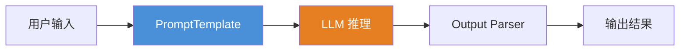
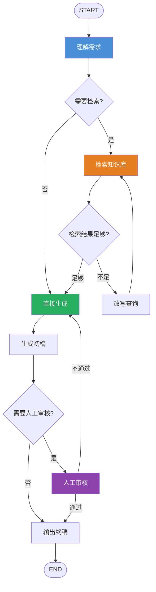

# LangChain 与 LangGraph

## 一、定义

**LangChain** 是 LLM 应用开发的"组件库"——提供 Prompt 管理、LLM 调用、检索、工具集成等标准化组件，让你像搭乐高一样快速拼装 AI 应用。**LangGraph** 是 Agent 流程的"状态机编排引擎"——基于有向图（StateGraph）管理复杂工作流的状态、分支、循环、回退和人机协作。

> [!quote] 一句话区分
> **LangChain 管"能力怎么拼"，LangGraph 管"流程怎么控"**——两者不是替代关系，是配合关系。LangChain 让 Agent 跑起来，LangGraph 让 Agent 真正活下来。

---

## 二、为什么出现

### 2.1 LangChain 解决了什么问题

2022 年底 ChatGPT 爆火后，开发者面临四个核心痛点：

| 痛点 | LangChain 的解法 |
|---|---|
| **LLM API 碎片化**：OpenAI/Anthropic/Cohere 各家用不同接口 | 统一 LLM 抽象层，一套代码切换所有模型 |
| **Prompt 管理混乱**：提示词散落在代码各处，难以维护和复用 | PromptTemplate 模板化管理，变量注入、版本控制 |
| **RAG 实现门槛高**：向量数据库、检索、拼接需要大量胶水代码 | 内置 Document Loader、Text Splitter、VectorStore、Retriever |
| **Agent 开发复杂**：工具调用、多轮推理、记忆管理需要从零搭建 | 内置 Agent 框架、Tool 抽象、Memory 管理 |

### 2.2 LangGraph 解决了什么问题

LangChain 在简单场景下足够好用，但一旦项目复杂化，就暴露出三个致命缺陷：

| 缺陷 | LangGraph 的解法 |
|---|---|
| **线性流程死板**：LangChain 的 Chain 是固定序列，无法处理分支、循环、回退 | 图结构（StateGraph）支持任意拓扑：条件分支、循环、并行 |
| **状态管理薄弱**：Chain 之间没有共享状态，复杂流程中的上下文容易丢失 | 全局 State 对象贯穿整个流程，支持持久化、版本控制、断点恢复 |
| **不可控不可中断**：Chain 一旦启动就无法暂停、人工审核、中断恢复 | 内置 Checkpoint 机制，支持 Human-in-the-loop、中断续跑 |

> [!important] 本质认知
> LangChain 解决的是"能跑 Demo"的问题，LangGraph 解决的是"能上线生产"的问题。能跑通 Demo 和能落地，完全是两回事。

---

## 三、核心思想

### 3.1 LangChain 的核心思想：链式组合（Chain Composition）

LangChain 将 LLM 应用的每个组件（Prompt、LLM、Retriever、Tool）抽象为可组合的模块，通过**链式调用**将它们串联起来。

**六大核心组件**：

| 组件               | 作用                         | 示例                                    |
| ---------------- | -------------------------- | ------------------------------------- |
| **Models（模型）**   | 统一 LLM/Chat/Embedding 模型接口 | `ChatOpenAI(model="gpt-4o")`          |
| **Prompts（提示词）** | 模板化提示词管理                   | `PromptTemplate.from_template("...")` |
| **Chains（链）**    | 将多个组件串联为执行流水线              | `prompt \| llm \| output_parser`      |
| **Indexes（索引）**  | 文档加载、分块、向量化、检索             | `VectorStoreIndex.from_documents()`   |
| **Memory（记忆）**   | 对话历史、上下文管理                 | `ConversationBufferMemory`            |
| **Agents（智能体）**  | LLM 自主决策并调用工具              | `create_tool_calling_agent()`         |

**LCEL（LangChain Expression Language）**：使用 `|` 管道符串联组件，声明式构建链：

```python
chain = prompt | llm | output_parser
```

### 3.2 LangGraph 的核心思想：有状态图（StateGraph）

LangGraph 将 Agent 流程建模为**有向图**，其中：

- **节点（Node）**：执行具体操作（调用 LLM、执行工具、人工审核等）
- **边（Edge）**：定义节点之间的流转关系（普通边、条件边）
- **状态（State）**：贯穿所有节点的全局共享状态对象，支持持久化

**核心要素**：

```
StateGraph = 节点（Node）+ 边（Edge）+ 状态（State）+ 条件路由（Conditional Edge）
```

### 3.3 两者关系：组件库 + 流程引擎

```
LangChain（组件库）          LangGraph（流程引擎）
┌─────────────────┐         ┌─────────────────────┐
│ PromptTemplate   │         │  StateGraph          │
│ ChatModel        │────────▶│  ┌───┐   ┌───┐     │
│ Retriever        │  组件   │  │ A │──▶│ B │     │
│ Tool             │  注入   │  └───┘   └─┬─┘     │
│ Memory           │         │      ▲     │ 条件   │
└─────────────────┘         │      │     ▼ 分支   │
                            │   ┌───┐  ┌───┐     │
                            │   │ C │◀─│ D │     │
                            │   └───┘  └───┘     │
                            └─────────────────────┘
```

---

## 四、工作流程

### 4.1 LangChain 工作流程（线性链式）



**典型 RAG 流程**：用户提问 → 向量检索 → 拼接上下文 → 调用 LLM → 输出答案

### 4.2 LangGraph 工作流程（有状态图）



**核心能力**：条件分支、循环回退、人工审核中断、断点恢复

### 4.3 LangChain vs LangGraph 流程对比

| 维度 | LangChain（Chain） | LangGraph（Graph） |
|---|---|---|
| **流程结构** | 线性链，固定顺序 | 有向图，任意拓扑 |
| **分支能力** | 不支持（需 RouterChain） | 原生条件边（Conditional Edge） |
| **循环能力** | 不支持 | 原生支持 |
| **状态管理** | 无共享状态 | 全局 State 对象 |
| **中断恢复** | 不支持 | 内置 Checkpoint |
| **人工介入** | 不支持 | 原生 Human-in-the-loop |
| **并行执行** | 有限 | 原生支持 Send API |

---

## 五、关键技术

### 5.1 LangChain 关键技术

| 技术 | 说明 |
|---|---|
| **LCEL（LangChain Expression Language）** | 使用 `\|` 管道符声明式构建链，支持流式、异步、并行 |
| **PromptTemplate** | 模板化提示词管理，支持变量注入、Few-Shot、Chat 模板 |
| **ChatModel 抽象** | 统一 GPT-4/Claude/Gemini 等所有 LLM 的调用接口 |
| **Document Loader** | 支持 PDF/Word/Markdown/HTML/CSV 等 100+ 格式的文档加载 |
| **Text Splitter** | 多种分块策略（递归、语义、代码感知） |
| **VectorStore 集成** | 统一 Chroma/Milvus/Qdrant/Pinecone/FAISS 等向量库接口 |
| **Tool 抽象** | 将任意函数封装为 LLM 可调用的工具 |
| **Memory** | 对话历史管理（Buffer/Summary/Vector 等多种策略） |

### 5.2 LangGraph 关键技术

| 技术 | 说明 |
|---|---|
| **StateGraph** | 核心抽象：定义节点、边、状态的图结构 |
| **State（状态对象）** | TypedDict 定义，贯穿所有节点，支持持久化到数据库 |
| **Conditional Edge** | 根据当前状态动态决定下一步执行的节点 |
| **Checkpoint** | 每个节点执行后的状态快照，支持断点恢复和回退 |
| **Human-in-the-loop** | 流程在指定节点暂停，等待人工审核后继续 |
| **Send API** | 动态并行分发任务到多个节点（Map-Reduce 模式） |
| **SubGraph** | 将一个图作为另一个图的节点，支持模块化复用 |
| **Streaming** | 实时流式输出每个节点的执行状态 |

### 5.3 LangSmith（生态第三极）

| 功能 | 说明 |
|---|---|
| **链路追踪** | 可视化追踪每次 LLM 调用的输入、输出、耗时、Token 消耗 |
| **性能监控** | 实时监控延迟、错误率、吞吐量 |
| **A/B 测试** | 多版本 Prompt/模型对比实验 |
| **数据集管理** | 构建测试数据集，自动化回归测试 |
| **人工标注** | 对输出质量进行人工评分，积累评估数据 |

---

## 六、优点

### 6.1 LangChain 优点

- **上手极快**：LCEL 管道语法直观，三行代码串起 RAG 流程
- **生态丰富**：100+ 模型集成、60+ 文档加载器、50+ 向量库、数百个工具
- **标准化**：统一的 LLM 抽象层，切换模型只需改一行代码
- **社区活跃**：GitHub 90k+ Star，文档完善，教程丰富
- **快速原型**：从想法到 Demo 只需几小时，适合快速验证

### 6.2 LangGraph 优点

- **流程可控**：图结构原生支持分支、循环、回退，告别 if-else 地狱
- **状态持久化**：内置 Checkpoint，支持断点续跑、故障恢复、状态回溯
- **人工可介入**：Human-in-the-loop 机制，关键节点可暂停等待审核
- **生产级可靠**：1000+ TPS 并发处理能力，适合大规模部署
- **可观测性强**：每个节点执行状态可追踪，配合 LangSmith 实现全链路监控
- **多 Agent 协作**：原生支持多 Agent 编排，Supervisor + Worker 模式

### 6.3 两者组合优势

- **开发效率**：LangChain 提供组件，LangGraph 提供编排，分工明确
- **平滑演进**：从简单 Chain 逐步升级到复杂 Graph，无需推倒重来
- **完整生态**：LangChain + LangGraph + LangSmith 覆盖开发→编排→监控全链路

---

## 七、缺点

### 7.1 LangChain 缺点

- **抽象层过重**：层层封装导致调试困难，一个简单调用可能经过 5-6 层抽象
- **版本不稳定**：API 变动频繁，0.x 到 1.0 经历多次 Breaking Change，升级成本高
- **文档滞后**：代码更新快于文档，很多示例代码在新版本中已失效
- **过度封装**：很多场景下直接用 OpenAI SDK 反而更简洁，不必要的抽象增加学习成本
- **复杂流程脆弱**：线性 Chain 无法处理分支、循环、回退，复杂场景下代码迅速失控

### 7.2 LangGraph 缺点

- **学习曲线陡峭**：StateGraph 的概念（State、Node、Edge、Conditional Edge、Checkpoint）需要时间理解
- **调试复杂**：图结构比线性链更难追踪执行路径，需要通过 LangSmith 辅助
- **过度设计风险**：简单任务用 LangGraph 是"杀鸡用牛刀"，增加不必要的复杂度
- **性能开销**：状态持久化和 Checkpoint 机制带来额外延迟和存储成本
- **生态仍在早期**：相比 LangChain 的成熟生态，LangGraph 的第三方集成和最佳实践还在积累中

---

## 八、典型应用

### 8.1 LangChain 典型应用

- **知识库问答（RAG）**：`Document Loader → Text Splitter → Embedding → VectorStore → RetrievalQA`
- **简单聊天机器人**：`PromptTemplate + ChatModel + Memory`
- **文本摘要**：`Stuff/Map-Reduce/Refine` 三种 Chain 策略
- **SQL 查询**：自然语言 → SQL 生成 → 数据库查询 → 结果解释
- **API 调用**：自然语言 → 参数提取 → API 调用 → 结果格式化

### 8.2 LangGraph 典型应用

- **复杂 Agent 系统**：多步推理 + 工具调用 + 结果验证 + 失败重试
- **行业报告生成**：需求理解 → 多源检索 → 初稿生成 → 事实核查 → 人工审核 → 终稿
- **多 Agent 协作**：Supervisor 分配任务 → 各 Agent 并行执行 → 汇总结果
- **长流程任务**：代码生成 → 编译 → 测试 → 修复 → 重新编译（循环直到通过）
- **对话系统**：多轮对话 + 上下文管理 + 意图切换 + 知识库查询

### 8.3 组合使用场景

| 场景 | LangChain 负责 | LangGraph 负责 |
|---|---|---|
| **智能客服** | Prompt 模板、知识库检索、工单 API | 多轮对话流程、情绪识别分支、人工转接 |
| **代码审查** | 代码解析、LLM 审查、报告生成 | 多文件并行审查、问题分级、修复验证循环 |
| **数据分析** | 数据库查询、LLM 分析、图表生成 | 多数据源编排、分析步骤调度、结果校验 |

---

## 九、面试高频问题

### Q1：LangChain 和 LangGraph 的核心区别是什么？

**一句话**：LangChain 管"能力怎么拼"，LangGraph 管"流程怎么控"。

| 维度 | LangChain | LangGraph |
|---|---|---|
| **本质** | LLM 应用组件库 | 有状态图编排引擎 |
| **流程结构** | 线性链（Chain） | 有向图（StateGraph） |
| **状态管理** | 无共享状态 | 全局 State + Checkpoint |
| **分支/循环** | 不支持（需 workaround） | 原生支持 |
| **人工介入** | 不支持 | 原生 Human-in-the-loop |
| **定位** | 快速原型，简单应用 | 生产级复杂 Agent |

**加分点**：能说出"LangGraph 不是 LangChain 的升级版，而是补其短板"——LangChain 解决的是"调用问题"，LangGraph 解决的是"运行问题"。

### Q2：什么场景用 LangChain？什么场景用 LangGraph？

**LangChain 合适**：流程线性、步骤固定、状态简单，出错了重跑一遍也无所谓。如：知识库问答、基础 RAG、简单客服机器人、快速原型验证。

**LangGraph 合适**：有分支、有回退、需要保存状态、任务不能中断、需要人工审核、多 Agent 协同。如：复杂报告生成、多步骤 Agent、长流程任务管控。

**最佳实践**：两者一起用。LangChain 作为"能力积木"提供组件，LangGraph 作为"流程骨架"管控执行。

### Q3：LangGraph 的 StateGraph 是什么？请解释核心概念

**StateGraph** 是 LangGraph 的核心抽象，包含四个要素：

1. **State（状态）**：TypedDict 定义，贯穿所有节点的共享数据对象，支持持久化
2. **Node（节点）**：执行具体操作的 Python 函数，接收 State 并返回更新后的 State
3. **Edge（边）**：普通边（固定流向）和条件边（根据 State 动态路由）
4. **Checkpoint（检查点）**：每个节点执行后的状态快照，支持断点恢复

**示例**：
```python
class AgentState(TypedDict):
    messages: list
    next_step: str
    tool_results: dict

graph = StateGraph(AgentState)
graph.add_node("agent", call_agent)
graph.add_node("tools", call_tools)
graph.add_conditional_edges("agent", router, {"tools": "tools", "end": END})
graph.add_edge("tools", "agent")
```

### Q4：LangChain 的 Chain 和 LangGraph 的 Graph 有什么本质区别？

| 维度 | Chain | Graph |
|---|---|---|
| **拓扑结构** | 线性，A→B→C | 任意，支持分支、循环、并行 |
| **执行流程** | 编译时确定 | 运行时动态决定 |
| **状态传递** | 隐式，链式传递 | 显式，全局 State |
| **错误处理** | 整条链失败 | 可按节点重试/回退 |
| **可中断性** | 不可中断 | 可在任意节点暂停 |

**本质区别**：Chain 是"脚本"，Graph 是"状态机"。Chain 描述"做什么"，Graph 描述"在什么状态下做什么"。

### Q5：LCEL（LangChain Expression Language）是什么？有什么优势？

**LCEL** 是 LangChain 的声明式编程语法，使用 `|` 管道符串联组件：

```python
chain = prompt | llm | output_parser
```

**优势**：
- **声明式**：代码即文档，一目了然
- **自动并行**：自动识别可并行的步骤并优化执行
- **原生流式**：自动支持流式输出（`chain.stream()`）
- **自动异步**：自动支持异步调用（`chain.ainvoke()`）
- **内置可观测**：所有组件自动支持 LangSmith 追踪

### Q6：什么是 Human-in-the-loop？LangGraph 如何实现？

**Human-in-the-loop**：AI 流程在执行到关键节点时暂停，等待人工审核或决策后再继续。

**LangGraph 实现方式**：
1. 在图中标记需要人工审核的节点
2. 使用 `interrupt()` 在指定节点前暂停执行
3. 通过 Checkpoint 保存当前状态
4. 人工审核后调用 `graph.update_state()` 注入人工决策
5. 流程从暂停点继续执行

**典型场景**：敏感内容审核、重大决策确认、复杂纠纷判罚。

### Q7：LangChain 生态中 LangSmith 的作用是什么？

**LangSmith** 是 LangChain 生态的"运营层"，提供：

- **全链路追踪**：可视化每次 LLM 调用的输入、输出、耗时、Token 消耗
- **性能监控**：实时监控延迟、错误率、吞吐量
- **A/B 测试**：多版本 Prompt/模型对比
- **自动化评估**：构建测试数据集，持续回归测试
- **人工标注**：对输出质量进行评分，积累评估数据用于 Few-Shot 优化

**一句话**：LangSmith 让 LLM 应用从"能跑"到"能管"。

---

## 十、相关知识

- LLM 大语言模型 — LangChain/LangGraph 的目标平台
- Agent — LangGraph 是 Agent 编排的核心框架
- RAG 检索增强生成 — LangChain 的 RAG 模块是最常用的组件
- Transformer — 底层模型架构基础
- Prompt Engineering 提示词工程 — LangChain PromptTemplate 的底层实践
- 模型幻觉 — LangChain 的 bind_tools、create_tool_calling_agent 封装了工具调用的完整流程
- LlamaIndex 数据框架 — 与 LangChain 互补的 RAG 框架
- CrewAI 多 Agent 框架 — 与 LangGraph 同类的多 Agent 编排框架
- AutoGen 微软 — 微软的对话驱动多 Agent 框架

---

## 十一、代码示例

### LangChain：快速构建 RAG 问答

```python
from langchain_openai import ChatOpenAI, OpenAIEmbeddings
from langchain_community.document_loaders import PyPDFLoader
from langchain_text_splitters import RecursiveCharacterTextSplitter
from langchain_community.vectorstores import Chroma
from langchain_core.prompts import ChatPromptTemplate
from langchain_core.output_parsers import StrOutputParser
from langchain_core.runnables import RunnablePassthrough

# 1. 加载并分块文档
loader = PyPDFLoader("knowledge.pdf")
docs = loader.load()
splits = RecursiveCharacterTextSplitter(
    chunk_size=512, chunk_overlap=50
).split_documents(docs)

# 2. 向量化并存入向量库
vectorstore = Chroma.from_documents(splits, OpenAIEmbeddings())
retriever = vectorstore.as_retriever(search_kwargs={"k": 5})

# 3. 构建 Prompt 模板
template = """根据以下资料回答问题。如果资料中没有相关信息，请说"不知道"。
资料：{context}
问题：{question}
回答："""
prompt = ChatPromptTemplate.from_template(template)

# 4. 用 LCEL 构建链
llm = ChatOpenAI(model="gpt-4o", temperature=0)
chain = (
    {"context": retriever, "question": RunnablePassthrough()}
    | prompt
    | llm
    | StrOutputParser()
)

# 5. 提问
answer = chain.invoke("公司2023年营收增长多少？")
print(answer)
```

### LangGraph：构建带分支和回退的 Agent

```python
from typing import TypedDict, Literal
from langgraph.graph import StateGraph, END
from langchain_openai import ChatOpenAI
from langchain.tools import tool

# 1. 定义工具
@tool
def search(query: str) -> str:
    """搜索知识库"""
    return f"搜索结果：关于 {query} 的相关信息..."

@tool
def calculate(expression: str) -> str:
    """计算数学表达式"""
    return str(eval(expression))

# 2. 定义状态
class AgentState(TypedDict):
    messages: list
    tool_results: list
    retry_count: int

# 3. 定义节点
llm = ChatOpenAI(model="gpt-4o")
tools = [search, calculate]
llm_with_tools = llm.bind_tools(tools)

def call_agent(state: AgentState):
    """Agent 推理节点"""
    response = llm_with_tools.invoke(state["messages"])
    return {"messages": [response]}

def call_tools(state: AgentState):
    """工具执行节点"""
    last_message = state["messages"][-1]
    results = []
    for tool_call in last_message.tool_calls:
        tool_map = {t.name: t for t in tools}
        result = tool_map[tool_call["name"]].invoke(tool_call["args"])
        results.append(result)
    return {
        "tool_results": results,
        "retry_count": state.get("retry_count", 0) + 1
    }

# 4. 路由函数（条件边）
def router(state: AgentState) -> Literal["tools", "end"]:
    last_message = state["messages"][-1]
    if hasattr(last_message, "tool_calls") and last_message.tool_calls:
        if state.get("retry_count", 0) >= 3:
            return "end"
        return "tools"
    return "end"

# 5. 构建图
graph = StateGraph(AgentState)
graph.add_node("agent", call_agent)
graph.add_node("tools", call_tools)
graph.set_entry_point("agent")
graph.add_conditional_edges("agent", router, {"tools": "tools", "end": END})
graph.add_edge("tools", "agent")

# 6. 编译并运行
app = graph.compile()
result = app.invoke({
    "messages": [("user", "搜索 2024 年 AI 发展趋势，然后计算 3 的 5 次方")],
    "tool_results": [],
    "retry_count": 0
})
print(result["messages"][-1].content)
```

### LangGraph：Human-in-the-loop 示例

```python
from langgraph.graph import StateGraph, END
from langgraph.checkpoint.memory import MemorySaver
from typing import TypedDict

class State(TypedDict):
    content: str
    approved: bool

def generate_content(state: State):
    """生成内容"""
    return {"content": "这是 AI 生成的敏感内容，需要人工审核", "approved": False}

def human_review(state: State):
    """人工审核节点——此处会暂停等待"""
    return state

def publish(state: State):
    """发布内容"""
    if state["approved"]:
        return {"content": f"已发布：{state['content']}"}
    return {"content": "审核未通过，内容未发布"}

# 构建图
graph = StateGraph(State)
graph.add_node("generate", generate_content)
graph.add_node("review", human_review)
graph.add_node("publish", publish)
graph.set_entry_point("generate")
graph.add_edge("generate", "review")
graph.add_edge("review", "publish")
graph.add_edge("publish", END)

# 使用 MemorySaver 支持断点恢复，在 review 前暂停
app = graph.compile(checkpointer=MemorySaver(), interrupt_before=["review"])

# 运行到 review 节点前自动暂停
config = {"configurable": {"thread_id": "1"}}
result = app.invoke({"content": "", "approved": False}, config)
print(f"暂停在审核节点，当前状态: {result}")

# 人工审核通过后，更新状态并继续
app.update_state(config, {"approved": True})
result = app.invoke(None, config)
print(f"最终结果: {result['content']}")
```

### LangChain + LangGraph 组合：生产级 Agent

```python
from langchain_openai import ChatOpenAI
from langchain.tools import tool
from langgraph.graph import StateGraph, END
from langgraph.prebuilt import ToolNode
from typing import TypedDict, Literal, Annotated

# === LangChain 组件：定义工具和模型 ===
@tool
def search_web(query: str) -> str:
    """搜索互联网获取最新信息"""
    return f"搜索结果：{query}..."

@tool
def query_database(sql: str) -> str:
    """查询内部数据库"""
    return f"查询结果：{sql}..."

llm = ChatOpenAI(model="gpt-4o")
tools = [search_web, query_database]
llm_with_tools = llm.bind_tools(tools)

# === LangGraph 编排：构建 Agent 流程 ===
class AgentState(TypedDict):
    messages: Annotated[list, "对话历史"]
    final_answer: str

def agent_node(state: AgentState):
    response = llm_with_tools.invoke(state["messages"])
    return {"messages": [response]}

def should_continue(state: AgentState) -> Literal["tools", "end"]:
    last = state["messages"][-1]
    if hasattr(last, "tool_calls") and last.tool_calls:
        return "tools"
    return "end"

tool_node = ToolNode(tools)

graph = StateGraph(AgentState)
graph.add_node("agent", agent_node)
graph.add_node("tools", tool_node)
graph.set_entry_point("agent")
graph.add_conditional_edges("agent", should_continue, {"tools": "tools", "end": END})
graph.add_edge("tools", "agent")

app = graph.compile()
result = app.invoke({
    "messages": [("user", "搜索最新的 AI 趋势，并查询内部数据库中的相关项目")],
    "final_answer": ""
})
```

---

## 十二、个人理解

LangChain 和 LangGraph 的关系，是 2024-2026 年 AI 工程化最值得理解的设计决策之一。

几个关键判断：

1. **LangChain 的价值被低估了，也被高估了**。低估的是它作为"LLM 应用标准库"的生态价值——统一了 Prompt 管理、LLM 调用、检索、工具集成等散乱的最佳实践。高估的是它作为"万能框架"的定位——很多场景下直接用 OpenAI SDK 更简洁，LangChain 的过度抽象反而增加了认知负担。**LangChain 真正的价值不是"让你写更少的代码"，而是"让你不需要重复造轮子"**。

2. **LangGraph 是 Agent 从 Demo 到生产的必经之路**。2024 年大部分 Agent 项目都是"能跑通 Demo 但无法上线"的状态，根本原因就是缺乏状态管理、流程控制和错误恢复机制。LangGraph 的 StateGraph + Checkpoint + Human-in-the-loop 三重机制，让 Agent 从"脚本"变成了"系统"。**不会 LangGraph 的 Agent 开发者，本质上只是在写高级的 LLM 调用脚本**。

3. **"LangGraph 是 LangChain 的升级版"这句话是面试自杀**。这是一个常见的认知误区。两者的关系是"组件库 vs 流程引擎"——就像 React 和 Redux 的关系，不是谁替代谁，而是各司其职。面试官听到这句话，会直接判定你对 Agent 架构的理解停留在"能跑 Demo"的水平。

4. **LangChain 生态的终局是"不可见"**。最好的框架是让开发者感觉不到框架的存在。LangChain 1.0 之后的 LCEL 语法、LangGraph 的图编排、LangSmith 的自动监控，都在朝着这个方向演进——开发者只需要关注业务逻辑，框架自动处理模型调用、状态管理、性能优化。但这条路还很长。

5. **2026 年的趋势：LangGraph 成为 Agent 标准，但不再是唯一选择**。CrewAI（角色协作）、AutoGen（对话驱动）、DeepAgents（自主管理）等框架在各自领域都有独特优势。LangGraph 的优势在于**精细控制**——如果你需要精确控制 Agent 的每一步行为，LangGraph 是最好的选择；如果你想要快速搭建多 Agent 协作，CrewAI 可能更合适。选框架的本质是选 trade-off。