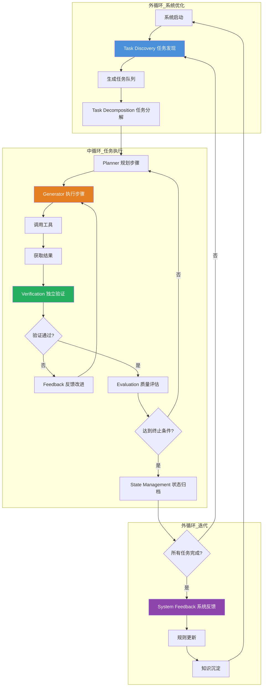

# Loop Engineering 循环工程

## 一、定义

Loop Engineering（循环工程）是 2026 年 6 月成形的 AI 工程新范式——**设计自动化的迭代循环系统，让 AI Agent 自主完成"发现任务→执行任务→评估输出→迭代改进"的完整闭环，工程师不再手动编写每一轮 Prompt，而是设计一组自我运转的循环（Loops）**。Claude Code 负责人 Boris Cherny 的经典表述是："I don't write prompts anymore. I have a bunch of loops running. My job is to write loops."（我不再写 Prompt 了。我有一堆循环在跑。我的工作是写循环。）

> [!quote] 一句话类比
> 如果 Harness Engineering 是给 Agent 搭赛道，Loop Engineering 就是设计赛车在赛道上的自动巡航系统——不需要每圈都手动踩油门、打方向，Agent 自己知道什么时候加速、什么时候转弯、什么时候进站维修。

---

## 二、为什么出现

### 2.1 AI 工程范式的四次进化

Loop Engineering 不是凭空出现的，它是 AI 工程范式演进的第四阶段：

| 阶段 | 时间 | 核心命题 | 工程师角色 |
|---|---|---|---|
| **Prompt Engineering** | 2022-2023 | 怎么问才能让模型回答得更好 | 写 Prompt 的人 |
| **Context Engineering** | 2024-2025 | 每步把什么信息交给模型 | 设计上下文的人 |
| **Harness Engineering** | 2026.2-2026.5 | 整条流水线怎么运转 | 设计系统的人 |
| **Loop Engineering** | 2026.6-现在 | 如何让系统自我运转、自我改进 | 设计循环的人 |

### 2.2 Harness Engineering 的"最后一公里"问题

Harness Engineering 解决了 Agent 的"能跑"和"能治"问题，但遗留了一个根本性痛点：**工程师仍然需要手动设计每一步的 Prompt 和验证逻辑**。当 Agent 系统变得复杂（几十个 Agent、上百个工具、数千个任务步骤），手动管理所有 Prompt 和验证规则变得不可行。

```
Harness Engineering 解决了"系统怎么管 Agent"
Loop Engineering 解决"Agent 怎么自己管自己"
```

### 2.3 2026 年 6 月的引爆点

Loop Engineering 作为公开术语，在 2026 年 6 月快速成词并扩散：

- **Google Cloud AI 负责人 Addy Osmani** 发表博文系统阐述 Loop Engineering，将其定义为"设计自动化的迭代循环，让 Agent 自主发现、执行、评估和改进任务"
- **Anthropic 工程师 Lance Martin** 在社交媒体上详细拆解了 Loop Engineering 的八个核心组件
- **Claude Code 负责人 Boris Cherny** 的"我不再写 Prompt，我的工作是写循环"成为 Loop Engineering 的标志性宣言
- 社区迅速将 Loop Engineering 与 Prompt Engineering、Context Engineering、Harness Engineering 串联为完整的 AI 工程四阶段进化论

---

## 三、核心思想

### 3.1 从"写 Prompt"到"写循环"的范式转变

传统 AI 开发模式：工程师手动写 Prompt → Agent 执行 → 工程师检查结果 → 手动调整 Prompt → 重复。

Loop Engineering 模式：工程师设计循环规则 → Agent 自动发现任务 → Agent 自动执行 → Agent 自动评估 → Agent 自动迭代 → 工程师只审查异常。

### 3.2 三层循环架构

| 循环层级 | 作用 | 运转频率 | 类比 |
|---|---|---|---|
| **内循环（Reasoning Loop）** | 模型单步推理：思考→行动→观察 | 秒级 | 赛车手每秒钟的微调 |
| **中循环（Task Loop）** | 任务执行：规划→执行→评估→重试 | 分钟级 | 赛车每圈的节奏 |
| **外循环（System Loop）** | 系统优化：失败归因→规则更新→知识沉淀 | 小时/天级 | 整场比赛的策略调整 |

### 3.3 八大核心组件

| 组件 | 职责 | 核心问题 |
|---|---|---|
| **Task Discovery（任务发现）** | 自动识别需要做什么 | "还有什么没做？" |
| **Task Decomposition（任务分解）** | 将大任务拆为可执行的小步骤 | "怎么拆？" |
| **Execution（执行）** | Agent 调用工具完成任务 | "怎么做？" |
| **Verification（验证）** | 独立检查执行结果是否正确 | "做对了吗？" |
| **Evaluation（评估）** | 判断输出质量，标记 pass/fail | "做得好吗？" |
| **Feedback（反馈）** | 将评估结果转化为改进信号 | "怎么改进？" |
| **State Management（状态管理）** | 记录循环进度和上下文 | "做到哪了？" |
| **Termination（终止条件）** | 判断何时停止循环 | "完成了吗？" |

### 3.4 设计原则

| 原则 | 说明 |
|---|---|
| **闭环优于开环** | 每个循环必须有明确的评估和反馈机制，不能只有"执行"没有"验证" |
| **独立验证优于自我评价** | 验证和评估必须由独立的 Evaluator 完成，不能依赖执行 Agent 的自我评价 |
| **渐进式卸载** | 工程师从"手动操作"→"监督"→"例外处理"→"设计规则"，逐步把工作卸载给循环 |
| **失败即资产** | 每次失败都被记录、归因、沉淀为规则，循环不会犯同样的错误两次 |
| **终止条件先行** | 在启动循环之前，必须先定义"什么时候停止"——最大步数、超时时间、质量标准 |

---

## 四、工作流程



**典型循环执行时间线**：

```
┌─ 内循环（秒级）─────────────────────────────────────┐
│ Think → Act → Observe → Think → Act → Observe → ... │
└──────────────────────────────────────────────────────┘
     ↓ 每一步完成后进入中循环检查
┌─ 中循环（分钟级）────────────────────────────────────┐
│ Plan → Execute → Verify → Evaluate → (Retry/Next)    │
└──────────────────────────────────────────────────────┘
     ↓ 任务完成后进入外循环
┌─ 外循环（小时/天级）─────────────────────────────────┐
│ Discover → Decompose → Execute All → Feedback → Learn │
└──────────────────────────────────────────────────────┘
```

---

## 五、关键技术

### 5.1 循环设计模式

| 模式 | 描述 | 适用场景 |
|---|---|---|
| **ReAct Loop** | Reasoning + Acting：思考→行动→观察→思考 | 单 Agent 工具调用 |
| **Plan-Execute Loop** | 先规划完整计划，再逐步执行 | 结构化任务 |
| **Evaluate-Optimize Loop** | 执行→评估→优化→重新执行 | 质量要求高的任务 |
| **Discover-Execute Loop** | 自动发现子任务→逐个执行 | 复杂、边界不清晰的任务 |
| **Human-in-the-Loop** | 在关键节点暂停，等待人工确认 | 高风险操作 |

### 5.2 循环控制机制

| 机制 | 说明 | 实现方式 |
|---|---|---|
| **步数限制** | 防止无限循环，设置最大步数 | `max_steps = 50` |
| **超时控制** | 单步和总任务超时 | `step_timeout = 30s`, `task_timeout = 10min` |
| **质量阈值** | 评估分数低于阈值时触发重试或终止 | `min_score = 0.8` |
| **收敛检测** | 连续 N 步无改进时终止 | `convergence_window = 3` |
| **成本预算** | Token 或费用超限时降级或终止 | `max_tokens = 10000` |
| **异常断路器** | 连续失败 N 次时熔断 | `circuit_breaker = 5` |

### 5.3 核心循环框架

| 框架 | 定位 | 循环能力 |
|---|---|---|
| **LangGraph** | 状态图编排引擎 | 支持循环、分支、条件边、状态持久化 |
| **CrewAI Flows** | CrewAI 的流程编排 | 支持顺序/条件/循环流程 |
| **AutoGPT** | 自主 Agent 循环 | 内置规划-执行-评估-反馈循环 |
| **TaskWeaver** | 代码优先的 Agent 框架 | 支持 Plan-Execute-Review 循环 |
| **MetaGPT** | 多 Agent 协作框架 | 支持 SOP 化的多角色循环 |
| **Custom Loops** | 自建循环系统 | 用 Python asyncio + 状态机实现 |

### 5.4 四大演化阶段对比

| 维度 | Prompt Engineering | Context Engineering | Harness Engineering | Loop Engineering |
|---|---|---|---|---|
| **工程师做什么** | 写 Prompt | 设计上下文 | 设计系统 | 设计循环 |
| **Agent 做什么** | 单次回答 | 多步推理 | 按系统规则执行 | 自主发现、执行、改进 |
| **人在循环中的角色** | 操作者 | 上下文提供者 | 系统管理员 | 规则设计师 + 例外处理者 |
| **核心挑战** | 怎么问对 | 喂什么信息 | 怎么管住 Agent | 怎么让 Agent 自己管自己 |
| **时间尺度** | 秒 | 分钟 | 小时 | 天/周 |

---

## 六、优点

- **工程师角色质变**：从"写 Prompt 的工匠"变成"设计循环的建筑师"，工作重心从操作层上升到规则层，一个工程师可以管理数十个自主运转的循环
- **自我改进能力**：外循环的反馈机制让系统从每次失败中学习，沉淀为规则和知识，系统越用越聪明，而非越用越退化
- **规模化能力**：一个设计良好的循环系统可以处理数千个并发任务，无需工程师逐个人工干预
- **质量一致性**：独立的 Verification 和 Evaluation 组件确保每次输出都经过检查，避免"这次好下次差"的波动
- **成本可控**：内建的成本预算和收敛检测机制，防止 Agent 进入"无限烧 Token"的死循环
- **可观测性天然内建**：循环的每一步都被记录在 State Management 中，任何时候都可以回溯完整的执行轨迹
- **与 Harness Engineering 无缝衔接**：Loop Engineering 是 Harness Engineering 之上的"自动驾驶层"，两者配合形成完整的 Agent 工程体系

---

## 七、缺点

- **概念极新**：2026 年 6 月才正式成词，行业实践极少，几乎没有成熟案例和最佳实践，风险极高
- **设计复杂度高**：一个真正有效的循环系统需要精心设计终止条件、评估标准、反馈机制、状态管理，设计不当的循环比没有循环更危险
- **调试困难**：当循环中的 Agent 行为异常时，需要追溯到"哪一圈、哪一步、哪个决策"出了问题，调试链路长、信息量大
- **Evaluator 的可靠性瓶颈**：循环的评估组件本身也是模型，如果 Evaluator 误判，整个循环会被误导，错误会在循环中被放大而非纠正
- **过度工程化风险**：简单的单轮问答任务不需要循环，强行引入只会增加延迟和复杂度，违背"先简单后复杂"原则
- **成本不可预测**：自主循环的 Token 消耗取决于任务复杂度和收敛速度，很难在事前精确预估
- **缺乏标准化工具**：目前没有成熟的 Loop Engineering 框架或平台，大多数实践者需要自己从零搭建

---

## 八、典型应用

### 8.1 代码库持续维护

**Claude Code 的实际应用**：Boris Cherny 的团队使用 Loop Engineering 让 Agent 自主发现代码库中的问题（Task Discovery）→ 自动修复（Execution）→ 自动运行测试（Verification）→ 自动提交 PR（完成）。工程师只审查最终 diff，不再手动写每一次修复的 Prompt。

### 8.2 内容创作流水线

**博客自动生产**：外循环发现热门话题 → 中循环分配写手 Agent 写初稿 → 审查 Agent 独立评估 → 不合格则反馈给写手迭代 → 合格则发布。整个流程中，编辑只审查最终发布的文章。

### 8.3 数据管道监控与修复

**ETL 自动运维**：监控循环检测数据异常 → 诊断循环分析根因 → 修复循环执行修复 → 验证循环确认修复效果 → 学习循环将此次异常的模式沉淀为规则，下次自动处理。

### 8.4 客户服务升级

**多级客服循环**：一级循环（FAQ 自动回答）→ 评估（置信度 < 0.8 则升级）→ 二级循环（知识库检索 + Agent 推理）→ 评估（仍不满足则升级）→ 三级循环（转人工 + Agent 辅助建议）。人在循环的最外层，只处理最复杂的 case。

### 8.5 安全合规审计

**持续合规扫描**：发现循环持续扫描代码和配置 → 识别循环判断是否违规 → 修复循环生成修复建议 → 验证循环确认修复有效 → 报告循环生成合规报告。审计员只需审查例外情况。

---

## 九、面试高频问题

### Q1：Loop Engineering 和 Harness Engineering 的区别是什么？

| 维度 | Harness Engineering | Loop Engineering |
|---|---|---|
| **核心问题** | 系统怎么管住 Agent | Agent 怎么自己管自己 |
| **工程师角色** | 设计系统规则和约束 | 设计自我运转的循环 |
| **Agent 自主性** | 有限（在规则内执行） | 高（自主发现任务、自我改进） |
| **时间尺度** | 任务级（小时） | 系统级（天/周） |
| **典型输出** | 编排引擎、安全护栏、可观测性 | 自我改进循环、自动任务发现、失败自愈 |

**关系**：Loop Engineering 是 Harness Engineering 之上的"自动驾驶层"。Harness 提供基础设施（赛道、护栏、监控），Loop 提供自主运行能力（自动巡航、自我修复）。两者不是替代关系，而是叠加关系。

### Q2：Loop Engineering 的四阶段演化是什么？（高频！）

```
Prompt Engineering（2022-2023）
  → 工程师写 Prompt，Agent 单次回答
  → Context Engineering（2024-2025）
  → 工程师设计上下文，Agent 多步推理
  → Harness Engineering（2026.2-2026.5）
  → 工程师设计系统，Agent 按规则执行
  → Loop Engineering（2026.6-现在）
  → 工程师设计循环，Agent 自主运转
```

**核心趋势**：工程师从"操作者"逐步升级为"规则设计师"，Agent 从"被动响应"逐步升级为"自主行动"。每一次进化，工程师的工作都向上抽象一层，Agent 的自主性都增加一层。

### Q3：Loop Engineering 的八大核心组件是什么？

1. **Task Discovery（任务发现）**："还有什么没做？"——自动识别需要完成的任务
2. **Task Decomposition（任务分解）**："怎么拆？"——将大任务拆解为可执行的小步骤
3. **Execution（执行）**："怎么做？"——Agent 调用工具完成任务
4. **Verification（验证）**："做对了吗？"——独立检查执行结果的正确性
5. **Evaluation（评估）**："做得好吗？"——判断输出质量，标记 pass/fail
6. **Feedback（反馈）**："怎么改进？"——将评估结果转化为具体的改进信号
7. **State Management（状态管理）**："做到哪了？"——记录循环进度和上下文
8. **Termination（终止条件）**："完成了吗？"——判断何时停止循环

**关键**：Verification 和 Evaluation 必须独立于 Execution，否则 Agent 既当运动员又当裁判，循环失去意义。

### Q4：三层循环架构分别是什么？各自解决什么问题？

| 层级 | 作用 | 解决什么问题 |
|---|---|---|
| **内循环（Reasoning Loop）** | 模型单步推理：Think→Act→Observe | 单步推理质量 |
| **中循环（Task Loop）** | 任务执行：Plan→Execute→Verify→Evaluate | 任务完成质量 |
| **外循环（System Loop）** | 系统优化：Discover→Learn→Update Rules | 系统持续改进 |

**设计原则**：内循环依赖模型能力，中循环依赖 Harness 设计，外循环依赖 Loop 设计。三层各有独立的终止条件和评估标准，互不干扰。

### Q5：为什么 Boris Cherny 说"我不再写 Prompt，我的工作是写循环"？

这句话揭示了 Loop Engineering 的核心范式转变：

- **过去**：工程师手动写 Prompt → Agent 执行 → 工程师检查结果 → 手动调整 Prompt → 重复。工程师是"操作者"。
- **现在**：工程师设计循环规则（任务发现规则、评估标准、终止条件、反馈机制）→ Agent 自主循环运转 → 工程师只审查异常和例外。工程师是"规则设计师"。

**本质**：工作重心从"操作层"（每一步怎么写 Prompt）上升到"规则层"（循环怎么运转），实现了"渐进的自我卸载"——把自己从重复性操作中解放出来。

### Q6：Loop Engineering 的循环控制机制有哪些？

| 机制 | 防止什么问题 | 典型配置 |
|---|---|---|
| **步数限制** | 无限循环 | `max_steps = 50` |
| **超时控制** | 任务卡住 | `step_timeout = 30s`, `task_timeout = 10min` |
| **质量阈值** | 劣质输出被接受 | `min_score = 0.8` |
| **收敛检测** | 无效迭代 | 连续 3 步无改进则终止 |
| **成本预算** | Token 费用失控 | `max_tokens = 10000` |
| **异常断路器** | 连续失败 | 连续 5 次失败则熔断，转人工 |

**设计原则**：所有循环都必须有明确的终止条件。没有终止条件的循环不是工程，是 BUG。

### Q7：Loop Engineering 的 Evaluator 为什么是瓶颈？如何缓解？

**瓶颈原因**：Evaluator 本身也是模型，存在误判和自我表扬倾向。当任务超出模型能力边界时，Evaluator 也会失效——错误输出被标记为 pass，正确输出被标记为 fail，循环被误导。

**缓解方案**：
1. **确定性优先**：能用代码验证的（单元测试、类型检查、Schema 校验）不用模型评估
2. **多 Evaluator 投票**：用 3 个不同模型交叉评估，取多数意见
3. **人工抽检**：外循环定期抽检 Evaluator 的评估结果，校准 Evaluator 的准确性
4. **边界降级**：当评估置信度低于阈值时，不强行 pass/fail，升级到人工判断

### Q8：什么场景下不该用 Loop Engineering？

Loop Engineering 不是银弹，以下场景不要强行引入：

- **单轮简单问答**：用 Loop Engineering 是杀鸡用牛刀，增加延迟和成本
- **任务边界明确的一次性执行**：不需要循环，直接执行即可
- **对延迟极度敏感的场景**：每层循环都会增加延迟
- **Evaluator 无法可靠评估的任务**：如果评估本身不可靠，循环会把错误放大
- **原型验证阶段**：先用最简单的 Prompt 验证可行性，确认需要循环再引入

---

## 十、相关知识

- Harness Engineering 驾驭工程 — Loop Engineering 的"路基"，提供编排、安全、可观测性等基础设施
- LLM 大语言模型 — 循环中 Agent 的"大脑"，推理和决策的核心
- AI Agent 智能体 — 循环的执行主体
- Prompt Engineering 提示词工程 — 四阶段演化的起点
- MCP 模型上下文协议 — 循环中 Agent 调用外部工具的标准协议
- LangChain-LangGraph — LangGraph 的 StateGraph 是实现循环编排的核心工具
- 模型幻觉 — 循环中 Execute 环节的关键，LLM 通过工具调用执行具体动作
- A2A Agent-to-Agent 协议 — 多 Agent 循环中的通信协议
- SDD 规范驱动开发 — 循环的"计划"环节的标准实践
- Vibe Coding 氛围编程 — Loop Engineering 试图超越的 AI 编程范式

---

## 十一、代码示例

### 最简 Loop：Plan-Execute-Evaluate 循环

```python
import asyncio
from dataclasses import dataclass, field
from typing import Optional
from enum import Enum

class StepStatus(Enum):
    PENDING = "pending"
    RUNNING = "running"
    PASSED = "passed"
    FAILED = "failed"
    RETRY = "retry"

@dataclass
class LoopState:
    """循环状态管理"""
    task: str
    max_steps: int = 10
    max_retries: int = 3
    quality_threshold: float = 0.7
    current_step: int = 0
    retry_count: int = 0
    history: list[dict] = field(default_factory=list)
    status: str = "running"

    def should_continue(self) -> bool:
        if self.current_step >= self.max_steps:
            return False
        if self.retry_count >= self.max_retries:
            return False
        return self.status == "running"

    def record_step(self, step_data: dict):
        self.history.append(step_data)

class LoopEngine:
    """循环引擎：管理 Plan-Execute-Evaluate 循环"""

    def __init__(self, planner, executor, evaluator):
        self.planner = planner       # 规划 Agent
        self.executor = executor     # 执行 Agent
        self.evaluator = evaluator   # 评估 Agent（独立于执行 Agent）

    async def run(self, task: str) -> LoopState:
        state = LoopState(task=task)

        # 1. 规划阶段
        plan = await self.planner.plan(state.task)
        state.record_step({"phase": "plan", "result": plan})

        # 2. 执行-评估循环
        for step_item in plan["steps"]:
            if not state.should_continue():
                break

            state.current_step += 1
            state.retry_count = 0

            while state.retry_count < state.max_retries:
                # 执行
                result = await self.executor.execute(step_item)
                state.record_step({
                    "phase": "execute",
                    "step": state.current_step,
                    "retry": state.retry_count,
                    "result": result,
                })

                # 评估（独立验证）
                eval_result = await self.evaluator.evaluate(
                    step=step_item,
                    result=result,
                    criteria=plan.get("acceptance_criteria", []),
                )

                if eval_result["score"] >= state.quality_threshold:
                    state.record_step({
                        "phase": "evaluate",
                        "score": eval_result["score"],
                        "status": StepStatus.PASSED.value,
                    })
                    break  # 通过，进入下一步
                else:
                    state.retry_count += 1
                    state.record_step({
                        "phase": "evaluate",
                        "score": eval_result["score"],
                        "status": StepStatus.RETRY.value,
                        "feedback": eval_result.get("feedback", ""),
                    })
                    # 反馈改进：将评估反馈注入下一次执行
                    step_item["improvement_hint"] = eval_result.get("feedback", "")

        state.status = "completed" if state.current_step > 0 else "failed"
        return state

# 使用示例
async def main():
    # 模拟三个 Agent（实际项目中替换为真实 LLM 调用）
    class MockPlanner:
        async def plan(self, task):
            return {
                "steps": [
                    {"action": "search", "query": task},
                    {"action": "analyze", "data": "search_results"},
                    {"action": "summarize", "findings": "analysis"},
                ],
                "acceptance_criteria": ["内容准确", "格式规范", "引用完整"],
            }

    class MockExecutor:
        async def execute(self, step):
            hint = step.get("improvement_hint", "")
            return {"output": f"执行了 {step['action']}，提示: {hint}", "tokens": 150}

    class MockEvaluator:
        async def evaluate(self, step, result, criteria):
            import random
            score = random.uniform(0.5, 1.0)
            return {
                "score": score,
                "feedback": "需要更多引用" if score < 0.7 else "",
            }

    engine = LoopEngine(MockPlanner(), MockExecutor(), MockEvaluator())
    state = await engine.run("分析 2026 年 AI 工程发展趋势")
    print(f"任务完成: {state.status}")
    print(f"总步数: {state.current_step}")
    print(f"历史记录: {len(state.history)} 条")

asyncio.run(main())
```

### 外循环：任务发现 + 持续改进

```python
import json
from datetime import datetime
from typing import Callable

class SystemLoop:
    """外循环：任务发现 → 执行 → 学习 → 改进"""

    def __init__(self):
        self.task_queue: list[str] = []
        self.rule_book: dict[str, Callable] = {}     # 学习到的规则
        self.failure_patterns: list[dict] = []       # 失败模式库
        self.execution_history: list[dict] = []      # 执行历史

    def discover_tasks(self, scope: str) -> list[str]:
        """任务发现：自动扫描需要做什么"""
        # 实际项目中：扫描 Issue、监控告警、代码审查、TODO 注释
        discovered = []
        discovered.append(f"[{scope}] 检查代码库中的安全漏洞")
        discovered.append(f"[{scope}] 更新过时的依赖")
        discovered.append(f"[{scope}] 补充缺失的单元测试")
        discovered.append(f"[{scope}] 优化性能瓶颈")
        return discovered

    async def execute_all_tasks(self, tasks: list[str]):
        """执行所有任务（中循环）"""
        for task in tasks:
            try:
                result = await self._execute_single_task(task)
                self.execution_history.append({
                    "task": task,
                    "result": result,
                    "timestamp": datetime.now().isoformat(),
                })
            except Exception as e:
                self.failure_patterns.append({
                    "task": task,
                    "error": str(e),
                    "timestamp": datetime.now().isoformat(),
                })

    async def _execute_single_task(self, task: str) -> dict:
        """执行单个任务（简化版中循环）"""
        # 1. 检查是否有匹配的规则（从过去的失败中学习）
        for pattern in self.failure_patterns:
            if pattern["task"] in task:
                # 应用学习到的规则，避免重复犯错
                return {"status": "skipped", "reason": f"匹配已知失败模式: {pattern['error']}"}

        # 2. 执行任务
        return {"status": "passed", "output": f"任务 '{task}' 执行成功"}

    def learn_from_failures(self):
        """从失败中学习：更新规则库"""
        for pattern in self.failure_patterns:
            if pattern["error"] not in self.rule_book:
                self.rule_book[pattern["error"]] = lambda task, p=pattern: {
                    "action": "skip",
                    "reason": f"已知失败模式: {p['error']}",
                }

    def generate_report(self) -> dict:
        """生成系统运行报告"""
        return {
            "total_tasks": len(self.execution_history),
            "passed": sum(1 for h in self.execution_history if h["result"]["status"] == "passed"),
            "failed": len(self.failure_patterns),
            "rules_learned": len(self.rule_book),
            "failure_patterns": self.failure_patterns[-5:],  # 最近 5 条
        }

# 使用示例
async def run_system_loop():
    system = SystemLoop()

    # 外循环：每天运行一次
    while True:
        print("=== 外循环开始 ===")

        # 1. 任务发现
        tasks = system.discover_tasks("项目X")
        print(f"发现 {len(tasks)} 个任务")

        # 2. 执行所有任务（中循环）
        await system.execute_all_tasks(tasks)

        # 3. 从失败中学习
        system.learn_from_failures()

        # 4. 生成报告
        report = system.generate_report()
        print(f"报告: {json.dumps(report, ensure_ascii=False, indent=2)}")

        # 5. 等待下一次循环
        print("=== 外循环结束，等待下次运行 ===\n")
        break  # 示例中只运行一次
        # await asyncio.sleep(86400)  # 实际项目中每天运行一次

asyncio.run(run_system_loop())
```

### 循环终止条件实现

```python
from dataclasses import dataclass, field
from typing import Optional
import time

@dataclass
class TerminationPolicy:
    """循环终止策略"""
    max_steps: int = 50                # 最大步数
    max_time_seconds: float = 600      # 最大时间（秒）
    max_tokens: int = 100000           # 最大 Token 消耗
    quality_threshold: float = 0.8     # 质量阈值
    convergence_window: int = 3        # 收敛检测窗口
    max_consecutive_failures: int = 5  # 连续失败上限

    # 运行时状态
    start_time: float = field(default_factory=time.time)
    total_tokens: int = 0
    consecutive_failures: int = 0
    recent_scores: list[float] = field(default_factory=list)
    step_count: int = 0

    def should_terminate(self, current_score: Optional[float] = None) -> tuple[bool, str]:
        """判断是否应该终止循环"""
        self.step_count += 1

        # 1. 步数超限
        if self.step_count >= self.max_steps:
            return True, f"步数超限: {self.step_count} >= {self.max_steps}"

        # 2. 时间超限
        elapsed = time.time() - self.start_time
        if elapsed >= self.max_time_seconds:
            return True, f"时间超限: {elapsed:.1f}s >= {self.max_time_seconds}s"

        # 3. Token 超限
        if self.total_tokens >= self.max_tokens:
            return True, f"Token 超限: {self.total_tokens} >= {self.max_tokens}"

        # 4. 连续失败
        if self.consecutive_failures >= self.max_consecutive_failures:
            return True, f"连续失败超限: {self.consecutive_failures} >= {self.max_consecutive_failures}"

        # 5. 收敛检测
        if current_score is not None:
            self.recent_scores.append(current_score)
            if len(self.recent_scores) > self.convergence_window:
                self.recent_scores.pop(0)
                # 最近 N 次分数没有改善
                if max(self.recent_scores) - min(self.recent_scores) < 0.01:
                    return True, f"收敛: 最近 {self.convergence_window} 步无改进"

        return False, "继续"

    def record_success(self, tokens: int):
        self.total_tokens += tokens
        self.consecutive_failures = 0

    def record_failure(self, tokens: int):
        self.total_tokens += tokens
        self.consecutive_failures += 1

    def summary(self) -> dict:
        return {
            "steps": self.step_count,
            "elapsed": f"{time.time() - self.start_time:.1f}s",
            "tokens": self.total_tokens,
            "failures": self.consecutive_failures,
            "convergence": len(self.recent_scores) >= self.convergence_window,
        }

# 使用示例
policy = TerminationPolicy(max_steps=10, max_time_seconds=60, quality_threshold=0.7)
for i in range(15):
    should_stop, reason = policy.should_terminate(current_score=0.85 - i * 0.01)
    policy.record_success(500)
    if should_stop:
        print(f"循环终止: {reason}")
        print(f"摘要: {policy.summary()}")
        break
```

---

## 十二、个人理解

Loop Engineering 是 AI 工程从"人类主导"到"系统自治"的临界点。它标志着工程师角色的根本性转变——从"让 AI 做对"变成"让 AI 自己做对"。但热度之下，需要冷静判断：

1. **Loop Engineering 不是"不用写 Prompt 了"，而是"不再逐轮写 Prompt 了"**。循环的规则、评估标准、终止条件仍然需要工程师精心设计。设计得不好的循环，比没有循环更危险——它会让 Agent 在错误的方向上迭代数百次，浪费大量 Token 后产生一个看似合理但完全跑偏的结果。**"写循环"比"写 Prompt"更需要系统思维和质量把控能力。**

2. **Loop Engineering 的成败取决于 Evaluator 的质量**。循环的核心是"评估-反馈-改进"，如果 Evaluator 不可靠，整个循环就是垃圾进、垃圾出。当前的模型在评估复杂任务时仍有 15-30% 的误判率——这意味着，在没有人工校准的情况下，Loop Engineering 的可靠性天花板是 70-85%。**在 Evaluator 不够可靠之前，Loop Engineering 更适合"辅助人"而非"替代人"。**

3. **"三层循环"的设计是 Loop Engineering 最精妙但也最容易被滥用的部分**。内循环依赖模型能力（容易做），中循环依赖 Harness 设计（可以做），外循环依赖系统持续学习（最难做）。大部分团队会把精力花在内循环和中循环上，却忽略了外循环——结果就是 Agent 能跑、能完成任务，但从来不从失败中学习，同样的错误犯了 100 次。**没有外循环的 Loop Engineering，本质上只是"自动化操作"，不是"工程"。**

4. **Loop Engineering 会加速"AI 工程师的失业"**——但只淘汰"只会写 Prompt 的人"。四阶段演化（Prompt → Context → Harness → Loop）的本质是工程师的不断"自我卸载"：每次卸载一层操作，就解放一层生产力。Loop Engineering 是这一过程的终点：工程师不再操作 Agent，而是设计 Agent 的"自动驾驶系统"。**未来的 AI 工程师，核心能力不再是"能把 Prompt 写得多好"，而是"能设计出多好的自我运转系统"。**

5. **Loop Engineering 的终极形态是"永不停机的自我改进系统"**。想象一个系统：外循环每天发现新任务 → 中循环执行每个任务 → 内循环完成每一步推理 → 失败被外循环学习并更新规则 → 规则让中循环不再犯同样的错误 → 系统越跑越聪明、越跑越省 Token。**这不是科幻，而是 2026 年下半年正在发生的工程实践。** 但距离"永不停机"还有两个关键瓶颈：Evaluator 的准确率和长周期状态管理的可靠性。突破这两个瓶颈，Loop Engineering 将成为 AI 工程史上最大的范式跃迁。