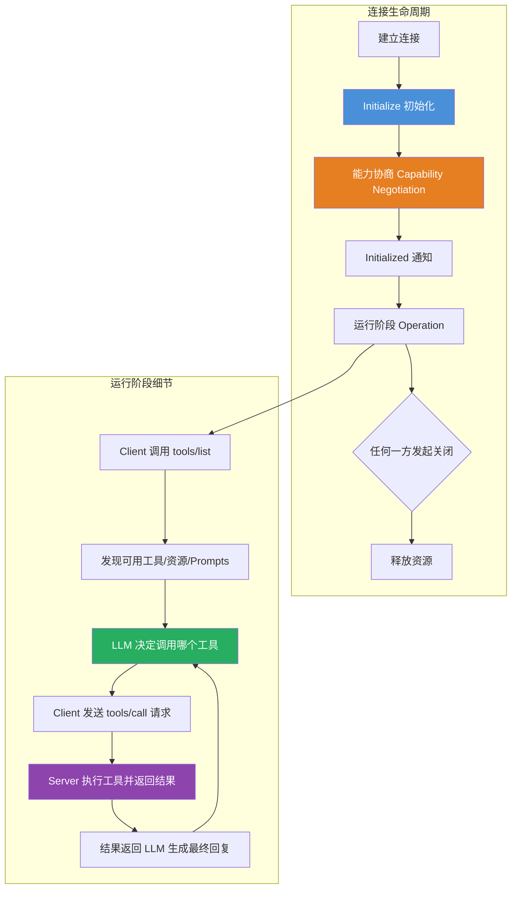

# MCP 模型上下文协议（Model Context Protocol）

## 一、定义

MCP（Model Context Protocol，模型上下文协议）是由 Anthropic 于 2024 年 11 月推出并开源的一套**标准化通信协议**，基于 JSON-RPC 2.0，定义了大语言模型（LLM）与外部工具、数据源和服务之间的统一交互方式。官方将其类比为 **"AI 应用的 USB-C 接口"**——正如 USB-C 为电子设备提供了统一的物理连接标准，MCP 为 AI 应用与外部系统之间提供了统一的协议连接标准。

> [!quote] 一句话类比
> 在 MCP 之前，每个 AI 应用连接每个外部工具都需要一条"定制连接线"（N×M 集成）；MCP 之后，所有 AI 应用和所有外部工具只需遵循同一套"USB-C 协议"（1×1 集成）。

---

## 二、为什么出现

### 2.1 传统 AI 集成的"M×N 集成困境"

在 MCP 出现之前，AI 应用与外部工具的集成呈现碎片化状态：

| 问题 | 具体表现 |
|---|---|
| **架构碎片化** | N 个 AI 应用 × M 个外部工具 → 需要 N×M 套定制集成代码，每套都要独立开发、测试、维护 |
| **难以扩展** | 新增一个工具需要重新开发适配层，新增一个 AI 应用也需要重新对接所有工具 |
| **上下文受限** | 模型只能依赖训练数据和有限的 Prompt 内容，无法访问实时外部信息 |
| **缺乏标准** | 各厂商（OpenAI Function Calling、Anthropic Tool Use、Google Function Calling）各有各的接口规范，互不兼容 |
| **重复造轮子** | 每个开发者都在为"查天气""搜文件""调 API"写相似的胶水代码 |

### 2.2 MCP 的解决方案

MCP 将"用什么工具"和"怎么调工具"彻底解耦：

- **统一协议**：所有工具提供方只需按 MCP 规范实现一次 MCP Server，所有 AI 应用即可通过 MCP Client 调用
- **动态发现**：Client 无需提前硬编码工具列表，运行时自动发现 Server 暴露的能力
- **双向通信**：模型既能读取数据（Resources），也能执行操作（Tools），还能使用模板（Prompts）
- **开放生态**：任何人可以开发 MCP Server 并被任意 MCP Client 调用，形成跨厂商、跨平台的工具市场

> [!important] 本质认知
> MCP 要解决的不是"AI 能不能调用工具"，而是"AI 调用工具的方式能不能标准化"——Function Calling 解决了前者，MCP 解决了后者。MCP 是 AI 工具生态从"手工业"走向"工业化"的关键一步。

---

## 三、核心思想

### 3.1 Client-Host-Server 三层架构

```
┌──────────────────────────────────────────────────────────┐
│                    Host（宿主应用）                        │
│  ┌─────────────┐   ┌─────────────┐   ┌─────────────┐    │
│  │ MCP Client  │   │ MCP Client  │   │ MCP Client  │    │
│  │    #1       │   │    #2       │   │    #3       │    │
│  └──────┬──────┘   └──────┬──────┘   └──────┬──────┘    │
└─────────┼─────────────────┼─────────────────┼────────────┘
          │                 │                 │
          ▼                 ▼                 ▼
   ┌─────────────┐   ┌─────────────┐   ┌─────────────┐
   │ MCP Server  │   │ MCP Server  │   │ MCP Server  │
   │  (本地文件)  │   │  (远程 API) │   │  (数据库)   │
   └─────────────┘   └─────────────┘   └─────────────┘
```

- **Host**：AI 应用本身（Claude Desktop、Cursor、Cherry Studio、自定义 Agent），负责整体交互流程和安全策略
- **MCP Client**：嵌入 Host 内部，每个 Client 与一个 MCP Server 建立一对一连接，负责协议层的消息收发
- **MCP Server**：轻量级程序，对外暴露标准化能力，通过 JSON-RPC 2.0 被 Client 调用

### 3.2 三大能力原语：Tools、Resources、Prompts

MCP Server 对外暴露三种标准化能力：

| 原语 | 控制方 | 描述 | 类比 |
|---|---|---|---|
| **Tools** | 模型控制 | 可执行的函数/操作，LLM 自主决定何时调用 | Function Call |
| **Resources** | 应用控制 | 可读取的数据源，应用程序决定如何使用 | GET 请求 |
| **Prompts** | 用户控制 | 预定义的提示词模板，用户主动选择触发 | 快捷指令 |

> [!tip] 关键区分
> Tools 是"模型主动调用"（如"帮我查天气"），Resources 是"应用主动读取"（如"获取当前文件内容"），Prompts 是"用户主动触发"（如"用代码审查模板检查这段代码"）。三层控制权的分离是 MCP 设计的精妙之处。

### 3.3 通信协议层：JSON-RPC 2.0

MCP 底层统一使用 JSON-RPC 2.0 协议，所有消息遵循请求-响应模式：

```json
// 请求示例：调用 add 工具
{
  "jsonrpc": "2.0",
  "id": 1,
  "method": "tools/call",
  "params": {
    "name": "add",
    "arguments": { "a": 5, "b": 3 }
  }
}

// 响应示例
{
  "jsonrpc": "2.0",
  "id": 1,
  "result": {
    "content": [{ "type": "text", "text": "8" }]
  }
}
```

三种消息类型：

| 消息类型 | 说明 |
|---|---|
| **Request**（请求） | 双向，期望对方返回响应，包含 `id`、`method`、`params` |
| **Response**（响应） | 双向，对请求的应答，包含 `id` 和 `result` 或 `error` |
| **Notification**（通知） | 单向，不需要响应，无 `id` 字段 |

---

## 四、工作流程



**MCP 与 Function Calling 的协作流程**：

1. LLM 通过 Function Calling 机制识别到需要调用工具
2. MCP Client 通过 MCP 协议向 MCP Server 发送标准化调用请求
3. MCP Server 执行实际操作（查询数据库、调用 API、读写文件等）
4. 执行结果通过 MCP 协议返回给 Client，再注入 LLM 的上下文
5. LLM 基于工具返回结果生成最终回复

```
LLM (Function Call) → MCP Client → MCP Protocol → MCP Server → 外部系统
                                                                    ↓
用户 ← LLM 生成回复 ← MCP Client ← MCP Protocol ← 执行结果
```

---

## 五、关键技术

### 5.1 三种传输方式

| 传输方式 | 原理 | 网络支持 | 流式支持 | 推荐程度 |
|---|---|---|---|---|
| **stdio** | 进程间通信，Client 启动 Server 为子进程，通过 stdin/stdout 通信 | 仅本地 | 否 | 本地开发首选 |
| **SSE** | 基于 HTTP 的单向流式推送，Client 通过 GET 接收推送，通过 POST 发送消息 | 远程 | 是 | 已废弃（deprecated） |
| **Streamable HTTP** | 基于 HTTP 的双向流式通信，统一 `/mcp` 端点 | 远程 | 是 | **官方推荐** |

### 5.2 能力协商（Capability Negotiation）

在初始化阶段，Client 和 Server 互相告知各自支持的能力：

```json
// Client → Server: 告知支持的能力
{
  "method": "initialize",
  "params": {
    "protocolVersion": "2025-03-26",
    "capabilities": {
      "tools": {},           // 支持工具调用
      "sampling": {}         // 支持服务端采样
    },
    "clientInfo": { "name": "MyAgent", "version": "1.0.0" }
  }
}

// Server → Client: 告知暴露的能力
{
  "result": {
    "protocolVersion": "2025-03-26",
    "capabilities": {
      "tools": { "listChanged": true },     // 工具列表可动态变化
      "resources": { "subscribe": true },   // 资源支持订阅
      "prompts": { "listChanged": true }    // 提示词模板可动态变化
    },
    "serverInfo": { "name": "Demo", "version": "1.0.0" }
  }
}
```

### 5.3 MCP Python SDK

| 组件 | 说明 |
|---|---|
| **FastMCP** | 高层 API，用装饰器快速定义 Tools/Resources/Prompts，入门首选 |
| **低层 API** | 手动管理 Server 实例、请求处理，适合复杂场景 |
| **Client Session** | 封装与 MCP Server 的连接、消息收发、能力发现 |

### 5.4 MCP 生态平台

| 平台 | 说明 |
|---|---|
| **MCP 官网** (modelcontextprotocol.io) | 官方文档与规范定义 |
| **MCP.so** | 社区驱动的 MCP Server 聚合平台 |
| **Smithery** (smithery.ai) | MCP 工具市场，支持 OAuth 认证 |
| **魔搭社区 MCP 市场** | 阿里达摩院，中文生态友好 |
| **Glama** (glama.ai) | MCP Server 目录与搜索 |

### 5.5 MCP 与 A2A、Function Calling 的对比

| 维度 | Function Calling | MCP | A2A（Agent-to-Agent） |
|---|---|---|---|
| **本质** | 模型能力 | 通信协议 | 通信协议 |
| **提出方** | OpenAI | Anthropic | Google |
| **定位** | 模型如何发起调用 | 模型与工具如何标准化通信 | Agent 之间如何协作 |
| **标准化** | 各厂商不同 | 统一 JSON-RPC 2.0 | 统一协议 |
| **工具发现** | 需预定义 Schema | 动态发现 | 动态发现 |
| **跨系统** | 差 | 原生支持 | 原生支持 |
| **生态复用** | 与具体应用绑定 | 一个 Server 被任意 Client 复用 | 跨 Agent 协作 |

---

## 六、优点

- **标准化**：统一 JSON-RPC 2.0 协议，一次开发、到处复用，彻底解决 M×N 集成困境
- **动态发现**：Client 运行时自动发现 Server 暴露的工具，无需硬编码，新增工具零客户端改动
- **双向通信**：模型既能读取数据也能执行操作，从"只读 AI"进化为"读写 AI"
- **开放生态**：任何人可开发 MCP Server 并发布到市场，形成跨厂商、跨平台的工具共享网络
- **轻量级**：MCP Server 可以是仅几十行代码的 Python 脚本，启动成本极低
- **传输灵活**：支持 stdio（本地开发）、Streamable HTTP（生产部署），适应不同场景
- **行业认可**：OpenAI 于 2025 年 3 月宣布集成 MCP，标志着 MCP 成为事实上的行业标准
- **安全隔离**：工具调用在独立进程中执行，权限可控，支持 OAuth 认证

---

## 七、缺点

- **协议尚在早期**：2024 年 11 月才发布，版本迭代快，部分 API 不稳定，SSE 已被标记为 deprecated
- **生态仍在建设中**：虽然增长迅速，但可用的生产级 MCP Server 数量和质量参差不齐，很多 Server 只是 Demo 级别
- **调试困难**：跨进程（stdio）或跨网络（Streamable HTTP）的 JSON-RPC 调用链长，出错时定位问题复杂
- **性能开销**：每增加一个 MCP Server 就多一层进程间通信或网络通信，工具调用链过长时延迟累积明显
- **安全风险**：MCP Server 可以执行任意代码，恶意 Server 可能窃取数据或执行危险操作，需要信任机制
- **与 Function Calling 的关系不清**：MCP 和 Function Calling 职责有重叠，实际开发中两者混用，增加理解成本
- **不支持流式工具调用**：工具调用的结果需要完全返回后才能注入 LLM 上下文，无法像 LLM 生成一样逐字流式返回
- **缺乏成熟的权限体系**：目前 MCP Server 的权限控制较粗粒度，缺乏细粒度的"谁可以调用哪个工具"的管理

---

## 八、典型应用

### 8.1 IDE 编程助手集成

**Cursor / VSCode + Cline**：通过 MCP 连接 GitHub、数据库、API 文档，AI 编程助手直接读取项目上下文、API 定义、数据库 Schema，生成更准确的代码。

**Apifox MCP Server**：将 API 文档作为 MCP 数据源，AI 可以根据实时的 API 定义自动生成 MVC 代码、数据模型、接口调用代码。

### 8.2 企业数据连接

**数据库 MCP Server**：将 MySQL、PostgreSQL、MongoDB 等数据库通过 MCP 暴露给 AI，用户用自然语言查询和分析数据。

**文件系统 MCP Server**：让 AI 读写本地文件系统，管理项目文件、生成报告、批量处理文档。

### 8.3 业务工具集成

**高德地图 MCP Server**：AI 应用直接查询地址、搜索周边、规划路线。在 Cherry Studio 中配置后，用户可直接用自然语言查询地图信息。

**Notion / Slack / Jira MCP Server**：将企业协作工具接入 AI，实现自然语言驱动的任务管理、文档查询、消息发送。

### 8.4 多 Agent 协作

**A2A + MCP**：MCP 处理 Agent 与工具的通信，A2A（Google 的 Agent-to-Agent 协议）处理 Agent 之间的通信。两者互补，构建完整的 Agent 通信体系。

### 8.5 自定义 Agent 工具链

开发者用 Python SDK 快速将已有 CLI 工具、API、脚本封装为 MCP Server，在自己的 Agent 应用中调用，无需从头开发工具集成层。

---

## 九、面试高频问题

### Q1：MCP 和 Function Calling 有什么区别？

| 维度 | Function Calling | MCP |
|---|---|---|
| **本质** | 模型的一种**能力** | 一套**通信协议标准** |
| **定位** | "模型如何发起调用" | "系统之间如何规范调用" |
| **偏重** | 模型能力层 | 工程架构层 |
| **调用方式** | 通常本地执行 | 支持本地和远程调用 |
| **标准化** | 各厂商实现不同 | 统一 JSON-RPC 2.0 规范 |
| **工具发现** | 需在 Prompt 中预定义函数 Schema | Server 自动注册，Client 动态发现 |
| **跨系统** | 难以跨进程/跨网络 | 原生支持分布式调用 |
| **生态复用** | 函数定义与具体应用绑定 | 一个 Server 可被任意 Client 复用 |

**核心关系**：MCP 不是替代 Function Calling，而是在其之上构建更完整的工程化方案。**Function Call 负责"决定调用哪个工具"，MCP 负责"规范执行工具调用"**。两者结合使用：LLM 通过 Function Call 机制识别到需要调用工具 → MCP Client 通过 MCP 协议去标准化调用 MCP Server。

### Q2：MCP 的核心架构是什么？三层分别的职责是什么？

**Client-Host-Server 三层架构**：

- **Host**（宿主）：AI 应用本身，管理整体交互流程和安全策略。例如 Claude Desktop、Cursor、自定义 Agent 程序
- **MCP Client**（客户端）：嵌入在 Host 内部，每个 Client 与一个 MCP Server 建立一对一连接。负责协议层的消息收发、能力协商、请求路由
- **MCP Server**（服务端）：轻量级程序，对外暴露 Tools、Resources、Prompts 三类能力。通过标准化协议被任意 Client 调用，与具体 AI 应用解耦

**设计优势**：一个 Host 可以同时连接多个 MCP Server（通过多个 Client），每个 Server 专注于一类工具（文件操作、数据库查询、API 调用），实现关注点分离和工具热插拔。

### Q3：MCP Server 的三种能力原语是什么？分别由谁控制？

| 原语 | 控制方 | 描述 | 典型场景 |
|---|---|---|---|
| **Tools** | 模型控制 | 可执行的函数/操作，LLM 自主决定何时调用 | "查询天气""发送邮件""操作数据库" |
| **Resources** | 应用控制 | 可读取的数据源，应用程序决定如何使用 | "读取项目文件""获取数据库 Schema" |
| **Prompts** | 用户控制 | 预定义的提示词模板，用户主动选择触发 | "代码审查模板""数据分析模板" |

**设计意图**：三种控制权分离——模型控制"什么时候做"（Tools），应用控制"读什么"（Resources），用户控制"怎么问"（Prompts）。这种分层设计避免了任何一个角色独揽所有控制权。

### Q4：MCP、A2A、Function Calling 三者如何选择？

| 场景 | 推荐方案 |
|---|---|
| **单个 LLM 调用单个工具** | Function Calling 即可，简单直接 |
| **单个 LLM 需要标准化接入多个工具** | MCP，统一协议，复用工具生态 |
| **多个 Agent 之间需要协作通信** | A2A（Google 的 Agent-to-Agent 协议） |
| **复杂 Agent 系统** | MCP（工具层）+ A2A（协作层），两者互补 |

**核心判断**：Function Calling 是"能力"、MCP 是"协议"、A2A 是"协作"。选择哪个取决于你的需求在哪个层面——是"模型能不能调用工具"（Function Calling）、"工具调用能不能标准化"（MCP）、还是"多个 Agent 能不能互相通信"（A2A）。

### Q5：MCP 的三种传输方式有什么区别？如何选择？

| 传输方式 | 适用场景 | 选择理由 |
|---|---|---|
| **stdio** | 本地开发、CLI 工具封装 | 简单高效，无需网络，安全 |
| **SSE** | 已弃用，不推荐新项目使用 | 已被 Streamable HTTP 替代 |
| **Streamable HTTP** | 生产部署、远程调用、分布式系统 | 双向流式、无状态、易扩展，官方推荐 |

**选择原则**：本地开发用 stdio（零配置），生产环境用 Streamable HTTP（灵活、可扩展）。SSE 仅用于维护已有项目。

### Q6：MCP 的安全模型是什么？有哪些风险？

**安全机制**：
- 每个 MCP Server 在独立进程中运行，进程级隔离
- 连接生命周期管理（初始化 → 运行 → 关闭），明确的安全边界
- 支持 OAuth 认证（如 Smithery 平台）
- 用户对工具调用有最终审批权（在 Host 层面）

**主要风险**：
- **恶意 Server**：MCP Server 可以执行任意代码，恶意 Server 可能窃取数据或执行危险操作
- **权限粒度粗**：目前缺乏细粒度的"谁可以调用哪个工具"的权限管理
- **中间人攻击**：远程 MCP Server 的通信需要 TLS 保护
- **工具注入**：如果 Server 返回的内容被直接注入 LLM 上下文，可能被利用进行 Prompt Injection

### Q7：为什么 OpenAI 宣布采用 MCP 是一个重大事件？

2025 年 3 月 26 日，OpenAI CEO Sam Altman 确认将在 OpenAI 产品中集成 MCP。这意味着：

1. **行业标准的确立**：最大的 AI 公司和第二大 AI 公司（Anthropic）在工具调用协议上达成一致，MCP 从 Anthropic 的"自家协议"变成"行业标准"
2. **生态爆发**：OpenAI 的体量将带动海量开发者和企业采用 MCP，加速 MCP Server 生态的丰富
3. **竞争格局变化**：协议层统一后，竞争焦点从"谁的协议更好"转向"谁的工具生态更丰富"——这对开发者有利

### Q8：MCP 的局限性是什么？什么场景下不适合用 MCP？

**不适合 MCP 的场景**：

- **简单的一次性工具调用**：如果只有一个工具、一个模型，直接用 Function Calling 更简单，MCP 是"杀鸡用牛刀"
- **对延迟极度敏感的场景**：MCP 多一层进程间/网络通信，延迟比直接 Function Call 高 10-50ms
- **需要流式工具调用结果的场景**：MCP 目前不支持流式返回工具结果，LLM 必须等工具完全执行完才能继续生成
- **离线/嵌入式场景**：MCP 的协议栈有一定复杂度，嵌入式设备上过于沉重

---

## 十、相关知识

- LLM 大语言模型 — MCP 服务的核心消费者，LLM 通过 MCP 获取外部信息
- AI Agent 智能体 — Agent 通过 MCP 标准化工具调用，MCP 是 Agent 工具层的基础设施
- 模型幻觉 — MCP 的上游能力，Function Calling 是 Tool Calling 的核心实现，MCP 将工具调用标准化为"即插即用"协议
- RAG 检索增强生成 — MCP 的 Resources 原语可以对接 RAG 的知识库
- LangChain-LangGraph — LangChain 已集成 MCP Client，支持 MCP 工具调用
- A2A Agent-to-Agent 协议 — Google 提出的 Agent 间通信协议，与 MCP 互补
- JSON-RPC 2.0 — MCP 的底层通信协议
- Prompt Engineering 提示词工程 — MCP 的 Prompts 原语与提示词模板直接相关

---

## 十一、代码示例

### 最简 MCP Server：stdio 模式

```python
from mcp.server.fastmcp import FastMCP

# 创建 MCP Server
mcp = FastMCP("Demo")

# 注册 Tool：计算器
@mcp.tool()
def add(a: int, b: int) -> int:
    """计算两个整数的和"""
    return a + b

# 注册 Tool：查询天气（模拟）
@mcp.tool()
def get_weather(city: str) -> str:
    """查询指定城市的天气"""
    # 实际项目中这里调用天气 API
    return f"{city}今天晴天，气温 22-30°C"

# 注册 Resource：配置文件
@mcp.resource("config://app")
def get_config() -> str:
    """获取应用配置"""
    return '{"version": "1.0.0", "debug": false}'

# 注册 Prompt：代码审查模板
@mcp.prompt()
def code_review(code: str) -> str:
    """生成代码审查提示词"""
    return f"""请对以下代码进行审查，关注：
1. 代码质量和可读性
2. 潜在的性能问题
3. 安全漏洞
4. 最佳实践

代码：
```
{code}
```"""

# 启动 Server（stdio 模式）
if __name__ == "__main__":
    mcp.run(transport="stdio")
```

### MCP Server：Streamable HTTP 模式（生产推荐）

```python
from mcp.server.fastmcp import FastMCP
import uvicorn

mcp = FastMCP("ProductionServer")

@mcp.tool()
def search_documents(query: str, top_k: int = 5) -> list[dict]:
    """在知识库中搜索文档"""
    # 实际项目中调用向量数据库或搜索引擎
    results = [
        {"title": "MCP 协议介绍", "score": 0.95, "content": "MCP 是..."},
        {"title": "MCP vs Function Calling", "score": 0.89, "content": "两者区别..."},
    ]
    return results[:top_k]

@mcp.tool()
def send_email(to: str, subject: str, body: str) -> str:
    """发送邮件"""
    # 实际项目中调用邮件 API
    return f"邮件已发送至 {to}，主题：{subject}"

@mcp.resource("db://schema")
def get_db_schema() -> str:
    """获取数据库 Schema"""
    return """
    CREATE TABLE users (
        id INT PRIMARY KEY,
        name VARCHAR(100),
        email VARCHAR(200)
    );
    CREATE TABLE orders (
        id INT PRIMARY KEY,
        user_id INT REFERENCES users(id),
        amount DECIMAL(10, 2)
    );
    """

# 启动 Streamable HTTP Server
if __name__ == "__main__":
    mcp.run(transport="streamable-http", host="0.0.0.0", port=8000)
```

### MCP Client：连接并调用 MCP Server

```python
import asyncio
from mcp import ClientSession, StdioServerParameters
from mcp.client.stdio import stdio_client

async def main():
    # 1. 创建 stdio 连接参数
    server_params = StdioServerParameters(
        command="python",
        args=["mcp_server.py"],
    )

    # 2. 建立连接
    async with stdio_client(server_params) as (read, write):
        async with ClientSession(read, write) as session:
            # 3. 初始化（能力协商）
            await session.initialize()
            print("MCP Server 已连接")

            # 4. 列出可用工具
            tools = await session.list_tools()
            print(f"可用工具: {[t.name for t in tools.tools]}")

            # 5. 调用工具
            result = await session.call_tool("add", arguments={"a": 10, "b": 20})
            print(f"add(10, 20) = {result.content[0].text}")

            # 6. 调用天气查询
            result = await session.call_tool("get_weather", arguments={"city": "北京"})
            print(f"天气: {result.content[0].text}")

            # 7. 列出可用资源
            resources = await session.list_resources()
            print(f"可用资源: {[r.uri for r in resources.resources]}")

            # 8. 读取资源
            resource = await session.read_resource("config://app")
            print(f"配置: {resource.contents[0].text}")

asyncio.run(main())
```

### MCP Client：同时连接多个 MCP Server

```python
import asyncio
from mcp import ClientSession, StdioServerParameters
from mcp.client.stdio import stdio_client

async def connect_server(name, command, args):
    """连接单个 MCP Server"""
    server_params = StdioServerParameters(command=command, args=args)
    read, write = await stdio_client(server_params).__aenter__()
    session = ClientSession(read, write)
    await session.initialize()
    return name, session, (read, write)

async def main():
    # 同时连接多个 MCP Server
    servers = await asyncio.gather(
        connect_server("file", "python", ["file_server.py"]),
        connect_server("weather", "python", ["weather_server.py"]),
        connect_server("database", "python", ["db_server.py"]),
    )

    sessions = {}
    for name, session, _ in servers:
        sessions[name] = session
        tools = await session.list_tools()
        print(f"[{name}] 工具: {[t.name for t in tools.tools]}")

    # 调用不同 Server 的工具
    result = await sessions["weather"].call_tool(
        "get_forecast", arguments={"city": "上海", "days": 3}
    )
    print(f"天气预报: {result.content[0].text}")

    result = await sessions["database"].call_tool(
        "query", arguments={"sql": "SELECT COUNT(*) FROM users"}
    )
    print(f"数据库查询: {result.content[0].text}")

asyncio.run(main())
```

### MCP Client 配置（Cherry Studio / Claude Desktop）

```json
{
  "mcpServers": {
    "weather": {
      "command": "python",
      "args": ["weather_server.py"]
    },
    "database": {
      "command": "npx",
      "args": ["-y", "@anthropic/mcp-server-postgres"],
      "env": {
        "DATABASE_URL": "postgresql://localhost/mydb"
      }
    },
    "filesystem": {
      "command": "npx",
      "args": ["-y", "@anthropic/mcp-server-filesystem", "/path/to/allowed/files"]
    }
  }
}
```

---

## 十二、个人理解

MCP 是 2024-2025 年 AI 基础设施领域最重要的协议创新，没有之一。它的意义不在于技术有多复杂——JSON-RPC 2.0 不是什么新鲜东西——而在于它解决了 AI 工具生态的"通用语言"问题。

1. **MCP 的成功是"时机"的胜利**。MCP 的技术方案并不复杂，但它在最恰当的时机出现——2024 年底，Agent 概念爆发，Function Calling 的碎片化问题已经让开发者痛苦不堪，行业急需一个统一标准。Anthropic 抓住了这个窗口。如果 MCP 早一年出现，可能无人问津；晚一年出现，可能已经被其他标准占据。

2. **OpenAI 的加入是 MCP 的"iPhone 时刻"**。2025 年 3 月 OpenAI 宣布集成 MCP，这标志着 MCP 从 Anthropic 的"自家协议"变成了"行业标准"。这让人想起 Google 的 Kubernetes——最初也是 Google 的内部项目，开源后成为行业标准。但 MCP 比 Kubernetes 更激进：它是由竞争对手 Anthropic 提出，被行业老大 OpenAI 采用——这在科技行业历史上极为罕见。

3. **MCP 的真正价值不在"工具调用"，在"工具市场"**。单个 MCP Server 的编写很简单，但 MCP 生态的真正价值在于：一旦有足够多的 MCP Server，AI 应用就可以像"安装 App"一样"安装工具"。这将催生一个全新的"AI 工具市场"——开发者不再需要为每个工具写集成代码，只需在 MCP 市场中搜索并安装即可。这是 AI 工具生态从"手工业"到"工业化"的跨越。

4. **MCP 不是银弹——它解决的是"连接"问题，不是"推理"问题**。MCP 让 LLM 可以调用工具，但 LLM 是否能正确判断何时调用、调用哪个工具、如何解析工具返回结果——这些"推理"问题仍然完全依赖 LLM 自身的能力。**MCP 是"高速公路"，不是"导航系统"**——它让工具调用的通道更顺畅，但无法保证 LLM 走对路。

5. **MCP + A2A 是 Agent 生态的"TCP/IP"**。MCP 处理 Agent 与工具的通信（工具层），A2A 处理 Agent 之间的通信（协作层）。两者结合，构建了 Agent 通信的完整协议栈。未来的 Agent 系统架构很可能是：LLM（大脑）→ Function Calling（决策）→ MCP（工具调用）→ A2A（多 Agent 协作）。MCP 和 A2A 的关系，就像 TCP/IP 中的 IP 和 TCP——IP 负责"找到对方"，TCP 负责"可靠传输"，两者分工明确、缺一不可。