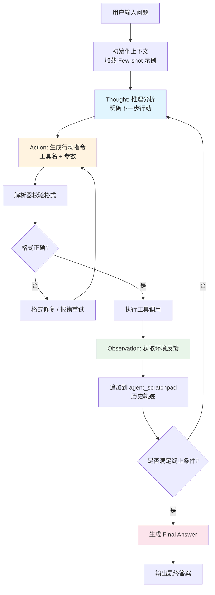
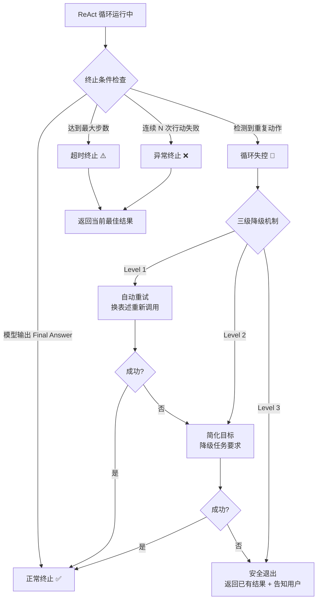
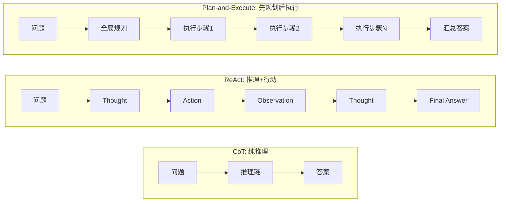
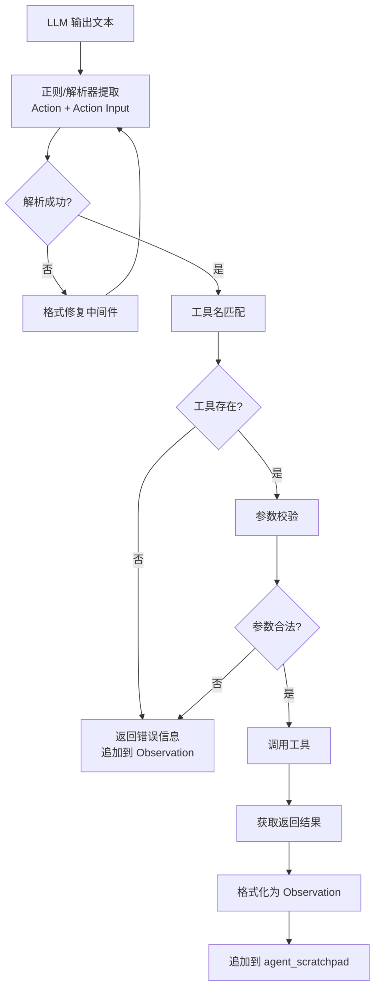

# ReAct模式

## 一、定义

**ReAct（Reasoning + Acting）** 是一种让 LLM 交替进行"推理"和"行动"的认知架构模式，通过 Thought-Action-Observation 循环驱动 Agent 自主解决复杂问题。核心三要素：Thought（思考分析）、Action（工具调用）、Observation（环境反馈）。

## 二、为什么出现

在 ReAct 出现之前，LLM 解决问题存在两条割裂的路径，各有致命缺陷：

| 路径 | 做法 | 致命缺陷 |
|------|------|----------|
| **纯推理（CoT）** | 让模型"想一想再回答" | 依赖预训练知识，无法获取实时信息；线性单链，一步错步步错 |
| **纯行动（Action Plan）** | 让模型直接生成行动指令 | 不利用 LLM 的推理能力，无法形成决策逻辑，异常处理能力弱 |

ReAct 的出现解决了三个核心问题：

- **知识边界问题**：LLM 预训练知识有截止日期，纯推理无法获取实时信息。ReAct 通过 Action 调用外部工具，突破了模型的知识边界
- **错误不可纠正问题**：CoT 是线性单链推理，中间步骤出错会"滚雪球"式传播。ReAct 通过 Observation 获取真实反馈，允许模型动态纠错
- **推理与行动割裂问题**：此前推理和行动是独立的，模型要么纯思考、要么纯执行。ReAct 将两者交织（interleaving），让"想"指导"做"、"做"反馈"想"

> [!important] 核心洞察
> ReAct 的本质不是发明了一种新技术，而是发现了一种**正确的交互范式**——让推理和行动交替进行，形成闭环。这个范式如此基础，以至于几乎所有现代 Agent 框架都建立在它之上。

## 三、核心思想

ReAct 的核心思想可以形式化为：

$$
(th_i, a_i) = \pi(o_{i-1}, a_{i-1}, o_{i-2}, a_{i-2}, \dots)
$$

即当前轮次的 Thought + Action 由前序所有 Observation 和 Action 共同决定，形成马尔可夫式的循环依赖。

### 三要素解析

| 要素 | 角色 | 输出形式 | 作用 |
|------|------|----------|------|
| **Thought** | 内心独白 | 自然语言文本 | 分析任务目标、历史反馈和当前状态，明确下一步行动的逻辑依据 |
| **Action** | 执行动作 | 工具名 + 参数 | 与外部环境交互，如搜索、计算、查询数据库 |
| **Observation** | 环境反馈 | 结构化数据 | 为下一轮推理提供真实数据支撑 |

### 与 CoT 的本质区别

CoT 让模型在回答前先写出推理过程，本质是"思维链"——纯内部推理，无外部交互。ReAct 让 Agent 在执行动作前先写出决策依据，本质是"边想边做"——推理和行动交织进行。

CoT 的推理是**闭卷考试**：模型只能依赖记忆中的知识。ReAct 的推理是**开卷考试**：模型可以随时查阅外部资料。

> [!example] 运行示例
> 用户："帮我看看明天北京的天气，如果下雨就提醒我带伞。"
>
> **第 1 轮**：
> - Thought: 用户想知道明天北京天气，我需要先获取天气预报
> - Action: `get_weather(city="北京", date="2026-07-23")`
> - Observation: `{"weather": "中雨", "temp": "22-28℃"}`
>
> **第 2 轮**：
> - Thought: 明天北京中雨，需要提醒用户带伞
> - Final Answer: "明天北京有中雨，气温 22-28℃，出门记得带伞！"

## 四、工作流程

### 4.1 ReAct 核心循环



### 4.2 终止与安全护栏



### 4.3 与其他范式的流程对比



## 五、关键技术

### 5.1 ReAct Prompt 模板

ReAct 的核心实现依赖精心设计的 Prompt 模板，规定了 Thought-Action-Observation 的交互格式：

```
You are a helpful assistant. Answer the following questions as best you can.
You have access to the following tools:

{tool_name}: {tool_description}

Use the following format:

Question: the input question you must answer
Thought: you should always think about what to do
Action: the action to take, should be one of [{tool_names}]
Action Input: the input to the action
Observation: the result of the action
... (Thought/Action/Action Input/Observation can repeat N times)
Thought: I now know the final answer
Final Answer: the final answer to the original question

Begin!

Question: {input}
Thought: {agent_scratchpad}
```

关键设计：`agent_scratchpad` 存储每轮 TAO 步骤，构成迭代记忆，让模型在每轮都能看到完整历史轨迹。

### 5.2 Action 解析与执行



### 5.3 安全护栏机制

生产级 ReAct Agent 必须配备的安全机制：

| 护栏类型 | 机制 | 推荐参数 |
|----------|------|----------|
| **最大步数限制** | 超过步数强制终止 | 轻量任务 5-10 步，中等 15-25 步，复杂 30-50 步 |
| **重复动作检测** | 精确匹配 + 语义相似 + 类别计数 | 连续 3 次相似动作触发预警 |
| **三级降级** | L1 重试 → L2 简化 → L3 安全退出 | 每级最多 3 次尝试 |
| **Token 预算控制** | 监控累计 Token 消耗 | 超过预算 80% 预警，100% 强制终止 |
| **超时熔断** | 单步执行超时 | 单步 30s，总任务 5min |

### 5.4 与其他 Agent 范式的技术对比

| 范式 | 核心特征 | 规划能力 | 交互性 | 适用场景 |
|------|----------|----------|--------|----------|
| **CoT** | 线性单链推理 | 无 | 无 | 纯推理问题（数学、逻辑） |
| **ReAct** | 推理+行动闭环 | 弱（局部动态） | 强 | Agent 核心、工具交互 |
| **Plan-and-Execute** | 显式规划+执行 | 强（全局） | 强 | 长任务、多阶段任务 |
| **ToT** | 树状多分支探索 | 强 | 可选 | 高难度复杂问题 |
| **ReWOO** | 先推理全部步骤再批量执行 | 中 | 弱 | 可并行批量任务 |
| **Reflexion** | ReAct + 反思机制 | 中 | 强 | 需要自我纠错的复杂任务 |
| **LATS** | 树搜索 + ReAct + Reflexion | 强 | 强 | 最复杂的多路径探索 |

### 5.5 框架演进

| 阶段 | 时间 | 特征 | 代表 |
|------|------|------|------|
| **原生 ReAct** | 2022-2023 | Prompt 驱动，全模型兼容 | LangChain `create_react_agent` |
| **ToolCalling 分流** | 2023-2024 | 原生函数调用，结构化 JSON | `create_tool_calling_agent` |
| **LangGraph 增强** | 2025 至今 | 状态机实现，支持分支/重试/HITL | LangChain 1.0+ LangGraph |
| **多 Agent 下沉** | 2025-2026 | 子 Agent ReAct + 总控调度 | LangGraph Multi-Agent |

## 六、优点

- **事实锚定，减少幻觉**：通过外部工具获取客观事实，将推理过程锚定到真实数据。在 Fever 事实核查任务中，ReAct 的幻觉率显著低于纯 CoT，因为每步推理都有 Observation 作为事实依据
- **可解释性强**：明文输出 Thought 思考过程，工具调用全日志可见，便于审计和调试。相比黑盒推理，ReAct 的决策链完全透明
- **动态纠错能力**：多轮交互使 Agent 遇到错误能自行调整策略。CoT 一步错步步错，ReAct 可以通过 Observation 发现错误并修正方向
- **少样本泛化**：依托 LLM 的上下文学习能力，仅需 1-3 个 Few-shot 示例即可快速适配多场景任务，无需微调
- **全模型兼容**：不依赖模型原生函数调用能力，纯 Prompt 驱动，开源模型、私有化部署场景均可使用
- **突破知识边界**：通过 Action 调用搜索引擎、数据库、API 等外部工具，突破了 LLM 预训练知识的截止日期限制
- **架构简洁**：Thought-Action-Observation 三要素构成的循环逻辑清晰，易于理解和实现

## 七、缺点

- **Token 消耗不可控**：每轮 Thought + Action + Observation 都占 Token，复杂任务 30 轮可能消耗 50K-100K tokens，成本可能是单次调用的 10-30 倍。这是 ReAct 在成本敏感场景的最大障碍
- **延迟显著**：多轮交互意味着多轮 LLM 推理 + 工具调用，端到端延迟随步数线性增长。对实时性要求高的场景不适用
- **错误传播风险**：中间 Thought 中的幻觉会在后续步骤中放大——错误 Thought → 错误 Action → 错误 Observation → 更错误 Thought，产生多米诺骨牌效应
- **循环失控**：模型可能陷入无意义的工具调用循环。真实案例：4 个 LangChain Agent 因未设步数限制，连续运行 11 天，消耗 $47,000 才被发现
- **上下文窗口污染**：每轮都追加新内容到 `agent_scratchpad`，早期关键信息可能被"挤出"注意力焦点，导致 Agent"遗忘"原始任务目标
- **单轮单工具限制**：原生 ReAct 单轮仅能调用一个工具，无法并行多工具调用（ToolCalling 和 LangGraph 可缓解）
- **格式依赖性强**：依赖 LLM 严格遵循 Prompt 格式输出，小模型容易格式错乱、解析失败，需要格式修复中间件兜底
- **规划能力弱**：ReAct 是"局部贪心"策略，每轮只决定下一步，缺乏全局规划能力，在长任务中容易偏离目标

## 八、典型应用

### 8.1 多跳问答（Multi-hop QA）

HotpotQA 等需要多跳推理的任务：第一跳搜索"谁导演了电影 X"，第二跳搜索"该导演的出生地"，第三跳汇总答案。ReAct 通过维基百科 API 逐步获取事实，每跳都基于前一步的 Observation 决定下一步搜索方向。

### 8.2 事实核查（Fact-checking）

Fever 任务：验证陈述的真伪。ReAct 通过搜索引擎获取证据，基于 Observation 判断陈述是否与事实一致，显著降低幻觉率。

### 8.3 企业级 RAG 智能检索

企业知识库场景：LLM 自主判断何时调用 RAG 检索、检索什么内容、是否需要追问检索。LangGraph + ReAct 成为 2025 年企业复杂 RAG 的主流方案，支持检索失败重试、问题改写、人工审批等分支。

### 8.4 交互式决策

- **ALFWorld**：文本游戏环境，ReAct 仅用 1-2 个 in-context examples 即超越 imitation 和 RL 方法
- **WebShop**：电商模拟环境，ReAct 自主浏览、搜索、选择商品

### 8.5 多工具编排

数据分析 Agent 串联使用：搜索引擎获取数据 → 计算器处理数值 → 代码执行器运行分析 → 数据库查询验证 → 生成报告。ReAct 协调多工具完成端到端任务。

### 8.6 多 Agent 子任务执行

LangGraph Multi-Agent 架构中：总控 Agent 负责任务分解，每个子 Agent 基于 ReAct 执行细分任务。ReAct 成为多 Agent 系统的基础执行单元。

## 九、面试高频问题

### Q1: ReAct 的核心思想是什么？Thought-Action-Observation 循环如何工作？

ReAct = Reasoning + Acting，核心是让 LLM 交替进行推理和行动。循环过程：Thought（分析当前状态，决定下一步做什么）→ Action（调用外部工具执行行动）→ Observation（获取工具返回的环境反馈）→ 基于新 Observation 进入下一轮 Thought，直到获取足够信息输出 Final Answer。关键在于推理和行动是交织的（interleaving），推理指导行动，行动反馈推理。

### Q2: ReAct 与 CoT 的本质区别是什么？

CoT 是纯内部推理，模型只依赖预训练知识"想一想再回答"，本质是闭卷考试。ReAct 在推理中穿插外部工具调用，可以获取实时信息，本质是开卷考试。三个关键区别：CoT 无法获取外部信息，ReAct 可以；CoT 是线性单链，一步错步步错，ReAct 可以通过 Observation 动态纠错；CoT 适合纯推理问题（数学、逻辑），ReAct 适合需要工具交互的 Agent 场景。

### Q3: ReAct 与 Plan-and-Execute 的区别？各自适用场景？

ReAct 是"边想边做"，每轮只决定下一步，动态适应，规划能力弱（局部贪心）。Plan-and-Execute 是"先规划后执行"，先全局规划所有步骤再逐步执行，规划能力强但灵活性差。ReAct 适合短任务、需要实时反馈的工具交互场景；Plan-and-Execute 适合长任务、多阶段、可预先规划结构的场景。成熟系统往往将两者叠加：Plan-and-Execute 管全局调度，ReAct 做局部动态交互。

### Q4: ReAct 的 Token 消耗问题如何缓解？

四种策略：第一，最大步数限制（轻量任务 5-10 步），防止无限循环；第二，摘要压缩历史轨迹，用 LLM 对 `agent_scratchpad` 做摘要，减少 Token 占用；第三，Plan-and-Execute 替代，先规划再执行，执行阶段不需要每轮重新推理；第四，ToolCalling 替代原生 ReAct，结构化 JSON 调用效率更高，支持多工具并行减少轮次。

### Q5: ReAct 的错误传播问题如何解决？

错误传播指中间 Thought 的幻觉在后续步骤中放大。解决方案：第一，引入 Reflexion 反思机制，在每轮后评估决策质量；第二，引入 RAG 事实锚定，让 Observation 提供客观事实约束推理；第三，引入验证步骤，关键 Action 前先验证推理逻辑；第四，限制最大步数，防止错误滚雪球；第五，多路径探索（ToT/LATS），并行多条推理路径，选择最优。

### Q6: LangChain 中 ReAct Agent 的实现原理？agent_scratchpad 的作用？

LangChain 的 `create_react_agent` 通过标准 ReAct Prompt 模板驱动 LLM 生成 Thought-Action-Observation 序列。`agent_scratchpad` 是存储历史 TAO 步骤的字符串缓冲区，每轮新的 Thought 都基于完整的 scratchpad 内容生成，构成迭代记忆。LangChain 1.0 后，ReAct 底层基于 LangGraph 状态机实现，`agent_scratchpad` 变为图的 State 字段，支持分支、重试、HITL 等高级能力。

### Q7: ReAct 与 ToolCalling 的区别？各自适用场景？

ReAct 是 Prompt 驱动的，通过文本格式（Thought/Action/Observation）驱动循环，全模型兼容但格式依赖性强、单轮单工具。ToolCalling 是模型原生函数调用能力，通过结构化 JSON 调用工具，格式可靠、支持多工具并行，但依赖模型支持。商用大模型（GPT/Claude）主力方案是 ToolCalling，ReAct 退守开源离线模型和私有化部署场景。两者不是互斥的，ToolCalling 可以视为 ReAct 思想在原生函数调用时代的演进。

### Q8: 如何设计 ReAct Agent 的安全护栏？

五层护栏：第一层，最大步数限制（轻量 5-10 步，中等 15-25 步，复杂 30-50 步）；第二层，重复动作检测（精确匹配 + 语义相似 + 类别计数，连续 3 次相似动作触发预警）；第三层，Token 预算控制（超过 80% 预警，100% 强制终止）；第四层，超时熔断（单步 30s，总任务 5min）；第五层，三级降级机制（L1 自动重试 → L2 简化目标 → L3 安全退出）。生产环境必须全栈部署，缺一不可。

## 十、相关知识

### 核心关联笔记

- Agent —— ReAct 是 Agent 最核心的推理范式，理解 Agent 架构是理解 ReAct 的前提
- LLM 大语言模型 —— ReAct 依赖 LLM 的推理能力和上下文学习能力
- Tool Calling 工具调用 —— ToolCalling 是 ReAct 思想在原生函数调用时代的演进，两者互补
- LangChain-LangGraph —— ReAct 的主流实现框架，LangChain 1.0 后基于 LangGraph 状态机实现
- Prompt Engineering 提示词工程 —— ReAct 的核心是精心设计的 Prompt 模板，规定了 TAO 交互格式
- RAG 检索增强生成 —— ReAct 常用于智能 RAG 场景，Agent 自主判断何时检索、检索什么
- 模型幻觉 —— ReAct 通过 Observation 事实锚定减少幻觉，但中间 Thought 的幻觉仍会传播
- MCP 模型上下文协议 —— MCP 扩展了 ReAct 可调用的工具范围，实现跨服务工具调用
- Loop Engineering 循环工程 —— ReAct 的 TAO 循环是循环工程在 Agent 领域的典型应用
- Harness Engineering 驾驭工程 —— ReAct Agent 的安全护栏是驾驭工程的核心实践
- Agent记忆机制 —— agent_scratchpad 本质是一种短期记忆，跨会话需要长期记忆机制配合
- Transformer —— 理解注意力机制才能理解为什么长 TAO 轨迹会导致上下文窗口污染

### 关键论文

- *ReAct: Synergizing Reasoning and Acting in Language Models* (Yao et al., 2022, ICLR 2023) —— ReAct 原始论文，提出 Thought-Action-Observation 范式
- *Chain-of-Thought Prompting Elicits Reasoning in Large Language Models* (Wei et al., 2022, NeurIPS) —— CoT 基础论文，ReAct 的前置工作
- *Tree of Thoughts: Deliberate Problem Solving with Large Language Models* (Yao et al., 2023, NeurIPS) —— ToT，多分支探索推理
- *Reflexion: Language Agents with Verbal Reinforcement Learning* (Shinn et al., 2023) —— 在 ReAct 基础上加入反思机制
- *Language Agent Tree Search (LATS)* (2024) —— Tree Search + ReAct + Plan-and-Execute + Reflexion 的融合

### 关键概念

- **Interleaving**：推理和行动交替进行的机制，ReAct 的核心创新
- **agent_scratchpad**：存储历史 TAO 步骤的缓冲区，构成迭代记忆
- **Few-shot In-Context Learning**：ReAct 仅需 1-3 个示例即可适配新任务
- **Error Propagation**：中间步骤错误在后续步骤中放大的现象
- **Grounding**：通过 Observation 将推理锚定到真实事实的过程

## 十一、代码示例

### 示例 1: LangChain ReAct Agent 完整实现

```python
from langchain.agents import create_react_agent, AgentExecutor
from langchain_openai import ChatOpenAI
from langchain.tools import Tool
from langchain_community.tools import DuckDuckGoSearchRun
from langchain_core.prompts import ChatPromptTemplate

# 初始化 LLM
llm = ChatOpenAI(model="gpt-4o-mini", temperature=0)

# 定义工具
search = DuckDuckGoSearchRun()

def calculator(expression: str) -> str:
    """安全计算数学表达式"""
    try:
        allowed = set("0123456789+-*/.() ")
        if not all(c in allowed for c in expression):
            return "Error: 表达式包含非法字符"
        return str(eval(expression))
    except Exception as e:
        return f"Error: {e}"

tools = [
    Tool(
        name="Search",
        func=search.run,
        description="用于搜索互联网上的最新信息",
    ),
    Tool(
        name="Calculator",
        func=calculator,
        description="用于计算数学表达式，输入为数学表达式字符串",
    ),
]

# ReAct Prompt 模板
prompt = ChatPromptTemplate.from_messages([
    ("system", """你是一个有用的助手。请尽力回答以下问题。
你可以使用以下工具：

{tools}

请使用以下格式：

Question: 你必须回答的输入问题
Thought: 你应该总是先思考要做什么
Action: 要执行的行动，必须是 [{tool_names}] 之一
Action Input: 行动的输入参数
Observation: 行动的执行结果
... (Thought/Action/Action Input/Observation 可以重复 N 次)
Thought: 我现在知道最终答案了
Final Answer: 对原始问题的最终答案

开始！

Question: {input}
Thought: {agent_scratchpad}"""),
])

# 创建 ReAct Agent
agent = create_react_agent(llm=llm, tools=tools, prompt=prompt)

# 创建执行器（带安全护栏）
agent_executor = AgentExecutor(
    agent=agent,
    tools=tools,
    verbose=True,
    max_iterations=10,        # 最大步数限制
    handle_parsing_errors=True,  # 格式错误自动修复
    early_stopping_method="generate",  # 超时时生成最终答案
)

# 执行任务
result = agent_executor.invoke({
    "input": "美国2024年GDP总量是多少万亿美元？这个数值的平方根是多少？"
})
print(result["output"])
```

### 示例 2: 自定义 ReAct Agent 核心循环

```python
import re
import json
from typing import Callable

class ReActAgent:
    """自定义 ReAct Agent 核心实现"""

    def __init__(
        self,
        llm: Callable,
        tools: dict[str, Callable],
        max_steps: int = 10,
        verbose: bool = True,
    ):
        self.llm = llm
        self.tools = tools  # {"tool_name": tool_func}
        self.max_steps = max_steps
        self.verbose = verbose

    def _build_prompt(self, question: str, scratchpad: str) -> str:
        tool_descriptions = "\n".join(
            [f"- {name}: {func.__doc__ or 'No description'}"
             for name, func in self.tools.items()]
        )
        tool_names = ", ".join(self.tools.keys())

        return f"""你是一个有用的助手。请尽力回答以下问题。
你可以使用以下工具：

{tool_descriptions}

请使用以下格式：
Thought: 思考过程
Action: 工具名称（必须是 [{tool_names}] 之一）
Action Input: 工具输入参数
Observation: 工具返回结果
... (可重复)
Thought: 我现在知道最终答案了
Final Answer: 最终答案

Question: {question}
Thought: {scratchpad}"""

    def _parse_response(self, response: str) -> dict:
        """解析 LLM 输出，提取 Action 和 Action Input"""
        # 检查是否输出了 Final Answer
        final_match = re.search(r"Final Answer:\s*(.+)", response, re.DOTALL)
        if final_match:
            return {"done": True, "answer": final_match.group(1).strip()}

        # 提取 Action 和 Action Input
        action_match = re.search(r"Action:\s*(.+)", response)
        input_match = re.search(r"Action Input:\s*(.+)", response)

        if not action_match or not input_match:
            return {"done": False, "error": "格式解析失败"}

        return {
            "done": False,
            "action": action_match.group(1).strip(),
            "action_input": input_match.group(1).strip(),
            "thought": response,
        }

    def _execute_action(self, action: str, action_input: str) -> str:
        """执行工具调用"""
        if action not in self.tools:
            return f"Error: 工具 '{action}' 不存在，可选工具: {list(self.tools.keys())}"

        try:
            result = self.tools[action](action_input)
            return str(result)
        except Exception as e:
            return f"Error: 工具执行失败 - {e}"

    def run(self, question: str) -> str:
        """执行 ReAct 循环"""
        scratchpad = ""
        seen_actions = []  # 重复动作检测

        for step in range(self.max_steps):
            if self.verbose:
                print(f"\n{'='*50}")
                print(f"Step {step + 1}/{self.max_steps}")

            # 生成 Thought + Action
            prompt = self._build_prompt(question, scratchpad)
            response = self.llm(prompt)

            # 解析响应
            parsed = self._parse_response(response)

            if parsed.get("done"):
                if self.verbose:
                    print(f"✅ Final Answer: {parsed['answer']}")
                return parsed["answer"]

            if parsed.get("error"):
                scratchpad += f"\nObservation: {parsed['error']}\n请检查格式并重试。"
                continue

            action = parsed["action"]
            action_input = parsed["action_input"]

            # 重复动作检测
            action_sig = f"{action}:{action_input}"
            if seen_actions.count(action_sig) >= 2:
                scratchpad += f"\nObservation: 检测到重复动作，请尝试不同方法。\n"
                continue
            seen_actions.append(action_sig)

            if self.verbose:
                print(f"Action: {action}")
                print(f"Action Input: {action_input}")

            # 执行 Action
            observation = self._execute_action(action, action_input)

            if self.verbose:
                print(f"Observation: {observation[:200]}...")

            # 追加到 scratchpad
            scratchpad += f"{parsed['thought']}\nObservation: {observation}\n"

        return f"达到最大步数 ({self.max_steps})，未能完成任务。"

# === 使用示例 ===
def search_tool(query: str) -> str:
    """搜索互联网信息"""
    # 实际实现中接入搜索 API
    return f"搜索结果: 关于 '{query}' 的相关信息..."

def calc_tool(expression: str) -> str:
    """计算数学表达式"""
    try:
        return str(eval(expression))
    except:
        return "计算错误"

agent = ReActAgent(
    llm=lambda prompt: f"Thought: 我需要搜索信息\nAction: search\nAction Input: GDP 2024",
    tools={"search": search_tool, "calc": calc_tool},
    max_steps=5,
)
result = agent.run("2024年全球GDP是多少？")
```

### 示例 3: LangGraph 增强版 ReAct（带重试和人工审批）

```python
from langgraph.graph import StateGraph, END
from langgraph.checkpoint.memory import InMemorySaver
from langchain_openai import ChatOpenAI
from langchain_core.tools import tool
from typing import TypedDict, Annotated
import operator

class AgentState(TypedDict):
    messages: Annotated[list, operator.add]
    iterations: int
    retry_count: int

llm = ChatOpenAI(model="gpt-4o-mini", temperature=0)

@tool
def search(query: str) -> str:
    """搜索互联网信息"""
    return f"搜索结果: {query}"

@tool
def calculator(expression: str) -> str:
    """计算数学表达式"""
    try:
        return str(eval(expression))
    except Exception as e:
        return f"Error: {e}"

tools = [search, calculator]

def agent_node(state: AgentState):
    """ReAct 推理节点：生成 Thought + Action"""
    messages = state["messages"]
    response = llm.bind_tools(tools).invoke(messages)
    return {
        "messages": [response],
        "iterations": state["iterations"] + 1,
    }

def execute_node(state: AgentState):
    """工具执行节点：执行 Action 并获取 Observation"""
    last_msg = state["messages"][-1]
    if last_msg.tool_calls:
        results = []
        for tc in last_msg.tool_calls:
            for t in tools:
                if t.name == tc["name"]:
                    results.append(t.invoke(tc["args"]))
                    break
        from langchain_core.messages import ToolMessage
        return {"messages": [ToolMessage(content=str(r), tool_call_id=tc["id"])
                             for r, tc in zip(results, last_msg.tool_calls)]}
    return {"messages": []}

def should_continue(state: AgentState):
    """路由决策：继续循环 / 重试 / 终止"""
    last_msg = state["messages"][-1]

    # 最大步数检查
    if state["iterations"] >= 10:
        return END

    # 有工具调用则继续执行
    if hasattr(last_msg, "tool_calls") and last_msg.tool_calls:
        return "execute"

    # 无工具调用，视为完成
    return END

# 构建图
workflow = StateGraph(AgentState)
workflow.add_node("agent", agent_node)
workflow.add_node("execute", execute_node)

workflow.set_entry_point("agent")
workflow.add_conditional_edges("agent", should_continue, {
    "execute": "execute",
    END: END,
})
workflow.add_edge("execute", "agent")  # 执行后回到 agent 推理

# 编译（带状态持久化）
checkpointer = InMemorySaver()
graph = workflow.compile(checkpointer=checkpointer)

# 执行
result = graph.invoke(
    {"messages": [{"role": "user", "content": "中国2024年GDP是多少？平方根是多少？"}],
     "iterations": 0, "retry_count": 0},
    config={"configurable": {"thread_id": "session-1"}},
)
print(result["messages"][-1].content)
```

### 示例 4: ReAct 与 RAG 结合的智能检索

```python
from langchain_core.tools import tool
from langchain_community.vectorstores import Chroma
from langchain_openai import OpenAIEmbeddings

# 初始化向量库
vectorstore = Chroma(
    embedding_function=OpenAIEmbeddings(),
    persist_directory="./chroma_db",
)

@tool
def knowledge_search(query: str) -> str:
    """在企业知识库中搜索相关信息。输入为搜索查询语句。"""
    docs = vectorstore.similarity_search(query, k=3)
    if not docs:
        return "未找到相关文档"
    return "\n\n".join([
        f"[文档{i+1}] {doc.page_content[:500]}"
        for i, doc in enumerate(docs)
    ])

@tool
def web_search(query: str) -> str:
    """在互联网上搜索最新信息。当知识库中找不到答案时使用。"""
    # 实际实现接入搜索 API
    return f"网络搜索结果: {query}"

# ReAct Agent 自主决定：先查知识库，不够再查网络
tools = [knowledge_search, web_search]

# Agent 会按如下逻辑推理：
# Thought: 用户问的是公司内部政策，先查企业知识库
# Action: knowledge_search("年假政策")
# Observation: [知识库返回结果]
# Thought: 知识库有年假政策但没有最新更新，需要查网络确认
# Action: web_search("2024年劳动法年假最新规定")
# Observation: [网络搜索结果]
# Thought: 现在有了完整信息，可以回答了
# Final Answer: 根据公司政策和国家最新规定...
```

## 十二、个人理解

### 1. ReAct 的真正贡献不是技术，而是范式

ReAct 论文没有发明任何新模型、新算法、新训练方法，它只是发现了一种正确的交互范式——让推理和行动交替进行。但这个发现的价值远超许多技术突破，因为它定义了 Agent 的基本运作方式。几乎所有现代 Agent 框架（LangChain、AutoGPT、CrewAI）都建立在 ReAct 范式之上。这印证了一个规律：在 AI 领域，正确的范式比更强的模型更重要——模型可以不断升级，但范式定义了能力的天花板。

### 2. ReAct 的"局部贪心"是最大局限，也是最大优势

ReAct 每轮只决定下一步，不做全局规划，这在理论上是一种"局部贪心"策略——容易陷入局部最优、偏离全局目标。但讽刺的是，这恰恰也是 ReAct 的优势所在：因为不做全局规划，所以不需要预先了解任务全貌，可以灵活应对未知变化。Plan-and-Execute 全局规划能力更强，但一旦计划出错就需要显式重规划，灵活性差。最佳实践不是二选一，而是叠加：Plan-and-Execute 管全局骨架，ReAct 做局部执行，Reflexion 做事后反思。

### 3. ToolCalling 不会取代 ReAct，而是让它隐形

很多人认为原生 ToolCalling 会取代 ReAct，这是误解。ToolCalling 取代的是 ReAct 的**实现方式**——从 Prompt 驱动的文本解析变为模型原生的函数调用。但 ReAct 的**核心思想**——推理和行动交替进行——并没有改变。事实上，ToolCalling Agent 内部仍然遵循 Thought-Action-Observation 循环，只是 Thought 变成了模型的内部推理、Action 变成了结构化 JSON、Observation 变成了函数返回值。ReAct 没有消失，它只是从显式的 Prompt 模板变成了隐式的模型能力。

### 4. 安全护栏才是 ReAct 生产化的真正壁垒

ReAct 的 Thought-Action-Observation 循环在 Demo 中很优雅，但在生产环境中是一个"定时炸弹"——循环失控、Token 爆炸、错误传播、重复动作，任何一个问题都可能导致灾难。真实案例中 4 个 Agent 运行 11 天烧掉 $47,000 的教训说明：ReAct 的生产化不在于循环逻辑本身，而在于安全护栏的系统性设计。最大步数限制、重复检测、三级降级、Token 预算控制、超时熔断——这些"无聊"的工程细节才是 ReAct Agent 能否上生产的真正壁垒。这也是为什么 LangGraph 相比原生 ReAct 的核心价值不在于"更强的推理"，而在于"更可控的执行"。

### 5. ReAct 的未来是"隐形化"和"分层化"

两个趋势值得关注：第一，**隐形化**——随着模型原生能力增强（ToolCalling、推理能力提升），ReAct 的显式 Thought 会逐渐变成模型的内部推理，用户不再看到"Thought: ..."的输出，但循环逻辑仍在运行。ReAct 从"看得见的框架"变成"看不见的能力"。第二，**分层化**——在多 Agent 架构中，ReAct 不再是唯一的推理范式，而是作为子 Agent 的执行单元，由上层的 Plan-and-Execute 或 LATS 负责全局调度。ReAct 从"全局范式"变成"局部工具"。这两个趋势不意味着 ReAct 在衰落，恰恰相反——它说明 ReAct 已经成为如此基础的基础设施，以至于它不再需要被显式讨论。
