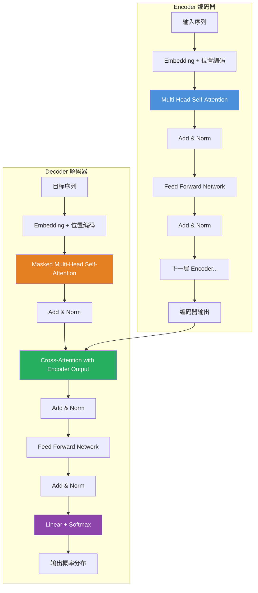

# Transformer

## 一、定义

Transformer 是 Google 在 2017 年论文《Attention Is All You Need》中提出的神经网络架构，**彻底摒弃了 RNN 的循环结构，完全基于自注意力机制（Self-Attention）建模序列中任意位置之间的依赖关系**，实现了训练的高度并行化，是当今所有大语言模型（GPT、BERT、Claude、Gemini 等）的基石架构。

> [!quote] 论文原话
> "We propose a new simple network architecture, the Transformer, based solely on attention mechanisms, dispensing with recurrence and convolutions entirely." —— Vaswani et al., 2017

---

## 二、为什么出现

Transformer 出现之前，序列建模（NLP、语音等）主要依赖 RNN/LSTM/GRU。这些架构存在三个根本性缺陷：

| 问题 | RNN 的局限 | Transformer 的解法 |
|---|---|---|
| **无法并行训练** | RNN 必须按时间步串行计算，第 t 步依赖第 t-1 步的结果 | 自注意力机制全局并行计算，所有位置同时处理 |
| **长距离依赖退化** | 梯度在长序列中逐层衰减，远距离 token 之间信息丢失严重 | 自注意力直接建立任意两个位置之间的连接，路径长度 O(1) |
| **计算效率低** | 序列长度 N 时，RNN 需要 O(N) 个串行步骤 | Transformer 的 Encoder 层内完全并行，GPU 利用率大幅提升 |

> [!important] 一句话总结
> Transformer 不是"更好的 RNN"，而是**换了一条完全不同的路**——用注意力机制替代循环，从根本上解决了序列建模的并行化和长距离依赖问题。

---

## 三、核心思想

Transformer 的核心思想可以概括为三个关键词：

### 3.1 自注意力（Self-Attention）

让序列中的每个词都"关注"序列中的所有其他词，动态计算词与词之间的关联权重。核心公式：

$$
\text{Attention}(Q, K, V) = \text{softmax}\left(\frac{QK^T}{\sqrt{d_k}}\right)V
$$

其中 **Q（Query）、K（Key）、V（Value）** 三个矩阵都由输入 X 通过不同的权重矩阵线性变换得到：

- **Q（查询）**：当前词想要"问什么"——"我在找什么信息？"
- **K（键）**：每个词"标签"——"我是什么类型的信息？"
- **V（值）**：每个词的实际内容——"我包含什么信息？"

> [!note] 直观类比
> 你去图书馆找书（Q = 你的需求），每本书有索引标签（K = 书的标签），你根据需求与标签的匹配度决定借哪些书，最终获取的是书的内容（V）。除以 $\sqrt{d_k}$ 是为了防止点积过大导致 Softmax 梯度消失。

### 3.2 多头注意力（Multi-Head Attention）

不只用一组 Q/K/V，而是用多组（h 个头），每组在不同子空间学习不同的注意力模式：

$$
\text{MultiHead}(Q, K, V) = \text{Concat}(\text{head}_1, ..., \text{head}_h)W^O
$$

$$
\text{head}_i = \text{Attention}(QW_i^Q, KW_i^K, VW_i^V)
$$

每个头降维到 $d_k = d_{model} / h$，拼接后恢复原始维度。这让模型能同时关注"句法关系"、"语义关联"、"位置模式"等多种依赖。

### 3.3 位置编码（Positional Encoding）

因为没有 RNN 的顺序结构，Transformer 需要显式注入位置信息。原始论文使用正弦/余弦函数：

$$
PE_{(pos, 2i)} = \sin\left(\frac{pos}{10000^{2i/d_{model}}}\right)
$$

$$
PE_{(pos, 2i+1)} = \cos\left(\frac{pos}{10000^{2i/d_{model}}}\right)
$$

---

## 四、工作流程



**Encoder（编码器）**：N 层堆叠，每层包含：
1. Multi-Head Self-Attention → 序列内部全局交互
2. Add & Norm（残差连接 + LayerNorm）
3. Feed Forward Network（两层线性 + 激活函数）
4. Add & Norm

**Decoder（解码器）**：N 层堆叠，每层包含：
1. **Masked** Multi-Head Self-Attention → 只能看到当前位置及之前的内容（防止"偷看"未来）
2. Add & Norm
3. **Cross-Attention** → Q 来自 Decoder，K/V 来自 Encoder 输出，实现 Encoder-Decoder 交互
4. Add & Norm
5. Feed Forward Network
6. Add & Norm
7. 最终 Linear + Softmax → 输出词表概率分布

> [!note] 三种注意力机制
> - **Self-Attention（Encoder 中）**：Q=K=V，来自同一序列，每个词关注所有词
> - **Masked Self-Attention（Decoder 中）**：加 Mask 遮挡未来位置，保证自回归生成
> - **Cross-Attention（Decoder 中）**：Q 来自 Decoder，K/V 来自 Encoder，融合源语言信息

---

## 五、关键技术

### 5.1 核心组件

| 技术 | 说明 |
|---|---|
| **Self-Attention** | 序列内全局注意力，计算任意两词之间的关联权重，路径长度 O(1) |
| **Multi-Head Attention** | 多组 Q/K/V 并行学习不同子空间的注意力模式 |
| **Scaled Dot-Product** | 点积注意力 ÷ $\sqrt{d_k}$，防止梯度消失 |
| **Positional Encoding** | 正弦/余弦位置编码，让模型感知词序 |
| **Feed Forward Network** | 两层线性变换 + ReLU/GELU，每个位置独立处理 |
| **Residual Connection** | 残差连接，避免梯度消失，保证深层网络可训练 |
| **Layer Normalization** | 对每个样本独立归一化，适合变长序列（优于 BatchNorm） |

### 5.2 训练关键技术

| 技术 | 说明 |
|---|---|
| **Dropout** | 在 Attention 输出、FFN 输出、Embedding 后使用，防止过拟合 |
| **Label Smoothing** | 标签平滑，防止模型过度自信，提升泛化能力 |
| **Warmup + Decay** | 学习率先线性升温再指数衰减，稳定训练初期 |
| **Adam Optimizer** | 自适应学习率优化器，Transformer 训练标配 |
| **Beam Search** | 解码时保留 Top-K 候选路径，提升生成质量 |

### 5.3 重要变体

| 变体 | 说明 | 代表模型 |
|---|---|---|
| **Encoder-Only** | 只使用 Encoder，双向注意力，适合理解任务 | BERT、RoBERTa |
| **Decoder-Only** | 只使用 Decoder，单向（因果）注意力，适合生成任务 | GPT 系列、LLaMA |
| **Encoder-Decoder** | 完整架构，适合序列转换任务 | 原始 Transformer、T5、BART |
| **Vision Transformer (ViT)** | 将图像切块作为"词"输入 Transformer | ViT、Swin Transformer |
| **RoPE** | 旋转位置编码，用旋转矩阵编码相对位置，长文本扩展性强 | LLaMA、Qwen、DeepSeek |
| **Sparse Attention** | 稀疏注意力，降低计算复杂度从 O(N²) 到 O(N log N) | Longformer、BigBird |

---

## 六、优点

- **训练高度并行**：Encoder 内部所有位置同时计算，不再受 RNN 的串行限制，GPU 利用率极高
- **长距离依赖建模强**：自注意力直接建立任意两个位置之间的连接，路径长度恒为 O(1)，远优于 RNN 的 O(N)
- **可扩展性好**：通过堆叠层数、增加头数、扩展维度可线性提升模型容量（Scaling Law）
- **通用性强**：同一架构适配 NLP、CV、语音、多模态等多个领域，成为 AI 领域的"统一架构"
- **可解释性较好**：注意力权重可视化，可以直观看到模型在做决策时"关注"了哪些输入
- **特征提取丰富**：多头机制从多个子空间并行学习，捕捉句法、语义、位置等不同维度的依赖

---

## 七、缺点

- **计算复杂度高**：自注意力复杂度为 $O(N^2 \cdot d)$，序列长度 N 增大时显存和计算量呈平方级增长
- **显存消耗大**：需要存储注意力矩阵（N×N），长序列场景下显存成为瓶颈
- **小数据不友好**：缺乏 RNN 的归纳偏置（局部性、时序性），小规模数据上容易过拟合，需要大量训练数据
- **位置编码局限**：原始正弦位置编码对超长序列的扩展性有限，需要 RoPE 等改进方案
- **推理时 Decoder 串行**：Decoder 自回归生成，每步依赖前一步输出，无法完全并行（KV Cache 可缓解但无法根除）
- **缺乏显式推理能力**：纯 Transformer 是一个"模式匹配器"，缺乏符号推理、因果推断等能力

---

## 八、典型应用

### 8.1 NLP 领域

- **大语言模型**：GPT-4/Claude/Gemini/LLaMA/DeepSeek 等全部基于 Decoder-Only Transformer
- **文本理解**：BERT 系列（分类、NER、问答、情感分析）
- **机器翻译**：原始 Transformer 的设计目标，T5、mBART 等
- **代码生成**：Copilot、Codex、StarCoder 等
- **文本摘要/对话**：BART、ChatGPT 等

### 8.2 计算机视觉

- **图像分类**：ViT（Vision Transformer），将图像切块作为序列输入
- **目标检测**：DETR（Detection Transformer），端到端目标检测
- **图像生成**：DiT（Diffusion Transformer），Sora 等视频生成模型的基础

### 8.3 多模态

- **图文理解**：CLIP、LLaVA、GPT-4V 等
- **语音处理**：Whisper、SpeechT5 等
- **视频生成**：Sora 基于 DiT 架构

---

## 九、面试高频问题

### Q1：Self-Attention 的计算公式是什么？为什么除以 $\sqrt{d_k}$？

**公式**：$\text{Attention}(Q, K, V) = \text{softmax}(\frac{QK^T}{\sqrt{d_k}})V$

**除以 $\sqrt{d_k}$ 的原因**：当 $d_k$ 较大时，$QK^T$ 的点积值会很大，经过 Softmax 后梯度趋近于 0（梯度饱和），导致训练困难。除以 $\sqrt{d_k}$ 将方差控制在 1 附近，保持梯度在合理区间。这是**数值稳定性**优化，而非模型容量优化。

**追问**：为什么方差会变大？——假设 Q 和 K 的每个元素独立，均值为 0，方差为 1，则点积的方差为 $d_k$。除以 $\sqrt{d_k}$ 将方差归一化到 1。

### Q2：为什么使用多头注意力而不是单头？

单头注意力只能捕捉**一种**依赖模式（比如只关注句法关系），多头能从**多个子空间**并行学习：

- 头 1：关注局部语法结构
- 头 2：关注长距离语义关联
- 头 3：关注指代关系
- 头 4：关注位置模式

每个头降维到 $d_k = d_{model}/h$，拼接后恢复原始维度，参数总量与单头（全维度）接近，但表达能力大幅提升。

### Q3：Transformer 为什么使用 LayerNorm 而不是 BatchNorm？

| 维度 | BatchNorm | LayerNorm |
|---|---|---|
| 归一化维度 | 对 Batch 维度（同一特征跨样本） | 对 Feature 维度（同一样本跨特征） |
| 序列长度依赖 | 依赖 Batch 内样本长度一致 | 不依赖 |
| 训练/推理一致性 | 推理时用全局统计量，不一致 | 一致 |
| 适用场景 | CNN（固定尺寸输入） | Transformer（变长序列） |

**核心原因**：NLP 任务中序列长度不一，BatchNorm 需要 padding 到相同长度，且 Batch 统计量受 padding 噪声影响。LayerNorm 对每个样本独立归一化，完全不受序列长度影响。

### Q4：Transformer 的并行化体现在哪里？Decoder 能完全并行吗？

**Encoder 可完全并行**：所有位置的自注意力同时计算，不受序列长度串行限制。

**Decoder 不能完全并行**：自回归生成时，第 t 步的输出依赖第 t-1 步。但有两个优化：
- **训练时**：使用 Teacher Forcing + Masked Attention，所有位置并行计算（Mask 遮挡未来位置）
- **推理时**：使用 KV Cache 缓存已计算的 Key/Value，避免重复计算

### Q5：Encoder-Decoder Attention（Cross-Attention）中 Q、K、V 分别来自哪里？

- **Q**：来自 Decoder 上一层的输出（当前解码状态）
- **K 和 V**：来自 Encoder 的最终输出（源语言编码信息）

直观理解：Decoder 用当前的解码状态（Q）去"查询"Encoder 编码的源语言信息（K），找到最相关的部分后提取其内容（V）。

### Q6：位置编码有哪些类型？RoPE 相比正弦编码有什么优势？

| 类型 | 特点 | 局限 |
|---|---|---|
| **正弦位置编码** | 固定函数生成，无需学习 | 绝对位置，外推性差 |
| **可学习位置编码** | 作为参数训练 | 无法外推到训练长度之外 |
| **相对位置编码** | 编码相对距离 | 计算复杂度增加 |
| **RoPE（旋转位置编码）** | 通过旋转矩阵编码相对位置 | 当前主流 |

**RoPE 优势**：
1. 自然编码相对位置关系（两个 token 的注意力只依赖它们的相对距离）
2. 良好的长度外推性（可推理比训练时更长的序列）
3. 被 LLaMA、Qwen、DeepSeek 等主流模型采用

### Q7：Transformer 的残差连接有什么作用？

- **缓解梯度消失**：梯度可通过残差路径直接回传到底层，避免在深层网络中衰减
- **保持信息流动**：即使 Attention 或 FFN 层"学坏"了，原始信息仍可通过残差路径传递
- **降低优化难度**：网络只需学习"残差"（与恒等映射的差异），而非完整的变换

### Q8：为什么 Q 和 K 要使用不同的权重矩阵？

如果 Q 和 K 使用相同的权重矩阵，自注意力会退化为**对称的自相关矩阵**——一个词对自己的注意力权重永远是最大的，且无法区分"提问者"和"被提问者"的角色。分开权重让 Q 学习"我要找什么"，K 学习"我能提供什么"，这是语义匹配可以不对称的关键。

---

## 十、相关知识

- LLM 大语言模型 — 基于 Transformer 构建的大语言模型
- BERT 模型 — Encoder-Only Transformer 代表
- GPT 系列模型 — Decoder-Only Transformer 代表
- Agent — Transformer 是 Agent 的推理引擎基础
- RAG 检索增强生成 — Transformer + 检索的混合架构
- Attention 注意力机制 — Transformer 的核心组件
- Positional Encoding 位置编码 — 让 Transformer 感知顺序
- Vision Transformer ViT — Transformer 在 CV 领域的应用
- Tokenization 分词算法 — BPE、WordPiece 等子词分词

---

## 十一、代码示例

### 用 PyTorch 从零实现 Scaled Dot-Product Attention

```python
import torch
import torch.nn as nn
import torch.nn.functional as F
import math

def scaled_dot_product_attention(Q, K, V, mask=None):
    """
    Q: (batch, num_heads, seq_len, d_k)
    K: (batch, num_heads, seq_len, d_k)
    V: (batch, num_heads, seq_len, d_v)
    mask: (batch, 1, seq_len, seq_len) or None
    """
    d_k = Q.size(-1)

    # 计算注意力分数: Q × K^T / √d_k
    scores = torch.matmul(Q, K.transpose(-2, -1)) / math.sqrt(d_k)

    # 应用 Mask（Padding Mask 或 Causal Mask）
    if mask is not None:
        scores = scores.masked_fill(mask == 0, float('-inf'))

    # Softmax 得到注意力权重
    attention_weights = F.softmax(scores, dim=-1)

    # 加权求和
    output = torch.matmul(attention_weights, V)

    return output, attention_weights

class MultiHeadAttention(nn.Module):
    def __init__(self, d_model, num_heads):
        super().__init__()
        assert d_model % num_heads == 0

        self.d_model = d_model
        self.num_heads = num_heads
        self.d_k = d_model // num_heads

        # Q、K、V 的线性变换矩阵
        self.W_Q = nn.Linear(d_model, d_model)
        self.W_K = nn.Linear(d_model, d_model)
        self.W_V = nn.Linear(d_model, d_model)
        self.W_O = nn.Linear(d_model, d_model)  # 输出投影

    def split_heads(self, x):
        """将 (batch, seq_len, d_model) 拆分为 (batch, num_heads, seq_len, d_k)"""
        batch_size, seq_len, _ = x.size()
        return x.view(batch_size, seq_len, self.num_heads, self.d_k).transpose(1, 2)

    def combine_heads(self, x):
        """将 (batch, num_heads, seq_len, d_k) 合并回 (batch, seq_len, d_model)"""
        batch_size, _, seq_len, _ = x.size()
        return x.transpose(1, 2).contiguous().view(batch_size, seq_len, self.d_model)

    def forward(self, Q, K, V, mask=None):
        # 线性变换 + 拆多头
        Q = self.split_heads(self.W_Q(Q))
        K = self.split_heads(self.W_K(K))
        V = self.split_heads(self.W_V(V))

        # 缩放点积注意力
        attn_output, attn_weights = scaled_dot_product_attention(Q, K, V, mask)

        # 合并多头 + 输出投影
        output = self.W_O(self.combine_heads(attn_output))

        return output, attn_weights
```

### 用 PyTorch 实现 Transformer Encoder 层

```python
class TransformerEncoderLayer(nn.Module):
    def __init__(self, d_model, num_heads, d_ff, dropout=0.1):
        super().__init__()
        self.self_attention = MultiHeadAttention(d_model, num_heads)
        self.feed_forward = nn.Sequential(
            nn.Linear(d_model, d_ff),
            nn.ReLU(),
            nn.Dropout(dropout),
            nn.Linear(d_ff, d_model),
        )
        self.norm1 = nn.LayerNorm(d_model)
        self.norm2 = nn.LayerNorm(d_model)
        self.dropout = nn.Dropout(dropout)

    def forward(self, x, mask=None):
        # 1. Self-Attention + 残差 + LayerNorm
        attn_output, _ = self.self_attention(x, x, x, mask)
        x = self.norm1(x + self.dropout(attn_output))

        # 2. Feed Forward + 残差 + LayerNorm
        ff_output = self.feed_forward(x)
        x = self.norm2(x + self.dropout(ff_output))

        return x

class PositionalEncoding(nn.Module):
    def __init__(self, d_model, max_len=5000):
        super().__init__()
        pe = torch.zeros(max_len, d_model)
        position = torch.arange(0, max_len).unsqueeze(1).float()
        div_term = torch.exp(
            torch.arange(0, d_model, 2).float() * (-math.log(10000.0) / d_model)
        )
        pe[:, 0::2] = torch.sin(position * div_term)   # 偶数位用 sin
        pe[:, 1::2] = torch.cos(position * div_term)   # 奇数位用 cos
        self.register_buffer('pe', pe.unsqueeze(0))    # (1, max_len, d_model)

    def forward(self, x):
        return x + self.pe[:, :x.size(1), :]
```

### 使用 HuggingFace 加载预训练 Transformer

```python
from transformers import AutoModel, AutoTokenizer

# 加载 BERT（Encoder-Only）
bert_tokenizer = AutoTokenizer.from_pretrained("bert-base-uncased")
bert_model = AutoModel.from_pretrained("bert-base-uncased")

inputs = bert_tokenizer("Hello, how are you?", return_tensors="pt")
outputs = bert_model(**inputs)
# outputs.last_hidden_state: (batch, seq_len, 768)

# 加载 GPT-2（Decoder-Only）
from transformers import AutoModelForCausalLM

gpt2_tokenizer = AutoTokenizer.from_pretrained("gpt2")
gpt2_model = AutoModelForCausalLM.from_pretrained("gpt2")

inputs = gpt2_tokenizer("The future of AI is", return_tensors="pt")
outputs = gpt2_model.generate(**inputs, max_new_tokens=50)
print(gpt2_tokenizer.decode(outputs[0]))
```

---

## 十二、个人理解

Transformer 是过去十年 AI 领域最重要的架构创新，没有之一。它的影响力不亚于 2012 年的 AlexNet——后者开启了深度学习时代，前者开启了大规模预训练时代。

几个关键判断：

1. **Transformer 的核心洞察不是"注意力"，而是"注意力就够了"**。注意力机制在 2014 年（Bahdanau）就出现了，但当时是作为 RNN 的辅助组件。Transformer 的激进之处在于：**把 RNN 整个扔掉，只用注意力**。这个"减法"比"加法"更有价值——它证明了只要注意力机制足够，就能获得更好的并行性和长距离建模能力。

2. **Scaling Law 的物理基础是 Transformer 的可扩展性**。如果今天的主流架构还是 LSTM，GPT-4 级别的模型根本训练不出来——RNN 的串行瓶颈在万卡集群上会导致 GPU 利用率极低。Transformer 能 Scale 到万亿参数，不是因为它"更聪明"，而是因为它"更容易并行"。

3. **Decoder-Only 架构的胜出是工程选择，不是理论必然**。理论上 Encoder-Decoder 表达能力更强（双向编码 + 交叉注意力），但 Decoder-Only 更简单、更统一（预训练和微调格式一致）、更容易 Scale。GPT 系列的成功证明了"够简单的架构 + 够大的规模 > 更精巧的架构 + 更小的规模"。

4. **$O(N^2)$ 复杂度是 Transformer 的阿喀琉斯之踵**。当前所有"长上下文"优化（FlashAttention、Sparse Attention、Mamba 等）本质上都是在绕过这个平方复杂度。未来 5 年，如果有一个架构能真正替代 Transformer，它一定是在保持并行性的同时把复杂度降到了 $O(N \log N)$ 甚至 $O(N)$。

5. **Transformer 不是 AGI 的终点**。它本质上是一个"超级模式匹配器"——在见过的模式上表现惊人，但缺乏真正的因果推理和符号操作能力。当前的 o1/o3 推理模型实际上是在 Transformer 之上外挂了"搜索/验证"机制，这说明纯 Transformer 的推理能力是有上限的。