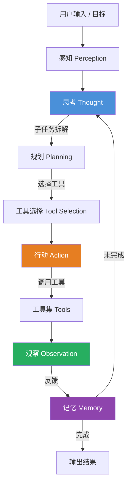

# AI Agent（智能体）

## 一、定义

AI Agent（智能体）是能够自主感知环境、规划决策、调用工具执行行动，并通过反馈循环持续迭代以达成特定目标的 AI 系统。本质上是 **LLM（大语言模型） + 规划 + 记忆 + 工具使用** 的有机结合体，让 AI 从"回答问题"进化为"完成任务"。

> [!quote] 经典定义
> Agent 是通过传感器感知环境，并通过执行器作用于环境的实体。—— Russell & Norvig，《人工智能：现代方法》

---

## 二、为什么出现

LLM 聊天机器人（ChatBot）存在四个根本性局限，Agent 正是为解决这些问题而生：

| LLM 局限 | Agent 的解法 |
|---|---|
| **不具有主动性**：不会主动感知环境并做出反应 | 引入感知-行动循环，持续监控环境变化 |
| **目标意识差**：多轮对话中可能忘记最初目标 | 内置规划器，始终围绕目标拆解和推进任务 |
| **无持续记忆**：仅关联有限的非持久化上下文 | 外挂短期记忆 + 长期记忆存储单元 |
| **无法与外部系统交互**：只能聊天，不能改变现实世界 | 通过工具调用（API、数据库、代码执行器等）操作外部环境 |

> [!important] 核心逻辑
> 当业务复杂度超过人工协调阈值，Agent 不是技术选择，而是必然解法。

---

## 三、核心思想

Agent 的核心思想来自 **ReAct（Reasoning + Acting）协同框架**（2022，普林斯顿 & Google），即"三元协同循环"：

1. **Thought（思考）**：分析问题，拆解目标，规划策略路径
2. **Action（行动）**：调用工具执行具体操作（搜索、计算、API 调用等）
3. **Observation（观察）**：获取行动结果反馈，判断是否达成目标，决定下一步

> [!note] PEAS 模型
> 描述 Agent 任务环境的四个维度：
> - **P**erformance（性能度量）：如何衡量表现好坏
> - **E**nvironment（环境）：Agent 所处的外部世界
> - **A**ctuators（执行器）：影响环境的手段（工具、API）
> - **S**ensors（传感器）：感知环境的手段（输入、数据流）

OpenAI Agent 范式在此基础上进一步系统化为四大模块：**Planning（规划器）、Memory（记忆体）、Action（执行器）、Tools（工具集）**。

---

## 四、工作流程



**Agent Loop 核心闭环**：感知 → 思考（规划 + 工具选择）→ 行动 → 观察 → 记忆写入 → 循环，直到目标达成或达到最大迭代次数。

### Agent vs Workflow 的本质区别

| 维度 | Workflow（工作流） | Agent（智能体） |
|---|---|---|
| **本质** | 预定义的、结构化的任务编排 | 自主的、以目标为导向的系统 |
| **决策方式** | 静态流程图，每步预先设定 | 基于实时信息动态推理和决策 |
| **适应性** | 低，无法处理预设之外的情况 | 高，能理解环境、推理、制定计划 |
| **"大脑"** | 规则引擎 | 大语言模型（LLM） |

---

## 五、关键技术

### 5.1 核心能力层

| 技术 | 说明 |
|---|---|
| **LLM 推理** | GPT-4/Claude/Gemini 等作为"大脑"，负责理解意图和决策 |
| **ReAct / 思维链 (CoT)** | 让模型展示推理步骤，协同推理与行动 |
| **Function Calling / Tool Use** | LLM 识别何时调用外部工具，并以结构化参数调用 |
| **RAG（检索增强生成）** | 外挂知识库，弥补 LLM 知识截断和幻觉问题 |
| **Prompt Engineering** | 通过精心设计的提示词约束 LLM 行为 |

### 5.2 记忆系统

- **短期记忆**：当前会话上下文（对话历史、中间结果）
- **长期记忆**：持久化存储（向量数据库、用户 Profile、历史任务记录）
- **工作记忆**：当前任务的状态跟踪

### 5.3 主流框架

| 框架 | 定位 | 特点 |
|---|---|---|
| **LangChain / LangGraph** | AI 应用开发框架 | 生态最丰富，图结构编排，1000+ TPS |
| **CrewAI** | 多 Agent 协作 | 角色定义 + 任务分配，多 Agent 协作最强 |
| **AutoGen（微软）** | 对话驱动多 Agent | 自然语言驱动的 Agent 间通信 |
| **AutoGPT** | 自主任务执行 | 第一个 AI Agent，适合快速原型 |
| **MetaGPT** | 结构化任务模拟 | 模拟公司部门（CEO/CTO/工程师）协作 |
| **Dify** | 国产低代码平台 | 图形化界面，拖拽构建 Agent |
| **OpenAI Swarm** | 轻量级多 Agent 编排 | OpenAI 官方，轻量实验性框架 |

---

## 六、优点

- **自主性**：不需每一步人工干预，自主规划并执行任务
- **工具使用能力**：能调用 API、数据库、搜索引擎、代码解释器等外部工具
- **动态适应性**：根据环境反馈实时调整策略，而非死守预设流程
- **复杂任务处理**：能将高层级目标拆解为可执行的子任务链
- **持续学习**：通过记忆系统积累经验，历史行为可优化后续决策
- **可扩展性**：工具集可插拔；多 Agent 架构可实现专业化分工协作

---

## 七、缺点

- **幻觉风险**：LLM 本质是概率预测，可能"一本正经地胡说八道"，且 Agent 的自主行动会放大危害
- **成本高昂**：每次循环消耗 Token，复杂任务可能需要数十轮迭代，推理成本远高于单次问答
- **可控性不足**：自主决策链路过长时，行为可预测性下降，调试和审计困难
- **无限循环风险**：工具调用结果矛盾时，Agent 可能反复切换尝试，导致死循环和成本爆炸
- **安全与合规**：自主操作外部系统可能引发数据泄露、越权操作等安全问题
- **评估困难**：准确率不够，需要从规划能力、鲁棒性、工具调用准确性、效率等多维度综合评估

---

## 八、典型应用

### 8.1 企业场景

- **智能客服**：自主查询订单、处理退款、多轮协商（非标准商品退款场景优于 Workflow）
- **自动化运维**：监控告警 → 自主诊断 → 执行修复 → 验证恢复
- **数据分析**：理解自然语言需求 → 编写 SQL → 执行查询 → 生成可视化报告
- **代码助手**：理解需求 → 编写代码 → 运行测试 → 修复 Bug 循环（如 Cursor、Copilot 的 Agent 模式）

### 8.2 个人场景

- **智能旅行规划**：查询天气 → 调整行程 → 预订酒店 → 推荐景点
- **个人研究助理**：搜索 → 阅读 → 摘要 → 交叉验证 → 生成报告
- **自动化办公**：读取邮件 → 提取待办 → 安排日程 → 起草回复

### 8.3 前沿方向

- **多 Agent 协作系统**：模拟软件开发团队（产品经理 → 架构师 → 工程师 → 测试）
- **具身智能**：Agent 控制机器人执行物理世界任务
- **Agentic Workflow**：Human-in-the-loop 混合架构，规则保底 + 智能增益

---

## 九、面试高频问题

### Q1：请用 PEAS 模型描述一个"智能客服 Agent"

**P（性能度量）**：问题解决率、平均处理时长、用户满意度评分、人工转接率
**E（环境）**：用户对话流、订单系统、退款系统、知识库
**A（执行器）**：消息发送接口、订单查询 API、退款申请 API、人工转接接口
**S（传感器）**：用户文本输入、用户历史订单数据、对话上下文

### Q2：Workflow 和 Agent 的核心区别是什么？什么时候用哪个？

**核心区别**：Workflow 是静态流程图，Agent 是动态目标导向系统。Workflow 的每个分支都是预设的，Agent 会基于实时反馈自主推理下一步。

- **Workflow 合适**：高频、标准、低价值交易（如标准化退款），法律合规严格场景
- **Agent 合适**：非标商品、复杂纠纷、需要情感维系的场景
- **最佳实践**：混合架构（Human-in-the-loop），Workflow 保底线，Agent 做增益

### Q3：Agent 为什么会"无限循环"？如何防止？

**原因**：两个工具返回矛盾结果时，Agent 反复切换尝试；或观测结果始终不满足终止条件。

**解决方案**：
- 设置最大迭代次数（Max Steps）
- 设置超时机制（Timeout）
- 引入反思步骤（Reflection）：连续 N 次失败后重新审视策略
- 添加人工审核节点（Checkpoint）

### Q4：如何评估一个 Agent 的好坏？

不能只看准确率。需多维度评估：
- **规划能力**：能否将复杂目标拆解为合理子步骤
- **鲁棒性**：工具调用失败或感知错误时能否自我修复
- **工具调用准确性**：是否选择了正确的 API 并传入正确参数
- **效率**：达成目标所需的平均 Token 数和循环步数
- **任务完成率**：端到端任务成功率

### Q5：Single-Agent 和 Multi-Agent 有什么区别？

| 维度 | Single-Agent | Multi-Agent |
|---|---|---|
| 适用场景 | 单一任务自动化 | 复杂协作任务 |
| 架构 | 一个 Agent 管理所有工具 | 多个专业 Agent 协作 |
| 优势 | 简单、延迟低、成本低 | 专业化分工、可扩展 |
| 劣势 | 工具过多导致选择困难 | 协调开销大、通信复杂 |
| 典型框架 | LangChain Agent | CrewAI、AutoGen |

### Q6：Function Calling 和 Tool Use 的区别？

**Function Calling** 是 OpenAI 的具体 API 实现，允许 LLM 输出结构化 JSON 来调用预定义函数。**Tool Use** 是更通用的概念，泛指 Agent 使用外部工具的能力。Function Calling 是 Tool Use 的一种实现方式。

### Q7：Agent 的上下文窗口有限，如何管理长对话？

- 滑动窗口截断（保留最近 N 轮）
- 摘要压缩（对历史对话做摘要后注入）
- 向量检索（将历史存入向量数据库，按相关性检索）
- 分层记忆（短期/长期/工作记忆分离管理）

---

## 十、相关知识

- [[LLM 大语言模型]] — Agent 的"大脑"基础
- [[RAG 检索增强生成]] — Agent 外挂知识库的核心技术
- [[Prompt Engineering 提示词工程]] — 约束 Agent 行为的核心手段
- [[模型幻觉]] — Agent 调用工具的核心机制，Function Calling 是其最常见的实现方式
- [[ReAct 推理框架]] — Agent 思考-行动循环的理论基础
- [[LangChain 入门]] — 最主流的 Agent 开发框架
- [[Multi-Agent 多智能体系统]] — 多 Agent 协作范式
- [[AI Agent 安全与对齐]] — Agent 安全性和可控性研究

---

## 十一、代码示例

### 基于 LangChain 构建一个简单的 Agent

```python
import os
from langchain_openai import ChatOpenAI
from langchain.agents import AgentExecutor, create_tool_calling_agent
from langchain.tools import tool
from langchain.prompts import ChatPromptTemplate

# 1. 定义工具
@tool
def search_weather(city: str) -> str:
    """查询指定城市的天气信息"""
    # 实际项目中替换为真实 API 调用
    weather_data = {
        "北京": "晴，25°C，湿度40%",
        "上海": "小雨，22°C，湿度75%",
        "深圳": "多云，28°C，湿度65%",
    }
    return weather_data.get(city, f"未找到 {city} 的天气数据")

@tool
def calculate(expression: str) -> str:
    """执行数学计算，输入数学表达式"""
    try:
        return str(eval(expression))
    except Exception as e:
        return f"计算错误: {e}"

# 2. 初始化 LLM
llm = ChatOpenAI(
    model="gpt-4",
    temperature=0,
    api_key=os.getenv("OPENAI_API_KEY")
)

# 3. 注册工具
tools = [search_weather, calculate]

# 4. 构建 Prompt
prompt = ChatPromptTemplate.from_messages([
    ("system", "你是一个有用的助手，可以使用工具来回答问题。"),
    ("human", "{input}"),
    ("placeholder", "{agent_scratchpad}"),
])

# 5. 创建 Agent
agent = create_tool_calling_agent(llm, tools, prompt)

# 6. 创建 Agent 执行器
agent_executor = AgentExecutor(
    agent=agent,
    tools=tools,
    verbose=True,          # 打印思考过程
    max_iterations=5,      # 防止无限循环
    handle_parsing_errors=True,
)

# 7. 运行 Agent
result = agent_executor.invoke({
    "input": "北京今天天气怎么样？如果温度超过25度，帮我算一下30度比它高多少度。"
})

print(result["output"])
```

### 基于 CrewAI 构建多 Agent 协作

```python
from crewai import Agent, Task, Crew, Process

# 定义研究员 Agent
researcher = Agent(
    role="研究员",
    goal="搜索并分析最新AI Agent发展趋势",
    backstory="你对技术数据极其敏感，擅长发现市场风口",
    verbose=True,
    allow_delegation=False,
)

# 定义作家 Agent
writer = Agent(
    role="科技作家",
    goal="基于研究分析撰写一篇通俗易懂的科普文章",
    backstory="你擅长用幽默的语言解释复杂技术概念",
    verbose=True,
    allow_delegation=False,
)

# 定义任务
research_task = Task(
    description="搜索2026年AI Agent领域的最新进展和关键趋势",
    agent=researcher,
    expected_output="一份包含3-5个关键趋势的结构化分析报告",
)

writing_task = Task(
    description="基于研究报告，撰写一篇面向普通读者的AI Agent科普文章，约800字",
    agent=writer,
    expected_output="一篇通俗易懂的科普文章",
)

# 组建团队
crew = Crew(
    agents=[researcher, writer],
    tasks=[research_task, writing_task],
    process=Process.sequential,  # 顺序执行
    verbose=True,
)

# 启动
result = crew.kickoff()
print(result)
```

---

## 十二、个人理解

Agent 的本质不是新技术，而是**架构范式的升维**。

LLM 刚出现时，大家把它当"超级问答机"用——输入一个问题，输出一个答案。但 Agent 的思路是：**把 LLM 当作操作系统内核，在上面构建规划、记忆、工具调用三个子系统**，让 LLM 从"回答问题"进化为"完成任务"。

这个转变的深刻程度，类似于从 DOS 命令行到 Windows 图形界面——交互模式发生了根本性改变。

但有几个冷水需要泼：

1. **Agent 不是银弹**。大部分场景下，一个设计良好的 Workflow 比 Agent 更可靠、更便宜、更可控。盲目上 Agent 是工程上的自嗨。

2. **幻觉问题在 Agent 语境下被放大**。单次问答的幻觉可能只是输出一段错误文本，但 Agent 的幻觉可能导致它调用错误的 API、删除错误的数据。Agent 的自主性越高，危害越大。

3. **评估体系严重滞后**。目前业界对 Agent 的评估仍以"看起来对不对"为主，缺乏系统性的端到端评估标准。这直接导致 Agent 系统难以进入生产环境。

4. **Multi-Agent 是正确方向，但落地成本极高**。多个 Agent 之间的通信协议、任务分配、冲突解决都是未解决的工程难题。现阶段大部分 Multi-Agent 系统只是 Demo 级别。

我认为 Agent 的真正价值释放点，不在于构建一个"万能 Agent"，而在于**垂直领域 + 有限工具集 + 明确边界**的专用 Agent。把边界划清楚，把工具集做扎实，把记忆系统做可靠，比追求通用性重要得多。