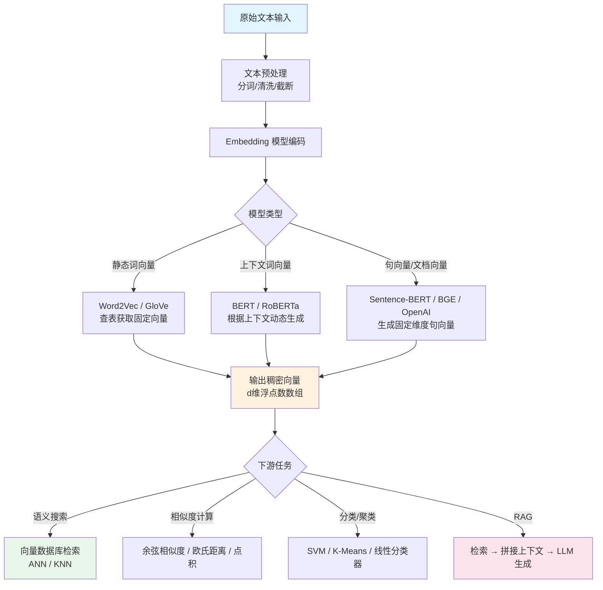

# Embedding 向量嵌入

## 一、定义

Embedding（向量嵌入）是将离散的高维符号（词、句子、图像、用户ID等）映射到低维、稠密、连续的实数向量空间的技术。核心公式：$f: X \rightarrow \mathbb{R}^d$，其中 $d$ 通常是 128~4096 维。这种映射使得语义相近的对象在向量空间中距离更近，语义无关的对象距离更远，从而让计算机能够"理解"并计算语义关系。

> [!tip] 一句话
> Embedding 是机器理解世界的"坐标系"——把人类能懂的语义，翻译成机器能算的向量。

## 二、为什么出现

**核心问题：计算机无法直接理解自然语言中的语义。**

传统方法用 one-hot 编码表示词汇：10 万词汇表意味着每个词是一个 10 万维的稀疏向量，且任意两个词之间距离完全相同（正交），"苹果"和"香蕉"的距离与"苹果"和"核弹"的距离一样——这完全丢失了语义信息。

Embedding 解决三个核心痛点：

1. **语义鸿沟**：将符号转化为可计算的数值向量，使语义相似度可以量化（余弦相似度、欧氏距离）
2. **维度灾难**：将高维稀疏表示（one-hot）压缩为低维稠密向量（100~4096 维），极大降低存储和计算成本
3. **通用特征表示**：Embedding 作为下游任务的通用输入，可复用于搜索、分类、聚类、推荐等场景，无需从头训练

在大模型时代，Embedding 更是 RAG（检索增强生成）的基石——没有高质量的 Embedding，向量检索就无从谈起。

## 三、核心思想

**核心原理：分布式假设（Distributional Hypothesis）**——"一个词的含义由它周围的上下文决定"（Firth, 1957）。

具体而言，Embedding 基于以下核心思想：

1. **语义空间映射**：将语义相近的对象映射到向量空间中的邻近区域。典型例子：$\vec{king} - \vec{man} + \vec{woman} \approx \vec{queen}$（Word2Vec 经典类比）

2. **对比学习（Contrastive Learning）**：现代 Embedding 模型的核心训练范式。拉近正样本对（query-positive），推远负样本对（query-negative），损失函数为 InfoNCE Loss：

$$
\mathcal{L} = -\log \frac{\exp(\text{sim}(q, p^+) / \tau)}{\exp(\text{sim}(q, p^+) / \tau) + \sum_{i=1}^{N} \exp(\text{sim}(q, p_i^-) / \tau)}
$$

其中 $\tau$ 为温度参数，$\text{sim}$ 通常是余弦相似度。

3. **双塔架构（Bi-Encoder）**：Query 和 Document 分别通过独立的编码器（或共享权重的同一编码器）生成向量，在线检索时只需计算向量相似度，无需实时推理。

4. **Matryoshka Representation Learning（MRL，嵌套式表征学习）**：2024年后主流 Embedding 模型（OpenAI text-embedding-3、BGE-M3、Qwen3-Embedding）支持的关键技术。将重要信息集中在前几个维度，使得同一个向量可以按需截断为不同维度（如 256/512/1024/2048），而无需重新编码，实现"一套向量，多种精度"。

## 四、工作流程



> [!note] 关键流程说明
> 1. **文本预处理**：分词、截断到模型最大长度（如 512/8192 tokens）
> 2. **编码**：模型前向传播，通常取最后一层 [CLS] token 的隐状态或对所有 token 做 mean pooling 作为句向量
> 3. **归一化**：输出向量通常做 L2 归一化，使余弦相似度等价于点积
> 4. **检索**：将 query 向量与向量数据库中的候选向量做相似度计算，返回 Top-K

## 五、关键技术

### 5.1 经典词向量技术

| 技术 | 核心思想 | 关键特点 | 局限 |
|------|----------|----------|------|
| **Word2Vec** (2013) | CBOW + Skip-gram，用周围词预测中心词（或反之） | 静态词向量，训练效率高 | 无法处理一词多义 |
| **GloVe** (2014) | 基于全局词共现矩阵分解 | 结合全局统计和局部上下文 | 同 Word2Vec，静态向量 |
| **FastText** (2016) | 子词（subword）级别的 n-gram 嵌入 | 可处理未登录词（OOV），对形态丰富语言效果好 | 仍是静态向量 |

### 5.2 上下文感知词向量

| 技术 | 核心思想 | 关键特点 |
|------|----------|----------|
| **ELMo** (2018) | 双向 LSTM，深层特征拼接 | 首次实现上下文相关的词向量 |
| **BERT** (2018) | Transformer Encoder + MLM 预训练 | 真正双向上下文建模，根据上下文动态生成词向量 |
| **RoBERTa** (2019) | BERT 优化版：更大数据、动态 Mask、去掉 NSP | 性能更强 |

### 5.3 句向量 / 文档向量技术

| 技术 | 核心思想 | 关键特点 |
|------|----------|----------|
| **Sentence-BERT** (2019) | 双塔架构 + 对比学习（Siamese Network） | 首次将 BERT 改造为高效的句向量模型，推理速度比 BERT 快 100 倍 |
| **SimCSE** (2021) | 简单对比学习：同一句子过两次 Dropout 作为正样本对 | 无监督方法，效果甚至超过部分有监督方法 |
| **RetroMAE** (2022) | 编码器轻量 Mask + 解码器激进 Mask 自重建 | BGE 系列的预训练算法，迫使编码器生成高质量句向量 |
| **E5 / Multilingual-E5** (2023) | 大规模弱监督对比学习，"query: " + "passage: " 前缀 | 微软出品，多语言效果优秀 |
| **BGE-M3** (2024) | RetroMAE + 多语言对比学习 + 混合检索统一优化 | 支持 100+ 语言、8192 长度、稠密+稀疏+多向量三种检索 |
| **OpenAI text-embedding-3** (2024) | 闭源，支持 MRL 可变维度 | 256/1024/3072 维灵活切换，$0.13/1M tokens (large) |
| **Qwen3-Embedding** (2025) | 基于 Qwen3 架构，支持 MRL + 多模态 | 阿里通义千问系列，4B/8B 参数，支持 32K 长度 |

### 5.4 核心训练范式

**对比学习（Contrastive Learning）** 是现代 Embedding 模型的主流训练方法：

- **正样本对构造**：(query, positive_document) 配对，如标题-正文、问题-答案
- **负样本构造**：随机负采样（in-batch negatives）、难负样本挖掘（hard negative mining）
- **损失函数**：InfoNCE Loss / MultipleNegativesRankingLoss（MNR Loss）
- **温度参数** $\tau$：控制对难负样本的区分力度，通常设 0.01~0.05

**Matryoshka Representation Learning（MRL）**：2024 年以来的关键技术，训练时同时优化多个截断维度的损失，使模型学会按重要性排序特征维度，实现"嵌套式"向量表示。

### 5.5 相似度度量

| 度量方式 | 公式 | 适用场景 |
|----------|------|----------|
| 余弦相似度 | $\cos(\theta) = \frac{A \cdot B}{\|A\| \|B\|}$ | 最常用，忽略向量长度，仅关注方向 |
| 欧氏距离 | $d(A,B) = \sqrt{\sum (A_i - B_i)^2}$ | 对向量长度敏感 |
| 点积（内积） | $A \cdot B = \sum A_i B_i$ | L2 归一化后等价于余弦相似度 |

## 六、优点

1. **语义理解能力强**：BERT 等上下文模型能捕捉一词多义。如"苹果发布新手机"与"iPhone 新品上市"即使无共同关键词也能判为高度相似

2. **维度压缩高效**：将 10 万维 one-hot 压缩到 768 维稠密向量，存储和计算开销降低 2-3 个数量级

3. **通用性强**：同一 Embedding 可复用于搜索、分类、聚类、推荐、异常检测等多种下游任务，无需为每个任务重新训练

4. **跨语言能力**：BGE-M3、E5 等多语言模型可将不同语言的同义文本映射到相近位置，实现跨语言检索

5. **MRL 灵活维度**：支持按需截断向量维度，在存储成本和检索精度之间灵活权衡，无需重新编码

6. **离线预计算**：文档向量可离线批量生成并存入向量数据库，在线检索仅需计算一个 query 向量 + 相似度匹配，毫秒级响应

7. **可解释性强于端到端黑盒**：通过向量空间可视化（t-SNE/PCA）可以直观观察语义分布，发现数据中的潜在模式

## 七、缺点

1. **模型切换成本极高**：一旦更换 Embedding 模型（如从 text-embedding-ada-002 切换到 text-embedding-3-large），所有已存储的向量必须全部重新生成，向量数据库的旧向量全部失效

2. **静态词向量无法处理一词多义**：Word2Vec/GloVe 为每个词生成唯一向量，"苹果"在"吃苹果"和"苹果手机"中向量相同，造成语义混淆

3. **上下文长度限制**：BERT 系列通常限制 512 tokens，BGE-M3 支持 8192，长文档必须分块处理，可能丢失跨块语义关联

4. **领域适配需要微调**：通用 Embedding 模型在垂直领域（医疗、法律、金融）效果显著下降，需要领域数据微调，成本较高

5. **计算资源消耗大**：BERT 级别模型推理需要 GPU，大批量文档编码时耗时不菲；BERT-large 模型参数量达 340M，推理延迟不可忽略

6. **语义理解有天花板**：Embedding 将复杂语义压缩为固定维度向量，必然存在信息损失，对反讽、双关、隐性推理等高级语义理解有限

7. **评估困难**：MTEB 基准虽覆盖广泛，但实际业务场景的检索质量很难用单一指标衡量，往往需要人工标注评估

8. **中文场景挑战**：分词错误、多义词、文言文、网络用语等在中文 Embedding 中仍是难题，C-MTEB 榜单前列模型以英文为主

9. **向量维度选择的权衡**：高维度（1024/3072）语义更丰富但存储和检索成本高，低维度（256/128）效率高但精度下降，需要在具体场景中做 trade-off

## 八、典型应用

1. **语义搜索**：将 query 和 document 分别 Embedding 后做向量相似度检索，替代/增强传统关键词搜索。典型落地：Elasticsearch + 向量插件、企业知识库搜索

2. **RAG（检索增强生成）**：Embedding 是 RAG 的核心组件，负责将用户问题向量化后在知识库中检索相关文档片段，拼接后交给 LLM 生成答案

3. **推荐系统**：用户 Embedding + 商品 Embedding，通过向量相似度做个性化推荐（YouTube DNN、淘宝双塔召回）

4. **文本分类与聚类**：将文本 Embedding 后作为特征输入 SVM/XGBoost 等传统分类器，或直接用 K-Means 聚类做话题发现

5. **问答系统**：问题-答案匹配，将问题和候选答案分别 Embedding，找最相似配对

6. **去重与相似检测**：计算文本对的 Embedding 相似度，用于新闻去重、论文查重、代码克隆检测

7. **跨语言检索**：多语言 Embedding 模型支持用中文 query 检索英文文档，无需翻译中间层

8. **异常检测**：监控日志、告警信息 Embedding 后聚类，偏离正常簇的即为异常

9. **多模态检索**：CLIP 等模型将文本和图像映射到同一向量空间，实现"以文搜图"、"以图搜文"

## 九、面试高频问题

### Q1：Word2Vec 中 CBOW 和 Skip-gram 的区别？哪个更好？

**CBOW**（Continuous Bag of Words）：用上下文词预测中心词，训练速度快，对高频词效果好，适合小数据集。

**Skip-gram**：用中心词预测上下文词，对低频词效果好，语义表示更丰富，适合大数据集。

**结论**：Skip-gram 通常更好，因为它在每个窗口内为每个词-上下文对生成多个训练样本，对低频词的 Embedding 质量更高。但在实际工业应用中，CBOW 训练速度快 3-5 倍，效果差距不大时优先选择 CBOW。

### Q2：为什么 BERT 的原始输出不适合直接作为句向量？

BERT 的原始句向量（[CLS] token 或平均池化）存在**各向异性（Anisotropy）**问题——所有句向量集中在向量空间的一个狭窄锥形区域，任意两个句子的相似度都在 0.6~0.9 之间，缺乏区分度。

原因：
1. BERT 的预训练任务（MLM + NSP）是 token 级别的，不直接优化句子级别的语义表示
2. 高频词对向量方向的影响过大，导致向量空间坍缩

**解决方案**：Sentence-BERT 使用对比学习微调，SimCSE 使用 Dropout 增强的无监督对比学习，BGE 使用 RetroMAE 预训练编码器，BGE-M3 使用大规模对比学习。

### Q3：余弦相似度 vs 欧氏距离，如何选择？

- **余弦相似度**：只关注向量方向，忽略长度。适合文本 Embedding，因为文本长度不应影响语义相似度判断。**推荐首选。**
- **欧氏距离**：对向量长度敏感。如果向量长度包含有意义的信息（如 TF-IDF 中的词频强度），则使用欧氏距离。
- **L2 归一化后**：余弦相似度 = 点积（内积），此时两者等价。

### Q4：Embedding 模型如何进行领域适配（微调）？

1. **构造领域数据**：收集 (query, positive_doc, negative_doc) 三元组，正样本来自点击日志、人工标注、或 LLM 合成
2. **难负样本挖掘**：用当前模型检索最相似但不相关的文档作为负样本，训练效果远好于随机负样本
3. **微调策略**：使用 Sentence-Transformers 库或 FlagEmbedding，在对比学习范式下微调，学习率 2e-5~5e-5，batch size 越大越好（in-batch negatives 更多）
4. **评估**：在领域测试集上评估 Recall@K、MRR 等指标
5. **工具链**：FlagEmbedding（BGE 官方）、sentence-transformers、ms-swift（魔搭）

### Q5：什么是 Matryoshka Embedding？有什么优势？

MRL（Matryoshka Representation Learning）是一种训练技巧，使得同一个 Embedding 向量的前 $d$ 维（$d$ 可以是 128、256、512、1024 等）本身就是有效且完整的向量表示。像俄罗斯套娃一样，大维度嵌套小维度。

**优势**：
- 一套向量，多种精度：无需重新编码即可在 256 维（快速粗筛）和 3072 维（精排）之间切换
- 存储灵活：可以根据场景需求选择存储维度，在高 QPS 场景用低维度，在高精度场景用高维度
- 零额外推理成本：一次编码，按需截断

**支持模型**：OpenAI text-embedding-3、BGE-M3、Qwen3-Embedding、Nomic Embed

### Q6：In-batch negatives 是什么？为什么 batch size 很重要？

**In-batch negatives**：在对比学习训练中，将一个 batch 内其他样本的正例作为当前样本的负例。例如 batch 有 32 个 (query, positive) 对，对于 query_i，其正例是 positive_i，而其他 31 个 positive_j (j≠i) 自动成为负例。

**batch size 为什么重要**：更大的 batch size = 更多负样本，对比学习效果越好。这是 Embedding 模型训练中最重要的超参数之一。BERT 级别模型通常需要 batch size 64~512，大模型（如 BGE-M3）需要上千的 batch size。

### Q7：Embedding 与 Reranker 的区别？为什么需要 Reranker？

| 维度 | Embedding（双塔） | Reranker（交叉编码器） |
|------|-------------------|----------------------|
| 架构 | Query 和 Doc 独立编码 | Query 和 Doc 拼接后联合编码 |
| 速度 | 快（向量已预计算） | 慢（每对都需完整推理） |
| 精度 | 中等 | 高（完整注意力交互） |
| 使用阶段 | 召回（粗排） | 精排（Rerank） |

**典型 RAG 流程**：Embedding 召回 Top-100 → Reranker 精排 Top-5 → LLM 生成。Embedding 保证召回率，Reranker 保证精确率。

### Q8：如何评估 Embedding 模型的好坏？

- **MTEB（Massive Text Embedding Benchmark）**：覆盖分类、聚类、配对、重排序、检索、STS 和摘要 7 大类 58 个数据集，是业界标准评测基准
- **C-MTEB**：中文版 MTEB
- **业务指标**：Recall@K、MRR（Mean Reciprocal Rank）、NDCG
- **人工评估**：标注人员对检索结果做相关性打分

## 十、相关知识

- [[RAG 检索增强生成|RAG]] — Embedding 是 RAG 检索阶段的核心，负责将 query 和 chunk 向量化
- [[向量数据库|向量数据库]] — Embedding 的输出存储在向量数据库中，实现高效 ANN 检索
- [[LLM 大语言模型|LLM 大语言模型]] — LLM 的 Embedding 层（token embedding + position embedding）是模型的第一层，将 token ID 转为向量
- [[Transformer|Transformer]] — BERT/Sentence-BERT 等 Embedding 模型基于 Transformer Encoder 架构
- [[Prompt Engineering 提示词工程|Prompt Engineering]] — 检索增强生成中，Embedding 检索到的上下文如何拼入 Prompt 是关键
- [[LangChain-LangGraph|LangChain 与 LangGraph]] — LangChain 的 VectorStoreRetriever 封装了 Embedding + 向量检索的完整流程
- [[Agent|AI Agent]] — Agent 的 Memory 和 Tool Retrieval 依赖 Embedding 做语义匹配
- [[MCP 模型上下文协议|MCP]] — MCP 中的 Resource 检索可借助 Embedding 实现语义路由
- [[模型幻觉]] — Tool Calling 让 LLM 可以按需调用 Embedding 工具做语义搜索和相似度匹配
- Contrastive Learning（对比学习） — 现代 Embedding 模型的核心训练范式
- Matryoshka Representation Learning（嵌套式表征学习） — 2024 年提出的可变维度 Embedding 技术
- ANN（Approximate Nearest Neighbor） — Embedding 向量检索的底层算法，HNSW/IVF/PQ 等
- 多模态 Embedding — CLIP、Qwen3-VL-Embedding 等将文本和图像映射到同一向量空间

## 十一、代码示例

### 示例 1：OpenAI Embedding API 调用

```python
from openai import OpenAI
import numpy as np

client = OpenAI(api_key="your-api-key")

# 生成 Embedding
def get_embedding(text: str, model: str = "text-embedding-3-small") -> list[float]:
    """获取文本的 Embedding 向量"""
    text = text.replace("\n", " ")
    response = client.embeddings.create(
        model=model,
        input=text,
        dimensions=512  # 可选，MRL 支持按需截断
    )
    return response.data[0].embedding

# 计算余弦相似度
def cosine_similarity(a: list[float], b: list[float]) -> float:
    a_arr, b_arr = np.array(a), np.array(b)
    return np.dot(a_arr, b_arr) / (np.linalg.norm(a_arr) * np.linalg.norm(b_arr))

# 使用示例
query = "如何优化数据库查询性能？"
doc1 = "数据库索引可以显著提升查询速度，特别是 B+树索引和哈希索引"
doc2 = "今天天气真好，适合出去散步"

query_emb = get_embedding(query)
doc1_emb = get_embedding(doc1)
doc2_emb = get_embedding(doc2)

print(f"Query vs Doc1 相似度: {cosine_similarity(query_emb, doc1_emb):.4f}")  # 高
print(f"Query vs Doc2 相似度: {cosine_similarity(query_emb, doc2_emb):.4f}")  # 低
```

### 示例 2：BGE-M3 本地部署（FlagEmbedding）

```python
from FlagEmbedding import BGEM3FlagModel

# 加载模型（首次运行自动下载）
model = BGEM3FlagModel(
    'BAAI/bge-m3',
    use_fp16=True  # 半精度加速推理
)

# 单条文本编码
sentences = [
    "什么是向量数据库？",
    "向量数据库是一种专门存储和检索向量数据的数据库系统"
]

# dense 向量（稠密检索）
dense_embeddings = model.encode(sentences)['dense_vecs']
print(f"Dense 向量维度: {dense_embeddings.shape}")  # (2, 1024)

# 稀疏向量（稀疏检索，BGE-M3 独有）
sparse_embeddings = model.encode(
    sentences,
    return_dense=True,
    return_sparse=True,
    return_colbert_vecs=True  # 多向量检索
)
# sparse_embeddings['lexical_weights']  → 稀疏词权重
# sparse_embeddings['colbert_vecs']     → ColBERT 多向量

# 计算相似度
from sklearn.metrics.pairwise import cosine_similarity
sim = cosine_similarity([dense_embeddings[0]], [dense_embeddings[1]])
print(f"相似度: {sim[0][0]:.4f}")
```

### 示例 3：Sentence-Transformers 通用 Embedding

```python
from sentence_transformers import SentenceTransformer
import numpy as np

# 加载模型
model = SentenceTransformer('moka-ai/m3e-base')  # 中文 Embedding 模型

# 批量编码
sentences = [
    "人工智能正在改变世界",
    "AI technology is reshaping industries",
    "今天晚饭吃什么"
]

embeddings = model.encode(
    sentences,
    normalize_embeddings=True,  # L2 归一化
    show_progress_bar=False
)

print(f"Embedding 维度: {embeddings.shape[1]}")  # 768

# 计算相似度矩阵
sim_matrix = model.similarity(embeddings, embeddings)
print(f"相似度矩阵:\n{sim_matrix}")
# 句1和句2（语义相近）相似度 > 句1和句3（无关）
```

### 示例 4：Embedding + 向量检索（ChromaDB）

```python
import chromadb
from chromadb.utils import embedding_functions

# 使用 OpenAI Embedding
openai_ef = embedding_functions.OpenAIEmbeddingFunction(
    api_key="your-api-key",
    model_name="text-embedding-3-small"
)

# 创建 Chroma 客户端
client = chromadb.PersistentClient(path="./chroma_db")
collection = client.get_or_create_collection(
    name="knowledge_base",
    embedding_function=openai_ef
)

# 添加文档
documents = [
    "Python 是一种解释型、面向对象的高级编程语言",
    "Java 是一种广泛使用的静态类型编程语言",
    "深度学习是机器学习的一个子集，使用多层神经网络",
    "React 是一个用于构建用户界面的 JavaScript 库"
]
collection.add(
    documents=documents,
    ids=[f"doc_{i}" for i in range(len(documents))]
)

# 语义搜索
results = collection.query(
    query_texts=["哪些语言是面向对象的编程语言？"],
    n_results=2
)
print("检索结果:")
for i, (doc, dist) in enumerate(zip(results['documents'][0], results['distances'][0])):
    print(f"  {i+1}. {doc} (距离: {dist:.4f})")
```

### 示例 5：Matryoshka Embedding 维度截断

```python
from openai import OpenAI
import numpy as np

client = OpenAI(api_key="your-api-key")

# 生成 3072 维完整向量
response = client.embeddings.create(
    model="text-embedding-3-large",
    input="人工智能技术发展趋势",
    dimensions=3072
)
full_vector = np.array(response.data[0].embedding)

# 按需截断为不同维度（无需重新调用 API）
vec_256 = full_vector[:256]   # 快速粗筛
vec_512 = full_vector[:512]   # 普通检索
vec_1024 = full_vector[:1024] # 高精度检索

# 归一化后的向量可以直接比较
def normalize(v):
    return v / np.linalg.norm(v)

# 验证：截断后的向量依然保持语义（同一句话的不同截断应高度相似）
print(f"256 vs 512 相似度: {np.dot(normalize(vec_256), normalize(vec_512)):.4f}")
print(f"512 vs 1024 相似度: {np.dot(normalize(vec_512), normalize(vec_1024)):.4f}")
```

## 十二、个人理解

**Embedding 是 AI 应用中最被低估的基础设施。** 很多人把注意力放在 LLM 的参数量、推理速度、Prompt 技巧上，但忽略了 Embedding 质量直接决定了 RAG、搜索、推荐等系统的上限。一个糟糕的 Embedding 模型，即使 LLM 再强，检索到的也是不相关的上下文，生成结果必然失准。

**Embedding 模型正在经历"军备竞赛"**：从 2013 年的 Word2Vec（300 维静态向量）到 2024 年的 BGE-M3（1024 维 + 稀疏 + 多向量 + 100+ 语言 + 8192 长度），十年间能力提升远超摩尔定律。而 MRL 技术的普及让"一套向量多种精度"成为现实，这在工程上极具价值——不需要为不同场景分别编码。

**但 Embedding 有根本性的局限**：它本质上是将高维语义信息压缩到固定维度向量中，必然存在信息损失。当语义关系复杂（如因果推理、反事实推理、多跳推理）时，简单的向量相似度远不够用。这就是为什么需要 Reranker、Knowledge Graph、HyDE（假设文档嵌入）等补充技术。Embedding 不是银弹，它是整个语义系统的第一层近似。

**选型建议**：中文场景优先考虑 BGE-M3（开源、多语言、多粒度、多功能），对性能要求极高且预算充足的场景用 OpenAI text-embedding-3-large（MTEB 排名领先 + MRL 灵活维度），离线/私有化部署场景用 M3E 或 BGE-base-zh-v1.5。不要盲目追新——有实际案例显示 BGE-M3 在中文 RAG 场景的召回率比 text-embedding-3-small 高出近 30 个百分点（62% → 91%），而调用成本差异不到一毛钱。

**未来趋势**：Embedding 和 Generative Model 的边界正在模糊。LLM 本身就可以作为 Embedding 模型（如 LLM2Vec），而 Embedding 模型也在向生成式方向发展（如 BGE-M3 的多向量检索）。最终，Representation 和 Generation 可能会统一在同一个模型架构中，Embedding 不再是一个独立的"预处理步骤"，而是模型内在能力的一部分。