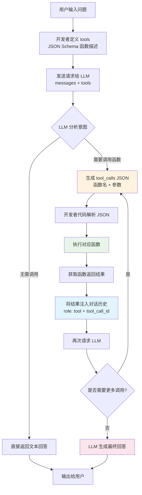
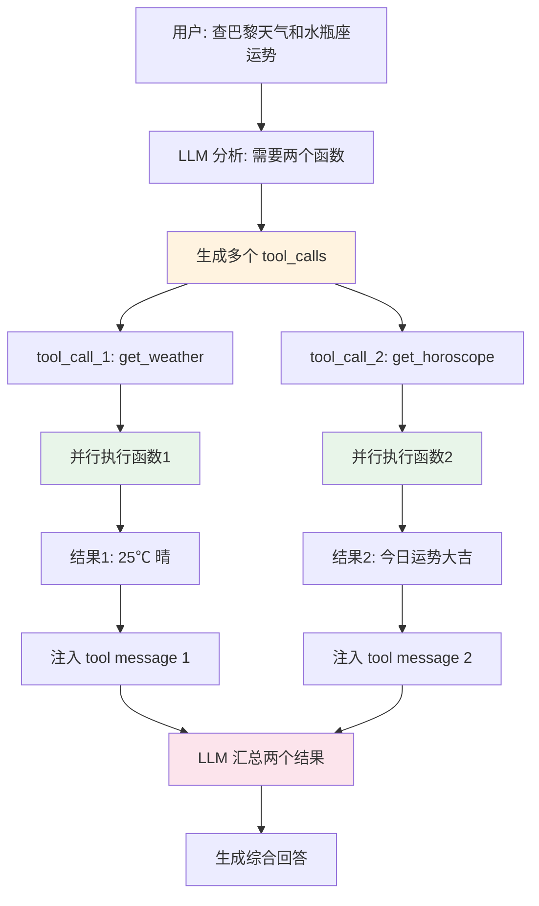
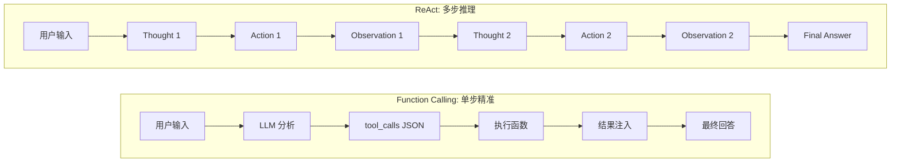

# Function Calling

## 一、定义

**Function Calling** 是 LLM 的一种原生 API 能力：模型能判断何时需要调用外部函数，并生成结构化的 JSON 参数（函数名 + 参数），由开发者代码执行实际操作后将结果返回给模型。本质上是让 LLM 从"只会说话"进化到"既能说话也能动手"。

## 二、为什么出现

在 Function Calling 出现之前，让 LLM 调用外部工具依赖 Prompt 工程手段（如 [[ReAct 推理框架]]），存在三个致命问题：

| 问题 | 表现 | 后果 |
|------|------|------|
| **解析不可靠** | 从自由文本中正则提取 Action 和参数 | 小模型格式错乱、解析失败率高 |
| **参数幻觉** | 模型编造不存在的参数或格式错误 | 函数执行失败，需重试或兜底 |
| **缺乏标准化** | 每个框架自定义格式，无统一标准 | 迁移成本高，跨模型不可复用 |

2023 年 6 月 13 日，OpenAI 在 Chat Completions API 中引入 Function Calling（首批支持 gpt-3.5-turbo-0613 和 gpt-4-0613），让模型原生输出结构化 JSON 调用指令，从根本上解决了上述问题。这标志着 AI 从单纯文本生成向具备行动能力的智能体系统的关键转变。

> [!important] 核心洞察
> Function Calling 的本质不是让模型"执行"函数，而是让模型"建议"调用哪个函数、传什么参数。==模型从不自行执行函数==，控制权始终在开发者手中。这是一个常被误解的关键点。

## 三、核心思想

### 3.1 五步交互机制

Function Calling 的核心思想是将"意图理解"和"执行操作"分离：LLM 负责理解用户意图并生成结构化调用指令，开发者代码负责执行函数并将结果反馈给模型。

$$
\text{User} \xrightarrow{\text{理解意图}} \text{LLM} \xrightarrow{\text{JSON 指令}} \text{Developer Code} \xrightarrow{\text{执行函数}} \text{Result} \xrightarrow{\text{反馈}} \text{LLM} \xrightarrow{\text{生成回答}} \text{User}
$$

### 3.2 与 ReAct 的哲学差异

| 维度 | Function Calling | ReAct |
|------|-----------------|-------|
| **本质** | 模型原生 API 能力 | 提示工程/框架模式 |
| **哲学** | "主管模式"——直接下达精准指令 | "侦探模式"——逐步推理-行动-观察 |
| **推理过程** | 隐式（黑盒） | 显式（白盒，有 Thought 日志） |
| **输出格式** | 结构化 JSON | 自由文本（需解析） |
| **可靠性** | 高，Schema 约束 | 中等，解析依赖正则 |
| **延迟** | 低，单次交互 | 高，多轮循环 |

> [!example] 类比
> Function Calling 像一个经验丰富的主管，听到任务直接下达精准指令；ReAct 像一个侦探，逐步思考-行动-观察，过程透明但较慢。最佳实践是==融合两者==：ReAct 负责宏观推理规划，Function Calling 负责战术执行。

### 3.3 Function Calling → Tool Calling 的演进

2023 年 11 月，OpenAI 将"Function Calling"更名为"**Tool Calling**"（参见 [[Tool Calling 工具调用]]）。这一更名反映了概念扩展：

- **Function** 是特定类型的工具，由 JSON Schema 定义，有严格输入输出格式
- **Tool** 是更广义概念，包括 function tools、custom tools（自由文本输入输出）、built-in tools（如 Web Search、Code Interpreter）

在 OpenAI 官方文档中，Tool Calling 是总称，Function 是工具的一种具体形式。

## 四、工作流程

### 4.1 Function Calling 核心流程



### 4.2 并行函数调用流程



### 4.3 与 ReAct 流程对比



## 五、关键技术

### 5.1 JSON Schema 函数定义

Function Calling 的核心是使用 JSON Schema 精确描述函数的名称、用途和参数结构：

```json
{
  "type": "function",
  "function": {
    "name": "get_weather",
    "description": "Retrieves current weather for the given location.",
    "parameters": {
      "type": "object",
      "properties": {
        "location": {
          "type": "string",
          "description": "City and country e.g. Bogotá, Colombia"
        },
        "units": {
          "type": "string",
          "enum": ["celsius", "fahrenheit"],
          "description": "Units the temperature will be returned in."
        }
      },
      "required": ["location", "units"],
      "additionalProperties": false
    },
    "strict": true
  }
}
```

| 字段 | 说明 |
|------|------|
| `name` | 函数名称，模型原样返回，用 `snake_case` |
| `description` | 函数用途描述，==决定模型何时调用该函数== |
| `parameters` | JSON Schema 定义的参数结构 |
| `required` | 必填参数列表 |
| `additionalProperties` | 设为 `false` 防止额外字段 |
| `strict` | 严格模式，约束参数严格符合 schema（2024.08 引入） |

### 5.2 Structured Output（结构化输出）

2024 年 8 月 OpenAI 推出 Structured Output 功能，是 Function Calling 的姊妹能力：

| 方案 | 原理 | 可靠性 |
|------|------|--------|
| **提示词约束** | 在 prompt 中要求输出 JSON | 低，依赖模型理解 |
| **JSON Schema Function Calling** | 通过工具定义约束 | 高，结构化输出 |
| **Structured Output (strict)** | 模型层面 Token 级强制约束 | 最高，Schema 级保证 |

核心原理：`strict: true` 不是在语义层面"恳求"模型遵守格式，而是在模型生成 Token 时施加结构化约束，从根本上杜绝格式错误。

### 5.3 并行函数调用（Parallel Function Calling）

OpenAI 支持在单次响应中调用多个函数。模型返回 `tool_calls` 数组，应用代码需遍历执行每个函数，并通过 `tool_call_id` 将结果匹配回对应调用：

```json
{
  "tool_calls": [
    {"id": "call_1", "function": {"name": "get_weather", "arguments": "{\"location\": \"Paris\"}"}},
    {"id": "call_2", "function": {"name": "get_horoscope", "arguments": "{\"sign\": \"Aquarius\"}"}}
  ]
}
```

### 5.4 各厂商实现对比

| 厂商 | 能力名称 | 特色 | 消息格式 |
|------|----------|------|----------|
| **OpenAI** | Tool Calling（原 Function Calling） | Parallel Calling、Strict Mode、Tool Search、Namespaces | `tools` + `tool_calls` |
| **Anthropic** | Tool Use | 与 MCP 协议深度集成 | `tools` + `tool_use` block |
| **Google Gemini** | Function Calling | 多模态输入+文本输出 | `function_declarations` |
| **通义千问 Qwen** | Function Calling | 联网搜索+代码解释器+MCP | 兼容 OpenAI 格式 |
| **DeepSeek** | Function Calling | 开源模型支持 | 兼容 OpenAI 格式 |

> [!warning] 格式差异
> 不同厂商的消息格式不完全一致，但趋势是围绕 Function/Tool 调用做统一抽象。LangChain 等框架提供了统一的 Tool 抽象层屏蔽底层差异。

### 5.5 MCP 与 Function Calling 的关系

MCP（Model Context Protocol，参见 [[MCP 模型上下文协议]]）由 Anthropic 于 2024 年 11 月推出，与 Function Calling 是==互补而非替代==的关系：

| 维度 | Function Calling | MCP |
|------|-----------------|-----|
| **定位** | 模型 API 层面的工具调用能力 | 系统架构层面的通信协议 |
| **标准化** | 各厂商 API 格式不统一 | 开放标准协议 |
| **工具发现** | 需手动定义 tools | 自动发现（Resources/Tools/Prompts） |
| **上下文传输** | 每次需重传全量上下文 | 支持增量更新 |
| **传输层** | 依赖模型 API | JSON-RPC 2.0，支持 Stdio/HTTP |

未来趋势：==MCP 作为工具发现层，Function Calling 作为模型执行层==。

## 六、优点

- **结构化输出**：JSON Schema 约束参数格式固定，易于解析，相比从自由文本中正则提取，可靠性显著提升
- **高可靠性**：`strict: true` 模式在 Token 生成级别强制约束，从根本上杜绝格式错误和参数幻觉
- **并行调用**：单次响应可调用多个函数，支持并行执行，大幅提升多工具场景的效率
- **原生支持**：主流模型 API 原生支持，接入简单，无需复杂的 Prompt 工程和文本解析逻辑
- **实时数据获取**：突破 LLM 训练数据时效限制，通过调用搜索 API、数据库等获取实时信息
- **精确计算**：调用计算器/数据库函数保证 100% 准确，避免 LLM 数学计算的幻觉问题
- **灵活扩展**：支持自定义函数、内置工具（Web Search、Code Interpreter）、Tool Search 动态加载、Namespaces 按领域分组
- **安全可控**：模型只生成调用指令不执行函数，开发者完全掌控执行逻辑和权限

## 七、缺点

- **模型幻觉参数**：即使有 Schema 约束，LLM 仍可能生成虚构的参数值（如编造不存在的城市名），需服务端校验兜底
- **推理不透明**：决策过程是"黑盒"，不像 [[ReAct 推理框架]] 那样有显式 Thought 日志，调试困难
- **上下文管理复杂**：每轮工具调用需维护完整的消息历史（含 tool messages），Token 消耗随轮次线性增长
- **成本增加**：多轮对话（LLM → Tool → LLM）消耗更多 Token 和时间，复杂任务成本可能是单次调用的数倍
- **模型支持有限**：并非所有模型都支持 Function Calling，开源小模型的支持程度参差不齐
- **安全风险**：可能引发不可逆操作（发邮件、转账、删除数据），必须加用户确认环节和权限控制
- **提供商锁定**：不同厂商 API 格式不一致（OpenAI/Claude/Gemini 各有差异），迁移成本高
- **Schema 设计门槛**：函数描述的质量直接影响模型调用准确率，需要经验丰富的 Schema 设计

## 八、典型应用

### 8.1 实时信息获取

- **天气查询**：用户问"巴黎天气"，模型调用 `get_weather` 函数获取实时天气
- **股票行情**：用户问"苹果股价"，模型调用 `get_stock_price` 函数获取实时行情
- **新闻检索**：用户问"今日科技新闻"，模型调用 `search_news` 函数获取最新资讯

### 8.2 精确计算与数据处理

- **数学计算**：用户问"1234 × 5678"，模型调用 `calculator` 函数确保 100% 准确
- **数据库查询**：模型调用 `query_database` 函数从企业数据库中检索结构化数据
- **数据分析**：模型调用 `run_python` 函数执行数据分析代码

### 8.3 外部操作执行

- **发邮件**：模型调用 `send_email` 函数（需用户确认）
- **创建日历事件**：模型调用 `create_event` 函数添加日程
- **文件操作**：模型调用 `read_file` / `write_file` 函数操作文件系统

### 8.4 多工具编排

- **企业知识库问答**：模型自主决定调用 `knowledge_search`（查内部知识库）或 `web_search`（查互联网）
- **编程助手**：模型编排 `read_code` → `analyze` → `write_code` → `run_tests` 多个函数完成编程任务
- **旅行规划**：模型并行调用 `get_weather` + `search_flight` + `search_hotel` 一次性获取多维度信息

### 8.5 Agent 系统基础设施

Function Calling 是现代 Agent 系统的底层执行机制。[[Agent]] 通过 [[ReAct 推理框架]] 进行宏观推理规划，每个 Action 的具体执行通过 Function Calling 实现。[[LangChain-LangGraph]] 的 `create_tool_calling_agent` 和 LangGraph 的 `ToolNode` 都基于 Function Calling 构建。

## 九、面试高频问题

### Q1: Function Calling 是什么？模型会自己执行函数吗？

Function Calling 是 LLM 调用外部函数的原生 API 能力。核心流程：用户提问 → LLM 理解意图并判断需要调用哪些函数 → 生成结构化 JSON（函数名 + 参数）→ 开发者代码解析 JSON 并执行函数 → 将结果作为 tool message 返回给 LLM → LLM 基于结果生成最终回答。==模型从不自行执行函数==，只负责"建议"调用哪个函数、传什么参数，执行权完全在开发者手中。

### Q2: Function Calling 和 ReAct 的区别？如何选择？

Function Calling 是模型原生 API 能力，生成结构化 JSON 调用工具，高效但黑盒；ReAct 是提示工程模式，通过 Thought-Action-Observation 循环迭代，透明但低效。选择标准：意图明确的单步任务用 Function Calling（快、可靠）；需要多步推理的复杂任务用 ReAct（透明、可调试）；最佳实践是融合两者——ReAct 负责宏观推理规划，Function Calling 负责战术执行。

### Q3: 如何处理 LLM 生成的幻觉参数？

三层防护：第一层，Schema 约束——使用 `strict: true` + `additionalProperties: false` + `enum` 约束参数范围；第二层，服务端校验——对参数进行类型、范围、权限校验，拒绝非法参数；第三层，兜底机制——设置调用次数上限，异常时降级到默认回答或要求用户确认。关键原则：==永远不要信任 LLM 生成的参数，服务端校验是最后一道防线==。

### Q4: Parallel Function Calling 如何处理？

模型在单次响应中返回 `tool_calls` 数组包含多个函数调用。处理步骤：遍历 `tool_calls` 数组，对每个 `tool_call` 执行对应函数，将每个结果以 `role: "tool"` 的消息追加到对话历史，通过 `tool_call_id` 将结果匹配回对应调用，最后再次请求模型汇总所有结果。关键点：每个 tool_call 有独立的 id，结果必须通过 id 匹配，不能混淆。

### Q5: Function Calling 和 Tool Calling 是什么关系？

2023 年 6 月 OpenAI 最初命名为 Function Calling；2023 年 11 月更名为 Tool Calling。更名反映概念扩展：Function 是特定类型的工具（JSON Schema 定义，严格输入输出），Tool 是更广义概念（包括 function tools、custom tools、built-in tools 如 Web Search 和 Code Interpreter）。在 OpenAI 官方文档中，Tool Calling 是总称，Function 是工具的一种具体形式。业界两者常混用。

### Q6: MCP 和 Function Calling 是什么关系？MCP 会取代 Function Calling 吗？

不会取代，两者互补。Function Calling 是模型层面的工具调用能力（模型生成 JSON 指令），MCP 是系统层面的工具通信协议（标准化工具发现和上下文传输）。MCP 解决 Function Calling 的两大痛点：工具集成标准化（自动发现 vs 手动定义）和上下文传输优化（增量更新 vs 全量重传）。未来趋势：MCP 作为工具发现层，Function Calling 作为模型执行层，两者协同工作。

### Q7: Structured Output 和 Function Calling 是什么关系？

姊妹能力。Function Calling 让 LLM 输出结构化结果指向工具调用（生成函数名+参数）；Structured Output 让 LLM 输出结构化结果指向数据塑形（直接输出符合 Schema 的 JSON）。两者都通过 JSON Schema 约束，`strict: true` 在 Token 生成级别强制约束。Structured Output 可视为 Function Calling 参数生成能力的独立应用——不需要实际调用函数，只需要结构化输出。

### Q8: 如何设计高质量的 Function Schema？

五个原则：第一，函数名用 `snake_case` 语义清晰（如 `get_weather` 而非 `do_action`）；第二，description 要具体说明"何时调用"和"做什么"（如 "Get today's horoscope. Call this when the user asks about daily fortune."）；第三，所有参数必须有 description 帮助 LLM 理解用途；第四，用 `enum` 约束可选值减少幻觉，用 `required` 明确必填参数；第五，使用 `additionalProperties: false` 和 `strict: true` 防止额外字段和格式错误。嵌套结构不宜过深，保持扁平化。

## 十、相关知识

### 核心关联笔记

- [[Tool Calling 工具调用]] —— Function Calling 的演进形态，Tool Calling 是总称，Function 是工具的具体形式
- [[Agent]] —— Function Calling 是 Agent 执行外部操作的核心底层能力
- [[ReAct 推理框架]] —— ReAct 负责宏观推理规划，Function Calling 负责战术执行，两者互补
- [[LLM 大语言模型]] —— Function Calling 依赖 LLM 的意图理解和结构化输出能力
- [[LangChain-LangGraph]] —— 提供 Tool 抽象层和 `create_tool_calling_agent` / `ToolNode` 封装
- [[MCP 模型上下文协议]] —— 系统层面的工具通信协议，与 Function Calling 互补
- [[Prompt Engineering 提示词工程]] —— 函数 description 的质量本质是 prompt 工程
- [[RAG 检索增强生成]] —— RAG 可封装为 Function 供模型调用，实现 Agentic RAG
- [[模型幻觉]] —— Function Calling 可通过调用外部工具减少幻觉，但参数幻觉仍需防范
- [[Agent与Workflow的区别]] —— Function Calling 是 Agent 自主决策的技术基础，Workflow 通常不涉及
- [[Agent记忆机制]] —— Function Calling 的多轮交互历史需要记忆管理
- [[Transformer]] —— 理解 LLM 生成结构化 JSON 的底层机制

### 关键参考资料

- OpenAI 官方文档 - Function Calling: https://platform.openai.com/docs/guides/function-calling
- OpenAI 2023.06 Function Calling 发布公告
- OpenAI 2024.08 Structured Output 发布
- Anthropic 2024.11 MCP 发布

### 关键概念

- **tool_calls**：模型返回的函数调用指令数组，包含函数名和参数
- **tool_call_id**：每个函数调用的唯一标识，用于匹配执行结果
- **strict mode**：严格模式，Token 级别强制约束参数符合 Schema
- **Parallel Function Calling**：单次响应调用多个函数
- **Tool Search**：模型动态搜索和加载相关工具（GPT-5+ 支持）

## 十一、代码示例

### 示例 1: OpenAI 原生 API 完整流程

```python
from openai import OpenAI
import json

client = OpenAI()

# Step 1: 定义工具
tools = [
    {
        "type": "function",
        "function": {
            "name": "get_weather",
            "description": "Get current weather for a given location.",
            "parameters": {
                "type": "object",
                "properties": {
                    "location": {
                        "type": "string",
                        "description": "City and country, e.g. Paris, France",
                    },
                    "unit": {
                        "type": "string",
                        "enum": ["celsius", "fahrenheit"],
                        "description": "Temperature unit",
                    },
                },
                "required": ["location", "unit"],
                "additionalProperties": False,
            },
            "strict": True,
        },
    }
]

# Step 2: 发送请求
messages = [
    {"role": "system", "content": "You are a helpful weather assistant."},
    {"role": "user", "content": "What's the weather in Paris?"},
]

response = client.chat.completions.create(
    model="gpt-4o",
    messages=messages,
    tools=tools,
)

messages.append(response.choices[0].message)

# Step 3: 检查是否需要调用函数
if response.choices[0].message.tool_calls:
    for tool_call in response.choices[0].message.tool_calls:
        # 解析函数名和参数
        func_name = tool_call.function.name
        args = json.loads(tool_call.function.arguments)

        # 执行函数
        if func_name == "get_weather":
            result = {"location": args["location"], "temperature": 25, "unit": args["unit"], "condition": "晴"}

        # Step 4: 将结果注入对话历史
        messages.append({
            "role": "tool",
            "tool_call_id": tool_call.id,
            "content": json.dumps(result, ensure_ascii=False),
        })

    # Step 5: 再次请求模型生成最终回答
    final_response = client.chat.completions.create(
        model="gpt-4o",
        messages=messages,
        tools=tools,
    )
    print(final_response.choices[0].message.content)
else:
    # 无需调用函数，直接输出
    print(response.choices[0].message.content)
```

### 示例 2: 并行函数调用

```python
from openai import OpenAI
import json

client = OpenAI()

tools = [
    {
        "type": "function",
        "function": {
            "name": "get_weather",
            "description": "Get weather for a city",
            "parameters": {
                "type": "object",
                "properties": {
                    "city": {"type": "string", "description": "City name"}
                },
                "required": ["city"],
                "additionalProperties": False,
            },
            "strict": True,
        },
    },
    {
        "type": "function",
        "function": {
            "name": "get_horoscope",
            "description": "Get today's horoscope for a zodiac sign",
            "parameters": {
                "type": "object",
                "properties": {
                    "sign": {"type": "string", "description": "Zodiac sign"}
                },
                "required": ["sign"],
                "additionalProperties": False,
            },
            "strict": True,
        },
    },
]

messages = [
    {"role": "user", "content": "巴黎天气怎么样？还有水瓶座的今日运势"}
]

response = client.chat.completions.create(
    model="gpt-4o",
    messages=messages,
    tools=tools,
)

messages.append(response.choices[0].message)

# 并行处理多个 tool_calls
if response.choices[0].message.tool_calls:
    import concurrent.futures

    def execute_tool(tool_call):
        name = tool_call.function.name
        args = json.loads(tool_call.function.arguments)

        if name == "get_weather":
            return {"city": args["city"], "temp": 25, "condition": "晴"}
        elif name == "get_horoscope":
            return {"sign": args["sign"], "fortune": "今日大吉，适合创新"}

    # 并行执行所有函数调用
    with concurrent.futures.ThreadPoolExecutor() as executor:
        futures = {
            executor.submit(execute_tool, tc): tc
            for tc in response.choices[0].message.tool_calls
        }
        for future in concurrent.futures.as_completed(futures):
            tc = futures[future]
            result = future.result()
            messages.append({
                "role": "tool",
                "tool_call_id": tc.id,
                "content": json.dumps(result, ensure_ascii=False),
            })

# 汇总结果
final = client.chat.completions.create(model="gpt-4o", messages=messages, tools=tools)
print(final.choices[0].message.content)
```

### 示例 3: LangChain 工具调用 Agent

```python
from langchain.tools import tool
from langchain_openai import ChatOpenAI
from langchain.agents import create_tool_calling_agent, AgentExecutor
from langchain_core.prompts import ChatPromptTemplate

# 使用装饰器定义工具（自动生成 JSON Schema）
@tool
def get_weather(city: str, unit: str = "celsius") -> dict:
    """获取指定城市的当前天气信息。当用户询问天气时调用此函数。

    Args:
        city: 城市名称，如 "北京"、"Paris"
        unit: 温度单位，celsius 或 fahrenheit
    """
    # 模拟天气 API
    weather_data = {
        "北京": {"temp": 28, "condition": "晴", "unit": unit},
        "Paris": {"temp": 18, "condition": "多云", "unit": unit},
    }
    return weather_data.get(city, {"error": f"未找到 {city} 的天气数据"})


@tool
def calculator(expression: str) -> str:
    """计算数学表达式。当用户需要数学计算时调用此函数。

    Args:
        expression: 数学表达式，如 "2 + 3 * 4"
    """
    try:
        allowed = set("0123456789+-*/.() ")
        if not all(c in allowed for c in expression):
            return "Error: 表达式包含非法字符"
        return str(eval(expression))
    except Exception as e:
        return f"Error: {e}"


@tool
def search_database(query: str) -> list:
    """在企业数据库中搜索信息。

    Args:
        query: 搜索查询语句
    """
    return [{"id": 1, "content": f"关于 '{query}' 的搜索结果"}, {"id": 2, "content": "相关文档"}]


# 创建工具调用 Agent
llm = ChatOpenAI(model="gpt-4o-mini", temperature=0)

prompt = ChatPromptTemplate.from_messages([
    ("system", "你是一个有用的助手，可以查询天气、计算数学表达式和搜索数据库。"),
    ("user", "{input}"),
    ("agent_scratchpad", "{agent_scratchpad}"),
])

agent = create_tool_calling_agent(llm=llm, tools=[get_weather, calculator, search_database], prompt=prompt)

agent_executor = AgentExecutor(
    agent=agent,
    tools=[get_weather, calculator, search_database],
    verbose=True,
    max_iterations=5,
)

# 执行任务
result = agent_executor.invoke({"input": "北京和巴黎的温差是多少度？"})
print(result["output"])
```

### 示例 4: LangGraph 有状态工具调用

```python
from langgraph.graph import StateGraph, END
from langgraph.prebuilt import ToolNode
from langchain_openai import ChatOpenAI
from langchain_core.tools import tool
from typing import TypedDict, Annotated
import operator

class AgentState(TypedDict):
    messages: Annotated[list, operator.add]
    iterations: int

@tool
def search_web(query: str) -> str:
    """搜索互联网获取最新信息"""
    return f"搜索结果: {query} 的最新信息..."

@tool
def query_database(sql: str) -> str:
    """执行数据库查询"""
    return f"查询结果: 执行了 {sql}"

@tool
def send_email(to: str, subject: str, body: str) -> str:
    """发送邮件（需要用户确认的敏感操作）"""
    return f"邮件已发送给 {to}"

tools = [search_web, query_database, send_email]
llm = ChatOpenAI(model="gpt-4o-mini", temperature=0).bind_tools(tools)

def agent_node(state: AgentState):
    """LLM 决策节点: 决定调用哪个工具"""
    response = llm.invoke(state["messages"])
    return {
        "messages": [response],
        "iterations": state["iterations"] + 1,
    }

def should_continue(state: AgentState):
    """路由: 判断是否继续调用工具"""
    # 安全护栏: 最大 10 轮
    if state["iterations"] >= 10:
        return END

    last_msg = state["messages"][-1]
    if hasattr(last_msg, "tool_calls") and last_msg.tool_calls:
        # 敏感操作检查
        for tc in last_msg.tool_calls:
            if tc["name"] == "send_email":
                # 在实际应用中这里应该暂停等待人工审批 (HITL)
                print(f"⚠️ 敏感操作: 发送邮件给 {tc['args'].get('to')}")
        return "tools"
    return END

# 构建图
workflow = StateGraph(AgentState)
workflow.add_node("agent", agent_node)
workflow.add_node("tools", ToolNode(tools))

workflow.set_entry_point("agent")
workflow.add_conditional_edges("agent", should_continue, {
    "tools": "tools",
    END: END,
})
workflow.add_edge("tools", "agent")  # 工具执行后回到 agent

app = workflow.compile()

# 执行
result = app.invoke({
    "messages": [{"role": "user", "content": "查一下苹果公司最新财报，然后发邮件给 boss@company.com 汇报"}],
    "iterations": 0,
})
print(result["messages"][-1].content)
```

### 示例 5: 多厂商统一调用（LangChain 抽象层）

```python
from langchain_core.tools import tool
from langchain_openai import ChatOpenAI
from langchain_anthropic import ChatAnthropic
from langchain_google_genai import ChatGoogleGenerativeAI

# 统一工具定义（LangChain 自动转换为各厂商格式）
@tool
def get_weather(city: str) -> dict:
    """获取指定城市的天气"""
    return {"city": city, "temp": 25, "condition": "晴"}

@tool
def calculator(expression: str) -> str:
    """计算数学表达式"""
    try:
        return str(eval(expression))
    except:
        return "Error"

tools = [get_weather, calculator]

# 同一套工具，无缝切换不同厂商模型
models = {
    "openai": ChatOpenAI(model="gpt-4o-mini", temperature=0).bind_tools(tools),
    "claude": ChatAnthropic(model="claude-3-5-sonnet-20241022", temperature=0).bind_tools(tools),
    "gemini": ChatGoogleGenerativeAI(model="gemini-2.0-flash", temperature=0).bind_tools(tools),
}

# 统一调用接口
query = "北京天气怎么样？如果温度低于20度，告诉我温差是多少"

for name, model in models.items():
    print(f"\n=== {name} ===")
    response = model.invoke(query)
    if response.tool_calls:
        for tc in response.tool_calls:
            print(f"  调用: {tc['name']}({tc['args']})")
    else:
        print(f"  回答: {response.content}")
```

## 十二、个人理解

### 1. Function Calling 的真正贡献是"标准化"而非"能力突破"

Function Calling 并没有让 LLM 获得此前不可能的新能力——在它出现之前，[[ReAct 推理框架]] 已经能让 LLM 调用工具了。Function Calling 的真正贡献是==将工具调用从"Prompt 工程技巧"提升为"模型原生 API 标准"==。这个标准化的价值远超技术本身：它让工具调用从"每个开发者自己摸索"变成"所有模型厂商共同遵守的规范"，大幅降低了开发门槛和迁移成本。从这个角度看，Function Calling 对 Agent 生态的意义类似于 HTTP 对 Web 的意义——不是发明了新能力，而是定义了新标准。

### 2. Strict Mode 是被低估的突破

2024 年 8 月 OpenAI 推出的 `strict: true` 模式看似只是一个小参数，实则是 Function Calling 最重要的技术突破。此前 Function Calling 的可靠性依赖模型"理解"Schema 并"尽量遵守"——这本质上是概率性的。Strict Mode 在 Token 生成级别施加约束，将可靠性从"大概率正确"提升到"Schema 级保证"。这个突破的意义在于：它让 Function Calling 从"可用"变成"可信赖"，为金融、医疗等高可靠场景的 Agent 落地扫清了障碍。很多人关注大模型的能力提升，但==可靠性提升的工程价值往往大于能力提升==。

### 3. Function Calling 不会取代 ReAct，而是让 ReAct 隐形化

很多人认为原生 Function Calling 会取代 ReAct，这是误解。Function Calling 取代的是 ReAct 的==实现方式==——从 Prompt 驱动的文本解析变为模型原生的 JSON 生成。但 ReAct 的==核心思想==——推理和行动交替进行——并没有改变。事实上，LangChain 的 `create_tool_calling_agent` 内部仍然遵循 Thought-Action-Observation 循环，只是 Thought 变成了模型内部推理、Action 变成了结构化 JSON、Observation 变成了函数返回值。ReAct 没有消失，它只是从显式的 Prompt 模板变成了隐式的模型能力。

### 4. MCP + Function Calling 是 Agent 工具生态的未来架构

Function Calling 解决了"模型如何调用工具"的问题，但没解决"工具如何被发现和管理"的问题——每个应用都需要手动定义 tools 列表，工具无法跨应用复用。MCP（参见 [[MCP 模型上下文协议]]）恰好填补了这个空白：MCP 作为工具发现层，自动暴露可用工具；Function Calling 作为模型执行层，生成调用指令。这种分层架构类似于微服务中的"服务注册发现 + 服务调用"——MCP 是服务注册中心，Function Calling 是服务调用协议。未来 Agent 系统的工具生态大概率会建立在这两层架构之上。

### 5. Function Calling 的终极形态是"工具消失"

当前 Function Calling 要求开发者预先定义 tools 列表，模型从中选择调用。但这只是过渡形态。OpenAI 已经推出了 Tool Search（模型动态搜索和加载相关工具）和 Namespaces（按领域分组工具），这些功能的演进方向是：==开发者不再需要预先定义 tools，模型根据任务自主发现、加载、调用工具==。当这个能力成熟时，"Function Calling"作为一个独立概念将逐渐消失——工具调用会变成模型的隐性能力，就像人类不需要刻意"定义"自己能使用的工具一样。用户只需要说"帮我查一下天气"，模型自动发现天气工具、生成调用、返回结果，整个过程对用户透明。Function Calling 的终极形态，是它自己变得不再可见。
