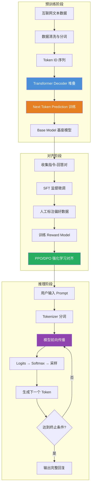

# LLM 大语言模型（Large Language Model）

## 一、定义

LLM（大语言模型）是基于 Transformer 架构、在海量文本数据上训练的**自回归语言模型**，核心能力是**根据前文预测下一个 Token**，通过数十亿至数万亿参数捕捉语言中的语法、语义、知识和推理模式，实现文本生成、理解、翻译、推理等通用自然语言处理能力。

> [!quote] 一句话类比
> LLM 的本质是"概率估算器"——给定前文，它计算词表中每个词出现的概率，选最可能的那个。但当参数规模突破某个阈值后，涌现出推理、规划、代码生成等能力，远超"概率估算器"的范畴。

---

## 二、为什么出现

### 2.1 传统 NLP 的碎片化困境

在 LLM 之前，NLP 领域是"一个任务一个模型"：机器翻译用 Seq2Seq，情感分析用 TextCNN，命名实体识别用 BiLSTM-CRF。每个任务需要专门的标注数据、特征工程和模型架构，开发成本极高，且小模型缺乏泛化能力。

### 2.2 三个关键突破催生 LLM

| 突破 | 代表工作 | 核心贡献 |
|---|---|---|
| **Transformer 架构** | Attention is All You Need (2017) | 自注意力机制替代 RNN，支持并行训练和长程依赖 |
| **Scaling Law** | Kaplan et al. (2020) | 证明了模型性能随参数、数据、算力呈幂律增长——"越大越好"有了理论支撑 |
| **GPT/RLHF 范式的成熟** | GPT-3 (2020) → InstructGPT (2022) → ChatGPT | 从"预训练 → 微调"到"预训练 → SFT → RLHF"，让模型学会遵循指令 |

> [!important] 本质认知
> LLM 不是一个"做大了的 NLP 模型"，而是**范式的根本转变**：从"为每个任务训练专用模型"到"用同一个模型通过 Prompt 完成所有任务"。这种"通用性"才是 LLM 革命性的地方。

---

## 三、核心思想

### 3.1 自回归语言建模（Next Token Prediction）

LLM 的训练目标极其简单：给定前文 $x_1, x_2, ..., x_{t-1}$，预测下一个 Token $x_t$ 的概率分布：

$$
P(x_t | x_1, x_2, ..., x_{t-1}) = \text{softmax}(W \cdot h_t)
$$

其中 $h_t$ 是最后一层 Transformer 在位置 $t$ 的隐藏状态，$W$ 是输出投影矩阵。训练时使用交叉熵损失：

$$
\mathcal{L} = -\sum_{t} \log P(x_t | x_{<t})
$$

这个看似简单的"填空题"训练范式，在足够大的模型和数据下，竟然涌现出推理、编程、翻译等复杂能力——这是 LLM 最反直觉也最深刻的发现。

### 3.2 三阶段训练范式

```
预训练（Pre-training） → 监督微调（SFT） → 人类反馈强化学习（RLHF）
```

| 阶段 | 数据 | 目标 | 产出 |
|---|---|---|---|
| **预训练** | 万亿级 Token 互联网文本 | 学习语言的统计规律和世界知识 | Base Model（如 GPT-4 Base） |
| **SFT** | 万级高质量指令-回答对 | 让模型学会遵循指令格式 | Chat Model（如 GPT-4） |
| **RLHF** | 人类偏好对比数据 | 对齐人类价值观（有用、无害、诚实） | Aligned Model（如 ChatGPT） |

### 3.3 涌现能力（Emergent Abilities）

当模型规模超过某个临界点（约 100B 参数），突然出现小模型完全不具备的能力：思维链推理（Chain-of-Thought）、少样本学习（Few-Shot）、代码生成、多语言翻译等。这些能力**不是被显式训练出来的，而是规模的副产品**。

### 3.4 关键架构组件

| 组件 | 说明 | 演进 |
|---|---|---|
| **Self-Attention** | 每个 Token 关注序列中所有 Token，计算相关性加权 | MHA → GQA → MLA |
| **Position Encoding** | 注入位置信息，否则 Attention 对位置不敏感 | 绝对编码 → RoPE（旋转位置编码） |
| **激活函数** | 前馈网络的非线性变换 | ReLU → GELU → SwiGLU |
| **归一化** | 稳定深层网络训练 | LayerNorm → RMSNorm + Pre-Norm |
| **MoE（混合专家）** | 每个 Token 只激活部分 FFN 参数，扩大模型容量而保持推理速度 | DeepSeek-V3: 671B 参数，每次仅激活 37B |

---

## 四、工作流程



**推理阶段解码策略**：

| 策略 | 原理 | 适用场景 |
|---|---|---|
| **贪心解码** | 每步选概率最高的 Token | 确定性输出，但容易重复 |
| **Temperature 采样** | $P_i = \text{softmax}(z_i / T)$，T 越高越随机 | 创意写作（T > 0.7），事实问答（T < 0.3） |
| **Top-K 采样** | 只从概率最高的 K 个 Token 中采样 | 平衡质量和多样性 |
| **Top-P（Nucleus）采样** | 从累积概率超过 P 的最小 Token 集合中采样 | 动态调整候选集大小 |
| **Beam Search** | 维护多条候选序列，每步扩展 | 翻译等需要最优解的任务 |

---

## 五、关键技术

### 5.1 核心架构技术

| 技术 | 说明 | 代表模型 |
|---|---|---|
| **Transformer Decoder** | 仅保留解码器，去掉了编码器，单向自回归 | GPT 全系列 |
| **GQA（分组查询注意力）** | 多个 Query 头共享同一组 KV 头，减少 KV Cache 内存 | Llama 2/3, Mistral |
| **MLA（多头潜在注意力）** | 将 KV 压缩到低维潜在空间再存储，进一步减少 KV Cache | DeepSeek-V2/V3 |
| **RoPE（旋转位置编码）** | 通过旋转矩阵编码相对位置，支持长序列外推 | Llama, Qwen, DeepSeek |
| **SwiGLU 激活** | GLU 变体 + Swish，比 GELU 性能更好 | Llama, Gemma |
| **MoE（混合专家）** | 多个 FFN 专家 + 路由器，稀疏激活 | DeepSeek-V3, Mixtral |
| **Flash Attention** | 利用 GPU 显存层级优化注意力计算，速度提升 2-4 倍 | 几乎所有现代 LLM |

### 5.2 训练技术

| 技术 | 说明 |
|---|---|
| **混合精度训练** | FP16/BF16 前向 + FP32 梯度累积，节省显存 50% |
| **梯度检查点** | 不存储中间激活，反向传播时重新计算，用时间换显存 |
| **ZeRO（零冗余优化器）** | DeepSpeed 的分片策略，将优化器状态、梯度、参数分片到多 GPU |
| **管道并行 + 张量并行** | 跨 GPU 切分模型层（管道并行）和单层权重（张量并行） |
| **数据并行** | 每 GPU 持有一份完整模型，处理不同 batch，梯度同步 |

### 5.3 对齐技术

| 技术 | 说明 | 优缺点 |
|---|---|---|
| **SFT（监督微调）** | 在高质量指令-回答对上微调 | 简单有效，但泛化有限 |
| **RLHF（人类反馈强化学习）** | 训练 Reward Model → PPO 优化 | 效果好，但流程复杂、不稳定 |
| **DPO（直接偏好优化）** | 直接从偏好数据优化，无需显式 Reward Model | 简化 RLHF，稳定性更好 |
| **Constitutional AI** | 用 AI 反馈替代人类反馈，基于规则列表自我训练 | 降低人工标注成本 |
| **RLVR（可验证奖励强化学习）** | 代码/数学等有客观答案的任务，用规则验证替代人工 | DeepSeek-R1 的关键技术 |

### 5.4 推理优化技术

| 技术 | 说明 | 加速比 |
|---|---|---|
| **KV Cache** | 缓存已计算的 Key/Value，避免重复计算 | 本质加速 |
| **量化（Quantization）** | FP16 → INT8/INT4，精度损失 < 2% | 2-4x 显存节省 |
| **投机解码（Speculative Decoding）** | 用小模型快速生成草稿，大模型并行验证 | 1.5-3x 加速 |
| **vLLM / PagedAttention** | 将 KV Cache 分页管理，减少显存碎片 | 2-4x 吞吐提升 |
| **Flash Attention 2/3** | 进一步优化 GPU 显存 I/O | 1.5-2x 加速 |

### 5.5 主流 LLM 对比（2024-2025）

| 模型 | 厂商 | 参数量 | 架构亮点 | 开源 |
|---|---|---|---|---|
| **GPT-4o** | OpenAI | 未公开 | 多模态原生，文本+图像+语音 | 否 |
| **Claude 3.5** | Anthropic | 未公开 | Constitutional AI，长上下文 200K | 否 |
| **DeepSeek-V3** | 深度求索 | 671B (37B 激活) | MoE + MLA，训练成本仅 $5.6M | 是 |
| **Llama 3.1** | Meta | 405B | GQA + RoPE，最大开源模型 | 是 |
| **Qwen 2.5** | 阿里 | 72B | GQA + SwiGLU，中文能力最强 | 是 |
| **Gemma 3** | Google | 27B | 滑动窗口注意力 + QK-Norm | 是 |
| **Mistral Large** | Mistral | 123B | MoE + GQA + 多语言 | 否 |

---

## 六、优点

- **通用性**：一个模型处理翻译、摘要、编程、推理、数学、对话等几十种任务，无需为每个任务训练专用模型
- **涌现能力**：规模突破后涌现思维链推理、代码生成、多语言理解等能力，小模型完全不具备
- **零样本/少样本学习**：通过 Prompt 即可完成新任务，无需微调，极大降低 AI 应用门槛
- **自然语言交互**：以自然语言为输入输出界面，用户无需编程即可与 AI 协作
- **知识整合能力**：预训练阶段吸收了万亿级 Token 中的世界知识，回答覆盖面远超人类专家
- **可扩展性**：Scaling Law 已被验证，加大参数量、数据量、算力即可持续提升性能
- **生态成熟**：HuggingFace、LangChain、vLLM 等工具链使 LLM 开发、部署、微调变得极其便利

---

## 七、缺点

- **幻觉问题（Hallucination）**：模型会自信地生成不存在的事实，这是自回归生成机制的根本缺陷，目前无法根治。即使在 RAG 加持下，仍存在 5-15% 的幻觉率
- **训练成本高昂**：GPT-4 训练成本约 $78M，DeepSeek-V3 约 $5.6M（已经是极致优化），电力和 GPU 集群投入令中小企业望而却步
- **推理延迟高**：大模型自回归解码天然串行，端到端延迟通常在 200ms-2s，对实时交互场景仍是挑战
- **知识截止日期**：训练数据有截止时间，无法回答最新事件。RAG 可以缓解，但检索质量依赖外部知识库
- **上下文窗口有限**：即使 128K 窗口也无法承载企业全量知识库，`Lost in the Middle` 现象导致窗口中间的信息被忽略 [$TRAE_REF](https://arxiv.org/abs/2307.03172)
- **偏见与毒性**：训练数据中的社会偏见、歧视、暴力内容会被模型学习并复现，RLHF 只能缓解不能根除
- **可解释性差**：LLM 是黑箱，无法解释"为什么生成这个答案"，在医疗、法律、金融等高风险场景面临合规挑战
- **安全风险**：Prompt Injection、Jailbreak 攻击可绕过安全对齐，模型可能被诱导生成有害内容
- **环境成本**：一次 GPT-3 训练耗电约 1,287 MWh，相当于 120 个美国家庭的年用电量，碳排放约 552 吨 CO₂

---

## 八、典型应用

### 8.1 对话助手与客服

**ChatGPT / Claude / 豆包**：通用对话 + 特定领域知识，替代传统 FAQ 和规则引擎。金融行业实践显示，结合 RAG 的 LLM 客服将问题解决率从 42% 提升至 78%。

### 8.2 代码生成

**GitHub Copilot / Cursor / Devin**：根据注释和上下文生成代码，编程效率提升 55%（GitHub 2024 调研数据）。从代码补全进化为端到端软件开发智能体。

### 8.3 内容创作与营销

**文本生成**：撰写文章、广告文案、邮件、社交媒体内容。**Jasper AI** 等工具已实现从营销策略到内容生成的自动化流水线。

### 8.4 知识管理与企业搜索

**RAG 系统**：企业文档 → 向量化 → 语义检索 → LLM 生成准确答案。微软 Copilot for Microsoft 365 将企业知识库与 LLM 对接，减少信息检索时间 40%。

### 8.5 医疗辅助

**诊断辅助**：Med-PaLM 2 在 USMLE 测试中达到 86.5% 准确率（专家级）。**药物研发**：LLM 辅助文献综述、分子筛选、临床试验设计，将新药研发周期缩短 30%。

### 8.6 教育与培训

**个性化导师**：Khan Academy 的 Khanmigo 基于 GPT-4 提供苏格拉底式教学，不直接给答案而是引导思考。语言学习场景中，LLM 提供无限耐心的对话练习伙伴。

### 8.7 金融分析

**研报生成**：BloombergGPT 在金融领域表现优于通用模型，自动生成财报摘要、风险分析、投资建议。**合规审查**：LLM 分析合同条款，识别潜在合规风险，替代人工审查 80% 的工作量。

### 8.8 法律文书

**合同审查**、**案例检索**、**法律咨询**初见成效。但需注意：LLM 幻觉率在专业法律场景中仍有 17-33%，不能替代律师，只能作为辅助工具。

---

## 九、面试高频问题

### Q1：LLM 的训练流程是什么？

标准的三阶段训练：

1. **预训练（Pre-training）**：在万亿级 Token 互联网文本上做 Next Token Prediction，学习语言的统计规律和世界知识。产出 Base Model。
2. **监督微调（SFT）**：在万级高质量指令-回答对上微调，让模型学会理解指令格式。产出 Chat Model。
3. **RLHF（人类反馈强化学习）**：收集人类偏好对比数据 → 训练 Reward Model → 用 PPO 或 DPO 优化模型，使其输出符合"有用、无害、诚实"的价值观。

> [!tip] 加分点
> 能说明 DeepSeek-R1 的 R1-Zero 路线跳过了 SFT，直接用 RLVR（可验证奖励强化学习）从 Base Model 训练出推理能力，挑战了三阶段范式。

### Q2：什么是 LLM 的幻觉（Hallucination）？如何缓解？

**定义**：模型生成看似流畅但不符合事实的内容。根源在于自回归生成——每一步都选概率最高的 Token，整个序列可能偏离事实但不偏离语言流畅度。

**LLM 没有"知道"和"不知道"的区分机制**——它被训练为"预测下一个 Token"，而非"判断自己是否知道答案"。

**缓解方案**：

| 方案 | 原理 | 效果 |
|---|---|---|
| **RAG** | 检索外部知识库，将事实注入 Prompt | 幻觉率从 30% 降至 5-15% |
| **Prompt Engineering** | 要求模型引用来源、不确定时明确说"不知道" | 降低 10-20% |
| **RLHF 对齐** | 训练时惩罚错误回答，奖励"我不知道" | 降低 15-30% |
| **Self-Reflection** | 让模型生成后自我检查并修正 | 多轮时有效 |
| **Temperature 控制** | 事实性任务用低温度（T < 0.3） | 简单有效 |

### Q3：Decoder-Only 架构为什么成为 LLM 的主流选择？

| 对比维度 | Decoder-Only（GPT） | Encoder-Decoder（T5） | Encoder-Only（BERT） |
|---|---|---|---|
| **自回归** | 是 | 是 | 否（双向） |
| **生成能力** | 天然支持 | 支持 | 不支持 |
| **预训练效率** | 高（单向注意力，所有 Token 同时计算 loss） | 中 | 高 |
| **零样本泛化** | 强（上下文学习） | 中 | 弱 |
| **推理效率** | KV Cache 可复用 | 需要独立的 Encoder 计算 | 不适用 |

**结论**：Decoder-Only 在"生成能力 + 预训练效率 + 零样本泛化"三个维度上综合最优，Scaling Law 验证了其可扩展性。Encoder-Decoder 在需要精确的条件控制时仍有优势，但 LLM 的通用性需求让 Decoder-Only 成为主流。

### Q4：SFT 和 RLHF 的区别是什么？为什么需要 RLHF？

| 维度 | SFT | RLHF |
|---|---|---|
| **数据** | 单个指令-回答对（正例） | 成对比较数据（A 比 B 好） |
| **目标** | 最大化 P(回答\|指令) | 最大化 Reward Model 给的分 |
| **学习信号** | 直接模仿 | 相对偏好 |
| **泛化** | 局限于训练数据分布 | 能泛化到新场景 |
| **对齐** | 格式对齐 | 价值观对齐 |

**为什么需要 RLHF**：SFT 只能教模型"模仿格式"，不能教模型"什么是好的回答"。RLHF 通过人类偏好信号，让模型学会区分"正确但啰嗦"和"正确且简洁"、"礼貌但回避"和"诚实但直接"等微妙差异。

### Q5：LLM 的 Scaling Law 是什么？有什么实际意义？

**核心发现**（Kaplan et al., 2020）：模型性能（验证集 Loss）与模型参数 $N$、训练数据量 $D$、计算量 $C$ 呈幂律关系：

$$
L(N, D, C) \propto N^{-\alpha_N} + D^{-\alpha_D} + C^{-\alpha_C}
$$

**Chinchilla 定律**（Hoffmann et al., 2022）进一步指出：最优训练效率下，**每 1 个参数约需要 20 个 Token**。GPT-3（175B 参数，300B Token）严重"欠训练"，理论上 175B 参数需要 3.5T Token。

**实际意义**：
- **指引资源分配**：给定固定算力预算，可以算出最优的参数量和 Token 数
- **预测性能**：已知小模型的性能，可以外推大模型的性能
- **指导模型设计**：DeepSeek-V3 用 MoE 在 671B 参数下只激活 37B，用更少的算力获取更大的容量

### Q6：GPT、LLaMA、DeepSeek 的核心架构差异是什么？

| 维度 | GPT-4 | Llama 3 | DeepSeek-V3 |
|---|---|---|---|
| **注意力机制** | MHA（推测） | GQA（分组查询） | MLA（多头潜在注意力） |
| **位置编码** | RoPE | RoPE | RoPE |
| **激活函数** | GELU | SwiGLU | SwiGLU |
| **FFN** | 密集 FFN | 密集 FFN | MoE（256 专家，每次激活 9 个） |
| **归一化** | Pre-RMSNorm | Pre-RMSNorm | Pre-RMSNorm |
| **KV Cache** | 标准 | GQA 减少 | MLA 低维压缩 |
| **总参数/激活** | 未公开 | 405B / 405B | 671B / 37B |
| **开源** | 否 | 是 | 是 |

**关键差异**：DeepSeek-V3 的 MoE + MLA 组合是当前效率最高的方案——总参数 671B 但推理时只激活 37B，单位成本远低于 Llama 3 的密集架构。

### Q7：如何评估 LLM 的性能？

| 评估维度 | 常用基准 | 说明 |
|---|---|---|
| **知识能力** | MMLU（57 学科多选题） | 衡量世界知识广度 |
| **推理能力** | GSM8K（数学应用题）、MATH（竞赛数学） | 衡量逻辑推理 |
| **代码能力** | HumanEval（代码生成）、MBPP | 编程能力 |
| **综合能力** | Chatbot Arena（人类投票） | 真实用户偏好 |
| **中文能力** | C-Eval、CMMLU | 中文知识 |
| **多语言** | MGSM（多语言数学） | 跨语言迁移 |
| **安全对齐** | TruthfulQA、RealToxicityPrompts | 安全性和真实性 |

**关键认知**：Benchmark ≠ 实际效果。Chatbot Arena 是最接近真实使用场景的评估方式，但成本高。MMLU 等基准容易被"刷榜"（训练数据污染），需结合多个基准综合判断。

### Q8：LLM 推理为什么慢？有哪些加速方法？

**慢的原因**：
1. **自回归解码**：每生成一个 Token 需要一次完整的前向传播，串行不可并行
2. **KV Cache 显存瓶颈**：长序列下 KV Cache 大小 = `2 × 层数 × 头数 × 头维度 × 序列长度 × 精度字节`，128K 上下文可达数十 GB
3. **内存带宽瓶颈**：大模型推理是"内存密集型"而非"计算密集型"，GPU 计算单元大量时间在等数据

**加速方法**：

| 方法 | 加速原理 | 典型效果 |
|---|---|---|
| **量化（INT8/INT4）** | 减少权重精度，降低显存占用 | 2-4x 加速 |
| **KV Cache 量化** | 仅对 KV Cache 做低精度量化 | 1.5-2x 加速 |
| **投机解码** | 小模型快速草稿 + 大模型并行验证 | 1.5-3x 加速 |
| **Flash Attention** | 分块计算 + IO 优化 | 2-4x 加速 |
| **vLLM PagedAttention** | KV Cache 分页管理，提高 GPU 利用率 | 2-4x 吞吐提升 |
| **TensorRT-LLM** | 算子融合 + 图优化 + 多种并行策略 | 3-5x 加速 |

---

## 十、相关知识

- [[Transformer]] — LLM 的底层架构基础，Self-Attention、Multi-Head Attention 的核心原理
- [[RAG 检索增强生成]] — 解决 LLM 幻觉和知识时效性的关键方案
- [[AI Agent 智能体]] — LLM 作为 Agent 的"大脑"，驱动工具调用、规划、记忆
- [[Prompt Engineering 提示词工程]] — 与 LLM 交互的核心技能，直接影响输出质量
- [[LangChain 与 LangGraph]] — LLM 应用开发框架，编排 LLM 调用链
- [[模型幻觉]] — LLM 调用外部工具的核心扩展能力，突破纯文本生成的局限
- [[向量数据库]] — RAG 和 Agent 记忆系统的存储基础设施
- [[LLM 微调技术]] — SFT、LoRA、QLoRA 等参数高效微调
- [[Scaling Law]] — 指导 LLM 规模扩展的理论基础
- [[RLHF 人类反馈强化学习]] — LLM 对齐的核心技术
- [[MoE 混合专家]] — 高效 LLM 架构的关键技术

---

## 十一、代码示例

### HuggingFace Transformers：加载并推理 LLM

```python
from transformers import AutoModelForCausalLM, AutoTokenizer
import torch

# 1. 加载模型和分词器
model_name = "Qwen/Qwen2.5-7B-Instruct"  # 可替换为 Llama、Gemma 等
tokenizer = AutoTokenizer.from_pretrained(model_name, trust_remote_code=True)
model = AutoModelForCausalLM.from_pretrained(
    model_name,
    torch_dtype=torch.bfloat16,          # BF16 精度，节省显存
    device_map="auto",                    # 自动分配到 GPU
    trust_remote_code=True,
)

# 2. 构建 Prompt（Chat 格式）
messages = [
    {"role": "system", "content": "你是一个专业的 AI 技术顾问，回答应准确、简洁。"},
    {"role": "user", "content": "请用通俗的语言解释什么是 LLM 的涌现能力？"},
]
text = tokenizer.apply_chat_template(
    messages,
    tokenize=False,
    add_generation_prompt=True,
)

# 3. 分词
inputs = tokenizer(text, return_tensors="pt").to(model.device)

# 4. 生成
with torch.no_grad():
    outputs = model.generate(
        **inputs,
        max_new_tokens=512,               # 最大生成长度
        temperature=0.7,                  # 温度：0=确定，1=随机
        top_p=0.9,                        # Nucleus 采样
        do_sample=True,                   # 开启采样
        repetition_penalty=1.1,           # 惩罚重复
    )

# 5. 解码输出
response = tokenizer.decode(
    outputs[0][inputs["input_ids"].shape[1]:],
    skip_special_tokens=True,
)
print(response)
```

### OpenAI API：调用 GPT-4o

```python
from openai import OpenAI

client = OpenAI(api_key="your-api-key")

# 单轮对话
response = client.chat.completions.create(
    model="gpt-4o",
    messages=[
        {"role": "system", "content": "你是一个严谨的 AI 研究者。"},
        {"role": "user", "content": "Scaling Law 的核心结论是什么？"},
    ],
    temperature=0.3,           # 低温度，追求事实准确性
    max_tokens=500,
    top_p=0.9,
)
print(response.choices[0].message.content)

# 多轮对话（带上下文）
messages = [
    {"role": "system", "content": "你是一个 Python 编程专家。"},
    {"role": "user", "content": "请用 Python 实现一个快速排序算法。"},
    {"role": "assistant", "content": "def quicksort(arr):\n    if len(arr) <= 1:\n        return arr\n    pivot = arr[0]\n    left = [x for x in arr[1:] if x <= pivot]\n    right = [x for x in arr[1:] if x > pivot]\n    return quicksort(left) + [pivot] + quicksort(right)"},
    {"role": "user", "content": "能优化一下吗？选择 pivot 的方式可以改进。"},
]
response = client.chat.completions.create(
    model="gpt-4o",
    messages=messages,
    temperature=0.5,
    max_tokens=800,
)
print(response.choices[0].message.content)
```

### vLLM：高性能推理服务

```python
from vllm import LLM, SamplingParams

# 1. 初始化模型（自动 PagedAttention + 张量并行）
llm = LLM(
    model="Qwen/Qwen2.5-7B-Instruct",
    dtype="bfloat16",
    tensor_parallel_size=2,         # 2 张 GPU 张量并行
    gpu_memory_utilization=0.9,     # GPU 显存利用率
    max_model_len=8192,             # 最大上下文长度
)

# 2. 批量推理
sampling_params = SamplingParams(
    temperature=0.7,
    top_p=0.9,
    max_tokens=256,
)

prompts = [
    "解释一下什么是 RLHF？",
    "Scaling Law 的核心公式是什么？",
    "GPT-4 和 Llama 3 的架构有什么区别？",
]

outputs = llm.generate(prompts, sampling_params)
for output in outputs:
    print(f"Prompt: {output.prompt}")
    print(f"Response: {output.outputs[0].text}")
    print("---")
```

### LoRA 微调示例（PEFT）

```python
from peft import LoraConfig, get_peft_model, TaskType
from transformers import AutoModelForCausalLM, AutoTokenizer, TrainingArguments, Trainer
from datasets import Dataset

# 1. 加载基座模型
model_name = "Qwen/Qwen2.5-7B"
model = AutoModelForCausalLM.from_pretrained(
    model_name,
    torch_dtype=torch.bfloat16,
    device_map="auto",
)

# 2. LoRA 配置
lora_config = LoraConfig(
    task_type=TaskType.CAUSAL_LM,
    r=16,                           # LoRA 秩
    lora_alpha=32,                  # 缩放因子
    lora_dropout=0.1,               # Dropout 率
    target_modules=["q_proj", "k_proj", "v_proj", "o_proj"],  # 目标模块
)

model = get_peft_model(model, lora_config)
model.print_trainable_parameters()
# 输出: trainable params: 33,554,432 || all params: 7,075,389,440 || trainable%: 0.4743%
# 仅训练 0.47% 的参数！

# 3. 准备数据（示例）
data = [
    {"instruction": "将以下句子翻译成英文", "input": "今天天气很好", "output": "The weather is nice today."},
    {"instruction": "写一首五言绝句", "input": "主题：春天", "output": "春风拂面来，百花竞相开。鸟语声声脆，人间四月天。"},
]
# ... 实际使用时需加载完整数据集并格式化

# 4. 训练配置
training_args = TrainingArguments(
    output_dir="./lora_output",
    per_device_train_batch_size=4,
    gradient_accumulation_steps=4,
    num_train_epochs=3,
    learning_rate=2e-4,
    warmup_ratio=0.03,
    logging_steps=10,
    save_strategy="epoch",
    bf16=True,
)

# 5. 开始训练（省略 Dataset 构建细节）
# trainer = Trainer(model=model, args=training_args, train_dataset=dataset)
# trainer.train()

# 6. 保存 LoRA 权重
# model.save_pretrained("./lora_adapter")
```

---

## 十二、个人理解

LLM 是过去十年 AI 领域最重大的突破，没有之一。它把 NLP 从"特征工程"时代直接拉进"通用智能"时代，让一个模型处理几乎所有语言任务成为现实。但热度之下，有几个判断需要冷静下来：

1. **LLM 不是 AGI，也不会是 AGI 的唯一路径**。Next Token Prediction 作为训练目标，本质上是在"拟合训练数据的统计分布"，而非"理解世界"。它擅长的是语言模式匹配，而非因果推理。当前的 LLM 缺乏世界模型、缺乏持续学习能力、缺乏真正的推理能力——这些是通往 AGI 必须跨越的鸿沟。Scale 能带来涌现，但涌现的边界在哪里，没有人知道。

2. **"大"不再是唯一壁垒，效率才是**。2024-2025 年的核心叙事已经从"更大的模型"变成"更高效的模型"。DeepSeek-V3 用 MoE + MLA 在 671B 参数中只需激活 37B，训练成本仅 $5.6M——这意味着 OpenAI 的"算力壁垒"正在被消解。未来的竞争焦点不再是"谁参数量大"，而是"谁单位算力产出高"。

3. **RLHF 不是对齐的终点**。RLHF 的本质是"让人类标注者满意"，而非"让模型真正安全"。人类标注者本身有偏见、有认知盲区、可以被政治正确绑架。DeepSeek-R1 的 RLVR 路线（用可验证的奖励替代人类偏好）是一个更本质的方案——**能用规则验证的就不该用人来判断**。未来对齐方案会走向"规则 + 偏好"的混合模式。

4. **开源模型的追赶速度远超预期**。Llama 3 405B 开源、DeepSeek-V3 开源、Qwen 2.5 开源——闭源模型（GPT-4、Claude）的优势窗口正在急剧缩小。2025 年的趋势是：**闭源模型不是"领先"，而是"不同"**——闭源在安全、合规、多模态上有优势，开源在定制化、成本、隐私上有优势。两者会长期共存，而非一方取代另一方。

5. **LLM 的真正价值不在"聊天"，在"基础设施化"**。如果 LLM 只是用来做聊天机器人，它不值今天这个估值。真正的价值在于：LLM 正在成为计算平台的"新操作系统"——它提供自然语言接口、驱动 Agent 决策、编排工具调用、管理知识检索。就像 2010 年代"每个 App 都需要一个后端数据库"，2030 年代"每个 App 都需要一个 LLM 作为推理引擎"。**ChatGPT 只是 LLM 的 iPhone 时刻，真正的 App Store 生态才刚刚开始**。