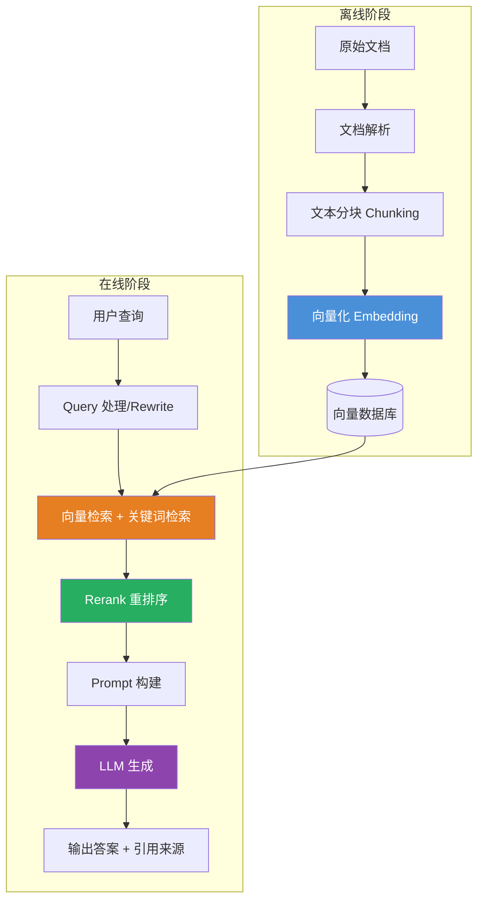

# RAG（检索增强生成）

## 一、定义

RAG（Retrieval-Augmented Generation，检索增强生成）是一种将**信息检索**与**大模型生成**相结合的 AI 架构——在 LLM 生成答案之前，先从外部知识库中检索相关文档，再将检索结果与用户问题一起送入模型，让模型基于真实资料生成回答。

> [!quote] 一句话类比
> 传统大模型是**闭卷考试**，答案全靠"记忆"；RAG 是**开卷考试**，先查资料再答题。

---

## 二、为什么出现

RAG 解决 LLM 的三大核心痛点：

| 痛点 | 说明 | RAG 的解法 |
|---|---|---|
| **知识时效性** | 训练数据有截止日期，无法回答截止日期之后的新事件 | 检索外部知识库，实时补充最新信息 |
| **幻觉问题** | 模型"一本正经地胡说八道"，生成看似合理但实际错误的内容 | 答案基于检索到的真实文档，可溯源，幻觉率可从 30%+ 降至 5% 以下 |
| **私有数据不可达** | 企业内部文档、客户数据无法被公开模型访问 | 数据存本地，推理时检索相关片段，数据不出企业 |

> [!important] 核心逻辑
> LLM 的知识是"冻结"在训练截止日的，而现实世界每天都在更新。RAG 的本质是给 LLM 装了一个**外挂硬盘**——需要什么知识，当场去查。

---

## 三、核心思想

RAG 的核心思想可以概括为 **"检索 + 增强 + 生成"三步走**：

1. **检索（Retrieval）**：将用户问题向量化，在向量数据库中通过相似度计算找到最相关的 Top-K 文档片段
2. **增强（Augmentation）**：将检索到的文档片段与用户问题拼接，构建增强后的上下文 Prompt
3. **生成（Generation）**：LLM 基于增强后的上下文生成最终答案，答案可追溯至具体来源

**本质**：通过外部信息的动态注入，弥补生成模型在知识广度和时效性上的不足。RAG 不改变模型参数，而是改变模型的**输入**——从"裸问题"变成"问题 + 相关资料"。

### RAG vs 微调 vs 长上下文

| 维度 | RAG | 微调（SFT） | 长上下文 |
|---|---|---|---|
| **知识存储** | 外部知识库 | 模型参数内部 | 一次性塞入 Prompt |
| **知识更新** | 更新知识库即可 | 重新训练，成本高 | 每次重新传入 |
| **幻觉控制** | 答案可追溯来源 | 模型"凭记忆"回答 | 受限于上下文窗口 |
| **成本** | 低（无训练） | 高（需 GPU 训练） | Token 消耗极大 |
| **延迟** | 中等（检索开销） | 低 | 低 |

---

## 四、工作流程



**离线阶段（索引构建）**：文档加载 → 分块 → 向量化 → 存入向量数据库

**在线阶段（检索生成）**：Query 处理 → 混合检索（向量 + BM25）→ Rerank 精排 → 拼接 Prompt → LLM 生成

> [!note] 关键设计决策
> 每个环节都有 trade-off：Chunk 大小（语义完整 vs 检索精度）、Top-K 值（召回率 vs 噪声）、是否 Rerank（精度 vs 延迟）。

---

## 五、关键技术

### 5.1 文档处理

| 技术 | 说明 |
|---|---|
| **文档解析** | PDF/Word/Markdown/HTML 等多格式解析，PDF 表格和图片提取是难点 |
| **文本分块（Chunking）** | 固定长度、递归分割、语义分割、Parent-Child 四种策略 |
| **元数据提取** | 来源、时间戳、权限、标题等结构化信息 |

### 5.2 Embedding 与向量化

| 技术 | 说明 |
|---|---|
| **Embedding 模型** | BGE-M3、GTE-large、text-embedding-3-large、Jina 等 |
| **向量数据库** | Milvus、Qdrant、Chroma、Weaviate、Pinecone、FAISS |
| **索引算法** | IVF-PQ、HNSW、DiskANN 等近似最近邻搜索（ANN） |

### 5.3 检索策略

|                 技术                 |                      说明                       |
| :--------------------------------: | :-------------------------------------------: |
|     **向量检索（Dense Retrieval）**      |                语义相似度匹配，擅长同义表达                 |
| **关键词检索（Sparse Retrieval / BM25）** |                精确匹配，擅长人名、编号、术语                |
|      **混合检索（Hybrid Search）**       |     BM25 + 向量，取并集后融合（RRF 加权），召回率提升 15-20%     |
|          **Rerank（重排序）**           | Bi-Encoder 粗排 + Cross-Encoder 精排，精度提升最显著的单项优化 |
|         **Query Rewrite**          |            将口语化查询转化为检索友好形式，补全隐含信息             |
|              **HyDE**              |      先让 LLM 生成假设答案，用假设答案的 Embedding 去检索       |

### 5.4 进阶架构

| 架构 | 说明 |
|---|---|
| **Self-RAG** | 模型自我评估检索质量，质量差时自动触发重写或重检 |
| **CRAG（Corrective RAG）** | 检索后评估相关性，不相关则自动纠正（重写查询 / 网络搜索补充） |
| **Graph RAG** | 基于知识图谱的检索，擅长多跳推理和实体关系查询 |
| **Agentic RAG** | 将 Agent 的规划、工具调用能力融入 RAG 流程，支持多步推理 |

### 5.5 主流开发框架

| 框架 | 定位 | 特点 |
|---|---|---|
| **LangChain** | 通用 AI 应用框架 | 生态最丰富，RAG 模块完善 |
| **LlamaIndex** | 专用 RAG 框架 | 数据索引与检索优化，QueryEngine 高层抽象 |
| **Ragas** | RAG 评估框架 | "LLM 监考"自动评估 Faithfulness 等指标 |
| **Dify** | 低代码 RAG 平台 | 可视化构建知识库问答 |
| **FastGPT** | 国产 RAG 平台 | 开箱即用的知识库问答系统 |

---

## 六、优点

- **知识实时更新**：更新知识库无需重训模型，成本低几个数量级
- **幻觉大幅降低**：答案基于真实文档，可溯源，幻觉率从 30%+ 降至 5% 以下
- **私有数据安全**：数据不出企业，只在推理时检索相关片段
- **可解释性强**：输出可标注引用来源，增强用户信任
- **领域适应快**：注入垂直领域文档即可快速构建专业问答系统
- **成本低**：无需 GPU 训练，开发周期短（相比微调）
- **灵活组合**：可与微调、Agent 等技术组合使用

---

## 七、缺点

- **检索质量依赖**：检索到错误或不相关文档，生成结果必然偏离——"垃圾进，垃圾出"
- **额外延迟**：多一次检索 + Rerank，端到端延迟比纯 LLM 高 100-500ms
- **上下文窗口限制**：检索结果过多可能超出模型 Token 上限
- **多跳推理弱**：传统 RAG 是单轮检索，无法处理需要跨文档推理的复杂问题
- **工程复杂度高**：涉及文档解析、分块策略、Embedding 选型、向量库运维、Rerank 调优等
- **评估困难**：需要从检索质量（Recall）和生成质量（Faithfulness）两个维度分别评估
- **长上下文模型的冲击**：Gemini 200 万 Token、Claude 100K 起步，简单场景下长上下文可能更直接

---

## 八、典型应用

### 8.1 企业场景

- **企业知识库问答**：员工问"2023 年财务报告营收增长多少？"→ 检索对应 PDF 段落 → 生成准确答案
- **智能客服**：基于产品手册、FAQ、历史工单的精准问答，大幅降低人工转接率
- **合规审查**：检索法规条文 → 对照合同条款 → 生成合规分析报告
- **医疗辅助**：检索最新医学文献 → 结合病例 → 辅助诊断建议

### 8.2 开发者场景

- **代码库问答**：检索代码仓库 → 生成 API 使用说明、Bug 修复建议
- **技术文档助手**：检索框架文档 → 回答"如何在 Spring AI 中配置 Milvus？"

### 8.3 个人场景

- **个人知识管理**：检索私人笔记、读书摘要 → 回答"我上次关于 XXX 的笔记是什么？"
- **研究辅助**：检索论文库 → 生成文献综述

---

## 九、面试高频问题

### Q1：什么是 RAG？它解决了大模型的哪些痛点？

**三句话回答**：RAG 是"检索 + 增强 + 生成"的混合架构。解决三大痛点：① 知识时效性（训练数据截止后的新知识无法获取）② 幻觉问题（没有依据时"编造"答案）③ 私有数据访问（企业内部数据模型不可见）。

**加分点**：能说出 RAG 演进历程：Naive RAG → Advanced RAG（Rerank + Query Rewrite）→ Modular RAG → Graph RAG → Agentic RAG。

### Q2：RAG 和微调（Fine-tuning）有什么区别？什么时候用哪个？

| 维度 | RAG | 微调 |
|---|---|---|
| 原理 | 知识存外部，推理时检索 | 知识存模型参数内部 |
| 知识更新 | 更新知识库，秒级 | 重新训练，天级 + GPU |
| 成本 | 低 | 高 |
| 风格适配 | 不改变 | 可改变 |

**选型**：知识频繁更新 / 需要引用来源 / 私有数据 → RAG；需要改变风格 / 领域格式适配 → 微调；**最佳实践是 RAG + 微调组合**。

### Q3：RAG 的完整工作流程是什么？

**离线（索引阶段）**：文档加载 → 文本分块 → 向量化（Embedding）→ 存入向量数据库 + 元数据索引

**在线（检索生成阶段）**：Query 处理（Rewrite / HyDE）→ 混合检索（BM25 + 向量）→ Rerank 精排 → Prompt 构建 → LLM 生成答案

**加分点**：能说出每个步骤的 trade-off——Chunk 大小、K 值选择、Rerank 成本等。

### Q4：Chunk 策略怎么选？不同策略的 trade-off 是什么？

| 策略 | 适用场景 | 核心 trade-off |
|---|---|---|
| 固定长度 | 快速原型 | 简单但可能截断语义 |
| 递归分割 | 通用问答（推荐默认） | 尽量保持语义完整性 |
| 语义分割 | 法律/医疗高精度 | 质量最高但计算成本最高 |
| Parent-Child | 长文档问答（最佳实践） | 小 Chunk 检索 + 大 Chunk 生成 |

**Chunk Size trade-off**：大 Chunk 保留更多上下文但引入噪声 + 消耗 Token；小 Chunk 检索精度高但可能丢失上下文。**Overlap** 防止关键信息被切分到边界处丢失。

### Q5：如何提升 RAG 的检索准确率？

**优化优先级**（从高到低）：

1. **混合检索（Hybrid Search）**：BM25 + 向量，召回率提升 15-20%
2. **Rerank（重排序）**：Cross-Encoder 精排，精确率提升 20-30%
3. **Query Rewrite / HyDE**：优化查询表达
4. **优化 Chunk 策略**：选对大小和 Overlap
5. **升级 Embedding 模型**：BGE-M3、GTE-large 等
6. **多路召回**：向量 + 关键词 + 知识图谱
7. **自适应检索**：Self-RAG / CRAG

### Q6：如何评估 RAG 系统的质量？

**RAG Triad（Ragas 框架）**：

- **Faithfulness（忠实度）**：答案是否忠实于检索到的上下文（目标 > 95%），**最关键指标**
- **Answer Relevancy（答案相关性）**：是否真正回答了用户问题
- **Context Recall（上下文召回率）**：检索到的上下文是否包含回答问题所需的全部信息

**检索指标**：Recall@K、MRR、NDCG、Precision@K

### Q7：Graph RAG 和传统 RAG 有什么区别？

| 维度 | 传统 RAG | Graph RAG |
|---|---|---|
| 数据结构 | 向量（扁平化文档片段） | 知识图谱（实体 + 关系） |
| 检索方式 | 向量相似度 | 图遍历 + 实体链接 |
| 多跳推理 | 弱，单轮检索 | 强，可沿关系多跳检索 |
| 适用场景 | 事实性问答 | 关系推理、全局摘要 |

**典型场景**：传统 RAG 擅长"什么是 XX"；Graph RAG 擅长"XX 和 YY 之间有什么关系？"

### Q8：Self-RAG 和 CRAG 的核心思想是什么？

**Self-RAG**：模型在生成过程中自我评估——检索到的内容是否相关？是否需要重新检索？是否需要补充信息？通过特殊的 Reflection Token 控制检索和生成行为。

**CRAG（Corrective RAG）**：检索后先评估相关性，不相关则自动纠正——尝试 Query Rewrite 重试，或直接转向网络搜索补充。核心是"先判断质量，再决定下一步"。

### Q9：长上下文窗口越来越大，RAG 还有必要吗？

**有必要。** 原因：

1. **成本**：长上下文意味着每次推理都要处理大量 Token，成本是 RAG 的 10-100 倍
2. **注意力稀释**：上下文越长，模型对关键信息的注意力越分散（"Lost in the Middle" 现象）
3. **延迟**：长上下文的 Prefill 阶段延迟远高于 RAG 的检索延迟
4. **可解释性**：RAG 可精确标注引用来源，长上下文难以追溯

**结论**：长上下文适用于一次性小规模文档分析；RAG 适用于大规模知识库的持续问答。

---

## 十、相关知识

- [[LLM 大语言模型]] — RAG 的生成引擎基础
- [[Agent]] — Agentic RAG 将 Agent 能力融入 RAG
- [[Embedding 向量嵌入]] — RAG 检索的核心技术
- [[向量数据库]] — Milvus、Qdrant、Chroma 等
- [[模型幻觉]] — RAG 检索器可封装为 Tool，让 LLM 按需调用，实现 Agentic RAG
- [[Prompt Engineering 提示词工程]] — RAG 的 Prompt 构建策略
- [[Fine-tuning 微调]] — RAG 的互补技术路线
- [[Graph RAG 知识图谱增强检索]] — 基于知识图谱的进阶 RAG
- [[Ragas RAG 评估框架]] — RAG 系统的自动化评估

---

## 十一、代码示例

### 基于 LangChain 构建 RAG 问答系统

```python
import os
from langchain_openai import ChatOpenAI, OpenAIEmbeddings
from langchain_community.document_loaders import PyPDFLoader, TextLoader
from langchain_text_splitters import RecursiveCharacterTextSplitter
from langchain_community.vectorstores import Chroma
from langchain.chains import RetrievalQA
from langchain.prompts import PromptTemplate

# ========== 离线阶段：构建索引 ==========

# 1. 加载文档
loader = PyPDFLoader("knowledge_base.pdf")  # 支持 PDF/Text/Markdown
documents = loader.load()

# 2. 文本分块（递归分割，推荐默认策略）
text_splitter = RecursiveCharacterTextSplitter(
    chunk_size=512,        # 每块 512 tokens
    chunk_overlap=50,      # 重叠 50 tokens，防止语义截断
    separators=["\n\n", "\n", "。", "，", " ", ""]  # 优先按段落切分
)
chunks = text_splitter.split_documents(documents)
print(f"共 {len(chunks)} 个 Chunk")

# 3. 向量化 + 存入向量数据库
embeddings = OpenAIEmbeddings(model="text-embedding-3-large")
vectorstore = Chroma.from_documents(
    documents=chunks,
    embedding=embeddings,
    persist_directory="./chroma_db",  # 持久化存储
    collection_name="my_knowledge_base"
)

# ========== 在线阶段：检索生成 ==========

# 4. 构建带约束的 Prompt
prompt_template = """你是一个基于知识库的问答助手。请严格根据以下资料回答问题。
如果资料中没有相关信息，请直接回答"我没有找到相关信息"，不要编造。

资料：
{context}

问题：{question}

回答："""

PROMPT = PromptTemplate(
    template=prompt_template,
    input_variables=["context", "question"]
)

# 5. 创建 RAG 链
llm = ChatOpenAI(model="gpt-4o", temperature=0)
qa_chain = RetrievalQA.from_chain_type(
    llm=llm,
    chain_type="stuff",          # 将所有检索结果拼接后送入 LLM
    retriever=vectorstore.as_retriever(
        search_type="similarity",
        search_kwargs={"k": 5}   # 检索 Top-5 最相关文档
    ),
    chain_type_kwargs={"prompt": PROMPT},
    return_source_documents=True,  # 返回引用来源
)

# 6. 提问
question = "公司2023年的营收增长是多少？"
result = qa_chain.invoke({"query": question})

print(f"答案: {result['result']}")
print(f"来源: {[doc.metadata.get('source') for doc in result['source_documents']]}")
```

### 基于 LlamaIndex 构建 RAG（更简洁）

```python
from llama_index.core import (
    VectorStoreIndex, SimpleDirectoryReader, Settings
)
from llama_index.llms.openai import OpenAI
from llama_index.embeddings.openai import OpenAIEmbedding

# 配置全局 LLM 和 Embedding 模型
Settings.llm = OpenAI(model="gpt-4o", temperature=0)
Settings.embed_model = OpenAIEmbedding(model="text-embedding-3-large")

# 1. 加载文档目录（自动处理 PDF/Text/Markdown）
documents = SimpleDirectoryReader("./knowledge_docs").load_data()

# 2. 构建索引（自动分块 + 向量化 + 存储）
index = VectorStoreIndex.from_documents(documents)

# 3. 创建查询引擎
query_engine = index.as_query_engine(
    similarity_top_k=5,     # 检索 Top-5
    response_mode="compact" # 紧凑模式：拼接检索结果后生成
)

# 4. 提问
response = query_engine.query("公司2023年的营收增长是多少？")
print(f"答案: {response}")
print(f"来源: {[node.metadata for node in response.source_nodes]}")
```

### 进阶：带 Rerank 的 RAG

```python
from langchain.retrievers import ContextualCompressionRetriever
from langchain_cohere import CohereRerank

# 基础检索器（粗排，取 Top-20）
base_retriever = vectorstore.as_retriever(
    search_type="similarity",
    search_kwargs={"k": 20}
)

# Rerank 压缩器（精排，取 Top-5）
compressor = CohereRerank(
    model="rerank-english-v3.0",
    top_n=5
)

# 两阶段检索器
compression_retriever = ContextualCompressionRetriever(
    base_compressor=compressor,
    base_retriever=base_retriever
)

# 使用带 Rerank 的检索器构建 QA 链
qa_chain = RetrievalQA.from_chain_type(
    llm=llm,
    retriever=compression_retriever,  # 使用 Rerank 检索器
    chain_type_kwargs={"prompt": PROMPT},
    return_source_documents=True,
)
```

---

## 十二、个人理解

RAG 是当前 LLM 落地最务实的方案，没有之一。尽管 2025-2026 年长上下文窗口越来越大，但说"RAG 已死"的人没有理解 RAG 的本质——**RAG 不是上下文窗口不够大的补丁，而是一种架构范式**。

几个关键判断：

1. **RAG 不是过渡方案，而是持久架构**。长上下文模型解决的是"一次性处理大文档"的问题，RAG 解决的是"持续管理动态知识库"的问题。两者的场景完全不同。把 10 万页文档全塞进上下文，不仅成本爆炸，而且模型会"迷路"——注意力分散到无关内容上。

2. **RAG 真正的价值不在检索，在"可追溯"**。企业级应用最核心的需求不是回答得有多聪明，而是"这个回答的依据是什么"。RAG 天然支持引用溯源，这是纯 LLM 和长上下文都做不到的。

3. **大多数 RAG 系统效果差的根本原因，是工程基本功不过关**。Chunk 乱切、Embedding 模型选错、没有 Rerank、Prompt 没有约束"只基于资料回答"——这些基础问题不解决，堆再多高级技术也没用。

4. **Graph RAG 和 Agentic RAG 是正确方向，但不要过早优化**。先跑通 Naive RAG → 加混合检索和 Rerank → 再考虑 Graph RAG。很多团队连基础 RAG 都没做好，就在追 Graph RAG 的热点，这是本末倒置。

5. **RAG + Agent 是 2026 年最值得关注的方向**。Agent 的多轮推理、工具调用、动态规划能力，正好弥补了传统 RAG"单轮检索、多跳推理弱"的短板。Agentic RAG 让检索从"一次性"变成"多轮交互式"——Agent 根据检索结果动态决定下一步是继续检索、换个角度检索、还是直接生成答案。

RAG三板斧：
1.分段打桩，别乱重启
	记住：线上出问题，最蠢的操作就是上来就重启；
		没有高大上的监控也能定位，就卡死三个耗时节点：
			从用户提问到Embedding生成完的耗时，卡了就是编码接口拖后腿；向量库检索的查询耗时，卡了就是召回量太大或索引没建好；大模型Token返回耗时，卡了就是并发打满或Promopt写太满
		标准动作：收告警->查三段耗时->锁定卡点->精准处理，别凭感觉瞎试

2.两级降级，先保能用
	不改代码也能快速降级，分两步走：
			一级降级：先砍召回量，Top10砍成Top3，关掉重排和多余过滤，先把检索耗时打下来
			二级降级：临时跳过RAG检索，切纯大模型通用模式，至少用户能收到回复，不是一直转圈卡死
		降级的核心从来不是“关功能”，是先保“能用”，再谈“好用”

3.超时+限流，守住底线
	不要漏这两个最简单的配置
		1.每一步调用都加超时：Embedding、检索、大模型、超时直接失败，别让一个慢请求拖死整个服务的线程
		2.加基础并发限流：单实例同时处理的对话数卡死上限，超了直接提示稍后重试，别让一波流量直接冲穿这个系统
	这俩都是框架自带的配置，一行代码都不用多写