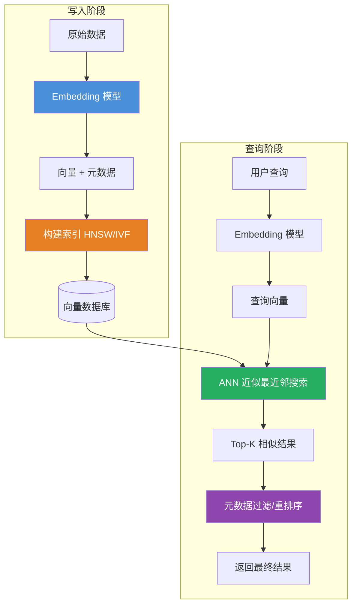

	
# 向量数据库（Vector Database）

## 一、定义

向量数据库是专门用于**存储、索引和查询高维向量数据**的数据库系统，核心能力是通过**近似最近邻搜索（ANN）** 算法，在高维空间中快速找到与查询向量最相似的数据，解决传统数据库无法高效处理语义检索和非结构化数据匹配的痛点。

> [!quote] 一句话类比
> 传统数据库做的是"精确匹配"——"找年龄=25的人"；向量数据库做的是"语义匹配"——"找和这个意思最像的段落"。

---

## 二、为什么出现

### 2.1 传统数据库的"维度诅咒"

关系型数据库的 B-Tree 索引在处理超过 100 维的数据时，索引效率呈指数级下降。以人脸识别为例：当特征维度从 128 维提升到 512 维时，MySQL 的查询延迟从 3ms 飙升至 1.2 秒。这种"维度灾难"使得传统技术在处理 AI 生成的高维数据时完全失效。

### 2.2 大模型时代的"记忆外挂"

| 痛点 | 向量数据库的解法 |
|---|---|
| **LLM 知识时效性**：训练数据截止，无法回答新事件 | 外部知识库向量化，实时检索最新信息注入 LLM |
| **LLM 幻觉问题**：模型"编造"不存在的事实 | 检索真实文档作为生成依据，可溯源 |
| **非结构化数据爆炸**：文本、图像、音频占全球数据 80% 以上 | 通过 Embedding 转化为统一向量，语义检索 |
| **LLM 上下文窗口有限**：GPT-4 的 32K 窗口无法承载企业级知识库 | 向量数据库作为"外部记忆"，只检索最相关的 Top-K 片段 |

> [!important] 本质认知
> 向量数据库是大模型的"海马体"——大模型提供认知能力，向量数据库赋予记忆本能。腾讯云实践显示，结合向量数据库的 RAG 方案使大模型响应速度提升 5 倍，成本降低 70%。

---

## 三、核心思想

向量数据库的核心思想是 **"语义向量化 + 近似最近邻搜索"**：

### 3.1 向量嵌入（Embedding）

将文本、图像、音频等非结构化数据，通过嵌入模型（如 BERT、OpenAI Embedding）映射为高维空间中的向量。**语义相近的数据，向量距离更近**。

```
"苹果很好吃" → [0.23, -0.45, 0.67, ..., 0.12]  (768维)
"这个水果真甜" → [0.25, -0.43, 0.65, ..., 0.14]  (768维)  ← 距离近，语义相似
"今天天气不错" → [-0.78, 0.32, -0.15, ..., -0.55] (768维)  ← 距离远，语义不同
```

### 3.2 近似最近邻搜索（ANN）

全量对比所有向量的复杂度为 O(N)，百万级数据需要秒级。ANN 通过**索引结构**将复杂度降至 O(log N)，实现毫秒级检索，牺牲的精度极小（通常 < 2%）。

### 3.3 距离度量

| 度量方式 | 公式特点 | 适用场景 |
|---|---|---|
| **余弦相似度** | 衡量向量方向，忽略长度，值域 [-1, 1] | 文本语义匹配（最常用） |
| **欧氏距离** | 衡量向量空间直线距离 | 图像特征检索（需归一化） |
| **内积** | 结合长度与方向 | 推荐系统（用户-物品匹配） |
| **汉明距离** | 二值向量逐位比对 | 二值化特征快速匹配 |

---

## 四、工作流程



**标准数据闭环**：

1. **数据预处理**：文本分段、清洗，适配嵌入模型输入
2. **向量生成**：调用 Embedding 模型将文档转为向量
3. **数据入库**：向量 + 元数据 + 原始文档批量写入集合
4. **索引构建**：自动构建 HNSW/IVF 索引，加速检索
5. **查询处理**：用户查询 → 向量化 → ANN 搜索
6. **结果返回**：按相似度排序，返回 Top-K 结果

---

## 五、关键技术

### 5.1 核心索引算法

| 算法 | 原理 | 复杂度 | 适用场景 | 代表实现 |
|---|---|---|---|---|
| **HNSW** | 分层可导航小世界图，多层图结构跳跃搜索 | O(log N) | 高精度实时检索，百万~千万级 | Milvus、Chroma、Weaviate |
| **IVF** | 倒排文件 + K-Means 聚类分区，只搜索最近的几个聚类 | O(√N) | 十亿级大规模数据集 | FAISS、Milvus |
| **PQ（乘积量化）** | 将高维向量分解为多个低维子空间分别量化，压缩比可达 64:1 | O(log N) | 内存受限场景、移动端部署 | FAISS、ScaNN |
| **LSH（局部敏感哈希）** | 哈希函数使得相似向量以高概率落在同一桶中 | O(1) | 快速近似搜索，精度要求不高的场景 | Annoy |
| **DiskANN** | 基于 SSD 的图索引，减少内存占用 | O(log N) | 万亿级数据，内存受限 | Microsoft |

### 5.2 关键优化技术

| 技术 | 说明 |
|---|---|
| **混合搜索（Hybrid Search）** | 向量语义检索 + BM25 关键词检索 + 元数据过滤，多路召回融合排序 |
| **量化压缩** | FP32 → INT8 精度损失 < 2%，内存占用降低 4 倍 |
| **分级缓存** | 热数据驻留 GPU 显存，温数据存内存，冷数据下沉至 NVMe SSD |
| **数据分片** | 基于一致性哈希的横向扩展，支持分布式部署 |
| **流水线并行** | 将索引构建分解为 MapReduce 任务，加速大规模索引构建 |

### 5.3 主流向量数据库对比

| 数据库 | 语言 | 定位 | 核心优势 | 局限性 |
|---|---|---|---|---|
| **Milvus** | Go/C++ | 企业级大规模 | 分布式架构，亿级向量毫秒级检索，CNCF 毕业项目 | 部署复杂，运维成本高 |
| **Qdrant** | Rust | 高性能轻量 | Rust 内存安全，单机可处理 10 亿向量，API 清晰 | 分布式性能不如 Milvus |
| **Chroma** | Python | 开发者友好 | 零配置开箱即用，3 行代码上手，LangChain 原生集成 | 大规模性能有限，无原生分布式 |
| **Weaviate** | Go | 混合搜索 | GraphQL 原生，内置向量化模块，BM25+向量混合搜索 | GraphQL 有学习曲线，配置复杂 |
| **Pinecone** | 商业闭源 | 云服务 | 免运维，自动扩缩，按量付费 | 价格较高，数据必须上云 |
| **FAISS** | C++/Python | 算法库 | Meta 开源，GPU 加速极致性能，算法最丰富 | 不是完整 DBMS，缺乏持久化/并发管理 |
| **pgvector** | C | PostgreSQL 扩展 | 与现有 PG 生态无缝集成，SQL 直接查询向量 | 性能不如专用向量数据库 |

### 5.4 选型建议

| 数据规模 | 实时性要求 | 推荐方案 |
|---|---|---|
| < 100 万 | 低 | Chroma（本地原型） |
| 100 万 - 1000 万 | 中 | Qdrant 单节点 / pgvector |
| 1000 万 - 10 亿 | 高 | Milvus 集群 |
| > 10 亿 | 极高 | Milvus 分布式 + 定制架构 |

---

## 六、优点

- **毫秒级语义检索**：ANN 算法将检索复杂度从 O(N) 降至 O(log N)，百万级向量检索 < 10ms
- **非结构化数据处理**：文本、图像、音频统一转化为向量，同一套接口处理所有模态
- **语义理解能力**：基于向量相似度而非关键词匹配，真正理解"意思相近"而非"字面相同"
- **水平扩展性强**：Milvus 等支持分布式分片，可扩展至千亿级向量
- **与 LLM 生态无缝集成**：LangChain、LlamaIndex、Dify 等主流 AI 框架原生支持
- **混合查询能力**：向量检索 + 元数据过滤 + 关键词匹配，多维度精准召回
- **实时更新**：支持动态增删改向量，无需重建全量索引

---

## 七、缺点

- **精确度 vs 速度的权衡**：ANN 本质是"近似"搜索，牺牲约 1-5% 的精度换取百倍速度提升。对精度要求极高的场景仍需全量比对
- **运维复杂度**：Milvus 等企业级方案部署涉及多个微服务组件（ETCD、MinIO、Pulsar），学习成本高
- **资源消耗大**：高维向量索引（HNSW）内存占用大，千万级 768 维向量约需 30-60GB 内存
- **维度灾难**：万维以上向量，HNSW 构建时间呈指数增长，索引效率急剧下降
- **距离度量敏感**：选择错误的距离度量（如未归一化直接用欧氏距离）会导致检索结果完全偏离预期
- **数据隐私挑战**：同态加密等隐私保护技术会导致检索速度下降 100 倍以上
- **缺乏统一标准**：各向量数据库 API、索引参数、性能指标互不兼容，迁移成本高
- **冷启动问题**：新知识库初期向量少，语义覆盖不足，检索质量差

---

## 八、典型应用

### 8.1 RAG（检索增强生成）

**流程**：用户提问 → 问题向量化 → 向量数据库检索 Top-K 相关文档 → 拼接 Prompt → LLM 生成答案

**价值**：让 LLM 基于企业私有知识库回答，幻觉率从 30%+ 降至 5% 以下。

### 8.2 语义搜索

**场景**：电商搜索"适合夏天穿的轻薄外套"——传统关键词匹配到"夏天"和"外套"但无法理解"轻薄"；向量搜索能检索到"防晒衣"、"皮肤衣"等语义相近但字面不同的商品。

**效果**：京东实践显示，引入向量搜索后 CTR 提升 23%。

### 8.3 推荐系统

**原理**：用户行为序列 → 向量化 → 在向量数据库中搜索相似用户 → 推荐相似用户喜欢的内容。

**优势**：相比协同过滤，向量推荐能捕捉更深层的语义偏好。

### 8.4 图像/视频检索

**以图搜图**：图像 → CLIP/ViT 向量化 → 向量数据库检索 → 返回相似图片

**视频去重**：视频关键帧 → 向量化 → 检测重复/相似视频

### 8.5 多模态应用

- **自动驾驶**：激光雷达点云 + 摄像头图像 + GPS 轨迹联合向量化，相似路况案例快速匹配
- **医疗影像**：DICOM 图像 → ResNet 特征向量 → 构建病例相似性图谱 → 辅助诊断罕见病
- **蛋白质结构预测**：AlphaFold 将 3D 结构编码为 1024 维向量，加速新药研发周期 40%

### 8.6 金融风控

**用户画像**（500+ 维度）+ 交易图谱（300+ 关系）→ 向量化 → 微秒级识别洗钱模式，替代 Oracle Exadata 节省 85% 硬件投入。

---

## 九、面试高频问题

### Q1：向量数据库和传统数据库的核心区别是什么？

| 维度 | 传统数据库（MySQL/PostgreSQL） | 向量数据库（Milvus/Chroma） |
|---|---|---|
| **存储对象** | 结构化数据（行、列） | 高维向量 + 元数据 + 原文 |
| **检索方式** | 精确匹配、模糊查询（B-Tree） | 语义相似性检索（ANN） |
| **索引结构** | B-Tree / B+Tree | HNSW / IVF / PQ |
| **适用场景** | 事务处理、精确查询 | RAG、推荐、图像检索、语义搜索 |
| **高维数据处理** | 100 维以上性能指数级下降 | 768-1536 维毫秒级响应 |

**核心区别**：传统数据库做"精确匹配"，向量数据库做"语义匹配"。前者回答"是否相等"，后者回答"有多相似"。

### Q2：ANN（近似最近邻搜索）和精确最近邻搜索有什么区别？为什么用 ANN？

| 维度 | 精确搜索（KNN） | 近似搜索（ANN） |
|---|---|---|
| **复杂度** | O(N × D) | O(log N) |
| **百万级检索耗时** | 秒级 | 毫秒级（< 10ms） |
| **精度** | 100%（返回真实最近邻） | 95-99%（损失 1-5%） |
| **适用场景** | N < 1 万 | N > 10 万 |

**为什么用 ANN**：当 N = 100 万、D = 768 时，精确搜索需要计算 7.68 亿次浮点乘法，耗时数秒。ANN 通过索引结构将搜索空间从 100 万缩减到几百个候选，实现毫秒级检索。损失 1-5% 的精度换取 100-1000 倍的速度提升，在绝大多数 AI 场景下完全可接受。

### Q3：HNSW 索引的原理是什么？

**HNSW（Hierarchical Navigable Small World）** 是分层可导航小世界图：

1. **分层结构**：顶层节点少（长距离跳跃），底层节点多（精细搜索）
2. **搜索过程**：从顶层开始，逐层下降，每层找到局部最近邻，最后在底层精确搜索
3. **关键参数**：`M`（每节点最大连接数，平衡精度和内存）、`efConstruction`（构建时搜索宽度）、`efSearch`（查询时搜索宽度）

**类比**：HNSW 像高速公路系统——顶层是"高速路"（少节点，快速跨越），底层是"街道"（多节点，精确定位）。从高速到街道逐层接近目标。

**优势**：高精度 + 低延迟 + 支持动态增删，是当前最主流的向量索引算法。

### Q4：为什么向量检索要结合元数据过滤？

**纯向量检索的局限**：向量相似度只反映语义相似性，无法表达结构化约束。例如"搜索 2024 年发布的 AI 相关论文"——纯向量检索可能返回 2023 年或非 AI 领域的论文，因为它们在语义空间中也接近。

**混合检索策略**：
1. **前置过滤**：先按元数据过滤（`year=2024, category='AI'`），再在过滤后的子集中做向量检索。适合过滤条件严格、数据量大的场景。
2. **后置过滤**：先向量检索 Top-K，再按元数据过滤。适合过滤条件宽松的场景。
3. **融合排序**：向量相似度分 + 元数据匹配分，加权排序。

### Q5：Milvus、Qdrant、Chroma 怎么选？

| 场景 | 推荐 | 理由 |
|---|---|---|
| **个人学习/原型验证** | Chroma | 零配置，`pip install` 即用，3 行代码上手 |
| **中小团队/RAG 应用** | Qdrant | Rust 高性能，单机千万级，部署简单，API 清晰 |
| **企业级/大规模生产** | Milvus | 分布式架构，亿级→千亿级，CNCF 毕业，生态成熟 |
| **已有 PostgreSQL** | pgvector | 零额外运维，SQL 直接查询，与现有系统无缝集成 |
| **不想管运维** | Pinecone/Zilliz Cloud | 免运维云服务，按量付费，自动扩缩 |

### Q6：余弦相似度和欧氏距离的区别？什么时候用哪个？

| 维度 | 余弦相似度 | 欧氏距离 |
|---|---|---|
| **衡量什么** | 向量方向（角度） | 向量空间距离 |
| **值域** | [-1, 1] | [0, +∞) |
| **受向量长度影响** | 不受（归一化到方向） | 受影响 |
| **适用场景** | 文本语义匹配（词频差异大） | 图像特征（已归一化） |

**选型原则**：文本场景默认用余弦相似度（因为文本向量长度受词频影响大，但语义取决于方向而非长度）；图像特征已归一化时可用欧氏距离。

**常见错误**：未归一化就用欧氏距离——"苹果很好吃"重复 10 遍得到的向量长度会变大，欧氏距离会认为它跟原句"不相似"，但语义完全一致。

### Q7：向量数据库在 RAG 中的作用是什么？

RAG 的三大核心环节中，向量数据库承担"检索"环节：

1. **离线**：文档 → 分块 → Embedding → 向量数据库
2. **在线**：用户问题 → Embedding → 向量数据库检索 Top-K → 拼接 Prompt → LLM 生成

向量数据库的检索质量直接决定 RAG 的上限——"巧妇难为无米之炊"，检索不到正确文档，LLM 再强也生成不出正确答案。**RAG 的瓶颈 80% 在检索环节，而非生成环节。**

### Q8：什么是向量数据库的"维度灾难"？

维度灾难（Curse of Dimensionality）：随着向量维度增加，数据在高维空间中的分布变得极其稀疏，所有点之间的距离趋于相等，相似度计算失去区分度。

**具体表现**：
- 索引构建时间指数增长
- 检索精度急剧下降
- 所需存储空间爆炸

**缓解方案**：
- PCA 降维（保留 95% 方差）
- 乘积量化（PQ）压缩
- 选择更适合高维场景的索引算法（如 DiskANN）

---

## 十、相关知识

- [[RAG 检索增强生成]] — 向量数据库是 RAG 的核心检索基础设施
- [[Agent]] — Agent 的工具调用和记忆系统依赖向量数据库
- [[Embedding 向量嵌入]] — 向量数据库的数据来源，Embedding 模型质量决定检索上限
- [[Transformer]] — Embedding 模型（BERT 等）的底层架构
- [[LangChain 与 LangGraph]] — Chroma/Milvus 等向量数据库的 LangChain 集成
- [[LLM 大语言模型]] — 向量数据库服务的最终消费者
- [[Prompt Engineering 提示词工程]] — RAG 的 Prompt 拼接依赖向量检索结果
- [[近似最近邻搜索 ANN]] — 向量数据库的核心算法

---

## 十一、代码示例

### Chroma：最简上手（3 行代码）

```python
import chromadb

# 1. 创建客户端和集合
client = chromadb.PersistentClient(path="./chroma_db")
collection = client.get_or_create_collection("my_knowledge")

# 2. 插入数据
collection.add(
    documents=[
        "向量数据库是专门存储高维向量的数据库系统",
        "RAG 是检索增强生成，结合检索和生成解决幻觉问题",
        "HNSW 是分层可导航小世界图，最主流的向量索引算法",
    ],
    metadatas=[
        {"topic": "向量数据库", "source": "百科"},
        {"topic": "RAG", "source": "论文"},
        {"topic": "算法", "source": "论文"},
    ],
    ids=["doc_1", "doc_2", "doc_3"],
)

# 3. 语义检索
results = collection.query(
    query_texts=["什么是向量索引算法？"],
    n_results=2,
)
for doc, dist in zip(results["documents"][0], results["distances"][0]):
    print(f"[距离={dist:.3f}] {doc}")
```

### Milvus：企业级大规模向量检索

```python
from pymilvus import MilvusClient, DataType

# 1. 连接 Milvus（支持集群模式）
client = MilvusClient(uri="http://localhost:19530")

# 2. 创建 Collection（定义 Schema）
client.create_collection(
    collection_name="knowledge_base",
    dimension=768,          # 向量维度（与 Embedding 模型匹配）
    metric_type="COSINE",   # 余弦相似度
    auto_id=True,           # 自动生成主键
)

# 3. 批量插入数据
import numpy as np
# 模拟 10000 条 768 维向量
vectors = np.random.rand(10000, 768).tolist()
data = [
    {"vector": v, "text": f"文档内容 {i}", "source": "技术文档"}
    for i, v in enumerate(vectors)
]
client.insert(collection_name="knowledge_base", data=data)

# 4. 创建索引（HNSW）
index_params = {
    "index_type": "HNSW",
    "metric_type": "COSINE",
    "params": {"M": 16, "efConstruction": 200},
}
client.create_index(
    collection_name="knowledge_base",
    index_params=index_params,
)

# 5. 加载到内存
client.load_collection("knowledge_base")

# 6. 向量检索
query_vector = np.random.rand(768).tolist()
results = client.search(
    collection_name="knowledge_base",
    data=[query_vector],
    limit=5,                            # Top-5
    output_fields=["text", "source"],   # 返回元数据字段
    search_params={"ef": 64},           # HNSW 查询参数
)
for hits in results:
    for hit in hits:
        print(f"ID={hit['id']}, 距离={hit['distance']:.4f}, 文本={hit['entity']['text']}")
```

### Qdrant：Rust 高性能 Rust 向量检索

```python
from qdrant_client import QdrantClient
from qdrant_client.models import Distance, VectorParams, PointStruct

# 1. 连接 Qdrant
client = QdrantClient(host="localhost", port=6333)

# 2. 创建 Collection
client.create_collection(
    collection_name="docs",
    vectors_config=VectorParams(size=768, distance=Distance.COSINE),
)

# 3. 插入向量
import numpy as np
vectors = np.random.rand(100, 768).tolist()
points = [
    PointStruct(
        id=i,
        vector=v,
        payload={"text": f"文档 {i}", "category": "AI"},
    )
    for i, v in enumerate(vectors)
]
client.upsert(collection_name="docs", points=points)

# 4. 检索
results = client.search(
    collection_name="docs",
    query_vector=np.random.rand(768).tolist(),
    limit=5,
    query_filter={"must": [{"key": "category", "match": {"value": "AI"}}]},  # 元数据过滤
)
for hit in results:
    print(f"ID={hit.id}, 分数={hit.score:.4f}, 数据={hit.payload}")
```

### LangChain 集成向量数据库

```python
from langchain_openai import OpenAIEmbeddings
from langchain_community.vectorstores import Chroma
from langchain_community.document_loaders import TextLoader
from langchain_text_splitters import RecursiveCharacterTextSplitter

# 1. 加载并分块文档
loader = TextLoader("knowledge.txt")
documents = loader.load()
text_splitter = RecursiveCharacterTextSplitter(chunk_size=512, chunk_overlap=50)
chunks = text_splitter.split_documents(documents)

# 2. 向量化并存入 Chroma
embeddings = OpenAIEmbeddings(model="text-embedding-3-large")
vectorstore = Chroma.from_documents(
    documents=chunks,
    embedding=embeddings,
    persist_directory="./chroma_langchain_db",
)

# 3. 检索
retriever = vectorstore.as_retriever(
    search_type="similarity",
    search_kwargs={"k": 5},
)
docs = retriever.invoke("什么是向量数据库？")
for doc in docs:
    print(f"来源: {doc.metadata.get('source')}")
    print(f"内容: {doc.page_content[:200]}...")
    print("---")
```

---

## 十二、个人理解

向量数据库是 AI 基础设施中最被低估、但最不可或缺的一环。它既不像 LLM 那样光鲜，也不像 Agent 那样"智能"，但**没有向量数据库，RAG 就不存在，Agent 的记忆就是空谈，推荐系统就退化为协同过滤**。

几个关键判断：

1. **向量数据库本质上是"索引"，不是"数据库"**。它解决的核心问题是"怎么在高维空间快速找到最近的邻居"，这和传统数据库的"怎么在 B-Tree 上快速找到精确匹配的行"本质上是一类问题。但向量数据库的"数据库"属性（ACID、事务、并发控制）远弱于传统数据库，**当前阶段它更像一个"搜索引擎"而非"数据库"**。

2. **HNSW 是当前最优解，但不是终极答案**。HNSW 在百万~亿级向量范围内表现优异，但它的图结构需要全部加载到内存（内存占用 ≈ 向量数据 × 2-3 倍），千亿级向量时内存成本不可接受。DiskANN 等基于 SSD 的方案正在尝试突破这个瓶颈，未来 3 年的趋势是"内存 + SSD 混合存储"。

3. **Chroma 是入门神器，但不要在生产环境百万级以上数据时用它**。Chroma 的定位是"开发者友好"，它的价值在于让你 3 分钟跑通 RAG Demo。但一旦数据量超过百万、并发超过 10 QPS，就应该迁移到 Qdrant 或 Milvus。**技术选型最大的坑不是"选错了"，而是"选了 Chroma 做 Demo 后就再也没换过"**。

4. **向量数据库正在从"专用"走向"融合"**。PostgreSQL 的 pgvector 扩展、Elasticsearch 的向量检索、Redis 的 RedisVL——传统数据库和搜索引擎都在加入向量检索能力。对于数据量不大的场景，**能用 pgvector 就别多引入一个独立组件**。专用向量数据库的真正价值在"大规模"（亿级以上）和"低延迟"（< 10ms）场景。

5. **向量数据库的终局不是"一个数据库"，而是"AI 应用的操作系统级基础设施"**。未来每个 AI 应用都会有一个向量数据库作为"记忆层"，就像今天每个 Web 应用都有一个关系型数据库。但向量数据库不会替代传统数据库——它们会共存：**传统数据库存"事实"（What），向量数据库存"语义"（Why）**。