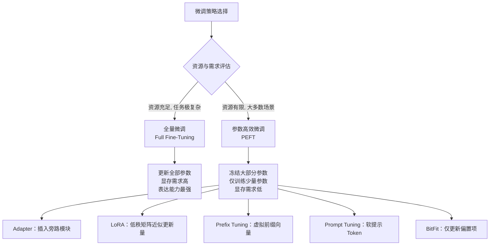
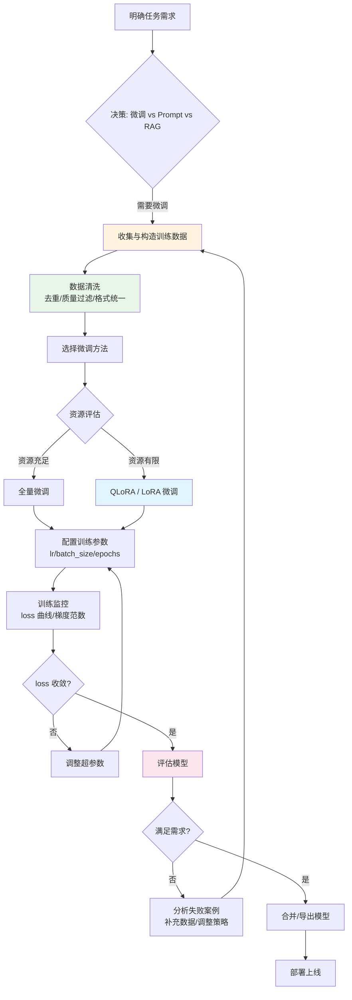
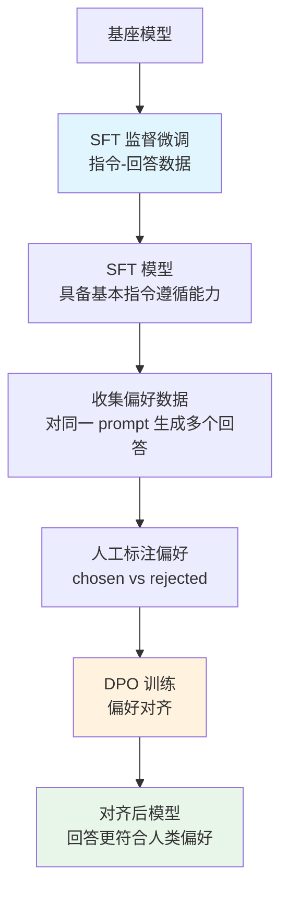
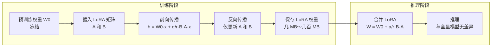
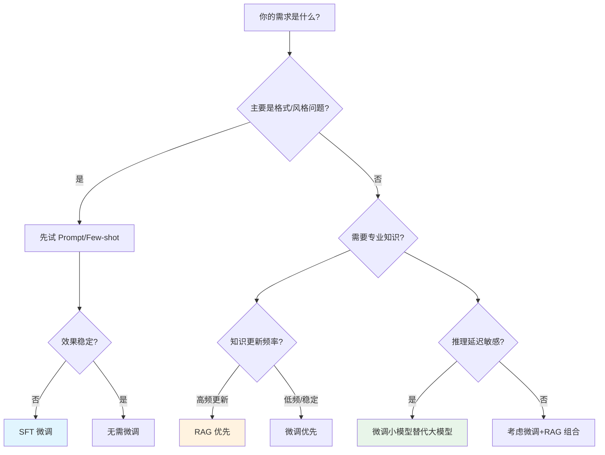

# 微调

## 一、定义

**微调（Fine-Tuning）** 是在已预训练好的大语言模型基础上，使用少量特定任务数据继续训练，使模型适配特定领域、任务或风格。核心逻辑：预训练让模型学习通用语言能力，微调让模型学习特定任务规范、行业术语、输出格式或人类偏好。

> [!important] 一句话区分
> 微调是改模型参数，[[Prompt Engineering 提示词工程|Prompt 工程]]是改输入，[[RAG 检索增强生成|RAG]]是改外部上下文。

## 二、为什么出现

预训练模型掌握了通用语言能力，但存在五个无法通过 Prompt 解决的核心问题：

| 问题 | 表现 | 微调如何解决 |
|------|------|-------------|
| **领域知识匮乏** | 不了解行业术语、内部流程、业务规范 | 用领域数据训练，将专业知识内化到模型参数中 |
| **输出格式不稳定** | 要求 JSON 输出但偶尔格式错误，长文本结构混乱 | 用格式化数据训练，让模型学会稳定输出 |
| **风格难以统一** | 客服、品牌写作需要统一语气，Prompt 控制力有限 | 用风格化数据训练，实现长期稳定的风格内化 |
| **推理成本高** | 每次调用闭源大模型 API 成本高，高频场景不可持续 | 微调小模型替代大模型，本地部署降低成本 |
| **数据隐私合规** | 医疗、金融数据不能发送到第三方 API | 微调后本地部署，数据不出域 |

## 三、核心思想

微调的本质是**在通用能力之上叠加特定能力**，而非从零学习。核心思想分为两个层次：

### 3.1 训练范式对比

| 阶段 | 数据量 | 目标 | 产出 |
|------|--------|------|------|
| **预训练** | 海量（TB 级） | 学习通用语言规律和世界知识 | 通用基座模型 |
| **微调** | 少量（百～万条） | 学习特定任务规范、格式、风格 | 领域专用模型 |
| **对齐** | 偏好数据（千条级） | 学习人类偏好和价值观 | 安全可用模型 |

### 3.2 全量微调 vs 参数高效微调



### 3.3 LoRA 核心原理

LoRA（Low-Rank Adaptation）假设模型微调时的权重更新量 \(\Delta W\) 具有低秩特性，因此不直接更新原权重 \(W_0\)，而是用两个低秩矩阵的乘积来近似：

$$
h = W_0 x + \frac{\alpha}{r} B A x
$$

其中 \(A \in \mathbb{R}^{r \times d_{\text{in}}}\)，\(B \in \mathbb{R}^{d_{\text{out}} \times r}\)，\(r \ll d\)。训练时冻结 \(W_0\)，只更新 \(A\) 和 \(B\)。推理时可将 \(BA\) 合并回 \(W_0\)，==无额外推理延迟==。

> [!note] 关键参数
> - **r（rank）**：低秩空间维度，r=8 是常见起点，复杂任务可到 32-64
> - **α（alpha）**：缩放因子，通常 α=2r，控制 LoRA 更新量相对强度
> - **target_modules**：在哪些层插入 LoRA，常见为 `["q_proj", "v_proj"]` 或全部 Attention 矩阵

### 3.4 QLoRA：量化 + LoRA

QLoRA = **4-bit 量化模型** + **LoRA 适配器**。核心组件：

| 组件 | 作用 |
|------|------|
| **NF4（4-bit NormalFloat）** | 面向正态分布权重设计的 4-bit 量化格式 |
| **双重量化** | 对量化常数再次量化，进一步减少存储 |
| **FP16 LoRA** | LoRA 适配器保持 FP16 精度，保证训练稳定 |
| **分页优化器** | 显存不足时自动将优化器状态卸载到 CPU |

QLoRA 的核心价值：==让消费级 GPU 也能微调大模型==，显存需求相比全量微调降低一个数量级。

### 3.5 SFT vs RLHF vs DPO：训练范式对比

```mermaid
graph TD
    subgraph SFT["监督微调 SFT"]
        A1[指令-回答数据集] --> A2[交叉熵损失<br/>最大化正确回答概率]
        A2 --> A3[教模型"怎么回答"]
    end

    subgraph RLHF["RLHF 三阶段"]
        B1[SFT 训练策略模型] --> B2[训练 Reward Model<br/>人类偏好数据]
        B2 --> B3[PPO 强化学习<br/>优化高奖励回答]
    end

    subgraph DPO["DPO 直接偏好优化"]
        C1[偏好对数据<br/>chosen vs rejected] --> C2[直接优化策略<br/>无需 Reward Model]
        C2 --> C3[取代 PPO 简化流程]
    end

    SFT --> RLHF
    SFT --> DPO
```

| 维度 | SFT | RLHF（PPO） | DPO |
|------|-----|------------|-----|
| **数据需求** | 指令-回答对 | 偏好对 + 奖励模型 | 偏好对（chosen/rejected） |
| **训练模型数** | 1 个 | 4 个（Actor/Critic/RM/Ref） | 2 个（Policy/Ref） |
| **工程复杂度** | 低 | 极高 | 中 |
| **训练稳定性** | 高 | 中（需调参） | 高 |
| **适用场景** | 格式/风格/领域适配 | 复杂偏好对齐 | 大多数对齐场景 |

## 四、工作流程

### 4.1 微调全流程



### 4.2 SFT → DPO 对齐流程



### 4.3 LoRA 训练与推理流程



## 五、关键技术

### 5.1 PEFT 方法体系

| 方法 | 核心思想 | 可训练参数量 | 推理延迟 | 适用场景 |
|------|----------|-------------|----------|----------|
| **LoRA** | 低秩矩阵近似更新量 | ~0.1%-1% | 无（可合并） | 主流方案，通用性强 |
| **QLoRA** | 4-bit 量化 + LoRA | ~0.1%-1% | 无（可合并） | 消费级 GPU 微调 |
| **Adapter** | 插入旁路模块 | ~1%-5% | 略有增加 | 多任务切换 |
| **Prefix Tuning** | 虚拟前缀向量 | ~0.01% | 占用上下文 | 控制输出行为 |
| **Prompt Tuning** | 软提示 Token | ~0.001% | 占用上下文 | 大模型效果才好 |
| **BitFit** | 仅更新偏置项 | ~0.01% | 无 | 简单任务 |
| **IA3** | 缩放激活值向量 | ~0.01% | 极小 | 轻量适配 |

### 5.2 LoRA 配置详解

```python
from peft import LoraConfig

LoraConfig(
    r=16,                    # rank: 低秩维度，r=8 是常见起点
    lora_alpha=32,           # 缩放因子，通常 alpha=2*r
    target_modules=[         # 在哪些层插入 LoRA
        "q_proj", "k_proj", "v_proj", "o_proj",  # Attention 矩阵
        "gate_proj", "up_proj", "down_proj",       # MLP 层（可选）
    ],
    lora_dropout=0.05,       # Dropout 防止过拟合
    bias="none",             # 不训练 bias
    task_type="CAUSAL_LM",  # 自回归语言模型
)
```

**target_modules 选择指南**：
- 最小配置：`["q_proj", "v_proj"]` —— 最小参数量，基础效果
- 标准配置：`["q_proj", "k_proj", "v_proj", "o_proj"]` —— 推荐起点
- 全面配置：标准配置 + `["gate_proj", "up_proj", "down_proj"]` —— 最强表达力

**rank 选择指南**：
- r=8：通用任务，快速实验
- r=16：标准推荐，性价比高
- r=32：代码/专业领域任务
- r=64：数学推理等高复杂度任务

### 5.3 训练优化技术

| 技术 | 作用 | 使用场景 |
|------|------|----------|
| **梯度累积** | 模拟大 batch size，降低单步显存 | 显存不足时 |
| **混合精度（BF16/FP16）** | 减少显存和计算量 | BF16 比 FP16 更稳定 |
| **梯度检查点** | 以计算换显存，不缓存所有激活值 | 长文本/大模型 |
| **Flash Attention** | 优化注意力计算，降低显存和加速 | 标配 |
| **LoRA+** | A 和 B 使用不同学习率 | 提升收敛速度 |

### 5.4 主流训练框架

| 框架 | 定位 | 核心优势 | 适合人群 |
|------|------|----------|----------|
| **HuggingFace PEFT** | 官方 PEFT 库 | 标准化，兼容性好 | 需要最大灵活性的开发者 |
| **TRL** | 对齐训练库 | SFTTrainer / DPOTrainer 开箱即用 | 做 SFT 和偏好对齐 |
| **LLaMA-Factory** | 一站式微调 | Web UI + 多模型支持 | 不想写代码的用户 |
| **Axolotl** | 配置式微调 | YAML 配置，批量实验友好 | 需要大量实验 |
| **Unsloth** | 优化加速 | 训练速度快，显存优化 | 追求速度和低门槛 |

### 5.5 学习率参考

| 方法 | 常见学习率范围 |
|------|---------------|
| 全量微调 | 1e-5 ~ 5e-5 |
| LoRA | 1e-4 ~ 5e-4 |
| QLoRA | 1e-4 ~ 3e-4 |
| DPO | 1e-6 ~ 1e-5 |

## 六、优点

- **领域深度适配**：将专业知识内化到模型参数中，不是每次靠 Prompt 或检索片段临时拼凑，效果更稳定
- **输出格式稳定**：微调后模型能稳定输出 JSON、表格、特定格式，Prompt 对格式的控制力远不如微调
- **长期风格一致性**：客服、品牌写作等场景需要数月如一日的稳定风格，微调比 Prompt 更适合长期保持
- **降低推理成本**：一个在特定任务上微调过的 7B 模型，有时可以替代 70B 通用模型，推理成本大幅降低
- **数据不出域**：微调后可本地部署，满足医疗、金融等场景的合规要求
- **推理延迟可控**：本地部署消除网络延迟和 API 排队，适合实时交互场景
- **LoRA 可插拔**：不同任务训练不同 LoRA 适配器，推理时动态切换，一个基座模型服务多个场景
- **训练成本可控**：QLoRA 让消费级 GPU 也能微调 7B-70B 模型，降低硬件门槛

## 七、缺点

- **数据门槛高**：需要收集、清洗、标注数百到数万条高质量数据，数据质量直接决定微调效果
- **灾难性遗忘**：过度微调可能导致模型丢失通用能力，需要混合通用数据或控制训练轮次来缓解
- **算力与时间成本**：即使 QLoRA 降低了门槛，微调仍然需要 GPU 和时间，不适合零成本快速验证
- **过拟合风险**：数据量少或质量差时容易过拟合，表现为训练集效果好但泛化差
- **知识更新困难**：微调后模型知识固化在训练时点，需要知识更新时需重新微调，不如 RAG 灵活
- **调参复杂**：LoRA 的 r、α、target_modules、学习率、epochs 等超参数组合多，需要经验
- **评估困难**：微调效果不像分类任务有明确指标，需要人工评估或使用 LLM-as-Judge，成本高
- **跨任务迁移差**：针对任务 A 微调的模型，在任务 B 上可能表现不佳，需要多任务微调或 LoRA 切换
- **RLHF 工程复杂**：传统 RLHF 需要同时维护 4 个模型（Actor/Critic/RM/Ref），DPO 简化了但仍有门槛

## 八、典型应用

### 8.1 领域专业化

- **医疗**：微调模型学习医学知识，辅助诊断、病历书写、药物推荐
- **法律**：微调模型掌握法律条文、案例检索、合同审查
- **金融**：微调模型学习财务分析、风险评估、合规检查
- **代码**：微调模型学习特定编程语言、框架、代码风格

### 8.2 任务格式化

- **JSON 结构化输出**：微调后稳定输出 JSON，避免格式错误
- **客服话术**：微调输出标准客服流程，统一语气和话术
- **翻译**：微调特定领域术语和翻译风格
- **摘要**：微调特定长度、格式和侧重点的摘要风格

### 8.3 风格对齐

- **品牌写作**：微调模型学习品牌语言风格
- **教育内容**：微调输出适合特定年龄段的教学内容
- **创意写作**：微调学习特定作者或流派的写作风格

### 8.4 对齐训练

- **安全对齐**：DPO 训练让模型拒绝有害请求
- **偏好对齐**：让模型生成更符合人类偏好的回答（更详细、更有帮助）
- **推理增强**：GRPO 等方法提升数学推理、代码推理能力

### 8.5 微调 vs RAG vs Prompt 决策框架



## 九、面试高频问题

### Q1: 什么是微调？和预训练、Prompt 工程有什么区别？

微调是在预训练模型基础上，用少量特定任务数据继续训练，使模型适配特定领域/任务/风格。预训练是从零开始在海量文本上学习通用语言规律，数据量 TB 级。Prompt 工程不改模型参数，只通过精心设计的输入引导模型输出。一句话：预训练学"语言"，微调学"任务"，Prompt 学"怎么问"。

### Q2: 全量微调和 PEFT 的区别？LoRA 的核心思想是什么？

全量微调更新模型全部参数，显存需求高但表达能力最强。PEFT 冻结大部分参数，只训练少量新增参数。LoRA 是 PEFT 的代表方法，核心思想是假设微调时的权重更新量 ΔW 具有低秩特性，因此用两个低秩矩阵 A 和 B 的乘积来近似 ΔW，训练时只更新 A 和 B，推理时可合并回原权重，无额外延迟。公式：h = W₀x + (α/r)·BAx。

### Q3: LoRA 的 r、α、target_modules 分别是什么？如何选择？

r 是低秩维度，r=8 是常见起点，复杂任务可到 32-64；α 是缩放因子，通常 α=2r，控制 LoRA 更新量相对强度；target_modules 决定在哪些层插入 LoRA。最小配置 `["q_proj", "v_proj"]`，标准推荐 `["q_proj", "k_proj", "v_proj", "o_proj"]`，全面配置还加上 MLP 层。选择原则：资源越多、任务越复杂，可以覆盖更多模块和更大的 r。

### Q4: QLoRA 相比 LoRA 多了什么？核心优势是什么？

QLoRA = 4-bit 量化模型 + LoRA。相比 LoRA 多了三个核心组件：NF4（4-bit NormalFloat 量化格式，面向正态分布权重设计）、双重量化（对量化常数再次量化）、分页优化器（显存不足时卸载到 CPU）。核心优势是让消费级 GPU 也能微调大模型，显存需求相比全量微调降低一个数量级。

### Q5: SFT 和 RLHF 分别解决什么问题？DPO 为什么可以替代 PPO？

SFT（监督微调）教模型"怎么回答"——学习格式、风格、领域知识。RLHF（人类反馈强化学习）教模型"什么是更好的回答"——学习人类偏好。传统 RLHF 需要训练 Reward Model 然后用 PPO 优化，需同时维护 4 个模型，工程复杂度极高。DPO 从 RLHF 目标函数出发，将奖励函数隐式表示为策略函数，直接根据偏好数据优化模型，不需要单独训练 Reward Model，也不需要 PPO 循环，将工程复杂度从 4 个模型降到 2 个。

### Q6: 微调、RAG、Prompt 工程如何选择？

从三个维度判断：第一，任务是否需要实时知识——高频更新选 RAG，低频稳定选微调；第二，任务核心是格式/风格问题——先试 Prompt，效果不稳定再微调；第三，推理延迟和成本——高敏感度选微调小模型，不那么敏感选 Prompt+大模型。大多数生产场景是最佳组合：微调控制格式和风格，RAG 提供实时知识，Prompt 做最后兜底。

### Q7: 微调时显存不够怎么办？

五个优化手段：第一，使用 QLoRA（4-bit 量化）替代全量微调，显存降低一个数量级；第二，减小 per-device batch size + 增加梯度累积步数，模拟大 batch size；第三，开启梯度检查点，以计算换显存；第四，减少 target_modules 覆盖范围，从全部模块减到只覆盖 Attention 层；第五，降低 LoRA rank（如从 64 降到 8），减少可训练参数。优先级：QLoRA > 梯度检查点 > 梯度累积 > 减模块 > 降 rank。

### Q8: DPO、ORPO、SimPO、GRPO 分别是什么？如何选择？

DPO 是最基础的偏好对齐方法，用偏好对直接优化策略。ORPO 尝试将 SFT 和偏好优化合为一个阶段。SimPO 用平均 log 概率近似隐式奖励，减少对参考模型的依赖。GRPO（Group Relative Policy Optimization）是强化学习思路，通过群组比较和奖励信号优化模型，尤其适合数学推理和代码推理。选择：常规对齐用 DPO，想简化流程用 ORPO/SimPO，推理增强用 GRPO。数据质量比方法选择更重要。

## 十、相关知识

### 核心关联笔记

- [[LLM 大语言模型]] —— 微调的载体，理解 LLM 架构是理解微调的基础
- [[Transformer]] —— 理解 Attention 机制才能理解 LoRA 的 target_modules 设计
- [[RAG 检索增强生成]] —— 微调与 RAG 是互补关系，微调控制能力，RAG 提供知识
- [[Prompt Engineering 提示词工程]] —— 微调前先尝试 Prompt，Prompt 是成本最低的优化手段
- [[Embedding 向量嵌入]] —— 微调可能改变 Embedding 分布，影响下游检索效果
- [[向量数据库]] —— 微调+RAG 组合中，向量数据库是 RAG 的存储基础设施
- [[Agent]] —— 微调是提升 Agent 规划/工具调用/推理能力的核心手段
- [[Function Calling 函数调用]] —— 微调可提升模型 Function Calling 的准确率
- [[Tool Calling 工具调用]] —— 同上，微调让模型更准确地选择和调用工具
- [[模型幻觉]] —— 微调可通过领域知识内化减少幻觉，但过度微调可能引入新幻觉
- [[LangChain-LangGraph]] —— 微调后的模型可在 LangChain/LangGraph 中作为定制 LLM 使用
- [[ReAct 推理框架]] —— 微调可提升模型在 ReAct 循环中的推理和决策质量
- [[Agent记忆机制]] —— 微调可提升模型对记忆的利用效率

### 关键论文

- *LoRA: Low-Rank Adaptation of Large Language Models* (Hu et al., 2021) —— LoRA 原始论文
- *QLoRA: Efficient Finetuning of Quantized LLMs* (Dettmers et al., 2023) —— 4-bit 量化 + LoRA
- *Training Language Models to Follow Instructions* (Ouyang et al., 2022) —— InstructGPT，RLHF 奠基
- *Direct Preference Optimization* (Rafailov et al., 2023) —— DPO 原始论文，替代 PPO
- *ORPO: Monolithic Preference Optimization* (Hong et al., 2024) —— SFT+偏好优化单阶段
- *SimPO: Simple Preference Optimization* (Meng et al., 2024) —— 免参考模型的偏好优化

### 关键概念

- **PEFT（Parameter-Efficient Fine-Tuning）**：参数高效微调，只训练少量参数
- **SFT（Supervised Fine-Tuning）**：监督微调，教模型"怎么回答"
- **RLHF（Reinforcement Learning from Human Feedback）**：基于人类反馈的强化学习对齐
- **DPO（Direct Preference Optimization）**：直接偏好优化，简化 RLHF 流程
- **灾难性遗忘（Catastrophic Forgetting）**：过度微调导致模型丢失通用能力
- **LoRA 合并（Merge）**：将 LoRA 权重合并回原模型，消除推理延迟

## 十一、代码示例

### 示例 1: LoRA 微调（PEFT + Transformers）

```python
from transformers import AutoModelForCausalLM, AutoTokenizer, TrainingArguments, Trainer
from peft import LoraConfig, get_peft_model, TaskType
from datasets import Dataset

# 加载模型和分词器
model_name = "Qwen/Qwen2.5-7B-Instruct"
model = AutoModelForCausalLM.from_pretrained(
    model_name,
    torch_dtype="auto",
    device_map="auto",
)
tokenizer = AutoTokenizer.from_pretrained(model_name)

# LoRA 配置
lora_config = LoraConfig(
    r=16,
    lora_alpha=32,
    target_modules=["q_proj", "k_proj", "v_proj", "o_proj"],
    lora_dropout=0.05,
    bias="none",
    task_type=TaskType.CAUSAL_LM,
)

model = get_peft_model(model, lora_config)
model.print_trainable_parameters()
# 输出示例: trainable params: 41,943,040 || all params: 7,657,426,944 || trainable%: 0.5477%

# 准备数据
def format_instruction(example):
    return {
        "text": f"<|user|>\n{example['instruction']}\n<|assistant|>\n{example['output']}"
    }

train_data = Dataset.from_list([
    {"instruction": "将以下句子翻译成英文：今天天气真好。", "output": "The weather is really nice today."},
    {"instruction": "解释什么是机器学习", "output": "机器学习是人工智能的一个分支..."},
    # ... 更多数据
]).map(format_instruction)

# 训练参数
training_args = TrainingArguments(
    output_dir="./lora-finetuned",
    per_device_train_batch_size=4,
    gradient_accumulation_steps=4,  # 等效 batch_size = 16
    num_train_epochs=3,
    learning_rate=2e-4,
    warmup_ratio=0.03,
    logging_steps=10,
    save_strategy="epoch",
    bf16=True,
    gradient_checkpointing=True,
)

trainer = Trainer(
    model=model,
    args=training_args,
    train_dataset=train_data,
    tokenizer=tokenizer,
)

trainer.train()

# 保存 LoRA 权重
model.save_pretrained("./lora-adapter")
tokenizer.save_pretrained("./lora-adapter")
```

### 示例 2: QLoRA 微调（消费级 GPU 友好）

```python
import torch
from transformers import AutoModelForCausalLM, AutoTokenizer, BitsAndBytesConfig, TrainingArguments, Trainer
from peft import LoraConfig, get_peft_model, prepare_model_for_kbit_training

# 4-bit 量化配置
bnb_config = BitsAndBytesConfig(
    load_in_4bit=True,
    bnb_4bit_use_double_quant=True,
    bnb_4bit_quant_type="nf4",
    bnb_4bit_compute_dtype=torch.bfloat16,
)

# 加载量化模型
model = AutoModelForCausalLM.from_pretrained(
    "Qwen/Qwen2.5-7B-Instruct",
    quantization_config=bnb_config,
    device_map="auto",
    trust_remote_code=True,
)

tokenizer = AutoTokenizer.from_pretrained("Qwen/Qwen2.5-7B-Instruct")

# 为 k-bit 训练准备模型
model = prepare_model_for_kbit_training(model)

# LoRA 配置
lora_config = LoraConfig(
    r=16,
    lora_alpha=32,
    target_modules=["q_proj", "k_proj", "v_proj", "o_proj", "gate_proj", "up_proj", "down_proj"],
    lora_dropout=0.05,
    bias="none",
    task_type="CAUSAL_LM",
)

model = get_peft_model(model, lora_config)
model.print_trainable_parameters()

# 训练参数（QLoRA 推荐）
training_args = TrainingArguments(
    output_dir="./qlora-finetuned",
    per_device_train_batch_size=2,
    gradient_accumulation_steps=8,
    num_train_epochs=3,
    learning_rate=2e-4,
    fp16=False,
    bf16=True,
    logging_steps=10,
    save_strategy="epoch",
    optim="paged_adamw_8bit",  # QLoRA 推荐优化器
    gradient_checkpointing=True,
    max_grad_norm=0.3,
    warmup_ratio=0.03,
    lr_scheduler_type="cosine",
)

trainer = Trainer(
    model=model,
    args=training_args,
    train_dataset=train_data,
    tokenizer=tokenizer,
)

trainer.train()

# 保存并合并模型（可选）
model.save_pretrained("./qlora-adapter")

# 合并 LoRA 权重到原模型（消除推理延迟）
from peft import PeftModel
base_model = AutoModelForCausalLM.from_pretrained("Qwen/Qwen2.5-7B-Instruct")
merged_model = PeftModel.from_pretrained(base_model, "./qlora-adapter")
merged_model = merged_model.merge_and_unload()
merged_model.save_pretrained("./merged-model")
```

### 示例 3: SFT with TRL

```python
from datasets import Dataset
from trl import SFTTrainer, SFTConfig
from transformers import AutoModelForCausalLM, AutoTokenizer

model = AutoModelForCausalLM.from_pretrained("Qwen/Qwen2.5-7B-Instruct")
tokenizer = AutoTokenizer.from_pretrained("Qwen/Qwen2.5-7B-Instruct")

# 指令格式数据
def formatting_func(example):
    return f"<|user|>\n{example['instruction']}\n\n{example['input']}\n<|assistant|>\n{example['output']}"

train_dataset = Dataset.from_list([
    {"instruction": "翻译", "input": "Hello world", "output": "你好世界"},
    {"instruction": "分类", "input": "今天心情很好", "output": "情感：正面"},
    # ... 更多数据
])

sft_config = SFTConfig(
    output_dir="./sft-model",
    per_device_train_batch_size=4,
    gradient_accumulation_steps=4,
    num_train_epochs=3,
    learning_rate=2e-4,
    warmup_ratio=0.03,
    logging_steps=10,
    save_strategy="epoch",
    bf16=True,
    max_seq_length=2048,
    packing=True,  # 将多条短样本打包到同一序列，提升训练效率
)

trainer = SFTTrainer(
    model=model,
    args=sft_config,
    train_dataset=train_dataset,
    tokenizer=tokenizer,
    formatting_func=formatting_func,
)

trainer.train()
trainer.save_model("./sft-model")
```

### 示例 4: DPO 偏好对齐（TRL）

```python
from datasets import Dataset
from trl import DPOTrainer, DPOConfig
from transformers import AutoModelForCausalLM, AutoTokenizer

# 加载 SFT 后的模型作为策略模型
model = AutoModelForCausalLM.from_pretrained("./sft-model")
tokenizer = AutoTokenizer.from_pretrained("./sft-model")

# 加载参考模型（通常是 SFT 模型，DPO 期间冻结）
ref_model = AutoModelForCausalLM.from_pretrained("./sft-model")

# 偏好数据格式
dpo_dataset = Dataset.from_list([
    {
        "prompt": "如何健康减肥？",
        "chosen": "科学减肥需要结合合理饮食和适量运动。建议每天摄入...",
        "rejected": "你可以试试三天断食法，只喝水不吃东西。",
    },
    {
        "prompt": "能帮我写一封辞职邮件吗？",
        "chosen": "当然可以，以下是一封专业的辞职邮件模板：\n尊敬的领导...",
        "rejected": "我受够了，明天不来了。",
    },
    # ... 更多偏好数据
])

dpo_config = DPOConfig(
    output_dir="./dpo-model",
    per_device_train_batch_size=2,
    gradient_accumulation_steps=8,
    num_train_epochs=1,  # DPO 通常 1-2 个 epoch 足够
    learning_rate=5e-6,  # DPO 学习率通常比 SFT 低
    beta=0.1,  # KL 正则化系数，控制偏离参考模型的程度
    warmup_ratio=0.1,
    logging_steps=10,
    save_strategy="epoch",
    bf16=True,
    max_length=2048,
    max_prompt_length=1024,
)

trainer = DPOTrainer(
    model=model,
    ref_model=ref_model,
    args=dpo_config,
    train_dataset=dpo_dataset,
    tokenizer=tokenizer,
)

trainer.train()
trainer.save_model("./dpo-model")
```

### 示例 5: 数据准备与质量过滤

```python
import json
from datasketch import MinHash, MinHashLSH
from typing import List, Dict

def deduplicate_by_similarity(samples: List[Dict], threshold: float = 0.8) -> List[Dict]:
    """基于 MinHash 的近似去重"""
    lsh = MinHashLSH(threshold=threshold, num_perm=128)

    unique_samples = []
    for i, sample in enumerate(samples):
        # 计算 MinHash 签名
        m = MinHash(num_perm=128)
        for word in sample["output"].split():
            m.update(word.encode("utf8"))

        # 查询是否有相似样本
        result = lsh.query(m)
        if not result:
            lsh.insert(i, m)
            unique_samples.append(sample)

    return unique_samples


def filter_low_quality(samples: List[Dict]) -> List[Dict]:
    """过滤低质量微调数据"""
    filtered = []
    for sample in samples:
        output = sample.get("output", "")

        # 过滤条件
        if len(output) < 20:  # 过短的回答
            continue
        if len(output) > 5000:  # 过长的回答（根据任务调整）
            continue
        if "请点击链接" in output or "加微信" in output:  # 广告/营销
            continue
        if output.count("我") > 50:  # 异常重复（根据任务调整）
            continue

        filtered.append(sample)

    return filtered


def format_for_training(samples: List[Dict]) -> List[str]:
    """统一格式化为训练文本"""
    formatted = []
    for sample in samples:
        text = (
            f"<|user|>\n"
            f"{sample['instruction']}\n"
            f"{sample.get('input', '')}\n"
            f"<|assistant|>\n"
            f"{sample['output']}"
        )
        formatted.append(text)
    return formatted


# 使用示例
with open("raw_data.jsonl") as f:
    raw_data = [json.loads(line) for line in f]

# 管道：过滤 → 去重 → 格式化
clean_data = filter_low_quality(raw_data)
unique_data = deduplicate_by_similarity(clean_data)
train_texts = format_for_training(unique_data)

print(f"原始: {len(raw_data)} → 过滤后: {len(clean_data)} → 去重后: {len(unique_data)}")
```

## 十二、个人理解

### 1. 微调不是"让模型变聪明"，而是"让模型变听话"

很多人误以为微调能提升模型的智力水平，这是一个根本性误解。微调的本质是==约束模型行为==，而非==提升模型能力==。预训练决定了模型的能力上限，微调只是在这个上限内引导模型朝特定方向输出。一个微调后的医疗模型，不是在医学推理上比基座模型更聪明，而是更稳定地在医学上下文中输出符合医学规范的格式和内容。这就是为什么数据质量比微调方法更重要——低质量数据不是"教不会"，而是"教歪了"。

### 2. LoRA 的 "r=8 就够了" 暴露了预训练的巨大冗余

LoRA 论文的核心发现是 r=8 就能达到接近全量微调的效果，这意味着模型在微调时真正需要的更新自由度非常低。这个发现反过来暴露了一个事实：==预训练模型的参数空间存在巨大冗余==。模型中大部分参数在任务适配时不需要改变，只有少数"方向"上的调整就能实现显著的行为改变。这不仅是工程上的便利（省显存），更是对模型本质的深刻洞察——大模型的"大"更多体现在知识广度上，而非每个任务都需要用到的参数深度。

### 3. DPO 的流行不是因为"方法更好"，而是因为"工程更简单"

DPO 在开源社区迅速取代 PPO 成为主流对齐方法，根本原因不是 DPO 的对齐效果更好（实际上在某些场景下 PPO 效果更优），而是 DPO 的==工程复杂度降低了两个数量级==。PPO 需要同时维护 Actor、Critic、Reward Model、Reference Model 四个模型，调参极其困难。DPO 只需要 Policy 和 Reference 两个模型，训练流程简单得像 SFT 加了个偏好损失。这揭示了一个残酷规律：在 AI 工程化中，==易用性往往比理论最优性更重要==。DPO 的胜利不是算法的胜利，而是工程化的胜利。

### 4. 微调 + RAG 不是二选一，而是"肌肉记忆 + 查资料"

微调和 RAG 的关系常被描述为"竞争关系"，但这是错误的框架。正确的类比是：微调是==肌肉记忆==——模型通过训练将格式、风格、领域知识内化到参数中，不需要每次都查资料；RAG 是==查资料==——模型在需要最新知识时从外部检索。人类解决问题时，既需要肌肉记忆（比如会写代码的格式），也需要查资料（比如查最新的 API 文档）。生产环境的最佳实践几乎都是微调 + RAG 组合：微调控制格式和风格，RAG 提供实时知识。这不是妥协，而是针对不同问题使用不同工具。

### 5. 2026 年微调的最大变化：从"训练模型"到"训练适配器"

2023-2024 年，微调的主流叙事是"训练一个模型"。但到 2025-2026 年，随着 LoRA/QLoRA 的普及和 LoRA 合并技术的成熟，微调的叙事正在变为"训练一个适配器"。这意味着：一个基座模型 + 多个 LoRA 适配器（医疗、法律、代码、客服）= 多个"领域专家"。推理时动态切换适配器，甚至组合多个适配器（LoRA 算术）。这种模式将微调从"重量级模型发布"变成了"轻量级适配器分发"，分发一个 LoRA 权重文件（几十 MB）远比分发一个完整模型（几十 GB）高效。微调正在从"模型工厂"走向"适配器市场"——这个转变的影响可能比任何具体算法改进都更深远。