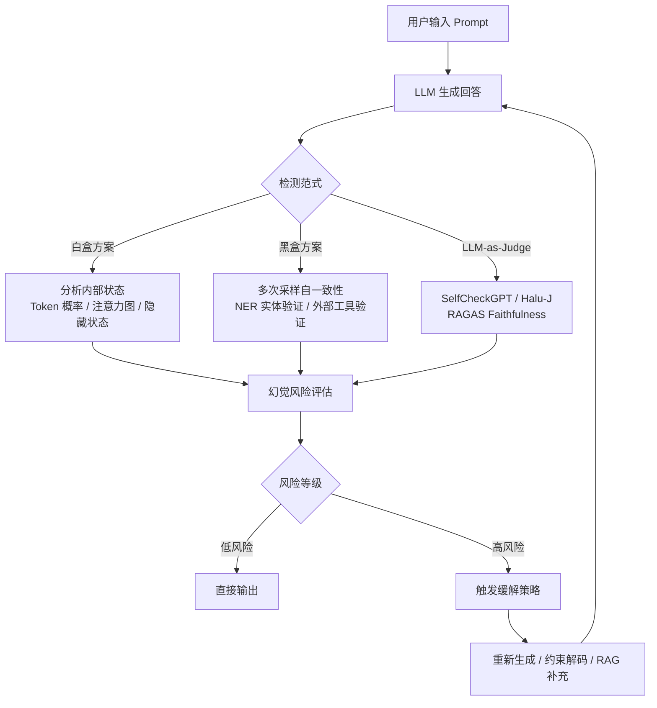
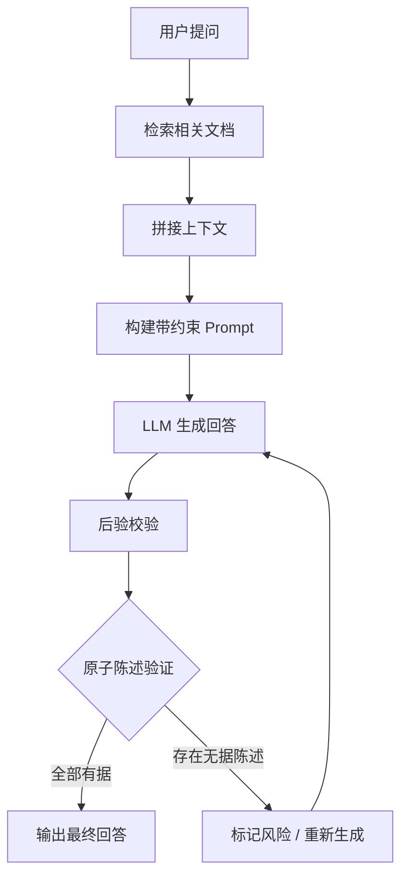

# 模型幻觉

## 一、定义

**模型幻觉（Hallucination）** 是指大语言模型在生成内容时，产生**看似合理但事实上不正确、虚构或误导性**的信息的现象。通俗地说，就是"一本正经地胡说八道"——模型以流畅自然的语言输出错误的、不存在的内容，且往往表现得高度自信。

核心特征：
- 语言流畅、逻辑看似合理，但事实错误
- 与客观世界知识冲突，或与输入上下文矛盾
- 常见于开放域问答、知识对话、长文生成等场景

> [!example] 典型例子
> 模型回答："世界上最长的河流是亚马逊河，位于非洲。"——亚马逊河实际在南美洲，且最长河流是尼罗河。

## 二、为什么出现

幻觉问题贯穿 LLM 从预训练到推理部署的全生命周期：

| 阶段 | 成因 |
|------|------|
| **预训练** | 训练数据含噪声、错误、过时信息；领域知识稀疏；预训练目标为最大化 token 概率（语言建模），而非事实准确性 |
| **SFT 微调** | 标注错误或不一致导致模型对错误知识过于自信 |
| **RLHF 对齐** | 奖励设计不完善时，模型会为了"迎合"预定目标而忽视内容正确性 |
| **推理阶段** | Token-by-token 生成无法修正早期错误，形成"滚雪球"效应；高 temperature 采样增加幻觉风险 |

核心矛盾：LLM 本质是一个**概率语言模型**，其训练目标是生成"像人话"的文本，而非"说真话"。当语言流畅性与事实准确性冲突时，模型天然倾向于前者。

## 三、核心思想

幻觉问题的研究围绕三个核心命题展开：

1. **分类与理解**：从忠实性（Faithfulness）和事实性（Factualness）两个维度对幻觉进行系统分类，建立统一的分析框架
2. **检测与量化**：通过白盒（内部状态）、黑盒（外部行为）、以及 LLM-as-Judge 三种范式，对幻觉进行自动化检测和量化评估
3. **缓解与控制**：从数据、训练、推理三个层面，通过 RAG、RLHF、约束解码、提示工程等技术手段降低幻觉发生概率

> [!important] 关键认知
> 幻觉不可能被彻底消除，只能被**检测、缓解、控制**。原因是 LLM 的概率本质决定了它不具备人类式的事实判断能力——它只是在做概率分布上的最佳猜测。

## 四、工作流程

### 4.1 幻觉检测流程



### 4.2 RAG 缓解幻觉流程



## 五、关键技术

### 5.1 幻觉分类体系

| 维度 | 类型 | 定义 |
|------|------|------|
| 忠实性 | Intrinsic（内在幻觉） | 生成内容与源输入直接矛盾 |
| 忠实性 | Extrinsic（外在幻觉） | 生成内容中含输入未要求的虚构信息 |
| 事实性 | Factuality Hallucination | 生成内容与可验证的真实世界事实不一致 |

按错误类型细分：事实冲突、无中生有、指令误解、逻辑错误。

### 5.2 检测技术

**白盒方案（基于模型内部状态）**：
- **Token 概率检测**：低概率 token 更可能为幻觉
- **Lookback Ratio**：基于注意力分配比例——若模型更多关注自身生成内容而忽视上下文，幻觉风险更高
- **上下文激活锐度（In-context Sharpness）**：正确生成伴随较低上下文熵值，错误生成则熵值较高
- **内部嵌入语义一致性（INSIDE）**：通过协方差矩阵特征值量化多次生成内容的语义差异

**黑盒方案**：
- **多次采样自一致性**：对同一问题多次采样，回答间逻辑不一致则存在幻觉风险
- **NER 实体验证**：生成实体未出现在知识源中则可能存在幻觉
- **外部工具验证**：将回答分解为原子陈述，用搜索引擎或知识库逐条验证（FacTool）

**LLM-as-Judge 方案**：
- **SelfCheckGPT**：零资源黑盒检测，基于多次采样的自一致性
- **Halu-J**：基于 critique 的幻觉检测器，提供详细解释
- **RAGAS Faithfulness**：评估答案中每句话是否能在检索上下文中找到依据

### 5.3 缓解技术

| 技术 | 核心思路 | 关键局限 |
|------|----------|----------|
| **RAG** | 将"闭卷考试"改为"开卷考试"，检索外部知识补充 | 检索数据质量差时会误导模型；缺乏验证机制 |
| **RLHF** | 人类反馈训练奖励模型，引导生成更可靠的输出 | 奖励设计不完善时可能诱导"迎合" |
| **约束解码** | 事实核采样、对比解码、不确定性感知束搜索 | 计算开销大，可能降低生成多样性 |
| **知识编辑（ROME/MEMIT）** | 精准修正模型内部错误知识，局部操作 | 适用范围有限，大规模知识编辑效果待验证 |
| **自我完善（Self-Refine）** | 模型生成后自动评估改进，模拟人类反复斟酌 | 依赖模型自身判断能力 |
| **提示工程** | 在 prompt 中明确约束（"不确定请说不知道"、要求引用来源） | 治标不治本，对复杂知识型问题效果有限 |

### 5.4 关键评估基准

| 基准 | 年份 | 用途 |
|------|------|------|
| TruthfulQA | 2021 | 评估回答真实性，含人工构造的"非自然事实"问题 |
| FActScore | 2023 | 细粒度原子评估长文生成的事实精确度 |
| HaluEval | 2023 | 大规模幻觉评估基准，含 35000 样本 |
| AlignScore | 2023 | 评估文本间语义对齐程度 |
| Lookback Lens | 2024 | 仅用注意力图检测和缓解上下文幻觉 |

## 六、优点

> [!warning] 说明
> "幻觉"本身是一个缺陷，不存在"优点"。以下是从**研究和工程角度**，研究幻觉问题带来的价值。

- **推动可信 AI 发展**：幻觉研究直接催生了 RAG、RLHF、知识编辑等一系列保证模型输出可靠性的技术
- **促进评估体系建立**：幻觉检测需求催生了 TruthfulQA、FActScore、RAGAS 等评估基准和框架，使 LLM 评估从"感觉"走向"量化"
- **暴露模型根本局限**：幻觉问题揭示了 LLM 概率本质与人类对事实性要求之间的根本矛盾，推动了从"更大模型"到"更可靠模型"的方向转变
- **驱动工具链成熟**：围绕幻觉检测与缓解，形成了 RAGAS、DeepEval、SelfCheckGPT 等成熟工具生态
- **促进多技术融合**：幻觉缓解需要检索、推理、约束、验证等多技术协同，推动了 AI 系统工程化

## 七、缺点

- **不可彻底消除**：幻觉是 LLM 概率本质的必然产物，只能缓解不能根除，这是最根本的局限
- **隐蔽性强**：幻觉内容往往语言流畅、逻辑自洽，用户难以察觉，尤其在专业领域容易被误导
- **随模型能力增强而恶化**：2025 年《纽约时报》报道，更强大的模型可能产生更隐蔽、更自信的幻觉，反而更难检测
- **检测成本高**：白盒方案需访问模型内部状态（闭源模型不可用）；黑盒方案需多次采样或外部工具调用，增加延迟和成本
- **缓解技术各有局限**：RAG 依赖检索质量；RLHF 奖励设计困难；约束解码影响生成多样性；知识编辑覆盖范围有限
- **评估标准不统一**：不同基准、不同指标之间缺乏一致性，难以横向比较不同方案的优劣
- **长文本幻觉更难处理**：长文生成中，前后不一致、细节虚构等问题更突出，检测和缓解难度呈指数级增长
- **多模态幻觉更复杂**：扩展到图像、视频等多模态场景时，幻觉问题更加复杂，检测和缓解技术尚不成熟
- **过度缓解可能适得其反**：过度保守的约束会导致模型拒绝回答本可正确回答的问题，或输出过于模板化

## 八、典型应用

### 8.1 检测场景

- **客服系统**：检测自动回复中的事实错误，避免误导用户（火山引擎云安全团队已落地）
- **内容审核**：自动识别 AI 生成内容中的虚假信息
- **医疗咨询**：对 AI 辅助诊断建议进行事实核查，防止错误医疗建议
- **法律文书**：验证 AI 生成的法律条款引用是否真实存在
- **金融分析**：核验 AI 生成的财务数据、公司信息是否准确
- **新闻写作**：事实核查 AI 辅助写作中的人名、地名、时间、数据是否准确

### 8.2 缓解场景

- **企业知识库问答**：RAG + RAGAS 评估 → 保障内部知识问答的准确性
- **教育辅导**：约束解码 + 提示工程 → 确保 AI 辅导内容不传播错误知识
- **代码生成**：SelfCheckGPT + 编译器验证 → 检测 AI 生成的代码是否存在逻辑错误
- **学术写作辅助**：FacTool + 外部搜索验证 → 确保引用的文献、数据真实存在

### 8.3 工具链

| 工具 | 场景 | 核心能力 |
|------|------|----------|
| RAGAS | RAG 系统评估 | Faithfulness / Answer Relevance / Context Relevancy / Context Recall |
| DeepEval | 通用 LLM 评估 | Hallucination Metric、上下文矛盾检测 |
| SelfCheckGPT | 零资源检测 | 多次采样自一致性 |
| AlignScore | 语义对齐评估 | 文本间事实一致性评分 |
| LangChain / LlamaIndex | RAG 构建 | 集成幻觉检测组件 |

## 九、面试高频问题

### Q1: 什么是 LLM 幻觉？为什么会产生？

幻觉是指 LLM 生成看似合理但事实错误、虚构或与输入矛盾的内容。成因贯穿全生命周期：预训练数据噪声与偏差、SFT 标注错误、RLHF 奖励设计不完善、推理阶段 token-by-token 生成无法修正早期错误、随机采样策略增加风险。根本原因是 LLM 本质是概率语言模型，训练目标是"像人话"而非"说真话"。

### Q2: 幻觉有哪些分类？Faithfulness 和 Factuality 的区别是什么？

按维度分：忠实性（Faithfulness）幻觉包括 Intrinsic（与输入冲突）和 Extrinsic（无中生有）；事实性（Factualness）幻觉是与可验证世界事实不一致。**关键区别**：Faithfulness 关注内部一致性（"这符合输入吗？"），Factuality 关注外部事实（"这是真的吗？"）。

### Q3: 如何检测 LLM 幻觉？

三种范式：**白盒方案**（基于 token 概率、Lookback Ratio、上下文激活锐度、INSIDE 嵌入一致性——需访问模型内部状态）；**黑盒方案**（多次采样自一致性、NER 实体验证、外部工具验证——无需访问内部状态）；**LLM-as-Judge 方案**（SelfCheckGPT、Halu-J、RAGAS Faithfulness——用 LLM 评估 LLM）。

### Q4: RAG 能否完全解决幻觉问题？为什么？

不能。RAG 效果高度依赖检索数据质量，若知识库含过时、错误或无关数据，模型仍会被误导。RAG 缺乏对数据源的有效验证机制，且过度依赖检索会削弱模型自身判断能力。RAG 本身也存在幻觉——检索到的噪音信息被模型当作事实输出。

### Q5: 列出至少三种缓解幻觉的技术，并说明各自局限。

- **RAG**：局限——检索质量依赖、缺乏验证机制、可能削弱模型自身判断
- **RLHF**：局限——奖励设计困难、可能诱导模型"迎合"而忽视真实性
- **约束解码**：局限——计算开销大、可能降低生成多样性和创造性
- **知识编辑（ROME）**：局限——覆盖范围有限、大规模编辑效果待验证
- **提示工程**：局限——治标不治本，对复杂知识型问题效果有限

### Q6: 什么是 RAGAS？其核心指标有哪些？

RAGAS 是 RAG 系统评估框架，采用 LLM-as-Judge 模式，无需人工标注黄金答案。核心指标：**Faithfulness**（忠实度，检测幻觉的核心指标——答案中每句话是否能在检索上下文中找到依据）、**Answer Relevance**（答案相关性）、**Context Relevancy**（上下文相关性）、**Context Recall**（上下文召回率）。

### Q7: SelfCheckGPT 的工作原理是什么？

SelfCheckGPT 是零资源黑盒幻觉检测方法。核心假设：当 LLM 对生成内容不确定或捏造事实时，多次独立采样的回答会出现逻辑不一致。具体做法是对同一问题多次采样（temperature 0.8），然后比较回答间的语义一致性——一致性越低，幻觉风险越高。不需要参考文本或外部知识库。

### Q8: 模型幻觉与模型能力的关系是什么？为什么更强的模型可能产生更严重的幻觉？

反直觉的结论：更强的模型在知识覆盖面上更广，但幻觉可能更隐蔽、更自信。原因：一是模型能力越强，生成内容越流畅自然，用户更难辨别真伪；二是大模型在知识边界附近更倾向于"自信地猜测"而非承认无知；三是模型能力提升主要来自规模扩展，但数据质量和事实性监督并未同步提升。2025 年《纽约时报》报道指出，AI 幻觉正在恶化。

## 十、相关知识

### 核心关联笔记

- [[LLM 大语言模型]] —— 幻觉问题的载体，理解 LLM 本质是理解幻觉的前提
- [[RAG 检索增强生成]] —— 当前最主流的幻觉缓解方案
- [[Prompt Engineering 提示词工程]] —— 通过 prompt 约束缓解幻觉的实用手段
- [[Embedding 向量嵌入]] —— RAG 中检索质量的基石，直接影响幻觉缓解效果
- [[向量数据库]] —— RAG 检索的存储与查询基础设施
- [[LangChain-LangGraph]] —— 集成 RAG 和幻觉检测的主流框架
- [[Agent]] —— 多步推理场景中幻觉会累积放大，Agent 需要内置幻觉检测
- [[Transformer]] —— 理解模型内部状态检测（白盒方案）的架构基础
- [[MCP 模型上下文协议]] —— 工具调用验证中的幻觉检测，确保工具调用参数正确
- [[Tool Calling 工具调用]] —— 工具调用中的幻觉（错误参数、错误工具选择）检测
- [[Harness Engineering 驾驭工程]] —— 幻觉控制是驾驭工程的核心挑战之一
- [[Loop Engineering 循环工程]] —— Self-Refine 等自我完善机制与循环工程的交叉

### 关键论文

- *A Survey on Hallucination in Large Language Models* (Huang et al., 2023/2025 TOIS) —— 最权威的幻觉综述
- *A Comprehensive Survey of Hallucination Mitigation Techniques* (Tonmoy et al., 2024) —— 32 种缓解技术汇总
- *SelfCheckGPT: Zero-Resource Black-Box Hallucination Detection* (Manakul et al., 2023)
- *Lookback Lens: Detecting and Mitigating Contextual Hallucinations* (Chuang et al., 2024)
- *FActScore: Fine-grained Atomic Evaluation of Factual Precision* (Min et al., 2023)
- *INSIDE: LLMs' Internal States Retain the Power of Hallucination Detection* (Chen et al., 2024)

### 关键概念

- **Groundedness（可依据性）**：RAG 场景的核心评估维度，答案是否能在检索上下文中找到依据
- **Factuality（事实性）**：与外部世界事实的一致性
- **Faithfulness（忠实性）**：与输入 prompt/上下文的一致性
- **Hallucination（幻觉）**：上层概念，包含 Factuality 和 Faithfulness 两个子维度

## 十一、代码示例

### 示例 1: 使用 RAGAS 评估 RAG 系统幻觉

```python
from ragas.metrics import faithfulness, answer_relevance, context_precision, context_recall
from ragas import evaluate
from datasets import Dataset

# 构造评估数据
data = {
    "question": ["亚马逊河位于哪个大洲？", "特斯拉的创始人是谁？"],
    "answer": [
        "亚马逊河位于南美洲，是世界第二长河。",  # 正确
        "特斯拉的创始人是埃隆·马斯克。",  # 幻觉：特斯拉由马丁·艾伯哈德和马克·坦彭宁创立
    ],
    "contexts": [
        ["亚马逊河位于南美洲，流经巴西、秘鲁等国。"],
        ["特斯拉成立于 2003 年，由马丁·艾伯哈德和马克·坦彭宁创立。"],
    ],
    "ground_truth": ["南美洲", "马丁·艾伯哈德和马克·坦彭宁"],
}

dataset = Dataset.from_dict(data)

# 评估
result = evaluate(
    dataset,
    metrics=[faithfulness, answer_relevance, context_precision, context_recall],
)
print(result)
# 第二条答案的 faithfulness 分数会较低，因为"埃隆·马斯克"不在上下文中
```

### 示例 2: 基于 Token 概率的幻觉检测（白盒方案）

```python
from transformers import AutoModelForCausalLM, AutoTokenizer
import torch

model_name = "Qwen/Qwen2.5-7B-Instruct"
tokenizer = AutoTokenizer.from_pretrained(model_name)
model = AutoModelForCausalLM.from_pretrained(
    model_name,
    torch_dtype=torch.float16,
    device_map="auto",
)


def detect_hallucination(prompt: str, max_new_tokens: int = 256) -> dict:
    """基于 token 概率的幻觉检测"""
    inputs = tokenizer(prompt, return_tensors="pt").to(model.device)

    with torch.no_grad():
        outputs = model.generate(
            **inputs,
            max_new_tokens=max_new_tokens,
            do_sample=True,
            temperature=0.7,
            return_dict_in_generate=True,
            output_scores=True,
        )

    scores = outputs.scores
    generated_ids = outputs.sequences[0][inputs["input_ids"].shape[1] :]

    logprobs = []
    for i, token_id in enumerate(generated_ids):
        prob = torch.softmax(scores[i], dim=-1)[token_id].item()
        logprobs.append(prob)

    min_prob = min(logprobs)
    avg_prob = sum(logprobs) / len(logprobs)

    return {
        "min_token_prob": min_prob,
        "avg_token_prob": avg_prob,
        "hallucination_risk": "high" if min_prob < 0.001 else "low",
        "token_probabilities": logprobs,
    }


prompt = "世界上最长的河流是亚马逊河，它位于非洲。请解释原因。"
result = detect_hallucination(prompt)
print(f"幻觉风险: {result['hallucination_risk']}")
```

### 示例 3: 基于 SelfCheckGPT 思路的多次采样自一致性检测

```python
def self_consistency_check(prompt: str, llm_call, n_samples: int = 5) -> dict:
    """
    基于多次采样自一致性的幻觉检测
    核心假设：当 LLM 捏造事实时，多次采样的回答会出现逻辑不一致
    """
    samples = []
    for _ in range(n_samples):
        response = llm_call(prompt, temperature=0.8)
        samples.append(response)

    unique_answers = set(samples)
    consistency_ratio = len(unique_answers) / n_samples

    return {
        "samples": samples,
        "unique_count": len(unique_answers),
        "consistency_ratio": consistency_ratio,
        "hallucination_risk": "high" if consistency_ratio > 0.6 else "low",
    }


prompt = "请列出 2025 年诺贝尔文学奖获得者的详细信息。"
result = self_consistency_check(prompt, llm_call)
print(f"一致性比率: {result['consistency_ratio']:.2f}")
print(f"幻觉风险: {result['hallucination_risk']}")
```

### 示例 4: RAG + 提示工程 + 后验校验的幻觉缓解方案

```python
def rag_with_hallucination_guard(query: str, retriever, llm) -> str:
    """
    RAG + 提示工程 + 后验校验的幻觉缓解方案
    """
    # Step 1: 检索相关文档
    docs = retriever.similarity_search(query, k=5)
    context = "\n\n".join([doc.page_content for doc in docs])

    # Step 2: 构建带约束的 prompt
    prompt = f"""
请基于以下检索到的信息回答问题。如果信息不足以回答问题，请明确说"我不知道"，不要编造。

检索到的信息：
{context}

问题：{query}

要求：
1. 只使用检索到的信息回答问题
2. 如果检索信息不足以回答，请说"根据现有信息，我无法回答"
3. 不要在回答中编造任何不存在的信息
4. 在回答末尾列出你引用的信息来源
"""

    # Step 3: 生成答案
    answer = llm.chat(prompt)

    # Step 4: 后验校验
    # 将答案分解为原子陈述，逐一验证
    claims = extract_claims(answer)
    verification = fact_check_via_search(claims)

    if any(not v["has_evidence"] for v in verification):
        flagged = [v["claim"] for v in verification if not v["has_evidence"]]
        answer += f"\n\n⚠️ 以下陈述可能存在风险，需要人工审核：{flagged}"

    return answer
```

## 十二、个人理解

### 1. 幻觉是 LLM 的"原罪"，不是 bug

把幻觉称为"bug"是一种误解。LLM 的训练目标是最大化下一个 token 的似然概率，这与"说真话"是两个完全不同的目标。模型在训练过程中从未被要求区分事实与虚构——它只被要求生成"像人话"的文本。从这个角度看，幻觉不是 LLM 的 bug，而是其概率本质的必然产物。我们能做的不是"修复"幻觉，而是用工程手段在概率模型的输出之上叠加一层事实性约束。

### 2. RAG 被过度神化了

RAG 是目前最主流的幻觉缓解方案，但行业对 RAG 的期望存在严重泡沫。RAG 面临三个被低估的问题：第一，检索质量决定一切——垃圾进垃圾出，但高质量的检索系统本身就是难题；第二，RAG 只是把幻觉从"模型知识边界"转移到"检索边界"，并没有解决幻觉本身；第三，RAG 可能让模型变得"懒惰"——过度依赖检索而削弱自身推理能力。RAG 是必要但不充分的方案。

### 3. 最强检测方案来自白盒

虽然黑盒方案（SelfCheckGPT 等）更通用、更易部署，但最精准的幻觉检测来自白盒方案——Lookback Ratio、上下文激活锐度、INSIDE 等基于内部状态的方法。这揭示了一个深层矛盾：最好的检测方法需要访问模型内部，但最强的闭源模型（GPT-4、Claude 等）恰恰不开放内部状态。这给产业界提出了一个选择：是使用开源模型获得更好的幻觉检测能力，还是使用闭源模型获得更好的生成能力但接受更高的幻觉风险？

### 4. 幻觉检测本身也在产生幻觉

LLM-as-Judge 方案（用 LLM 评估 LLM 的幻觉）存在一个递归问题：如果评估 LLM 本身也会产生幻觉，那么它对幻觉的评估是否可靠？RAGAS 的 Faithfulness 指标虽然被广泛使用，但其评估结果本身也需要校准。这形成了一个"谁来看守看守者"的无限递归——目前唯一的解法是人工抽检 + 多评判者交叉验证，但这又回到了成本问题。

### 5. 2025-2026 年的关键趋势

三个方向值得重点关注：**知识编辑**（ROME/MEMIT 等）试图从源头修改模型的错误知识，而不是在推理时打补丁，这是最具颠覆性的方向；**多模态幻觉**随着 GPT-4V、Gemini 等多模态模型普及，图像、视频中的幻觉问题将更加突出；**幻觉检测与生成的融合**——未来的模型可能会内置实时的幻觉检测模块，将检测和生成融为一体，而非像现在这样事后补救。但最根本的问题仍然存在：只要模型还是概率模型，幻觉就不会消失。我们能做的只是让模型在"不确定时闭嘴"，而不是让模型"永远说真话"。